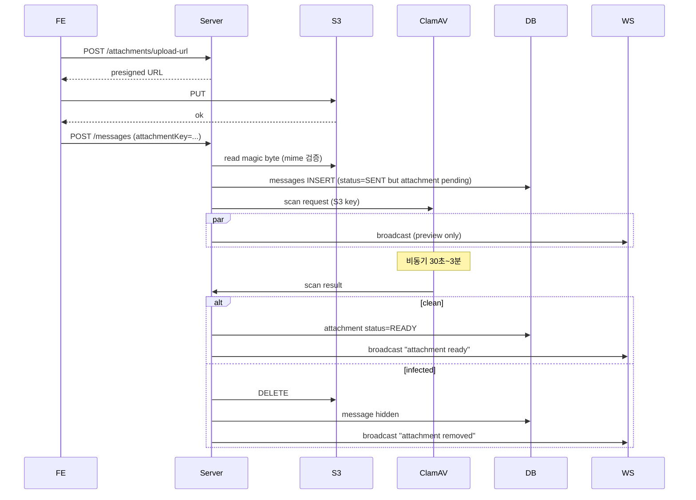

# Attachment scan — virus / malware

**[[security|↑ hub]]**

---

## 1. 본 vault — 옵션 (F8 이후)

| 단계 | 적용 |
| --- | --- |
| F0~F7 | mime + size 검증 만 |
| F8+ | + ClamAV 비동기 scan |
| F12+ | + AI 기반 malware (옵션) |

---

## 2. 흐름 (F8+)



---

## 3. mime 검증 (magic byte)

```java
byte[] head = s3.readBytes(key, 0, 16);
var detector = new Tika();
var detected = detector.detect(head);
if (!allowedMimes.contains(detected)) {
    s3.delete(key);
    throw new InvalidMimeException();
}
```

---

## 4. 함정

1. **FE mime 신뢰** → magic byte 검증.
2. **scan 동기** → 사용자 5분 대기.
3. **scan 결과 broadcast 안 함** → 사용자 못 보임 → 화면 stuck.
4. **infected file 영구 보관** → cleanup.

---

## 관련

- [[security|↑ hub]]
- [[../design-decisions/attachment-strategy]]
