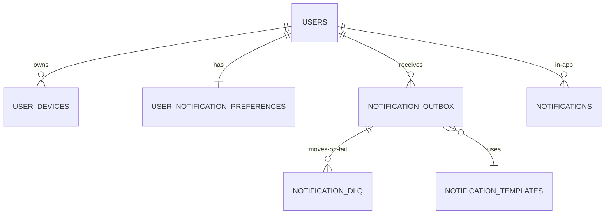

# notification database hub — ERD + 7 테이블

**[[../notification|↑ hub]]**

---

## 1. ERD



---

## 2. 테이블 목록

| # | 테이블 | 노트 |
| --- | --- | --- |
| 1 | notification_outbox ★ | [[notification-outbox-table]] |
| 2 | notifications (in-app) | [[notifications-table]] |
| 3 | user_devices ★ | [[user-devices-table]] |
| 4 | user_notification_preferences | [[user-preferences-table]] |
| 5 | notification_templates | [[notification-templates-table]] |
| 6 | notification_dlq | [[notification-dlq-table]] |
| 7 | notification_dedup_window | (별도 노트 X — [[../design-decisions/dedup-strategy#4]]) |

---

## 3. Migration

```
V01__users (signup 의 것)
V50__notification_outbox
V51__notifications_in_app
V52__user_devices
V53__user_notification_preferences
V54__notification_templates
V55__notification_dlq
V56__notification_dedup_window
```

---

## 4. 관련

- [[../notification|↑ hub]]
- [[../domain-model/domain-model]]
- [[../design-decisions/outbox-pattern]]
