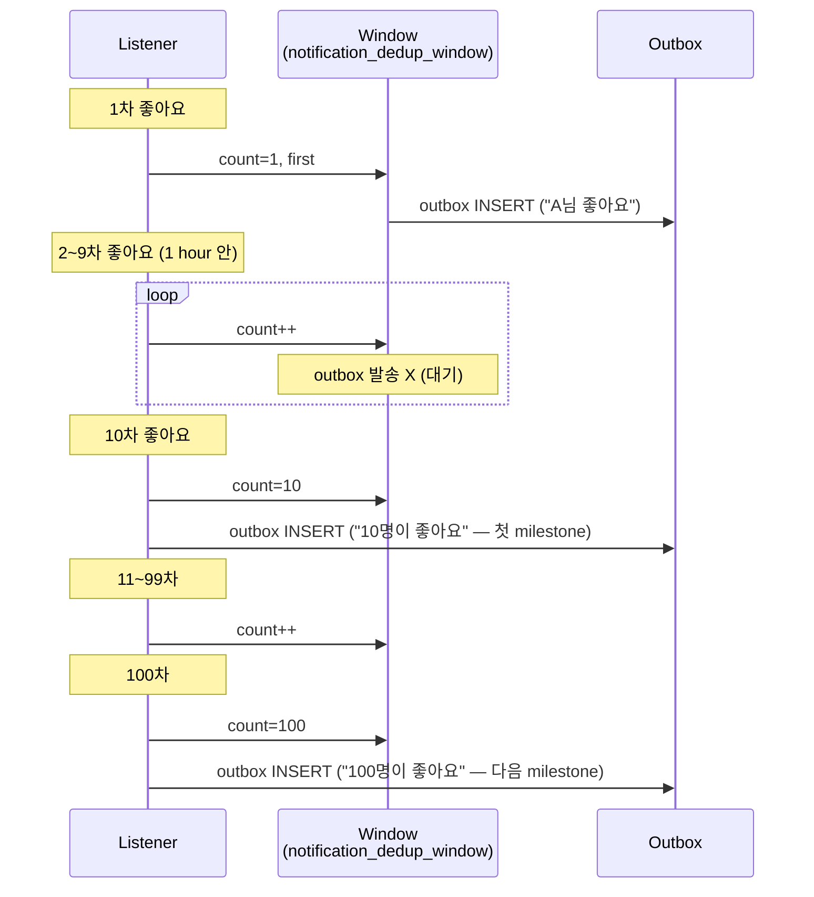

# Batch aggregation — burst 시 집계

**[[design-decisions|↑ hub]]**

> 인기 글의 좋아요 폭주 → 분당 100 알림 = spam → **"12 명이 좋아요" 1 개로 집계**.

---

## 1. 본 vault — 3 전략

| 전략 | 적용 |
| --- | --- |
| **immediate** | 결제 / 보안 / 댓글 등 — 즉시 발송 |
| **debounced (5s)** | chat — 같은 room 의 5초 연속 메시지 1개로 |
| **windowed (1h)** | 좋아요 — 1시간 안 N개 → "N명이 좋아요" |

---

## 2. Windowed 집계 흐름



milestone: 1 / 10 / 50 / 100 / 1000.

---

## 3. Debounced (chat)

```
사용자 B가 5초 안 5개 메시지 → A 에게 1번 알림 만
```

```java
@Service
public class DebouncedChatNotifier {

    private final ScheduledExecutorService scheduler;
    private final Map<String, ScheduledFuture<?>> pending = new ConcurrentHashMap<>();

    public void onChatMessage(ChatMessage msg) {
        var key = "%s|%s".formatted(msg.roomId(), msg.recipientId());

        // 기존 scheduled task cancel
        var existing = pending.remove(key);
        if (existing != null) existing.cancel(false);

        // 5초 후 발송 (계속 들어오면 매번 reset)
        var future = scheduler.schedule(() -> {
            outbox.save(NotificationOutboxRow.of(/* aggregated msg */));
            pending.remove(key);
        }, 5, TimeUnit.SECONDS);
        pending.put(key, future);
    }
}
```

→ 5초 안 새 메시지 = reset → debounce.

---

## 4. 왜 / 안 하면

### 4.1 왜 집계

- 인기 글 spam → 사용자 OFF.
- chat 의 연속 메시지 polling → 사용자 짜증.

### 4.2 안 하면

- 사용자 알림 OFF → 결제 / 보안 도 무시.
- App 삭제 위험.

### 4.3 대안

| 모델 | 적용 |
| --- | --- |
| 모두 immediate | spam 위험 |
| **windowed + debounced** ★ | 본 vault |
| AI 우선순위 학습 | 큰 platform |
| Inbox-style summary (daily digest) | low engagement |

---

## 5. 함정

### 함정 1 — debounce delay 너무 길게 (30s)
실시간 chat 의 UX ↓.

### 함정 2 — milestone 조밀 (1/2/3/...)
집계 의미 없음.
→ 1/10/100.

### 함정 3 — window 영구 (cleanup X)
DB 누적.
→ expires_at + cron.

---

## 6. 관련

- [[design-decisions|↑ hub]]
- [[dedup-strategy]]
- [[rate-limit]]
- [[../database/notification-outbox-table]]
