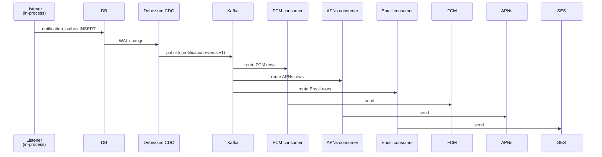

# Kafka 고도화 (F8+) — outbox + consumer 분산 ★

**[[design-decisions|↑ hub]]**

> F0~F7 = Spring `@TransactionalEventListener AFTER_COMMIT` + DB outbox.
> **F8+ = Kafka topic 으로 분산** — 다중 consumer instance + 다중 도메인 통합.

---

## 1. 본 vault 결정

| 단계 | 모델 |
| --- | --- |
| F0~F7 | DB outbox + single worker (in-process) |
| **F8** | DB outbox → Kafka topic (Debezium CDC 또는 polling publisher) |
| **F9** | Consumer 분리 (FCM consumer / APNs consumer / Email consumer) |

---

## 2. 왜 (F8+)

- DB outbox 의 worker 가 단일 instance 가 bottleneck.
- 채널 별 throughput 차이 (FCM 500/s vs Email 50/s) — 분리 시 scale 독립.
- 다른 도메인 (signup / board / product) 의 알림 통합.

---

## 3. Topic 설계

```
notification.events.v1              (전체 — partition key=user_id)
notification.fcm.queue.v1           (Android push consumer)
notification.apns.queue.v1          (iOS push consumer)
notification.email.queue.v1         (Email worker)
notification.dlq.v1                 (Dead letter)
```

---

## 4. 흐름 (F8+)



---

## 5. 함정

### 함정 1 — F0 부터 Kafka
overkill. 운영 부담.

### 함정 2 — direct send (outbox X)
DB commit 후 Kafka timeout 시 event 손실.
→ outbox + CDC.

### 함정 3 — consumer dedup 없음
at-least-once 의 중복 처리.
→ event_id UNIQUE.

### 함정 4 — partition key 잘못
같은 사용자 의 chat 순서 X.
→ user_id 또는 room_id.

---

## 6. 관련

- [[design-decisions|↑ hub]]
- [[outbox-pattern]]
- [[../implementation/kafka-integration]]
- [[../../product/design-decisions/kafka-event-driven|↗ product Kafka]]
