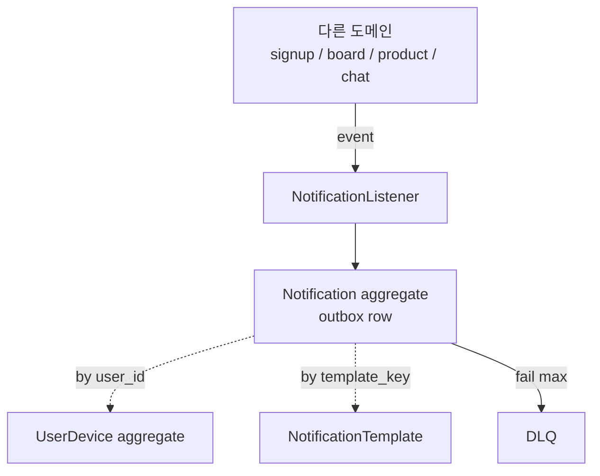

# Aggregate 경계

**[[domain-model|↑ hub]]**

---

## 1. 본 모듈 경계

---

## 2. 같은 TX

- listener: outbox.save 만 (다른 aggregate 변경 X).
- worker: outbox + result UPDATE (같은 aggregate).
- device 등록: UserDevice 만.

---

## 3. eventual

- 다른 도메인 event → AFTER_COMMIT → outbox INSERT (다른 도메인 의 TX 가 commit 후).
- worker → 외부 채널 호출 (트랜잭션 밖).

---

## 4. 관련

- [[domain-model|↑ hub]]
- [[../transactions]]
- [[../architecture]]
