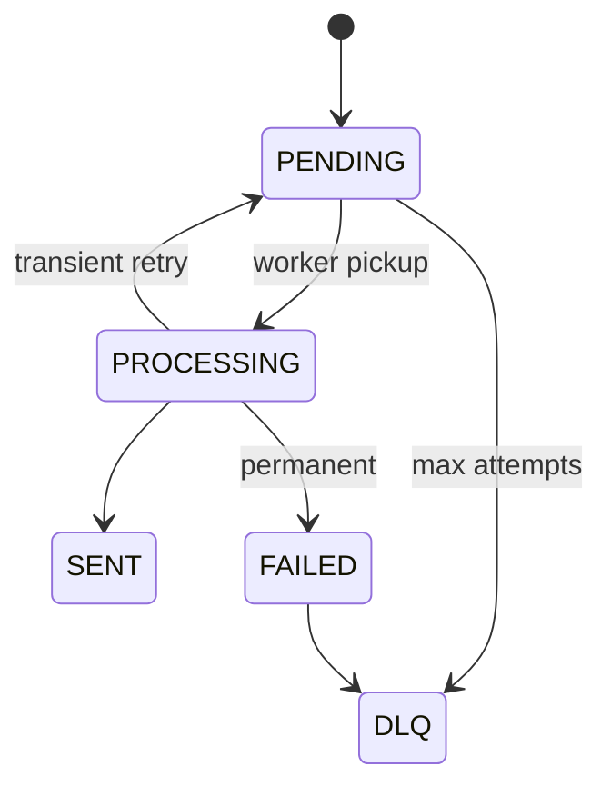

# NotificationStatus enum

**[[enums|↑ hub]]**

```java
public enum NotificationStatus {
    PENDING,
    PROCESSING,
    SENT,
    FAILED,
    DLQ;
}
```



---

## 관련

- [[enums|↑ hub]]
- [[../domain-model/notification-aggregate]]
- [[../design-decisions/retry-strategy]]
