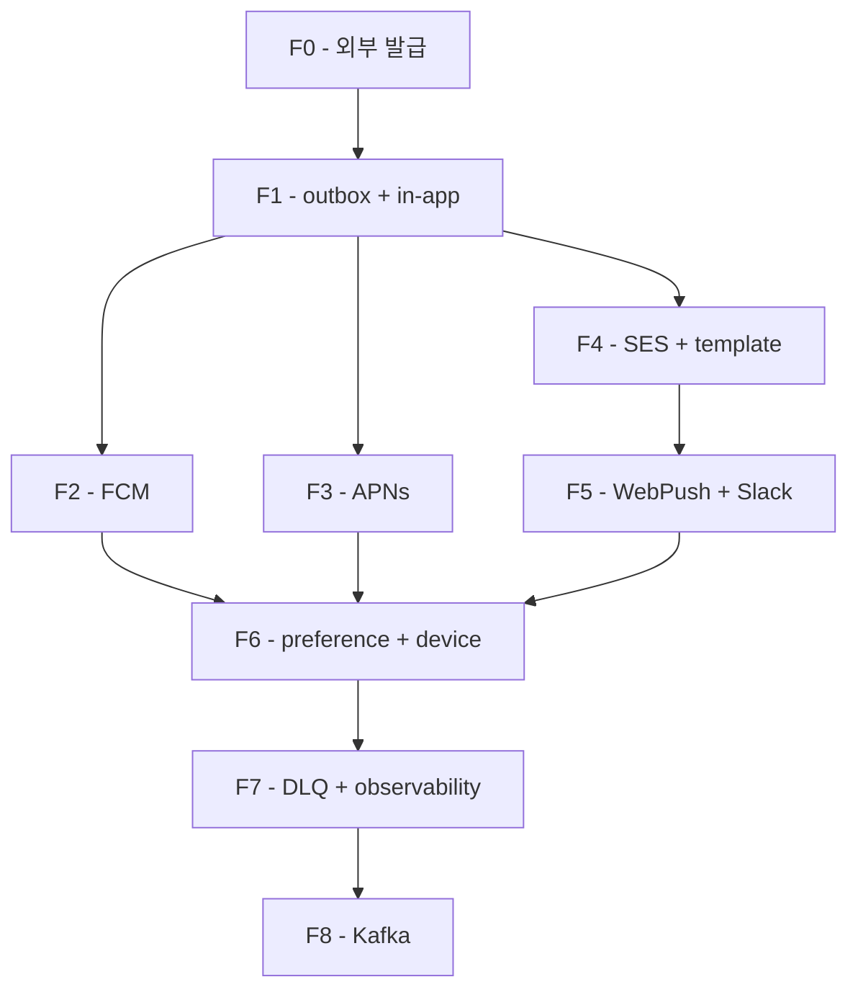

# 구현 순서 — F0~F8 PR 단위 to-do

**[[notification|↑ hub]]**

---

## 1. Phase 단계

| Phase | 내용 | 기간 |
| --- | --- | --- |
| F0 | 준비 (FCM project + APNs key + SES verify + Slack webhook) | 1주 |
| F1 | DB + outbox + in-app channel + worker (단순) | 1주 |
| F2 | FCM channel (Android) | 1주 |
| F3 | APNs channel (iOS) | 1주 |
| F4 | SES email + template / i18n | 1주 |
| F5 | WebPush + Slack admin | 0.5주 |
| F6 | 사용자 preference + device 관리 + rate limit | 1주 |
| F7 | DLQ + observability + abuse 검출 | 0.5주 |
| F8+ | Kafka consumer 분리 (scale) | 1주 |

총 ~8주 (팀 2명 기준).

---

## 2. mermaid



---

## 3. 의존성 매트릭스

| Feature | 의존 |
| --- | --- |
| F0 | signup auth |
| F1 | F0 |
| F2~F5 | F1 (병렬 가능) |
| F6 | F1 (preference/device 는 채널과 무관) |
| F7 | F1, F6 |
| F8 | F7 |

---

## 4. 회피 체크리스트

- [ ] Migration down 가능
- [ ] event_id UNIQUE
- [ ] FCM/APNs token KMS encrypt
- [ ] DLQ alert
- [ ] runbook 5 시나리오 검증
- [ ] pitfalls 점검

---

## 5. 다른 도메인 통합 순서

```
1. notification F0~F7 완성
2. signup → notification 사용 (이메일 인증 알림)
3. board → notification 사용 (댓글 / 좋아요)
4. product → notification 사용 (결제 / 환불)
5. chat → notification 사용 (offline push fallback)
```

→ 다른 도메인은 NotificationOutboxService 의존.

---

## 6. 관련

- [[notification|↑ hub]]
- [[overview]]
- [[prerequisites]]
- [[requirements]]
- [[design-decisions/kafka-event-driven]]
