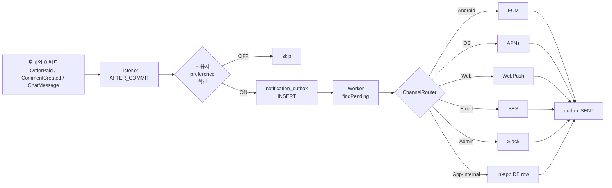

# 알림 레시피 — Push (FCM/APNs) + Email (SES) + WebPush + Slack + In-App hub

| 문서 버전 | 작성일 | 작성자 | 주요 변경 사항 |
| --- | --- | --- | --- |
| v1.0.0 | 2026-05-14 | engineering-agent/tech-lead | 최초 — folder split + ChannelRouter + outbox + 5 채널 |

**[[../api-design|↑ api-design hub]]**

> 모든 도메인 (signup / board / product / chat / order ...) 의 사용자 알림 통합 layer.
> **ChannelRouter** 가 채널 (FCM / APNs / SES / WebPush / Slack / in-app) 결정, **Outbox** 가 발송 보장.
> board / product / chat 의 `signup outbox 패턴` cross-link 가 가리키던 실제 구현.

---

## 0. 왜 이 레시피인가

| 질문 | 답 |
| --- | --- |
| 왜 별도 레시피? | 모든 도메인이 push / email 필요 — 한 곳에 모아 추상화. 중복 X. |
| 왜 outbox 패턴? | 트랜잭션 안 외부 호출 X (락 / cascade) — DB commit 보장 + 재시도. |
| 왜 ChannelRouter? | platform 별 (Android FCM / iOS APNs / Web WebPush) 어댑터 분기. 새 채널 추가 용이. |
| 왜 사용자 preference? | spam 방지 + 사용자 권리 — 알림 type 별 ON/OFF. |
| 왜 device 별 관리? | 멀티 디바이스 (폰 + 태블릿) 발송 + 만료 token 청소. |
| 왜 chat / board / product 와 분리? | 알림 ≠ 비즈니스 — 채널 변경 / 추가가 도메인 코드에 영향 X. |

---

## 1. 전체 흐름



자세히: [[overview]].

---

## 2. 폴더 구조

```
notification/
├── notification.md             ← 이 파일 (hub)
├── overview.md                 ← end-to-end
├── prerequisites.md            ← FCM/APNs/SES 발급 + service account
├── requirements.md             ← AC 35개
├── architecture.md             ← ChannelRouter + 어댑터 패턴
├── transactions.md             ← AFTER_COMMIT + outbox 트랜잭션 분리
├── implementation-order.md     ← F0~F9 단계
│
├── design-decisions/
│   ├── design-decisions.md
│   ├── channel-selection.md            ★ 어떤 채널 (FCM/APNs/Email/...)
│   ├── outbox-pattern.md               ★ 왜 outbox + SKIP LOCKED
│   ├── user-preferences.md             ← type 별 ON/OFF + 강제 ON (보안 알림)
│   ├── device-management.md            ★ 멀티 디바이스 + token 만료
│   ├── retry-strategy.md               ← exp backoff + max + DLQ
│   ├── dedup-strategy.md               ← event_id UNIQUE + 시간 window
│   ├── rate-limit.md                   ← spam 방어 (50/h per user)
│   ├── template-i18n.md                ← 다국어 + 변수 치환
│   ├── batch-aggregation.md            ← burst 시 집계 ("12명이 좋아요")
│   ├── ordering.md                     ← 알림 순서 보장 필요한가
│   └── kafka-event-driven.md           ★ F8+ Kafka 통합
│
├── database/
│   ├── database.md                     ← ERD
│   ├── notification-outbox-table.md    ★ worker 큐
│   ├── notifications-table.md          ← in-app 영구 (사용자 화면 목록)
│   ├── user-devices-table.md           ★ FCM/APNs token
│   ├── user-preferences-table.md       ← type 별 ON/OFF
│   ├── notification-templates-table.md ← i18n template
│   └── notification-dlq-table.md       ← 영구 실패
│
├── domain-model/
│   ├── domain-model.md
│   ├── notification-aggregate.md       ★ outbox row + channel
│   ├── user-device-aggregate.md
│   ├── value-objects.md                ← NotificationId / TemplateKey / DeviceToken
│   ├── domain-events.md
│   ├── repository-ports.md             ← NotificationChannel (out port) ★
│   └── aggregate-boundaries.md
│
├── enums/
│   ├── enums.md
│   ├── notification-type.md            ← LIKE_RECEIVED / COMMENT / PAYMENT / CHAT / ...
│   ├── notification-status.md          ← PENDING / PROCESSING / SENT / FAILED / DLQ
│   ├── channel-type.md                 ← FCM / APNS / SES / WEBPUSH / SLACK / IN_APP
│   ├── device-platform.md              ← ANDROID / IOS / WEB / DESKTOP
│   └── notification-priority.md        ← LOW / NORMAL / HIGH / CRITICAL
│
├── security/
│   ├── security.md
│   ├── device-token-rotation.md        ★ FCM token 만료 / 갱신
│   ├── pii-encryption.md               ← email / phone 암호화
│   ├── abuse-rate-limit.md             ← per-user / per-IP
│   ├── webhook-signature.md            ← FCM/APNs response 검증
│   └── audit-logging.md
│
├── implementation/
│   ├── implementation.md
│   ├── outbox-worker-impl.md           ★ Worker (SKIP LOCKED + exp backoff)
│   ├── channel-router-impl.md          ★ Router + 어댑터 등록
│   ├── fcm-channel-impl.md             ★ Firebase Admin SDK
│   ├── apns-channel-impl.md            ★ APNs HTTP/2 + JWT 인증
│   ├── webpush-channel-impl.md         ← VAPID + RFC 8030
│   ├── ses-email-channel-impl.md       ★ AWS SES + 템플릿
│   ├── slack-channel-impl.md           ← admin alerts
│   ├── in-app-channel-impl.md          ← DB row + 사용자 화면
│   ├── device-management-impl.md       ★ token 등록 / 갱신 / 청소
│   ├── preference-impl.md
│   ├── template-impl.md                ← Thymeleaf / mustache + i18n
│   └── kafka-integration.md            ★ F8+ Kafka consumer
│
├── testing/
│   ├── testing.md
│   ├── test-scenarios.md
│   ├── unit-tests.md
│   ├── integration-tests.md            ← Testcontainers + WireMock FCM
│   └── channel-mock-tests.md           ← FCM/APNs/SES mock
│
├── operations/
│   ├── operations.md
│   ├── observability.md                ← outbox lag / delivery rate / token 만료
│   ├── runbook.md                      ← FCM 장애 / APNs 만료 / quota
│   └── dlq-replay.md                   ★ DEAD_LETTER 수동 처리
│
└── pitfalls/
    ├── pitfalls.md
    ├── outbox-pitfalls.md
    ├── token-pitfalls.md
    ├── ordering-pitfalls.md
    └── rate-pitfalls.md
```

---

## 3. Phase 단계

| Phase | 내용 | 기간 |
| --- | --- | --- |
| F0 | 준비 (FCM project + APNs key + SES verify) | 1주 |
| F1 | DB + outbox + in-app channel | 1주 |
| F2 | FCM channel (Android) | 1주 |
| F3 | APNs channel (iOS) | 1주 |
| F4 | SES email channel + template | 1주 |
| F5 | WebPush + Slack admin | 0.5주 |
| F6 | 사용자 preference + device 관리 | 1주 |
| F7 | 운영 (DLQ + observability + replay) | 0.5주 |
| F8+ | Kafka consumer (F10+ scale) | 1주 |

총 ~8주 (팀 2명 기준).

자세히: [[implementation-order]].

---

## 4. cheat sheet

| 의사결정 | 정답 | 어디 |
| --- | --- | --- |
| 트랜잭션 안 외부 호출 | **금지** | [[design-decisions/outbox-pattern]] |
| 발송 보장 | outbox + worker + 멱등 | [[implementation/outbox-worker-impl]] |
| FCM token 만료 (UNREGISTERED) | DB DELETE + audit | [[security/device-token-rotation]] |
| 같은 알림 중복 발송 방지 | event_id UNIQUE + 1h dedup window | [[design-decisions/dedup-strategy]] |
| 사용자 설정 무시 | **금지** (모더 알림 제외) | [[design-decisions/user-preferences]] |
| 멀티 디바이스 | per-device 발송 + 만료 token 청소 | [[database/user-devices-table]] |
| 강제 ON 알림 | 보안 (login alert) / 결제 / 모더 | [[design-decisions/user-preferences]] |
| 영구 실패 | DLQ + admin replay | [[operations/dlq-replay]] |

---

## 5. 다른 컨텍스트

| 비즈니스 | 무엇이 달라지나 |
| --- | --- |
| 카카오톡 / 라인 | chat 내부 channel (자체 push) + FCM/APNs fallback |
| 일반 SaaS (Notion) | email 우선 + Slack admin |
| 게임 (배그) | push 위주 + 이벤트 알림 |
| 광고 SaaS (당근) | rate limit 강 (스팸 의심 → 사용자 OFF) |
| 글로벌 | i18n template + region timezone |

---

## 6. 관련

- [[../signup/database/email-outbox-table|↗ signup email-outbox]] (옛 단순 패턴 → 본 레시피로 발전)
- [[../board/design-decisions/notification-policy|↗ board notification 정책]]
- [[../product/design-decisions/refund-policy|↗ product 환불 알림]]
- [[../chat/chat|↗ chat (의존 — push fallback)]]
- [[../webhook-send|↗ webhook outbox 패턴 참조]]

---

## 7. 변경 이력

| Version | Date | 변경 |
| --- | --- | --- |
| v1.0.0 | 2026-05-14 | 최초 — folder hub + Phase F0~F8 + cheat sheet + 5 채널 |
