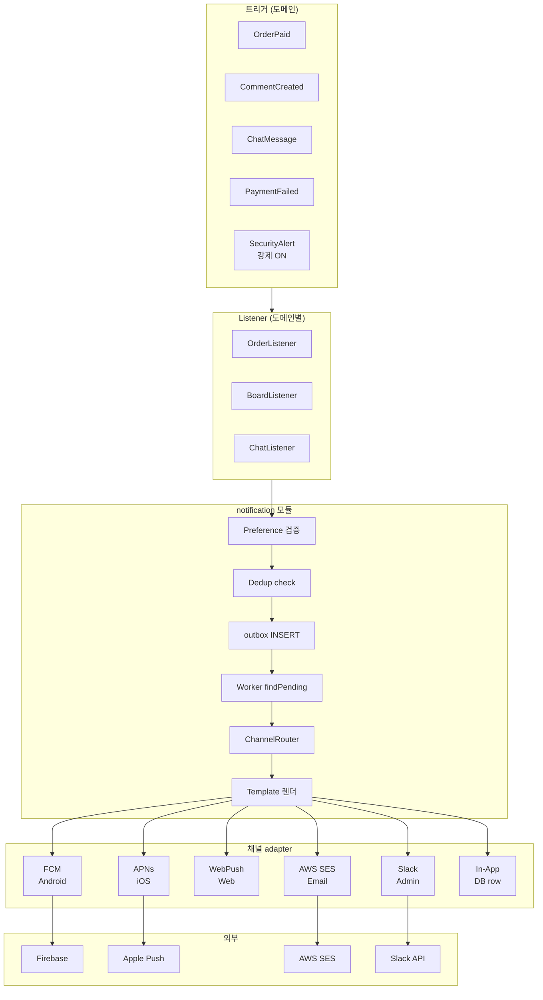
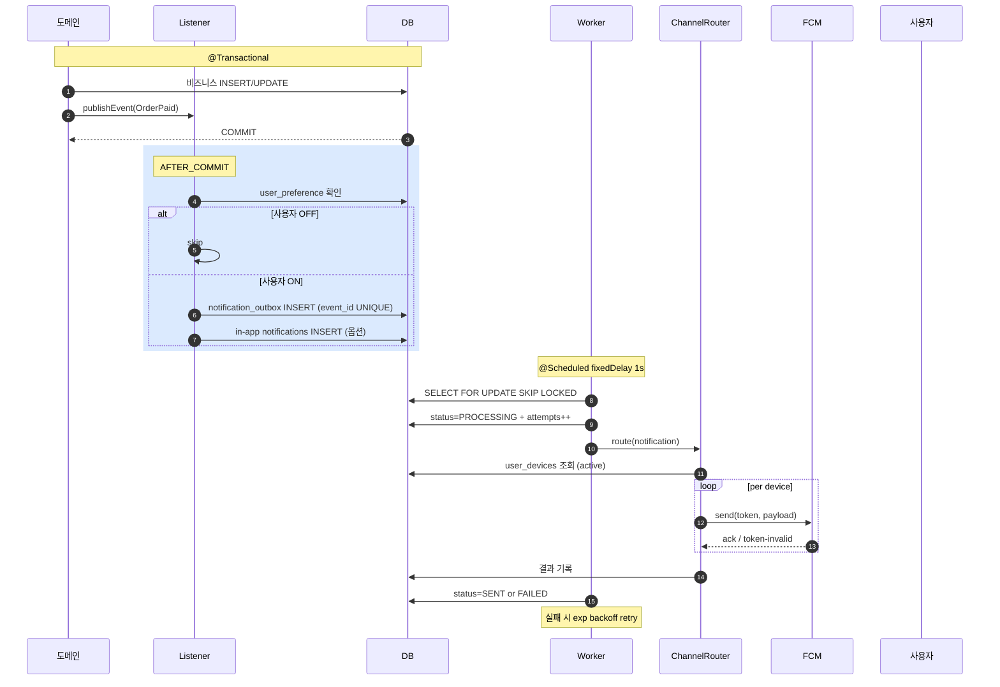
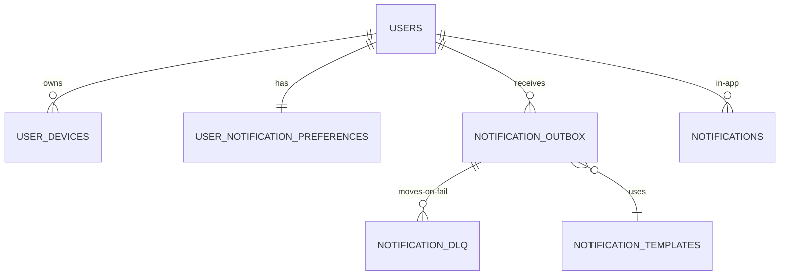
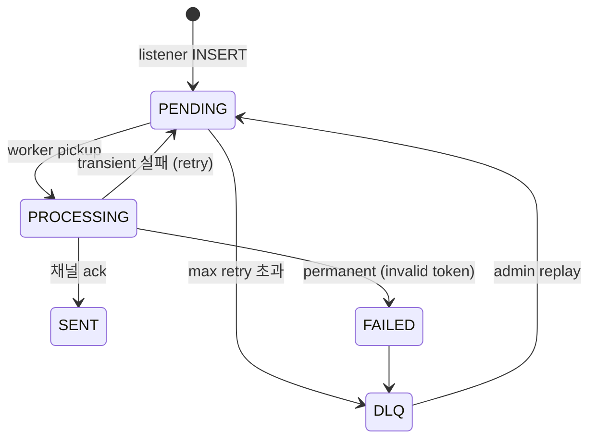

# notification overview — end-to-end

| 문서 버전 | 작성일 | 작성자 | 주요 변경 사항 |
| --- | --- | --- | --- |
| v1.0.0 | 2026-05-14 | engineering-agent/tech-lead | 최초 |

**[[notification|↑ hub]]**

---

## 1. 큰 그림



---

## 2. 시퀀스 — 단일 알림 발송



---

## 3. 흐름 — 핵심 6단계

```
1. 트리거 (도메인 이벤트)
2. Listener (AFTER_COMMIT) — preference 검증 + outbox INSERT
3. Worker pickup — SKIP LOCKED
4. ChannelRouter — platform / channel 결정
5. Template 렌더 — i18n + 변수 치환
6. 채널 adapter — FCM / APNs / SES / WebPush / Slack / in-app
   ↓
   성공 → SENT
   일시 실패 → exp backoff retry
   영구 실패 (invalid token / bad address) → DLQ + admin
```

---

## 4. ERD 큰 그림



자세히: [[database/database]].

---

## 5. 상태 머신 (outbox row)



자세히: [[enums/notification-status]].

---

## 6. 관련

- [[notification|↑ hub]]
- [[prerequisites]] — 시작 전
- [[requirements]] — 35 AC
- [[architecture]] — Hexagonal + ChannelRouter
- [[transactions]]
- [[implementation-order]]
