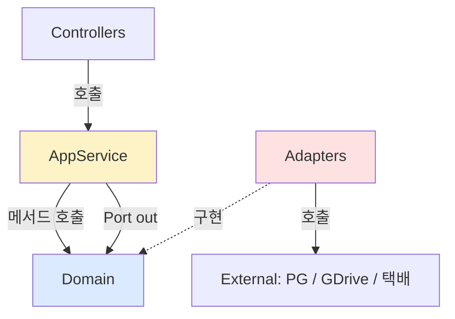

# product architecture — Hexagonal 패키지 구조

| 문서 버전 | 작성일 | 작성자 | 주요 변경 사항 |
| --- | --- | --- | --- |
| v1.0.0 | 2026-05-14 | engineering-agent/tech-lead | 최초 |

**[[product|↑ hub]]**

> Port-Adapter (DDD/Hexagonal) — signup 동일.

---

## 1. 패키지 구조

```
com.example.product
├── domain/                     ← 비즈니스 규칙 (의존성 0)
│   ├── product/
│   │   ├── Product.java
│   │   ├── ProductId.java
│   │   ├── ProductStatus.java
│   │   ├── ProductType.java
│   │   └── ProductRepository.java       ← Port (out)
│   ├── order/
│   │   ├── Order.java
│   │   ├── OrderItem.java
│   │   └── OrderRepository.java
│   ├── payment/
│   │   ├── Payment.java
│   │   ├── PaymentStatus.java
│   │   ├── Refund.java
│   │   └── PaymentRepository.java
│   ├── inventory/
│   │   ├── Inventory.java
│   │   └── InventoryRepository.java
│   ├── digital/                          ★
│   │   ├── DigitalDelivery.java
│   │   └── DigitalDeliveryRepository.java
│   ├── shared/
│   │   ├── Money.java
│   │   ├── Currency.java
│   │   └── DomainEvent.java
│   └── port/
│       ├── PaymentGateway.java           ← Port (out) → PG 어댑터
│       ├── DigitalAssetStorage.java      ← Port (out) → GDrive/S3
│       ├── WatermarkService.java         ← Port (out) → PDFBox
│       └── ShippingProvider.java         ← Port (out) → 택배 API
│
├── application/                ← Use case (Port in)
│   ├── product/
│   │   └── ProductCommandService.java
│   ├── order/
│   │   └── OrderApplicationService.java
│   ├── payment/
│   │   ├── PaymentConfirmService.java
│   │   ├── PaymentWebhookService.java
│   │   └── RefundService.java
│   └── digital/
│       └── DigitalDeliveryWorker.java    ← outbox worker
│
├── infrastructure/             ← Adapter (out)
│   ├── persistence/
│   │   ├── jpa/                          ← Spring Data JPA
│   │   └── jdbc/                         ← MyBatis (검색 / 통계)
│   ├── payment/
│   │   ├── toss/
│   │   │   ├── TossPaymentGateway.java
│   │   │   └── TossClient.java
│   │   ├── kcp/
│   │   └── stripe/
│   ├── storage/
│   │   ├── GoogleDriveStorage.java       ★
│   │   └── S3Storage.java
│   ├── watermark/
│   │   └── PdfBoxWatermarkService.java   ★
│   ├── shipping/
│   │   ├── CjShippingProvider.java
│   │   └── HanjinShippingProvider.java
│   └── notification/
│       └── FcmPushSender.java
│
├── interfaces/                 ← Adapter (in)
│   ├── api/                              ← REST controllers
│   │   ├── ProductController.java
│   │   ├── OrderController.java
│   │   ├── PaymentController.java
│   │   ├── RefundController.java
│   │   └── DownloadController.java       ← 디지털 다운로드
│   ├── webhook/
│   │   ├── TossWebhookController.java
│   │   ├── KcpWebhookController.java
│   │   └── ShippingWebhookController.java
│   └── admin/
│       ├── AdminProductController.java
│       └── AdminRefundController.java
│
└── config/
    ├── SecurityConfig.java
    ├── PaymentGatewayConfig.java         ← Router
    └── ScheduledTasksConfig.java
```

---

## 2. 의존성 흐름



→ domain 은 외부 의존성 0. 테스트 fast.

---

## 3. PG 어댑터 패턴

```java
// domain
public interface PaymentGateway {
    String provider();
    PgConfirmResult confirm(PgConfirmCommand cmd);
    PgCancelResult cancel(PgCancelCommand cmd);
    boolean verifyWebhookSignature(WebhookRequest req);
}

// infrastructure
@Component public class TossPaymentGateway implements PaymentGateway { ... }
@Component public class KcpPaymentGateway implements PaymentGateway { ... }
@Component public class StripePaymentGateway implements PaymentGateway { ... }

// config — router
@Component public class PaymentGatewayRouter {
    private final Map<String, PaymentGateway> byProvider;
    public PaymentGateway resolve(String provider) { ... }
}
```

자세히: [[design-decisions/pg-selection#5]].

---

## 4. 디지털 자산 저장소 어댑터

```java
public interface DigitalAssetStorage {
    String upload(String userId, String orderId, byte[] content);
    String getDownloadUrl(String storageFileId, Duration ttl);
    void revoke(String storageFileId, String userEmail);
}

@Component public class GoogleDriveStorage implements DigitalAssetStorage { ... }   // 본 vault
@Component public class S3Storage implements DigitalAssetStorage { ... }            // fallback
```

→ storage_provider 컬럼 기반 router.

자세히: [[design-decisions/digital-delivery-policy]].

---

## 5. 모듈 분리 (옵션 — Modular Monolith)

```
F0~F8: 단일 모듈 (com.example.product)
F12+: payment 모듈 분리 (com.example.payment) — DB 도 분리
```

→ 시작은 monolith, 매출 / 트래픽 증가 시 분리.

자세히: [[../../signup/architecture|↗ signup architecture]].

---

## 6. 관련

- [[product|↑ hub]]
- [[transactions]]
- [[domain-model/domain-model]]
- [[../signup/architecture|↗ signup architecture]]
- [[design-decisions/pg-selection]]
- [[design-decisions/digital-delivery-policy]]
