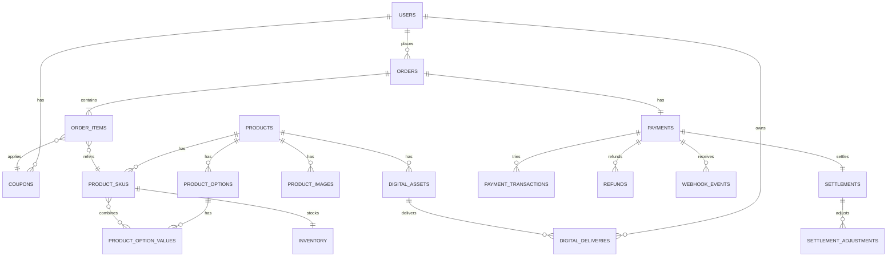

# product database hub — ERD + 14 테이블

| 문서 버전 | 작성일 | 작성자 | 주요 변경 사항 |
| --- | --- | --- | --- |
| v1.0.0 | 2026-05-14 | engineering-agent/tech-lead | 최초 |

**[[../product|↑ hub]]**

> 14개 테이블 — 상품 / 옵션 / 재고 / 주문 / 결제 / 환불 / 디지털 / webhook / 쿠폰.

---

## 1. ERD



---

## 2. 테이블 목록

| # | 테이블 | 노트 |
| --- | --- | --- |
| 1 | products | [[products-table]] |
| 2 | product_options + values | [[product-options-table]] |
| 3 | product_skus | [[products-table#sku]] |
| 4 | product_images | [[product-images-table]] |
| 5 | inventory | [[inventory-table]] |
| 6 | orders | [[orders-table]] |
| 7 | order_items | [[order-items-table]] |
| 8 | payments | [[payments-table]] |
| 9 | payment_transactions | [[payment-transactions-table]] |
| 10 | refunds | [[refunds-table]] |
| 11 | digital_assets ★ | [[digital-assets-table]] |
| 12 | digital_deliveries ★ | [[digital-deliveries-table]] |
| 13 | webhook_events | [[webhook-events-table]] |
| 14 | coupons + redemptions | [[coupons-table]] |
| 15 | settlements + adjustments | [[../design-decisions/settlement-policy#3]] |

---

## 3. Migration 순서

```
V01__users (signup 의 것)
V20__products
V21__product_options
V22__product_option_values
V23__product_skus + product_sku_options
V24__product_images
V25__inventory
V30__orders
V31__order_items
V32__payments
V33__payment_transactions
V34__refunds
V35__webhook_events
V36__digital_assets
V37__digital_deliveries
V38__coupons + coupon_redemptions
V39__settlements + adjustments
```

---

## 4. 공통 패턴

| 패턴 | 적용 |
| --- | --- |
| ULID PK CHAR(26) | 모든 도메인 테이블 |
| TIMESTAMPTZ | 모든 시간 (UTC 저장 + TZ 정보) |
| status VARCHAR + CHECK | enum 컬럼 |
| version BIGINT | optimistic lock 필요한 테이블 (orders / payments / inventory) |
| created_at / updated_at | audit 의무 |
| soft delete (deleted_at) | products (재구매 정산) |
| JSONB metadata | 확장 가능한 옵션 |

---

## 5. 관련

- [[../product|↑ hub]]
- [[../domain-model/domain-model]]
- [[../design-decisions/option-strategy]]
- [[../design-decisions/inventory-strategy]]
- [[../design-decisions/digital-delivery-policy]]
