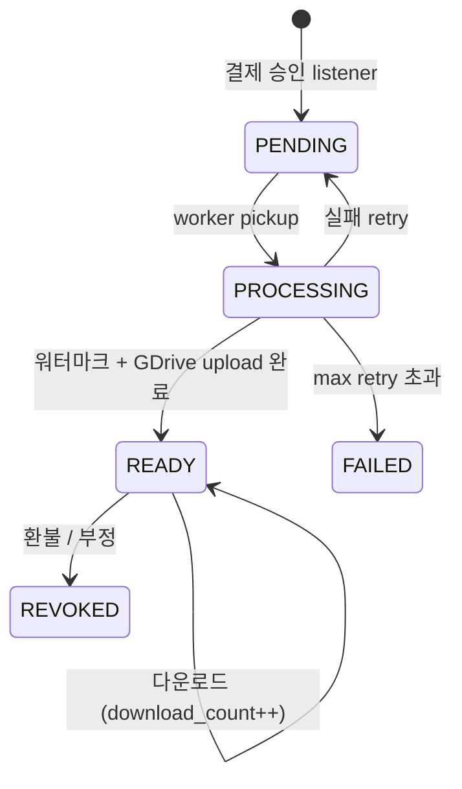

# digital_deliveries 테이블 — 사용자별 마스킹 사본 추적 ★

| 문서 버전 | 작성일 | 작성자 | 주요 변경 사항 |
| --- | --- | --- | --- |
| v1.0.0 | 2026-05-14 | engineering-agent/tech-lead | 최초 |

**[[database|↑ hub]]**

> 1 user × 1 order × 1 asset = 1 delivery (마스킹된 사본 + 토큰 다운로드).

---

## 1. Schema

```sql
-- V37__create_digital_deliveries.sql
CREATE TABLE digital_deliveries (
    id              CHAR(26) PRIMARY KEY,
    order_id        CHAR(26) NOT NULL REFERENCES orders(id),
    order_item_id   CHAR(26) NOT NULL REFERENCES order_items(id),
    user_id         CHAR(26) NOT NULL,
    asset_id        CHAR(26) NOT NULL REFERENCES digital_assets(id),
    status          VARCHAR(20) NOT NULL DEFAULT 'PENDING',

    storage_provider VARCHAR(20),                    -- GDRIVE / S3
    storage_file_id  VARCHAR(200),                    -- 사용자별 마스킹 PDF 의 file id
    watermark_hash   CHAR(64),                        -- 워터마크 식별자 (유출 시 추적)

    download_token_hash CHAR(64),                     -- 다운로드 토큰의 SHA-256
    download_count   INTEGER NOT NULL DEFAULT 0,
    download_max     INTEGER NOT NULL DEFAULT 5,
    token_expires_at TIMESTAMPTZ,

    delivered_at     TIMESTAMPTZ,                      -- 워터마크 + GDrive upload 완료 시각
    first_downloaded_at TIMESTAMPTZ,
    last_downloaded_at TIMESTAMPTZ,
    revoked_at       TIMESTAMPTZ,
    revoke_reason    VARCHAR(200),                     -- REFUND / FRAUD / MANUAL

    attempts         INTEGER NOT NULL DEFAULT 0,
    last_error       TEXT,
    next_attempt_at  TIMESTAMPTZ,
    created_at       TIMESTAMPTZ NOT NULL DEFAULT now(),
    updated_at       TIMESTAMPTZ NOT NULL DEFAULT now(),

    CONSTRAINT chk_dd_status CHECK
        (status IN ('PENDING', 'PROCESSING', 'READY', 'REVOKED', 'FAILED'))
);

CREATE UNIQUE INDEX ux_dd_user_item ON digital_deliveries (user_id, order_item_id);
CREATE INDEX ix_dd_user_status ON digital_deliveries (user_id, status, delivered_at DESC);
CREATE INDEX ix_dd_pending ON digital_deliveries (next_attempt_at, status)
    WHERE status IN ('PENDING', 'PROCESSING', 'FAILED');
```

---

## 2. 컬럼 "왜"

### 2.1 UNIQUE (user_id, order_item_id)

- 1 주문 item = 1 delivery — 중복 워터마크 사본 X.
- 재 다운로드 시 같은 row 재사용.

### 2.2 `watermark_hash`

- 워터마크 내용의 hash (userId + orderId + email partial 의 sha256).
- 유출된 PDF 발견 시 metadata 와 비교 → 누가 유출했는지 추적.

### 2.3 `download_token_hash`

- token 의 raw 는 DB X (보안).
- hash 비교 — token 도용 방어.

### 2.4 `download_count` + `download_max`

- 5회 한도 — 도용 방어.
- 한도 초과 시 401.

### 2.5 `revoked_at` + `revoke_reason`

- 환불 시 즉시 revoke + 사유 audit.
- 30일 후 cron 으로 storage_file_id 삭제 (evidence 보관 기간).

### 2.6 `attempts` + `next_attempt_at` (outbox 패턴)

- 워터마크 worker 실패 시 exp backoff retry.
- max 5회 + DEAD_LETTER → admin alert.

---

## 3. 상태 머신



---

## 4. 다운로드 흐름

```
1. 사용자 GET /downloads/{rawToken}
2. server: hash(rawToken) → DB 의 download_token_hash 와 비교
3. 검증: status=READY + revoked_at IS NULL + token_expires_at > now() + download_count < download_max
4. download_count++ + last_downloaded_at = now()
5. GDrive presigned URL (1h TTL) 발급
6. audit (IP / UA / time)
7. 302 redirect → GDrive
```

자세히: [[../implementation/digital-delivery-impl#download]].

---

## 5. 환불 시 revoke

```sql
UPDATE digital_deliveries SET
    status = 'REVOKED',
    revoked_at = now(),
    revoke_reason = 'REFUND',
    download_token_hash = NULL    -- 토큰 무효화
WHERE id = ?;
```

→ AFTER_COMMIT 에서 GDrive permission revoke (외부 호출).

30일 후 cron 으로 storage_file_id 삭제.

---

## 6. 함정

### 함정 1 — token raw 저장
DB 유출 시 token 도용.
→ hash 만.

### 함정 2 — UNIQUE 없음
한 user 가 같은 item 의 마스킹 2개 — 추적 모호.
→ UNIQUE (user_id, order_item_id).

### 함정 3 — revoke 시 file 즉시 삭제
분쟁 시 evidence 없음.
→ 30일 보관 + 삭제 cron.

### 함정 4 — download_count 안 추적
무한 다운로드 가능.
→ count + max.

### 함정 5 — attempts retry 무한
GDrive 일시 장애 시 무한 fail.
→ max 5회 + DEAD_LETTER.

### 함정 6 — worker 가 같은 row 동시 처리
2 worker 가 같은 PENDING row pickup.
→ ShedLock 또는 SELECT FOR UPDATE SKIP LOCKED.

자세히: [[../pitfalls/digital-delivery-pitfalls]].

---

## 7. 관련

- [[database|↑ hub]]
- [[digital-assets-table]]
- [[orders-table]] / [[order-items-table]]
- [[../design-decisions/digital-delivery-policy]]
- [[../security/digital-watermarking]]
- [[../implementation/digital-delivery-impl]]
- [[../pitfalls/digital-delivery-pitfalls]]
