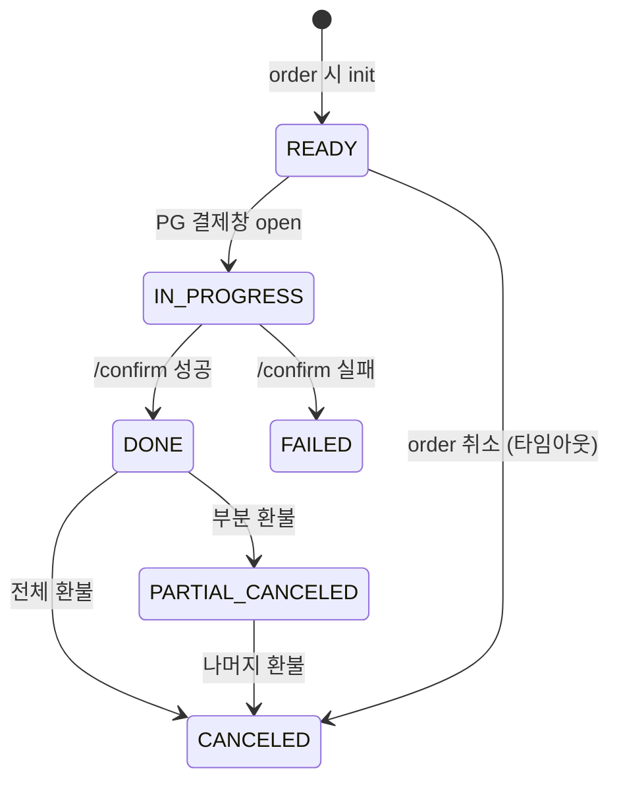

# payments 테이블

| 문서 버전 | 작성일 | 작성자 | 주요 변경 사항 |
| --- | --- | --- | --- |
| v1.0.0 | 2026-05-14 | engineering-agent/tech-lead | 최초 |

**[[database|↑ hub]]**

> 1 order = 1 payment (UNIQUE), PG 추상화 (provider 컬럼).

---

## 1. Schema

```sql
-- V32__create_payments.sql
CREATE TABLE payments (
    id              CHAR(26) PRIMARY KEY,
    order_id        CHAR(26) NOT NULL REFERENCES orders(id),
    buyer_id        CHAR(26) NOT NULL,
    amount          NUMERIC(15, 4) NOT NULL CHECK (amount >= 0),
    currency        CHAR(3) NOT NULL DEFAULT 'KRW',
    method          VARCHAR(20) NOT NULL,                 -- CARD / BANK / MOBILE / EASY_PAY
    status          VARCHAR(20) NOT NULL DEFAULT 'READY',
    pg_provider     VARCHAR(20) NOT NULL,                  -- TOSS / KCP / KAKAO / NAVER / STRIPE
    pg_payment_key  VARCHAR(100),                          -- PG 가 발급한 키
    pg_response     JSONB,                                 -- PG 의 raw 응답 (audit)
    idempotency_key VARCHAR(100),                          -- /confirm 의 헤더
    failure_reason  VARCHAR(500),
    version         BIGINT NOT NULL DEFAULT 0,
    requested_at    TIMESTAMPTZ NOT NULL DEFAULT now(),
    approved_at     TIMESTAMPTZ,
    canceled_at     TIMESTAMPTZ,
    created_at      TIMESTAMPTZ NOT NULL DEFAULT now(),
    updated_at      TIMESTAMPTZ NOT NULL DEFAULT now(),

    CONSTRAINT chk_pay_status CHECK
        (status IN ('READY', 'IN_PROGRESS', 'DONE', 'FAILED', 'CANCELED', 'PARTIAL_CANCELED'))
);

CREATE UNIQUE INDEX ux_payments_order ON payments (order_id);
CREATE UNIQUE INDEX ux_payments_pg_key
    ON payments (pg_provider, pg_payment_key) WHERE pg_payment_key IS NOT NULL;
CREATE UNIQUE INDEX ux_payments_idempotency
    ON payments (idempotency_key) WHERE idempotency_key IS NOT NULL;
CREATE INDEX ix_payments_status_req ON payments (status, requested_at DESC);
```

---

## 2. 컬럼 "왜"

### 2.1 UNIQUE (order_id)

- 1 order = 1 payment 정책.
- 실패 후 재시도는 같은 payment row 의 상태 변경 (재 INSERT X).

### 2.2 `pg_provider` (vs hardcode "TOSS")

- 멀티 PG 지원 — 어댑터 router 의 key.
- 환불 시 어떤 PG 인지 식별.

### 2.3 `pg_payment_key` UNIQUE partial

- PG 가 발급한 키 (예: toss 의 paymentKey).
- 환불 / 조회에 필수.
- partial = NULL 일 때 (READY 상태) UNIQUE 충돌 방지.

### 2.4 `pg_response JSONB` (raw)

- PG 의 모든 응답 보존 — 추후 분쟁 시 evidence.
- 비용 ↑ but 안전성 우선.

### 2.5 `idempotency_key`

- /confirm 의 Idempotency-Key 헤더 — 중복 호출 방어.
- UNIQUE partial.

---

## 3. 상태 머신



---

## 4. 함정

### 함정 1 — order_id UNIQUE 없음
1 order 에 N payment → 회계 mismatch.
→ UNIQUE.

### 함정 2 — pg_response 안 저장
PG 사고 시 evidence X.
→ raw JSONB.

### 함정 3 — pg_payment_key 검증 없이 신뢰
attacker 의 fake key 로 confirm 시도.
→ PG /payments/{key} 재조회 검증.

### 함정 4 — idempotency 컬럼 X
중복 결제.
→ UNIQUE partial.

자세히: [[../design-decisions/pg-selection]] · [[../security/idempotency-key]].

---

## 5. 관련

- [[database|↑ hub]]
- [[orders-table]]
- [[payment-transactions-table]] — audit
- [[refunds-table]]
- [[webhook-events-table]]
- [[../enums/payment-status]]
