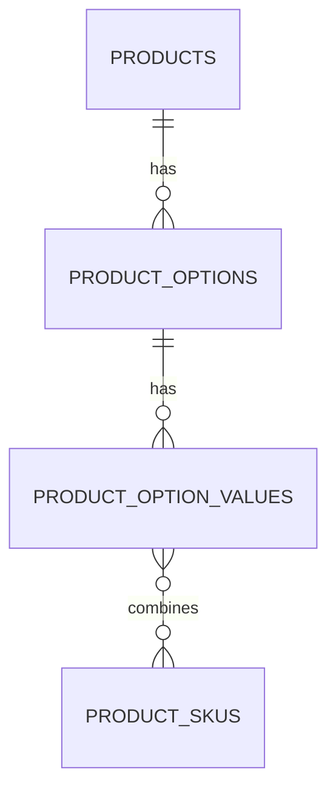

# product_options + product_option_values 테이블

| 문서 버전 | 작성일 | 작성자 | 주요 변경 사항 |
| --- | --- | --- | --- |
| v1.0.0 | 2026-05-14 | engineering-agent/tech-lead | 최초 |

**[[database|↑ hub]]**

> Product 의 옵션 axis (size, color) + 각 axis 의 값.

---

## 1. Schema

```sql
-- V21__create_product_options.sql
CREATE TABLE product_options (
    id          CHAR(26) PRIMARY KEY,
    product_id  CHAR(26) NOT NULL REFERENCES products(id),
    name        VARCHAR(50) NOT NULL,             -- "size" / "color"
    sort_order  INTEGER NOT NULL DEFAULT 0,
    created_at  TIMESTAMPTZ NOT NULL DEFAULT now(),

    UNIQUE (product_id, name)
);

-- V22__create_product_option_values.sql
CREATE TABLE product_option_values (
    id          CHAR(26) PRIMARY KEY,
    option_id   CHAR(26) NOT NULL REFERENCES product_options(id),
    value       VARCHAR(50) NOT NULL,             -- "S" / "M" / "L" / "red" / "blue"
    sort_order  INTEGER NOT NULL DEFAULT 0,
    extra_price_amount NUMERIC(15, 4) NOT NULL DEFAULT 0,   -- L 사이즈 +2000원
    created_at  TIMESTAMPTZ NOT NULL DEFAULT now(),

    UNIQUE (option_id, value)
);

CREATE INDEX ix_options_product ON product_options (product_id, sort_order);
CREATE INDEX ix_option_values_option ON product_option_values (option_id, sort_order);
```

---

## 2. 컬럼 "왜"

### 2.1 `sort_order`

- 옵션 표시 순서 (size 먼저 / color 나중).
- DB 변경 없이 UI 순서 변경.

### 2.2 `extra_price_amount` (옵션 값 별 추가 가격)

- L 사이즈 + 2000원, 큰 책 + 5000원.
- SKU price 가 권위, but 표시 용으로 활용.

### 2.3 UNIQUE (product_id, name)

- 같은 product 에 "size" 옵션 2개 = 의미 X.

---

## 3. 관계



→ option_values 와 SKUs 의 M:N 은 `product_sku_options` ([[products-table#sku]]).

---

## 4. 사용 예

```
Product: "티셔츠"
├── Option: "size"
│   ├── Value: "S"
│   ├── Value: "M"
│   └── Value: "L" (extra_price=2000)
└── Option: "color"
    ├── Value: "red"
    └── Value: "blue"

SKU-001 = ["S", "red"]
SKU-006 = ["L", "blue"] → price = base + 2000
```

---

## 5. 함정

### 함정 1 — 옵션 / 값 hardcode (JSONB)
검색 / 필터 어려움.
→ 별도 테이블.

### 함정 2 — sort_order 없음
UI 순서가 INSERT 순서.
→ sort_order.

### 함정 3 — value 의 i18n
글로벌 진입 시 "red" / "빨강" 번역 X.
→ product_option_value_i18n 테이블.

자세히: [[../design-decisions/option-strategy]].

---

## 6. 관련

- [[database|↑ hub]]
- [[products-table]]
- [[inventory-table]]
- [[../design-decisions/option-strategy]]
