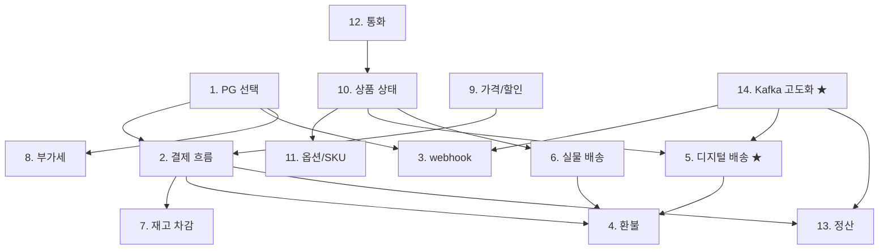

# product design-decisions — 정책 결정 hub

| 문서 버전 | 작성일 | 작성자 | 주요 변경 사항 |
| --- | --- | --- | --- |
| v1.0.0 | 2026-05-14 | engineering-agent/tech-lead | 최초 |

**[[../product|↑ product hub]]**

> "왜 / 안 하면 / 대안 / 트레이드오프" 4구조로 정리한 정책 결정 13개.
> 모든 결정은 한국 일반 SaaS 기준 — 글로벌 / 거대 platform 은 [9. 다른 컨텍스트] 참고.

---

## 1. 결정 목록

| # | 결정 | 핵심 | 노트 |
| --- | --- | --- | --- |
| 1 | **PG 선택** ★ | Toss 1차, KCP 2차 (이중화) | [[pg-selection]] |
| 2 | **결제 흐름** | redirect + /confirm 서버 호출 | [[payment-flow]] |
| 3 | **webhook 전략** | 비동기 보강 + idempotent + HMAC | [[webhook-strategy]] |
| 4 | **환불 정책** | 디지털: 다운로드 전만 / 실물: 단순변심 7일 | [[refund-policy]] |
| 5 | **디지털 배송** ★ | 사용자별 워터마크 PDF + GDrive | [[digital-delivery-policy]] |
| 6 | **실물 배송** | 택배 API 송장 + webhook 추적 | [[physical-delivery-policy]] |
| 7 | **재고 차감 시점** | 주문 시점 (Redis atomic) | [[inventory-strategy]] |
| 8 | **부가세 / 영수증** | 10% inclusive + 전자 영수증 | [[tax-strategy]] |
| 9 | **가격 / 할인** | 쿠폰 1개 + 적립금 적용 가능 | [[pricing-strategy]] |
| 10 | **상품 상태** | DRAFT/ACTIVE/SOLD_OUT/DISCONTINUED | [[product-status-policy]] |
| 11 | **옵션 / SKU** | Variant 패턴 (상품 1 + N SKU) | [[option-strategy]] |
| 12 | **통화 / 다국적** | KRW only (1단계) | [[currency-strategy]] |
| 13 | **정산** | PG D+3 → 가맹점 D+5 | [[settlement-policy]] |
| 14 | **Kafka 고도화** ★ | F10+ Outbox + Kafka (대용량 분산) | [[kafka-event-driven]] |

---

## 2. 결정 순서 (적용 우선순위)

→ PG 선택 (1) 이 모든 결정의 root. PG 마다 webhook / 환불 / 정산 모델이 다름.
→ Kafka (14) 는 F10+ 의 고도화 — 1~13 결정 위에서 비동기 / 분산 layer 만 변경.

---

## 3. 결정 패턴

각 결정 노트는 동일 구조:

1. **본 vault 의 결정** — 한 줄 요약
2. **왜 필요한가** — 비즈니스 / 기술 이유
3. **안 하면 어떤 문제** — 구체적 사고 사례
4. **대안 비교** — 표
5. **선택 사유 / 트레이드오프**
6. **구현 / 코드 예시**
7. **함정**
8. **다른 컨텍스트** (글로벌 / 큰 규모)

→ [[../../signup/design-decisions/design-decisions|↗ signup 동일 패턴]].

---

## 4. 관련

- [[../product|↑ hub]]
- [[../implementation-order]] — 이 결정들의 PR 적용 순서
- [[../../signup/design-decisions/design-decisions|↗ signup design-decisions]]
- [[../../board/design-decisions/design-decisions|↗ board design-decisions]]
