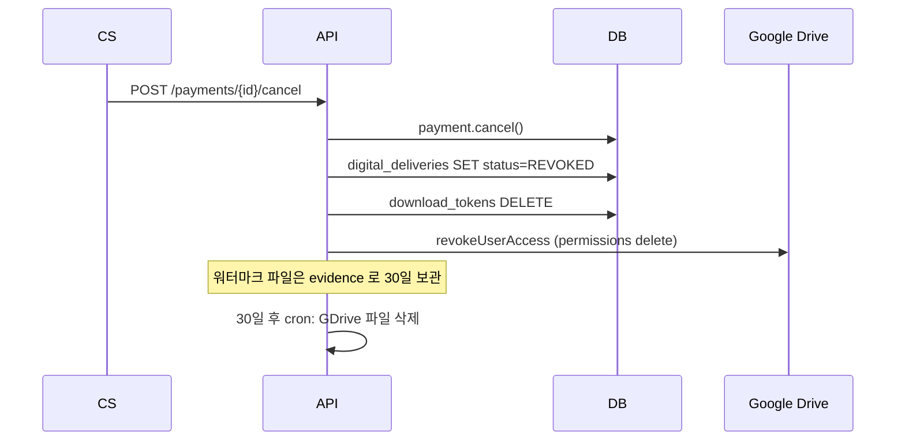

# 디지털 배송 정책 — 책 PDF 사용자별 마스킹 + Google Drive

| 문서 버전 | 작성일 | 작성자 | 주요 변경 사항 |
| --- | --- | --- | --- |
| v1.0.0 | 2026-05-14 | engineering-agent/tech-lead | 최초 — answer-be product 패키지 영감 + 정형화/개선 |

**[[design-decisions|↑ design-decisions hub]]**

> 디지털 상품 (책 / 강의 PDF / 음원) 의 배송 = **사용자별 고유 워터마크** + **저장소**.
> 본 vault: **원본 GDrive 보관 + 워터마크 PDF 사용자별 발급 + 다운로드 토큰**.
> answer-be (masterway-dev) 의 product 패키지 영감 — 정형화 + Hexagonal + 워터마크 / 토큰 / audit 깊이 강화.

---

## 1. 본 vault 결정

```
[원본 PDF]
   ↓ admin 업로드
[Google Drive / 원본 폴더] (private, service account 만 access)
   ↓
[결제 승인 PaymentApproved]
   ↓ AFTER_COMMIT → Listener → Worker enqueue
[Worker: 워터마크 적용]
   ↓
[Google Drive / users/{userId}/orders/{orderId}/{bookId}.pdf] (사용자별)
   ↓
[digital_deliveries row: driveFileId 저장, status=READY]
   ↓
[사용자 알림 (email + push)]
   ↓
[GET /downloads/{token}] (만료 7일, 5회 한도)
   ↓
[GDrive presigned link (1h TTL)] → 302 redirect → 다운로드
```

---

## 2. 왜 필요

### 2.1 왜 워터마크 (마스킹) 필수

- 디지털 책은 **무한 복제 가능** — 1 권 결제 후 100 명에게 배포 가능.
- 워터마크 = 사용자 ID / 주문 ID / 이메일 일부 / 구매일 박힘 → **유출 시 추적 가능**.
- 출판사 계약 시 워터마크 의무화하는 경우 다수.

### 2.2 왜 사용자별 고유 파일 (원본 공유 X)

- 원본 1개를 모든 사용자에게 share → 다운로드 후 워터마크 X → 추적 X.
- **per-user copy** = 워터마크 박힌 사본 = 사용자 책임 명확.

### 2.3 왜 Google Drive (S3 아님)

| 항목 | Google Drive | AWS S3 |
| --- | --- | --- |
| **inline viewer** | ✓ (PDF preview 기본) | 별도 PDF.js 통합 필요 |
| **permission 모델** | 사용자/그룹 권한 grant | bucket policy + presigned URL |
| **viewer 도용 방어** | viewer mode 가 다운로드 막을 수 있음 | presigned 만료로 보호 |
| **사용자별 폴더** | 직관적 (folder per user) | prefix per user |
| **API quota** | 1000 req/100s/user | 매우 높음 |
| **비용** | $6/seat (service account 1개로 다수 file 관리) | $0.023/GB + bandwidth |
| **대용량 파일** | 5TB / file max | 5TB / object max |
| **버전 관리** | 자동 | versioning 옵션 |
| **답찬-be 사례** | ✓ (참고) | - |

**왜 GDrive 선택 (본 vault)**:
- answer-be 의 패턴 영감.
- 책은 권당 ~100MB → S3 + CloudFront 가 cost 더 낮음.
- 단 **viewer 의 다운로드 차단 옵션** + **사용자가 GDrive 에서 직접 열람** UX 이점.

**왜 S3 도 안 함 (트레이드오프)**:
- GDrive API quota (1000 req/100s) — 사용자 폭증 시 throttle.
- 본 vault: 책 판매 (낮은 traffic) → GDrive OK. SaaS 전체 다운로드 (높은 traffic) 면 S3.

### 2.4 왜 다운로드 토큰 (만료 + 한도)

- 사용자가 다운로드 URL 을 공유 → 무한 다운로드.
- token = 만료 7일 + 5회 한도 → 도용 위험 ↓.
- 환불 시 token revoke → 다운로드 불가.

---

## 3. 안 하면 어떤 문제

| 잘못 | 사고 |
| --- | --- |
| 원본 PDF 를 공개 URL 로 | 1 권 결제 후 SNS 공유 → 매출 0 |
| 워터마크 X | 유출 시 누가 유출했는지 추적 불가 → 출판사 계약 위반 |
| 다운로드 무제한 | 사용자가 다른 PC 에 무한 백업 → 도용 |
| token 무한 유효 | 만료 없는 URL — 도용 위험 |
| 환불 후 다운로드 가능 | "환불받고 책 가져감" — 부당 이득 |
| permission GDrive 의 anyoneWithLink | 검색엔진 indexing 위험 |
| 사용자 폴더 공유 (others 와 동일) | 사용자 A 가 B 의 워터마크 볼 수 있음 |

---

## 4. 대안 비교

| 방식 | 설명 | 장점 | 단점 |
| --- | --- | --- | --- |
| **본 vault: GDrive + 워터마크 PDF + 토큰** ★ | 결제 → 워터마크 PDF 생성 → GDrive 저장 → 토큰 다운로드 | 추적 가능 + UX OK + viewer | API quota + GDrive 비용 |
| S3 + 워터마크 + presigned | S3 에 워터마크 PDF + presigned URL (5분) | 비용 ↓ + scale | viewer 별도 구현 |
| DRM (Adobe / Calibre) | DRM 적용 PDF — 특정 reader 만 | 도용 보호 1위 | 사용자 UX 매우 ↓ (reader 강제) |
| 스트리밍 (페이지별) | PDF 를 server-rendered HTML 페이지로 | 도용 매우 어려움 | 백엔드 비용 ↑↑ |
| epub + 시리얼 | 시리얼 키로만 열림 | 도용 보호 | reader 강제 |
| Github private repo (코드북) | git pull | 개발자 UX 좋음 | 책은 안 맞음 |
| 카카오 / 네이버 책 store 위탁 | 판매 위탁 | 자체 개발 X | 30% 수수료 |

자세히: [[../security/digital-watermarking]].

---

## 5. 트레이드오프

| 결정 | 본 vault | 대안 | 차이 |
| --- | --- | --- | --- |
| 워터마크 위치 | 페이지 footer (옅게) + metadata | 페이지 전체 도용 표시 | 가독성 vs 보호 |
| 워터마크 내용 | userId + orderId + 구매일 + email partial | userId 만 | 추적 가능성 vs 사용자 불쾌 |
| 다운로드 한도 | 5회 / 7일 | 무제한 / 영구 | 도용 vs UX |
| 환불 시 access | 즉시 revoke | 7일 유예 | 정책 |
| 저장소 | GDrive | S3 + CF | 비용 / scale / UX |
| GDrive 권한 | service account + 사용자 reader | anyoneWithLink | 보안 |

---

## 6. 워터마크 패턴

### 6.1 워터마크 내용 (사용자별 고유)

```
페이지 footer (작게, 회색):
"Purchased by [user@xxxxx.com] on 2026-05-14 | Order: ORD-2026-A1B2C3 | UID: 01HX..."

PDF metadata:
  /Producer: yule-studio
  /Custom: { userId, orderId, hashOfWatermark }

추가 — 보이지 않는 워터마크 (옵션):
  - PDF 의 미세한 픽셀 변형 (steganography)
  - 페이지 여백 끝의 1px 변형
```

### 6.2 왜 사용자 ID 만이 아니라 여러 필드

- userId 만 박으면 다른 사용자에게 보여도 신원 확인 어려움.
- email partial + orderId + 구매일 → 유출 시 신원 + 시점 명확.

### 6.3 PDFBox 코드 예시

```java
public byte[] applyWatermark(byte[] pdfBytes, WatermarkInfo info) {
    try (var doc = PDDocument.load(pdfBytes)) {
        var font = PDType1Font.HELVETICA;
        for (var page : doc.getPages()) {
            try (var cs = new PDPageContentStream(doc, page, AppendMode.APPEND, true)) {
                cs.setNonStrokingColor(200, 200, 200);   // 옅은 회색
                cs.setFont(font, 8);

                // footer
                cs.beginText();
                cs.newLineAtOffset(50, 30);
                cs.showText("Purchased by " + maskEmail(info.email())
                    + " | Order: " + info.orderId()
                    + " | UID: " + info.userId()
                    + " | " + info.purchasedAt());
                cs.endText();
            }
        }
        // metadata
        var meta = doc.getDocumentInformation();
        meta.setCustomMetadataValue("watermark", info.hash());
        meta.setCustomMetadataValue("userId", info.userId());

        var out = new ByteArrayOutputStream();
        doc.save(out);
        return out.toByteArray();
    }
}
```

자세히: [[../implementation/digital-delivery-impl]] · [[../security/digital-watermarking]].

---

## 7. Google Drive 통합

### 7.1 폴더 구조

```
[Service Account 의 My Drive]
├── _originals/             # 원본 (admin upload, service account only)
│   ├── book-001-source.pdf
│   ├── book-002-source.pdf
│   └── ...
└── _customers/
    └── {userId}/           # 사용자별 폴더 (사용자에게 reader 권한)
        └── {orderId}/
            ├── book-001-{watermarkHash}.pdf
            └── book-002-{watermarkHash}.pdf
```

### 7.2 권한

```
_originals/         → service account (writer) only
_customers/         → service account (writer)
_customers/{uid}/   → service account (writer) + 사용자 (reader, optional)
```

### 7.3 API 사용

```java
@Service
@RequiredArgsConstructor
public class GoogleDriveClient {

    private final Drive drive;     // service account 로 init

    public String uploadCustomerFile(String userId, String orderId,
                                     String fileName, byte[] content) {
        var folderId = ensureUserFolder(userId, orderId);

        var meta = new File();
        meta.setName(fileName);
        meta.setParents(List.of(folderId));

        var media = new ByteArrayContent("application/pdf", content);
        var created = drive.files().create(meta, media)
            .setFields("id, webViewLink")
            .execute();

        return created.getId();   // driveFileId
    }

    public String getShortLivedDownloadUrl(String fileId, Duration ttl) {
        // GDrive 의 webContentLink 직접 호출 (1h 정도 유효)
        return drive.files().get(fileId).setFields("webContentLink")
            .execute().getWebContentLink();
    }

    public void revokeUserAccess(String fileId, String userEmail) {
        // permissions delete
        var perms = drive.permissions().list(fileId).execute().getPermissions();
        perms.stream()
            .filter(p -> userEmail.equals(p.getEmailAddress()))
            .forEach(p -> {
                try { drive.permissions().delete(fileId, p.getId()).execute(); }
                catch (Exception e) { throw new RuntimeException(e); }
            });
    }
}
```

자세히: [[../implementation/digital-delivery-impl]].

---

## 8. 다운로드 토큰 모델

### 8.1 토큰 발급

```http
POST /api/v1/me/library/{deliveryId}/download-link

200 OK
{
  "downloadUrl": "https://api.example.com/downloads/{token}",
  "expiresAt": "2026-05-21T15:00:00Z",
  "remainingAttempts": 5
}
```

### 8.2 토큰 사용

```http
GET /downloads/{token}

→ 서버: 토큰 검증 + 횟수 검증 + GDrive presigned URL 발급
→ 302 redirect to GDrive download URL
→ 클라가 GDrive 에서 직접 다운
```

### 8.3 token 자체 spec

```
token = base64( hmac_sha256(deliveryId || userId || expiresAt, server_secret) )
```

→ DB row 의 `download_token_hash` 와 비교. raw token 은 DB X.

자세히: [[../security/digital-watermarking#downloadtoken]].

---

## 9. 환불 흐름 (디지털)



### 9.1 왜 즉시 access revoke

- "환불 받고 책 가짐" = 부당 이득.
- 다운로드 token 무효 + GDrive permission 제거 = 2 layer 방어.

### 9.2 왜 파일은 30일 보관 (즉시 삭제 X)

- 분쟁 시 evidence (워터마크 박힌 사본이 어디 유출되었는지 확인).
- 30일 후 자동 cron 삭제.

자세히: [[refund-policy#디지털]].

---

## 10. 함정

### 함정 1 — 원본 GDrive permission anyoneWithLink
출판사 원본 유출.
→ service account only.

### 함정 2 — 워터마크 적용 동기 (트랜잭션 안)
PDF 100MB 처리 — 트랜잭션 30s 락.
→ AFTER_COMMIT + worker.

### 함정 3 — Worker 실패 후 재시도 무한
GDrive API 일시 장애 시 무한 fail.
→ exp backoff + max 5회 + DEAD_LETTER.

### 함정 4 — 워터마크 PDF 파일 cache X
같은 사용자가 5번 다운로드 시 매번 워터마크 재생성.
→ 첫 생성 후 GDrive 에 저장하고 driveFileId 재사용.

### 함정 5 — 사용자별 GDrive 폴더 생성 안 함
모든 사용자 같은 폴더 — 권한 누수.
→ 사용자별 폴더 + 권한 grant.

### 함정 6 — 환불 시 GDrive 파일 즉시 삭제
30일 후 분쟁 시 evidence 없음.
→ permission 제거만 + 30일 후 file 삭제.

### 함정 7 — 토큰 만료 없음
URL 영구 — 도용.
→ 7일 만료 + 5회 한도.

### 함정 8 — 워터마크 적용 후 PDF 파일 크기 폭증
PDFBox 의 비효율 — 100MB → 500MB.
→ 적용 후 압축 (qpdf / Ghostscript).

### 함정 9 — 보이지 않는 워터마크 (steganography) 만
사용자가 PDF 의 metadata 만 삭제 → 추적 X.
→ visible footer + invisible metadata + hash 다중.

자세히: [[../pitfalls/digital-delivery-pitfalls]].

---

## 11. 다른 컨텍스트

### 11.1 강의 동영상 (Netflix-스타일)

```yaml
storage: CloudFront (HLS streaming)
watermark: per-session subtitle overlay
drm: widevine / fairplay
download: X (streaming only)
```

→ 책과 다름 — streaming 으로 도용 방어 + DRM.

### 11.2 음원 (멜론 / 지니)

```yaml
storage: 자체 CDN
encryption: 자체 키 (player 에서 decrypt)
watermark: 미세 noise (audio steganography)
download: X (player only)
```

### 11.3 일반 파일 (zip / 소프트웨어)

```yaml
storage: S3
delivery: presigned URL (15분)
watermark: filename 변경 + zip 내부 라이센스 키 파일
```

### 11.4 답찬-be / answer-be 의 영감

답찬-be 의 product 패키지에서:
- ✓ GDrive 사용
- ✓ 사용자별 마스킹 (정형화 X — 직접 수동 작업)
- ✗ 다운로드 토큰 / 한도 (없었음 — 추가 개선)
- ✗ AFTER_COMMIT outbox (동기 처리 — 개선)
- ✗ 환불 시 자동 revoke (수동 — 개선)
- ✗ Hexagonal 추상화 (직접 결합 — 개선)

→ 본 vault 는 정형화 + 개선 버전.

---

## 12. 관련

- [[design-decisions|↑ hub]]
- [[../security/digital-watermarking]] — 워터마크 구현 세부
- [[../implementation/digital-delivery-impl]] — Listener + Worker
- [[../database/digital-assets-table]] — 원본 자산
- [[../database/digital-deliveries-table]] — 사용자별 자산
- [[../enums/product-type]] — BOOK / DIGITAL
- [[refund-policy#디지털]]
- [[../pitfalls/digital-delivery-pitfalls]]
