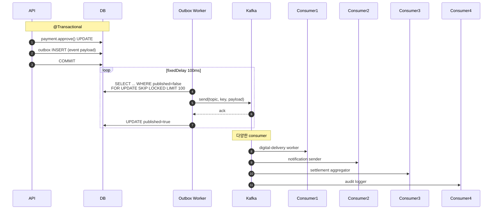

# Kafka 고도화 — 대용량 트랜잭션 처리 (Phase F10+) ★

| 문서 버전 | 작성일 | 작성자 | 주요 변경 사항 |
| --- | --- | --- | --- |
| v1.0.0 | 2026-05-14 | engineering-agent/tech-lead | 최초 — Spring in-process → Kafka 분산 |

**[[design-decisions|↑ design-decisions hub]]**

> F0~F9 = Spring `@TransactionalEventListener AFTER_COMMIT` (in-process, 단일 노드).
> **F10+ = Kafka 도입** — 대용량 / 분산 / 재처리 / consumer 별 scale-out.

---

## 1. 본 vault 결정

| 단계 | 이벤트 처리 |
| --- | --- |
| F0~F9 | Spring `@TransactionalEventListener AFTER_COMMIT` (in-process) |
| **F10** | Outbox + Kafka producer (트랜잭션 일관성) |
| **F11** | Kafka consumer 분리 (notification / digital / settlement) |
| **F12** | DLQ / replay / 분석 / KStreams 통계 |

→ 시작 (in-process) 단순함 → 트래픽 증가 시 분리.

---

## 2. 왜 / 안 하면 / 대안 / 트레이드오프

### 2.1 왜 F10+ 에 Kafka

- **대용량**: 결제 1000 TPS → in-process 의 `@Async` 스레드풀 한계.
- **분산**: 결제 / 디지털 / 정산 / 알림 모두 다른 서버 / 다른 팀 운영.
- **재처리**: consumer 가 fail 해도 offset 보관 — replay.
- **decouple**: producer 가 consumer 를 모름 — 새 consumer 추가 용이 (예: 분석 / 추천 pipeline).
- **scale-out**: consumer instance 늘리면 throughput 증가.

### 2.2 안 하면 어떤 문제

| 잘못 | 사고 |
| --- | --- |
| F0 부터 Kafka | 운영 복잡 (Zookeeper / 6 broker) + 학습 비용 + small scale 에 과잉 |
| F10+ 도 in-process 유지 | 결제 봇 throw 시 다른 도메인 (디지털 / 정산) 전부 같이 실패 |
| 단순 @Async (Kafka X) | 서버 재시작 시 in-memory queue 손실 → 워터마크 / 알림 누락 |
| Kafka 없이 DB outbox 만 | polling overhead + 단일 DB 부하 |

### 2.3 대안

| 모델 | 적용 |
| --- | --- |
| **Spring in-process** (현재 F0~F9) ★ | 단일 노드 / MVP |
| **Outbox + Kafka** (F10+) ★ | 분산 / 대용량 |
| RabbitMQ | 단순 queue (replay X) |
| AWS SQS | 관리형 (replay 7d / DLQ 기본) |
| AWS Kinesis | KStreams 비슷 |
| Redis Streams | 가벼움 (소규모) |

### 2.4 트레이드오프

- **Kafka**: scale + replay + decouple + 운영 복잡 (broker / Zookeeper / topic 관리).
- **SQS**: 관리형 (운영 ↓) + replay 7일 + cost.
- **in-process**: 단순 + 단일 노드 한계.

---

## 3. Topic 설계

| Topic | partition key | retention | 용도 |
| --- | --- | --- | --- |
| `product.order.events.v1` | orderId | 7d | OrderCreated / OrderPaid / OrderCanceled / OrderFulfilled |
| `product.payment.events.v1` | orderId | 30d | PaymentApproved / PaymentFailed / PaymentCanceled |
| `product.payment.webhook.v1` | pgPaymentKey | 7d | PG webhook 원본 (raw body) |
| `product.digital.delivery.v1` | userId | 14d | DigitalDelivery 생성 / 실패 / revoke |
| `product.inventory.events.v1` | skuId | 3d | 재고 차감 / 복원 / 부족 알림 |
| `product.notification.v1` | userId | 3d | push / email outbox |
| `product.settlement.v1` | paymentId | 90d | 정산 / 대사 |
| `product.audit.v1` | actorId | 365d | admin / system action |
| **DLQ** `*.dlq` | original key | 30d | consumer 실패 deadletter |

### 3.1 왜 partition key 별 분리

- 같은 orderId 의 이벤트 → 같은 partition → **순서 보장**.
- userId / skuId 별 분리 → consumer 부하 분산.

### 3.2 왜 retention 다르게

- 결제 30d (분쟁 윈도우).
- 알림 3d (이미 발송).
- 정산 90d (대사 윈도우).
- audit 365d (법적 5년 → cold storage 별도).

자세히: [[../implementation/payment-confirm-impl#kafka]].

---

## 4. Outbox + Kafka 패턴 (트랜잭션 일관성)



### 4.1 왜 outbox (직접 publish X)

- 직접 publish — 트랜잭션 commit 후 Kafka 호출 timeout 시 event 누락.
- outbox = "DB commit 와 함께 event 등록" → worker 가 별도로 발송 → **at-least-once** 보장.

### 4.2 왜 SKIP LOCKED

- 여러 worker instance 가 같은 row 안 잡음.
- PostgreSQL 의 `FOR UPDATE SKIP LOCKED` 또는 Redis 분산 락.

자세히: [[../implementation/payment-confirm-impl]] · [[../../signup/database/email-outbox-table|↗ signup outbox 패턴]].

---

## 5. Consumer 패턴

### 5.1 Idempotent consumer

```java
@KafkaListener(topics = "product.payment.events.v1",
               groupId = "digital-delivery-consumer",
               concurrency = "3")
public void onPaymentApproved(
        @Payload PaymentApprovedEvent ev,
        @Header(KafkaHeaders.RECEIVED_PARTITION) int partition,
        @Header(KafkaHeaders.OFFSET) long offset) {

    // 1. dedup (event_id UNIQUE)
    if (consumedEvents.exists(ev.eventId())) return;
    consumedEvents.save(ev.eventId(), partition, offset, now());

    // 2. business
    digitalDeliveryService.start(ev.orderId(), ev.userId());

    // 3. ack (auto by listener)
}
```

### 5.2 왜 idempotent

- Kafka at-least-once = 같은 메시지 2번 수신 가능.
- consumer 가 dedup 안 하면 → 워터마크 2번 / 알림 2번.

### 5.3 Consumer group 별 책임

| group | 책임 | scale |
| --- | --- | --- |
| `digital-delivery-consumer` | 워터마크 + GDrive upload | 3 instance |
| `notification-consumer` | push / email | 5 instance |
| `settlement-consumer` | 정산 row 집계 | 1 instance (single-threaded) |
| `audit-consumer` | audit log INSERT | 2 instance |
| `analytics-consumer` | KStreams / 통계 | 자유 |

→ payment-events 1 topic 을 여러 group 이 read (각 group 별 offset).

---

## 6. DLQ (Dead Letter Queue)

```java
@RetryableTopic(
    attempts = "5",
    backoff = @Backoff(delay = 1000, multiplier = 2.0),
    dltTopicSuffix = ".dlq"
)
@KafkaListener(topics = "product.payment.events.v1")
public void process(PaymentEvent ev) { ... }

@DltHandler
public void onDlq(PaymentEvent ev, @Header(KafkaHeaders.EXCEPTION_MESSAGE) String err) {
    log.error("dlq: {}", err);
    dlqRepo.save(ev, err);          // admin 검토용
    slack.alert("payment dlq", ev);
}
```

### 6.1 왜 DLQ

- 5회 retry 후 영구 실패 — main topic 막힘 방지.
- admin 이 dlq 검토 후 manual replay / 처리.

---

## 7. Kafka 인프라

| 항목 | 본 vault |
| --- | --- |
| broker | 3 노드 (production) / 1 노드 (dev Docker) |
| Zookeeper | KRaft mode (Zookeeper-less, Kafka 3.5+) |
| 클러스터 | AWS MSK 또는 Docker Cluster |
| 모니터링 | Kafka UI / kcat / Prometheus JMX |
| security | SASL/PLAIN + TLS (production) |

### 7.1 docker-compose (dev)

```yaml
services:
  kafka:
    image: confluentinc/cp-kafka:7.7.0
    environment:
      KAFKA_NODE_ID: 1
      KAFKA_PROCESS_ROLES: broker,controller
      KAFKA_LISTENERS: PLAINTEXT://0.0.0.0:9092,CONTROLLER://0.0.0.0:9093
      KAFKA_CONTROLLER_QUORUM_VOTERS: 1@kafka:9093
      KAFKA_ADVERTISED_LISTENERS: PLAINTEXT://kafka:9092
      KAFKA_OFFSETS_TOPIC_REPLICATION_FACTOR: 1
    ports: ["9092:9092"]
  kafka-ui:
    image: provectuslabs/kafka-ui:latest
    environment:
      KAFKA_CLUSTERS_0_BOOTSTRAPSERVERS: kafka:9092
    ports: ["8080:8080"]
```

자세히: [[../implementation/payment-confirm-impl#kafka-setup]].

---

## 8. 이벤트 schema (JSON)

```json
{
  "eventId": "01HX...",
  "eventType": "payment.approved",
  "version": "v1",
  "occurredAt": "2026-05-14T18:30:00Z",
  "aggregateId": "ord_01HX...",
  "aggregateType": "ORDER",
  "actor": { "userId": "...", "role": "USER" },
  "metadata": { "traceId": "...", "spanId": "..." },
  "payload": {
    "paymentId": "pay_01HX...",
    "orderId": "ord_01HX...",
    "amount": { "value": 50000, "currency": "KRW" },
    "method": "CARD",
    "pgProvider": "TOSS"
  }
}
```

### 8.1 왜 schema 명시 + version

- consumer / producer 의 schema 호환성 — `v1` → `v2` 시 backward-compatible.
- Confluent Schema Registry (Avro) 옵션.

---

## 9. Migration: in-process → Kafka

```
Step 1 (F10):
  - Outbox 테이블 도입
  - 기존 @TransactionalEventListener 에서 outbox INSERT 추가
  - in-process 처리 + outbox 동시 (dual-write 검증)

Step 2 (F10+1):
  - 새 consumer 만 Kafka 사용 (예: 새 분석 pipeline)
  - 기존 처리는 그대로 in-process

Step 3 (F11):
  - 기존 처리 1개씩 Kafka consumer 로 이전
  - notification → digital-delivery → settlement 순

Step 4 (F11+1):
  - in-process @TransactionalEventListener 제거
  - 모든 도메인 Kafka 통해 통신

Step 5 (F12):
  - KStreams 통계 / DLQ runbook / replay 도구
```

→ 점진적 이전, big-bang X.

---

## 10. 함정

### 함정 1 — F0 부터 Kafka 도입
운영 복잡 + 학습 비용 + 작은 trafic 에 과잉.
→ in-process 부터, F10+ 에 도입.

### 함정 2 — 직접 publish (outbox X)
DB commit 후 Kafka send timeout → event 손실.
→ outbox.

### 함정 3 — consumer idempotency X
같은 메시지 2번 처리.
→ event_id UNIQUE.

### 함정 4 — partition key 잘못 선택
같은 orderId 가 다른 partition → 순서 X.
→ aggregateId 기준.

### 함정 5 — schema version 없음
v1 → v2 시 consumer 깨짐.
→ schema version + backward-compat.

### 함정 6 — DLQ 없음
실패 시 main topic 막힘.
→ DLQ + 5회 retry.

### 함정 7 — offset commit 시점 잘못
처리 중 commit → 중복 처리.
→ ack 정책 명확 (manual ack 권장).

### 함정 8 — single-threaded consumer 1 partition 의존
처리 느림.
→ partition 늘리고 consumer instance 늘림.

### 함정 9 — Kafka 보안 X (production)
PLAINTEXT → 누구나 read.
→ SASL/PLAIN + TLS + ACL.

---

## 11. 다른 컨텍스트

### 11.1 글로벌 (Stripe Connect 스케일)

```yaml
broker: 자체 / AWS MSK 12+ node
schema-registry: Confluent
topics: per-region (us-east / eu-west / ap-northeast)
processing: KStreams + ksqlDB
```

### 11.2 작은 SaaS

```yaml
queue: AWS SQS (관리형, replay 7d)
또는: Spring in-process + DB outbox (Kafka 보다 단순)
```

### 11.3 마이크로서비스 (k8s)

```yaml
broker: AWS MSK / Strimzi (k8s operator)
service-mesh: Istio + Kafka mesh
```

### 11.4 분석 / ML pipeline (Netflix-스타일)

```yaml
kafka → kstreams → s3 → spark/flink → ML model
또는: kafka → kinesis firehose → analytics
```

---

## 12. TDD 통합 (참고)

### 12.1 EmbeddedKafka

```java
@SpringBootTest
@EmbeddedKafka(partitions = 3, topics = {"product.payment.events.v1"})
class PaymentConfirmTest { ... }
```

### 12.2 Testcontainers

```java
static KafkaContainer kafka = new KafkaContainer(DockerImageName.parse("confluentinc/cp-kafka:7.7.0"));
```

자세히: [[../testing/integration-tests]].

---

## 13. 관련

- [[design-decisions|↑ hub]]
- [[pg-selection]]
- [[webhook-strategy]]
- [[payment-flow]]
- [[../implementation/payment-confirm-impl]]
- [[../implementation/payment-webhook-impl]]
- [[../implementation/digital-delivery-impl]]
- [[../testing/integration-tests]]
- [[../../signup/database/email-outbox-table|↗ signup outbox 패턴]]
- [[../../webhook-send|↗ webhook-send]]
