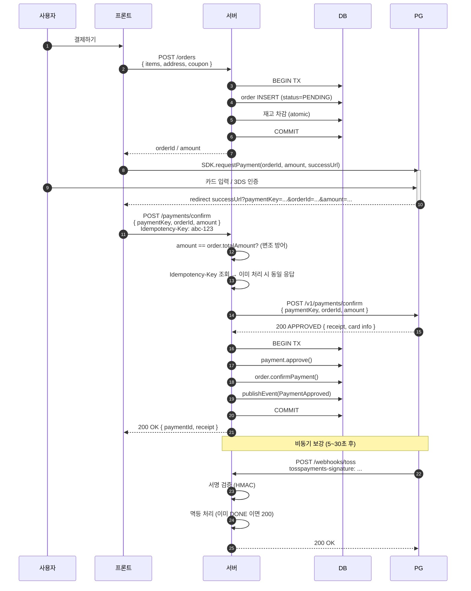

# 결제 흐름 — redirect + /confirm 서버 호출

| 문서 버전 | 작성일 | 작성자 | 주요 변경 사항 |
| --- | --- | --- | --- |
| v1.0.0 | 2026-05-14 | engineering-agent/tech-lead | 최초 |

**[[design-decisions|↑ design-decisions hub]]**

> "결제창 → callback → /confirm" 흐름 vs 다른 모델 비교.
> 본 vault: **redirect + 서버 /confirm** (Toss 표준).

---

## 1. 본 vault 결정

```
1. FE 가 /orders POST → orderId / amount 발급
2. FE 가 PG SDK 의 결제창 호출 (orderId, amount, successUrl)
3. PG 가 사용자 카드 입력 받음 → success → FE 의 successUrl 로 redirect
4. FE 가 /payments/confirm 호출 (paymentKey, orderId, amount)
5. 서버가 PG 의 /confirm API 호출 → 승인 처리
6. PG 가 비동기 webhook 발송 (보강)
```

---

## 2. 왜 필요

### 2.1 결제는 PG 가 호스팅하는 이유

- 사용자가 카드번호 / CVV 를 **서버에 절대 노출 X** = PCI-DSS.
- PG SDK 가 PG 도메인에서 입력 받음 (iframe / popup / native).
- 서버는 PG 가 발급한 **paymentKey** (불투명 토큰) 만 받음.

### 2.2 /confirm 을 FE 가 아닌 서버에서 호출 이유

- FE 가 직접 /confirm 호출 시 — 사용자가 amount 변조 가능 (1억 결제를 100원으로).
- 서버가 PG 에 amount 보내고 PG 가 검증 — 한 번 더 보안.
- 결제 결과의 트랜잭션 (DB UPDATE) 가 서버에 있어야 함.

---

## 3. 안 하면 어떤 문제

| 잘못 | 사고 |
| --- | --- |
| FE → PG → FE → 서버 (X) | FE 가 amount 1억 → 100원 변조 가능 |
| 서버 → PG → 서버 (FE 결제창 X) | 카드 입력 UX 직접 구현 — PCI-DSS |
| /confirm 응답 만 신뢰 (webhook 무시) | PG 응답 timeout 시 결제 결과 미확정 |
| webhook 만 신뢰 (/confirm 무시) | 사용자 즉시 결과 못 봄 — UX ↓ |

---

## 4. 대안 비교

| 흐름 | 적용 처 | 장점 | 단점 |
| --- | --- | --- | --- |
| **redirect + /confirm** ★ | Toss / KCP / Stripe Checkout | 표준, PCI-DSS, UX 좋음 | 사용자가 한 번 PG 화면 봄 |
| Card token (Stripe Elements) | Stripe / Braintree | 한 화면 (UX 더 좋음) | iframe 통합, JS 의존 |
| 직접 카드 처리 (PCI-DSS Level 1) | 자체 PG / 큰 enterprise | UX 1위 | PCI-DSS 심사 수억원 |
| QR / 간편결제 (카카오/네이버) | 모바일 | 1탭 결제 | 단일 결제수단 |
| recurring (token + auto-charge) | 구독 SaaS | 자동 갱신 | 빌링키 저장 책임 |

자세히: [[pg-selection]].

---

## 5. 트레이드오프

| 결정 | 본 vault | 대안 | 차이 |
| --- | --- | --- | --- |
| /confirm 시점 | FE 의 successUrl callback 시 | webhook 시 만 | UX vs 단순함 |
| amount 검증 위치 | 서버 (order.totalAmount 비교) | PG 위임 | 변조 방어 |
| Idempotency | `Idempotency-Key` 헤더 | 없음 (재호출 시 PG 가 거절) | 재시도 안전성 |
| 비동기 보강 | webhook + polling | /confirm 만 | timeout / 누락 방어 |

---

## 6. 흐름 (상세)



---

## 7. /confirm API 코드

```java
@PostMapping("/payments/confirm")
public ResponseEntity<PaymentConfirmResponse> confirm(
        @RequestHeader("Idempotency-Key") String idempotencyKey,
        @RequestBody PaymentConfirmRequest req,
        @AuthenticationPrincipal AuthUser auth) {

    return paymentService.confirm(idempotencyKey, req.paymentKey(),
        new OrderId(req.orderId()), Money.krw(req.amount()), auth.userId());
}
```

```java
@Transactional
public PaymentResult confirm(String idempotencyKey, String paymentKey,
                             OrderId orderId, Money amount, UserId buyerId) {

    // 1. Idempotency check
    return idempotencyStore.execute(idempotencyKey, () -> {

        // 2. order 조회 + amount 검증 (변조 방어)
        var order = orders.findById(orderId).orElseThrow();
        if (!order.totalAmount().equals(amount))
            throw new AmountTamperedException(amount, order.totalAmount());
        if (!order.buyerId().equals(buyerId))
            throw new ForbiddenException();

        // 3. payment 초기화 / 조회
        var payment = payments.findByOrderId(orderId)
            .orElseGet(() -> Payment.initiate(ids.next(), orderId, buyerId, amount,
                                              PaymentMethod.CARD, clock.now()));
        if (payment.status() == PaymentStatus.DONE)
            return PaymentResult.of(payment);  // idempotent

        // 4. PG 호출
        var pg = gatewayRouter.resolve("TOSS");
        var pgResult = pg.confirm(new PgConfirmCommand(paymentKey, orderId.value(), amount));

        // 5. 도메인 적용
        payment.markInProgress(paymentKey, clock.now());
        payment.approve(clock.now());
        order.confirmPayment();
        payments.save(payment);
        orders.save(order);

        return PaymentResult.of(payment);
    });
}
```

자세히: [[../implementation/payment-confirm-impl]].

---

## 8. 함정

### 함정 1 — amount 변조 검증 안 함
1억 결제를 1원으로.
→ 서버에서 order.totalAmount 비교.

### 함정 2 — Idempotency 없음
사용자 더블 클릭 → PG /confirm 2회 호출 → 결제 2번 차감.
→ Idempotency-Key 헤더 + 24h cache.

### 함정 3 — /confirm 응답 timeout 시 처리
서버 PG 호출 후 응답 received but 클라이언트 disconnect.
→ webhook + polling 으로 보강.

### 함정 4 — webhook 만 신뢰 (즉시 UX X)
사용자가 30초 기다려야 결제 완료 봄.
→ /confirm 으로 즉시 + webhook 보강.

### 함정 5 — successUrl 변조
사용자가 successUrl 직접 호출 → 결제 안 했는데 success.
→ paymentKey 가 PG 가 발급한 진짜 토큰 — 서버에서 PG 에 재조회 검증.

### 함정 6 — 재고 차감을 결제 후로
사용자가 결제했는데 재고 0 → 환불 처리.
→ 주문 생성 시 재고 차감 (결제 실패 시 복원).

자세히: [[inventory-strategy]] · [[../pitfalls/payment-pitfalls]].

---

## 9. 다른 컨텍스트

### 9.1 recurring (구독)

```
1. 첫 결제: 위와 동일 — paymentKey + billingKey 받음
2. billingKey 저장 (암호화)
3. 매월 batch — billingKey 로 자동 결제
4. 실패 시 dunning (3회 retry + 이메일)
```

### 9.2 간편결제 (카카오/네이버페이)

```
1. SDK 호출 — 카카오톡 / 네이버앱 으로 이동
2. 사용자 인증
3. callback → /confirm
```

→ Toss 통합 시 carrier 가 카카오/네이버 (간편결제 통합).

### 9.3 가상계좌

```
1. /orders POST → 가상계좌번호 발급
2. 사용자가 ATM/이체로 입금
3. PG webhook 이 입금 알림
4. server 가 order.confirmPayment()
```

→ 비동기 (수 시간 ~ 1일). order timeout 정책 별도.

---

## 10. 관련

- [[design-decisions|↑ hub]]
- [[pg-selection]]
- [[webhook-strategy]]
- [[../security/idempotency-key]]
- [[../implementation/payment-confirm-impl]]
- [[../pitfalls/payment-pitfalls]]
