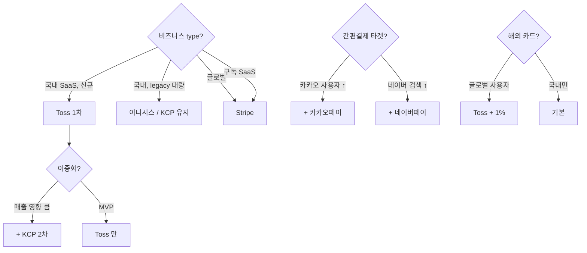

# PG 선택 — Toss / KCP / 카카오 / 네이버 / Stripe / PayPal 장단점

| 문서 버전 | 작성일 | 작성자 | 주요 변경 사항 |
| --- | --- | --- | --- |
| v1.0.0 | 2026-05-14 | engineering-agent/tech-lead | 최초 |

**[[design-decisions|↑ design-decisions hub]]**

> 결제 모듈의 **가장 큰 결정**. PG 마다 API / 환불 / 정산 / 수수료 / 인증 / 가맹 절차 모두 다름.
> 본 vault: **Toss 1차 + KCP 2차 (이중화)** — 한국 신규 SaaS 기준.
> 다른 컨텍스트 (글로벌 / 큰 platform) 는 [9. 다른 컨텍스트] 참고.

---

## 1. 본 vault 결정

| 단계 | PG | 이유 |
| --- | --- | --- |
| F5 (1차) | **토스페이먼츠** | 개발자 경험 1위, REST API + webhook 표준, 카드/페이/계좌 통합 |
| F8+ (2차) | **NHN KCP** | 토스 장애 fallback, 가맹점 다수 (안정 운영 10+년) |
| 옵션 | 카카오페이 / 네이버페이 | "간편결제" 버튼 추가 (별도 PG, 페이별 UX 강점) |
| 글로벌 | Stripe | KRW only 단계 후, 다국적 진입 시 |

---

## 2. 왜 PG 선택이 가장 중요한가

### 2.1 왜 필요

- 결제 = SaaS 의 매출 root → PG 의 SLA / fee / UX = 매출에 직접 영향.
- PG 변경은 **3~6개월 재작업** — webhook / 환불 / 정산 로직 모두 PG 종속.

### 2.2 안 하면 어떤 문제

| 실수 | 결과 |
| --- | --- |
| 인기 PG (Toss) 무시 → 옛 PG (이니시스 XML) 선택 | 개발자 retention ↓, 신규 채용 어려움, 결제 UX 구식 |
| 단일 PG 의존 (이중화 X) | PG 장애 30분 = 매출 0 (2022 KCP 장애 사례) |
| 가맹 절차 미고려 — 출시 직전 가맹 신청 | 가맹 심사 2~4주 — 출시 지연 |
| 정산 주기 미고려 | 사업 cashflow 문제 (PG D+5 → 본인 D+10 인 경우 자금 동결) |
| 카드 정보 직접 처리 시도 | PCI-DSS 심사 (수억원 비용) — 절대 X |

### 2.3 대안 (PG 후보)

→ [3. PG 비교표] 참고.

### 2.4 트레이드오프

- **Toss 단일** = 개발 빠름 + 신뢰 ↓ (장애 시 매출 0).
- **다중 PG** = 안정 ↑ + 개발 시간 2배 (각 PG webhook / 환불 / 정산 로직 별도).
- **간편결제 따로** = 매출 ↑ (카카오/네이버 사용자 끌어옴) + 정산 분리 → 회계 복잡.

---

## 3. PG 비교표 (한국 + 글로벌)

### 3.1 한국 PG

| 항목 | **토스페이먼츠** ★ | **NHN KCP** | **이니시스** (KG) | **나이스페이** | **카카오페이** | **네이버페이** |
| --- | --- | --- | --- | --- | --- | --- |
| API 스타일 | REST JSON + webhook | REST + 일부 XML | XML/SOAP + REST | XML/SOAP + REST | REST | REST |
| 개발자 경험 | ⭐⭐⭐⭐⭐ | ⭐⭐⭐ | ⭐⭐ | ⭐⭐ | ⭐⭐⭐⭐ | ⭐⭐⭐⭐ |
| 문서 품질 | 매우 좋음 | 보통 | 약간 구식 | 보통 | 좋음 | 좋음 |
| Idempotency 지원 | 표준 `Idempotency-Key` 헤더 | 일부 (재호출 정책) | 일부 | 일부 | 일부 | 일부 |
| 카드 수수료 (개인) | ~2.8% | ~2.7% | ~2.8% | ~2.8% | ~2.7% | ~2.7% |
| 카드 수수료 (사업자) | 협상 (1.6~2.5%) | 협상 | 협상 | 협상 | 협상 | 협상 |
| 정산 주기 | D+3 (영업일) | D+3 | D+3 | D+3 | D+3 | D+3~D+30 (조정) |
| webhook 서명 | HMAC-SHA-256 (헤더) | HMAC (서명키 포함) | 단순 (IP 화이트리스트 의존) | 단순 | HMAC | HMAC |
| 결제수단 | 카드 / 계좌 / 토스페이 / 휴대폰 / 가상계좌 / 카카오/네이버 (간편결제 통합) | 동일 (대부분) | 동일 | 동일 | 카카오페이 only | 네이버페이 only |
| 가맹 심사 | 1~2주 | 2~3주 | 2~4주 | 2~3주 | 1주 | 1주 |
| sandbox | 가입 즉시 무료 | 신청 후 1일 | 신청 후 1~3일 | 신청 후 1~3일 | 즉시 | 즉시 |
| KRW 환전 | N/A | N/A | N/A | N/A | N/A | N/A |
| 해외 카드 (VISA/Master) | O (수수료 +1%) | O | O | O | X | X |
| 정기결제 (recurring) | O (빌링키) | O | O | O | O | O |
| 환불 API | 멱등 + 부분 환불 | 멱등 + 부분 | 멱등 (이슈 보고됨) | 멱등 | 멱등 | 멱등 |
| **장점** | DX 최강, REST 표준, idempotency, 문서 깔끔 | 안정성 검증 (10+년), 가맹 다수 | 점유율 1위 (legacy 통합 이미 있을 때 강점) | 가성비 좋음 | 카카오 사용자 ↑↑↑ | 네이버 사용자 ↑↑↑, 멤버십 |
| **단점** | 시장점유율 KCP 보다 낮음 (가맹점 적음) | DX 평범, XML 잔존 | DX 구식, 문서 흩어짐 | DX 평범 | 단일 결제수단 only | 단일 결제수단 only |
| **추천 사용처** | 신규 SaaS (1차 PG) | 대형 / 안정 우선 | legacy 가 이미 이니시스 | 가성비 | 카카오 사용자 타겟 | 네이버 검색 유입 + 멤버십 |

### 3.2 글로벌 PG

| 항목 | **Stripe** | **PayPal** | **Adyen** | **Braintree** (PayPal 소속) |
| --- | --- | --- | --- | --- |
| API 스타일 | REST + webhook | REST + IPN (legacy) | REST + webhook | REST + webhook |
| 개발자 경험 | ⭐⭐⭐⭐⭐ | ⭐⭐⭐ | ⭐⭐⭐⭐ | ⭐⭐⭐⭐ |
| 카드 수수료 | 2.9% + $0.30 | 2.9% + $0.30 | interchange + 0.6% (협상) | 2.9% + $0.30 |
| KRW 지원 | O (정산은 USD) | O | O | O |
| 한국 지급결제업 | X (해외 PG, 한국 정산 어려움) | X | X (있지만 한국 비즈니스 어려움) | X |
| Idempotency | `Idempotency-Key` 표준 (Stripe 의 원조) | 부분 | 표준 | 표준 |
| 정기결제 | Subscriptions 모듈 | Recurring | O | O |
| webhook 보안 | Stripe-Signature 헤더 (HMAC) | IPN (legacy) | HMAC | HMAC |
| **장점** | 표준 / 글로벌 / Stripe-Tax / Issuing / Connect | 글로벌 사용자 인지 ↑ | 큰 enterprise 우대 | Stripe 와 비슷 |
| **단점** | 한국 사업자 계좌 정산 어려움 (Atlas 또는 우회) | DX 구식, 환불 정책 까다로움 | 가맹 심사 까다로움 | PayPal 의존 |
| **추천** | 글로벌 SaaS (한국 출시 후) | 글로벌 사용자 결제 (PayPal 버튼 추가) | enterprise | Stripe 대안 |

### 3.3 가상계좌 / 계좌이체 전용

| PG | 강점 |
| --- | --- |
| KG이니시스 가상계좌 | 한국 표준 |
| 토스 가상계좌 | DX 좋음 |
| 페이먼월 (Paymentwall) | 글로벌 가상화폐 (옵션) |

### 3.4 매출 / 점유율 (참고, 2026 추정)

```
한국 PG 시장 점유율 (대략)
1. 이니시스 (KG)  ~30% — legacy 강세
2. KCP            ~25% — 안정
3. 토스페이먼츠    ~20% — 빠른 성장 (스타트업 1위)
4. 나이스페이      ~10%
5. 기타            ~15%
```

→ 점유율 1위 (이니시스) ≠ 신규 개발 1위. 신규는 **DX 우선** = Toss.

---

## 4. 선택 기준 (의사결정 트리)



### 4.1 본 vault 의 선택 결과

```
F5 (결제 시작): Toss 단일 → 출시
F8 (안정화):    + KCP 2차 (장애 fallback)
선택:           + 카카오페이 / 네이버페이 (간편결제 버튼)
F12 (글로벌):   + Stripe (USD 결제)
```

---

## 5. 어댑터 패턴 (PG 추상화)

```java
// src/main/java/com/example/product/payment/PaymentGateway.java
public interface PaymentGateway {

    String provider();   // "TOSS" / "KCP" / "STRIPE"

    PgConfirmResult confirm(PgConfirmCommand cmd);    // 결제 승인
    PgCancelResult cancel(PgCancelCommand cmd);       // 환불
    PgPaymentInfo getById(String pgPaymentKey);       // 조회
    boolean verifyWebhookSignature(WebhookRequest req); // 서명 검증
}
```

```java
@Component
public class TossPaymentGateway implements PaymentGateway {
    public String provider() { return "TOSS"; }

    public PgConfirmResult confirm(PgConfirmCommand cmd) {
        return tossClient.post("/v1/payments/confirm",
            Map.of("paymentKey", cmd.paymentKey(),
                   "orderId", cmd.orderId(),
                   "amount", cmd.amount().value()))
            .map(this::toResult);
    }
    // ...
}

@Component
public class KcpPaymentGateway implements PaymentGateway { /* ... */ }

@Component
@RequiredArgsConstructor
public class PaymentGatewayRouter {

    private final Map<String, PaymentGateway> gateways;   // by provider name

    public PaymentGateway resolve(String provider) {
        return Optional.ofNullable(gateways.get(provider))
            .orElseThrow(() -> new IllegalArgumentException("unknown pg: " + provider));
    }
}
```

→ payment row 의 `pg_provider` 컬럼이 router 의 key. PG 추가 시 어댑터만 작성.

자세히: [[../implementation/payment-confirm-impl]].

---

## 6. PG fee / 정산 모델 (왜 중요)

### 6.1 비용 구조

```
매출 100원 결제 시:
- 카드사 수수료:  ~2.0% (PG 가 카드사에 전달)
- PG 수수료:      ~0.8% (PG 가 가져가는 마진)
- VAT (PG fee):  +0.1% (PG fee 의 10%)
─────────────────────────
- 가맹점 정산:    ~97.1원 (D+3~D+5)
```

→ 매출 1억 / 월 → 약 290만원 / 월 PG fee.

### 6.2 수수료 협상

- 매출 3억 / 월 이상 → 협상 가능 (2.0~2.3% 까지).
- 본 vault: F5 (출시) 기본료 → F12 (안정) 협상.

### 6.3 정산 주기

| PG | D+? | 비고 |
| --- | --- | --- |
| Toss | D+3 (영업일) | 표준 |
| KCP | D+3 | 표준 |
| 네이버페이 | 협상 (D+3~D+30) | 신규는 보수 |
| 카카오페이 | D+3 | 표준 |
| Stripe | D+7 (international) | KRW 정산 X — USD 으로 한국 통장 입금 어려움 |

자세히: [[settlement-policy]].

---

## 7. webhook 모델 비교

| PG | 서명 방식 | 재시도 | 순서 보장 |
| --- | --- | --- | --- |
| Toss | HMAC-SHA-256 (헤더 `tosspayments-signature`) | 5회 (exp backoff) | X (idempotency 필수) |
| KCP | HMAC + 서명키 in body | 3회 | X |
| 이니시스 | IP 화이트리스트 + 서명 (구식) | 미명확 | X |
| Stripe | HMAC-SHA-256 (`Stripe-Signature` 헤더) | 3일 동안 retry | X |

→ 모든 PG 가 **idempotency 보장 안 함** → 서버에서 처리 필수.

자세히: [[webhook-strategy]] · [[../security/webhook-signature]].

---

## 8. 함정 (PG 선택 시)

### 함정 1 — PG 가맹 절차 시간 미고려
출시 1주 전 가맹 신청 → 출시 지연.
→ F0 단계에 가맹 신청 동시 진행.

### 함정 2 — sandbox 만 테스트 / 실 PG 안 함
실 카드의 3DS 인증 / 한도 초과 / 부정 결제 시나리오 발견 X.
→ 출시 전 실 카드 (소액 결제 후 즉시 환불) 테스트.

### 함정 3 — PG 변경 시 환불 데이터 마이그 누락
옛 PG 의 paymentKey 로 환불 시도 → 실패.
→ payment row 에 `pg_provider` 컬럼 + 라우터.

### 함정 4 — 정산 vs 매출 회계 혼동
PG fee 가 매출에서 차감 vs 별도 비용?
→ 회계사 + 세무 정책 결정.

### 함정 5 — webhook IP 화이트리스트 의존
이니시스 / 일부 PG 의 IP 변경 시 webhook 못 받음.
→ IP + HMAC 서명 이중 검증.

### 함정 6 — PG 의 retry 와 서버의 timeout 미스매치
PG 가 3회 retry, 서버가 timeout 15s → PG 가 25초 후 retry 시 서버는 끊김.
→ webhook handler 는 빠르게 200 응답 + 비동기 처리.

### 함정 7 — KRW only 가정 → 글로벌 진입 시 재작업
Money 가 long krw 로 hardcode → 다국적 어려움.
→ `Money(BigDecimal amount, Currency currency)` 추상화.

자세히: [[currency-strategy]] · [[../pitfalls/payment-pitfalls]].

### 함정 8 — Toss 단일 의존 (이중화 X)
Toss 장애 30분 = 매출 0.
→ KCP / 카카오 / 네이버페이 fallback.

### 함정 9 — 카드 정보 (PAN, CVV) 직접 처리 시도
PCI-DSS 심사 (수억원) + 보안 사고 시 회사 종료 위험.
→ PG SDK 의 결제창만 사용, 서버는 paymentKey 만 받음.

자세히: [[../security/pci-dss]].

---

## 9. 다른 컨텍스트

### 9.1 글로벌 SaaS (Stripe)

```yaml
primary-pg: stripe
secondary-pg: braintree (paypal)
recurring: stripe-subscriptions
tax: stripe-tax (자동 VAT/Sales tax 계산)
3ds: stripe-3ds2 (자동)
```

**왜 Stripe**: Idempotency-Key 표준 (원조), 100+ 국가, currency 자동, tax 자동, Stripe-Connect (multi-vendor).

### 9.2 큰 한국 platform (쿠팡 / 무신사)

```yaml
primary-pg: 직접 자체 PG (PG 소유) 또는 다중 (이니시스 + KCP + 자체)
intent: 매출 ↑ + fee 절감 + UX 우선
```

→ 자체 PG = 매출 1조원 이상 + 라이선스 + 컴플라이언스 팀.

### 9.3 구독 SaaS (Netflix / 멜론)

```yaml
primary-pg: stripe (recurring billing)
billing-cycle: 월 / 년 / weekly
dunning: 자동 retry + 사용자 이메일 + 결제수단 변경 요청
```

자세히: [[payment-flow#recurring]].

### 9.4 디지털 콘텐츠 (책 / 음원)

```yaml
primary-pg: toss + 카카오/네이버페이 (간편결제 ↑)
digital-delivery: 마스킹 PDF + GDrive (본 vault 패턴)
refund-policy: 다운로드 전만 (전자상거래법)
```

자세히: [[digital-delivery-policy]] · [[refund-policy]].

### 9.5 B2B (대형 enterprise)

```yaml
primary: PG X — 직접 세금계산서 / 카드 결제 (별도 회의)
invoice: 후불 NET 30/60
```

→ PG 사용 X. invoice / billing 모듈 필요.

---

## 10. 시작 절차 (Toss 기준)

### 10.1 1주차 (가맹 신청)
- [ ] toss 가맹 신청 (사업자등록증 + 통신판매업 신고증)
- [ ] sandbox API Key 발급 (즉시)
- [ ] 정산 계좌 등록 (KYC 1주)

### 10.2 2주차 (개발)
- [ ] Toss SDK 설치 (FE)
- [ ] Spring Boot 의 PaymentGateway 어댑터 (Toss 구현체)
- [ ] /payments/confirm API
- [ ] webhook handler + 서명 검증
- [ ] idempotency 처리

### 10.3 3주차 (테스트)
- [ ] sandbox 카드로 전체 흐름 (성공 / 실패 / 환불)
- [ ] webhook 재시도 시나리오
- [ ] 실 카드 소액 결제 + 환불 (한도 / 3DS 검증)

### 10.4 4주차 (출시)
- [ ] production API Key 적용
- [ ] 모니터링 (메트릭 + Slack alerts)
- [ ] runbook

자세히: [[../implementation-order#F5]].

---

## 11. 이중화 (멀티 PG)

### 11.1 왜 필요

- Toss 장애 30분 사례 (2024).
- KCP 장애 1시간 사례 (2022).
- → 단일 PG = 매출 0 위험.

### 11.2 구현 패턴

```java
@Service
public class ResilientPaymentService {

    private final PaymentGatewayRouter router;
    private final CircuitBreaker tossBreaker;

    public PaymentResult pay(PaymentCommand cmd) {
        if (tossBreaker.allowsRequest()) {
            try {
                return router.resolve("TOSS").confirm(cmd);
            } catch (PgException e) {
                tossBreaker.recordFailure();
                log.warn("Toss failed, fallback to KCP", e);
            }
        }
        return router.resolve("KCP").confirm(cmd);
    }
}
```

### 11.3 트레이드오프

- 개발 시간 2배 + 회계 분리.
- 결제수단별 fee 차이 회계 → 매출 분석 복잡.
- 본 vault: F5 (Toss 만) → F8 이후 추가.

---

## 12. 관련

- [[design-decisions|↑ hub]]
- [[payment-flow]]
- [[webhook-strategy]]
- [[refund-policy]]
- [[settlement-policy]]
- [[../security/pci-dss]]
- [[../security/webhook-signature]]
- [[../security/idempotency-key]]
- [[../implementation/payment-confirm-impl]]
- [[../implementation/payment-webhook-impl]]
- [[../pitfalls/payment-pitfalls]]
