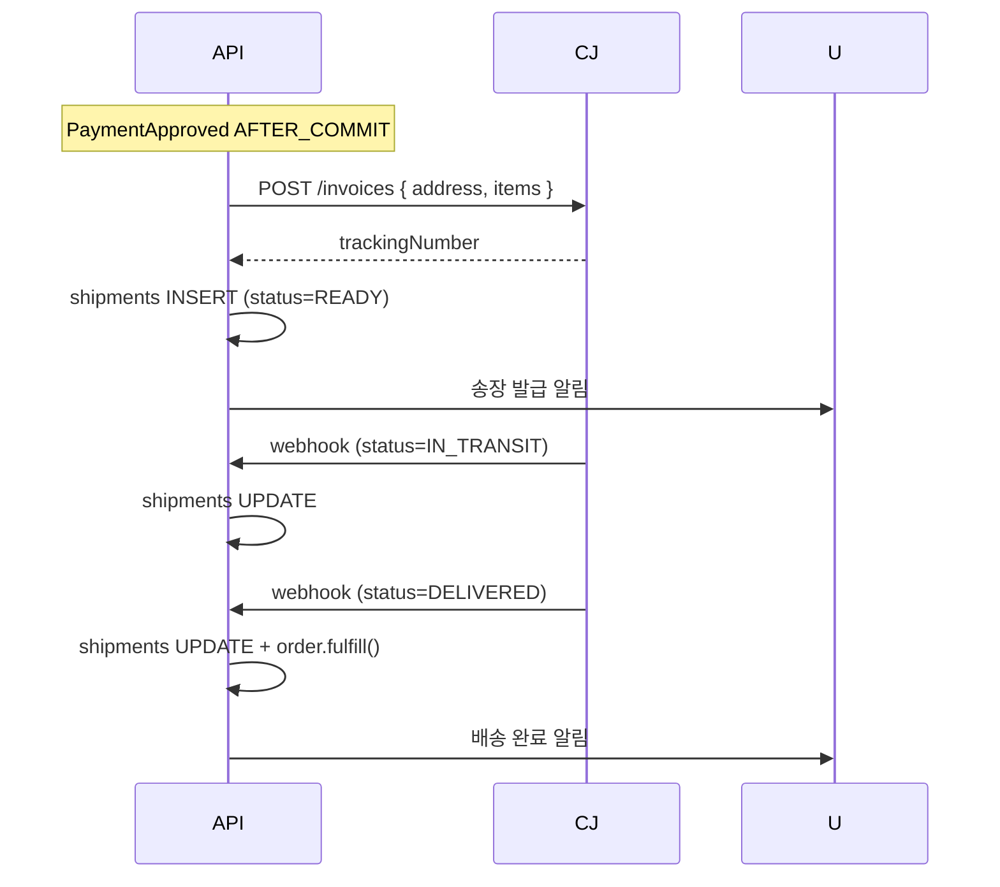

# 실물 배송 정책 — 택배 API + 송장 추적

| 문서 버전 | 작성일 | 작성자 | 주요 변경 사항 |
| --- | --- | --- | --- |
| v1.0.0 | 2026-05-14 | engineering-agent/tech-lead | 최초 |

**[[design-decisions|↑ design-decisions hub]]**

> 실물 상품 배송 — CJ / 한진 / 롯데 / 우체국 등 택배 API 통합 + tracking + 배송완료 callback.

---

## 1. 본 vault 결정

- F7 부터 — F5 (결제) F6 (디지털) 완성 후 진입.
- **CJ대한통운** 1차 (송장 발급 + tracking API + 점유율 1위).
- 어댑터 패턴 — `ShippingProvider` 인터페이스 + Provider 별 구현.
- 배송 상태 webhook (PICKED_UP / IN_TRANSIT / DELIVERED) — 누락 보강 polling.

---

## 2. 왜 / 안 하면 / 대안

### 2.1 왜 택배 API (수기 송장 X)

- 수기: admin 이 송장번호 수동 입력 → 휴먼 에러 + scale X.
- API: 자동 발급 + tracking webhook + 비용 자동 정산.

### 2.2 안 하면

| 잘못 | 사고 |
| --- | --- |
| 수기 송장 | 송장번호 오타 → 사용자 confusion |
| tracking 없음 | "배송 어디?" CS 문의 폭증 |
| 단일 택배사 | 그 택배사 파업 시 운영 중단 |
| webhook 무시 | 배송 완료 못 알아챔 → order FULFILLED 안 됨 |

### 2.3 대안

| 모델 | 적용 |
| --- | --- |
| **택배 API + webhook** ★ | 일반 SaaS |
| 3PL (쿠팡 풀필먼트) | 큰 platform |
| 자체 배송 (당근) | hyperlocal |
| 직접 픽업 (음식점) | F&B |

---

## 3. 어댑터

```java
public interface ShippingProvider {
    String provider();   // "CJ" / "HANJIN" / ...
    ShippingInvoice issue(ShippingCommand cmd);
    ShippingStatus track(String trackingNumber);
    boolean verifyWebhookSignature(String body, String signature);
}

@Component
public class CjShippingProvider implements ShippingProvider { /* ... */ }
```

---

## 4. 흐름



---

## 5. 함정

### 함정 1 — webhook 누락 시 fulfill 안 됨
일부 webhook 의 신뢰성 ↓.
→ polling 매일 (옛 IN_TRANSIT) 보강.

### 함정 2 — 송장 발급 동기
API 5s timeout → 사용자 결제 후 화면 stuck.
→ AFTER_COMMIT + worker.

### 함정 3 — 주소 변경 후 송장 발급
사용자가 주소 변경했는데 옛 주소로 송장.
→ 송장 발급 직전 address snapshot.

### 함정 4 — 반품 송장 별도 관리 X
반품 시 새 송장 발급 — return_shipments 분리.

---

## 6. 다른 컨텍스트

### 6.1 글로벌 (DHL / FedEx)
관세 / 통관 자동.

### 6.2 새벽 배송 (쿠팡 / 마켓컬리)
자체 풀필먼트 + slot 기반 시간 지정.

### 6.3 hyperlocal (당근)
1km 내 직접 픽업.

---

## 7. 관련

- [[design-decisions|↑ hub]]
- [[../implementation/physical-delivery-impl]]
- [[../enums/delivery-status]]
- [[../security/pii-encryption]] — 주소 암호화
