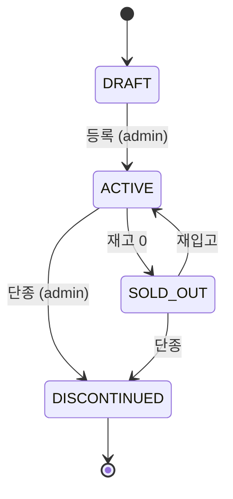

# 상품 상태 정책 — DRAFT/ACTIVE/SOLD_OUT/DISCONTINUED

| 문서 버전 | 작성일 | 작성자 | 주요 변경 사항 |
| --- | --- | --- | --- |
| v1.0.0 | 2026-05-14 | engineering-agent/tech-lead | 최초 |

**[[design-decisions|↑ design-decisions hub]]**

> 상품의 생애주기 — admin 등록부터 단종까지.

---

## 1. 본 vault 결정



| Status | 노출 | 결제 | URL 직접 |
| --- | --- | --- | --- |
| DRAFT | X | X | X (admin only) |
| ACTIVE | O | O | O |
| SOLD_OUT | O (품절 표시) | X | O |
| DISCONTINUED | X | X | O (옛 사용자 access — 환불 / 배송 처리) |

---

## 2. 왜 / 안 하면 / 대안

### 2.1 왜 4단계 분리

- DRAFT = admin 작성 중 (의미 있는 분리 — 노출 X).
- ACTIVE = 정상 판매.
- SOLD_OUT = 재고 0 but 노출 (재입고 알림 / 추후 복귀).
- DISCONTINUED = 영구 단종.

### 2.2 왜 DISCONTINUED 도 URL 직접 가능

- 옛 구매자가 환불 / 배송 추적 필요.
- 검색 / 카탈로그는 X.

### 2.3 안 하면

| 잘못 | 사고 |
| --- | --- |
| DRAFT 노출 | 미완성 상품 카탈로그 노출 |
| SOLD_OUT 결제 가능 | overselling |
| DISCONTINUED 카탈로그 노출 | 사용자 confusion |
| 상태 enum X (boolean active) | 4단계 표현 X |

### 2.4 대안

| 모델 | 적용 |
| --- | --- |
| **4 status** ★ | 일반 SaaS |
| boolean active | MVP |
| status + visibility 분리 | 큰 platform (Amazon) |
| version + status | A/B 가격 |

---

## 3. 가격 변경 시 audit

```sql
CREATE TABLE product_price_history (
    id, product_id, old_price, new_price, changed_by, reason, changed_at
);
```

→ DISCONTINUED 시 옛 가격으로 환불 / 정산.

---

## 4. 함정

### 함정 1 — DRAFT 결제 가능
admin 작성 중 노출 + 결제.
→ status=ACTIVE 검증.

### 함정 2 — SOLD_OUT 결제 가능
재고 0 but 결제 — overselling.
→ 결제 검증 + 재고 검증 이중.

### 함정 3 — DISCONTINUED 후 옛 환불 처리 X
가격 정보 사라짐.
→ price_history 보존.

### 함정 4 — 상태 변경 시 audit 없음
누가 언제 단종했는지 모름.
→ product_status_history.

---

## 5. 관련

- [[design-decisions|↑ hub]]
- [[../enums/product-status]]
- [[option-strategy]]
- [[inventory-strategy]]
