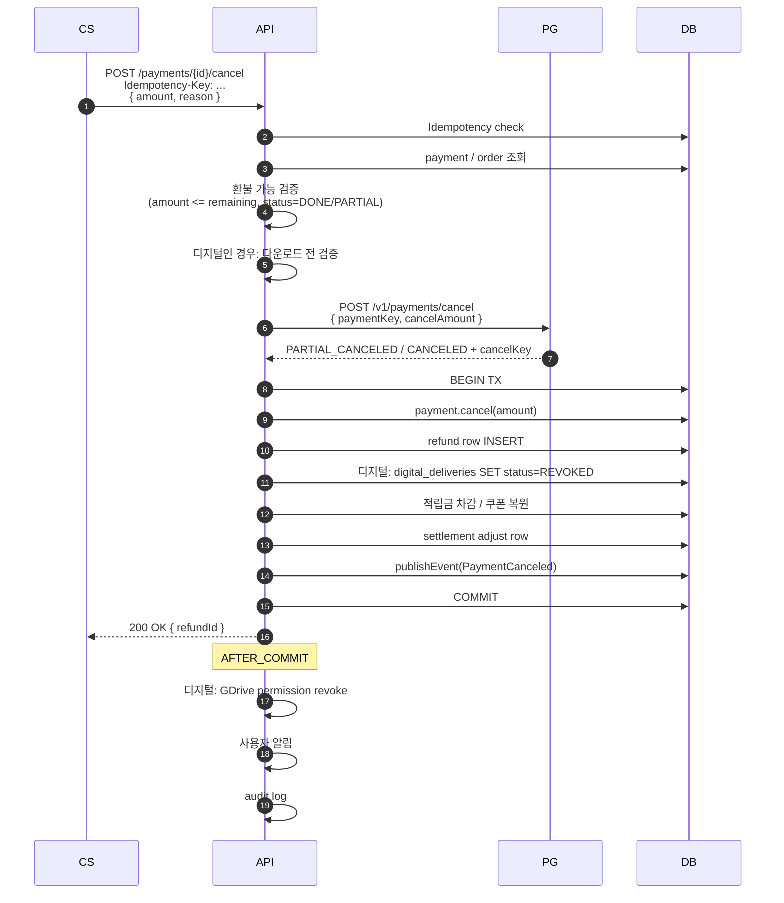

# 환불 정책 — 전체/부분/디지털/실물별 정책

| 문서 버전 | 작성일 | 작성자 | 주요 변경 사항 |
| --- | --- | --- | --- |
| v1.0.0 | 2026-05-14 | engineering-agent/tech-lead | 최초 |

**[[design-decisions|↑ design-decisions hub]]**

> 환불은 PG / 정산 / 디지털 access / 적립금 모두 영향 — 단순 cancel API 호출 하나 아님.
> 본 vault: 상품 type 별 정책 (실물 / 디지털 / 책) 분리.

---

## 1. 본 vault 결정

| 상품 type | 환불 가능 시점 | 자동 / CS |
| --- | --- | --- |
| PHYSICAL (실물) | 단순변심: 배송 전 100% / 배송 후 7일 회수 후 환불 | CS 승인 |
| DIGITAL (강의 / 음원) | 1회 재생 / 사용 전만 (전자상거래법) | 자동 (조건 충족 시) |
| BOOK (PDF) | **다운로드 전만** | 자동 |
| 부정 결제 / 사기 | 즉시 전체 환불 (PG 협조) | CS + 보안팀 |

---

## 2. 왜 필요

### 2.1 왜 type 별 정책 분리

- 실물: 회수 가능 → 단순변심 가능 (법적 보호).
- 디지털: 사용 후 회수 불가 → 다운로드 / 재생 전만 환불.
- 안 하면 → 사용자가 책 다운 받고 환불 = 부당 이득.

### 2.2 왜 멱등 환불

- CS 가 같은 환불 2번 클릭 시 → 2배 환불 = 손실.
- PG retry 시 같은 cancel 2번 호출 — PG 가 거절하지만 응답 다름.

### 2.3 왜 부분 환불 가능

- 5개 상품 주문 중 1개만 환불.
- PARTIAL_CANCELED 상태 유지 + 남은 금액 또 환불 가능.

---

## 3. 안 하면 어떤 문제

| 잘못 | 사고 |
| --- | --- |
| 디지털 다운로드 후 환불 허용 | 사용자 부당 이득 (책 가져감) |
| 멱등 X | 중복 환불 = 손실 |
| 적립금 차감 X | 환불 받고 적립금 도 가져감 |
| 쿠폰 복원 X | 사용자가 쿠폰 1번 더 쓸 수 있음 (의도와 다름) |
| 정산 미반영 | 회계 mismatch |
| 디지털 access revoke X | 환불 후에도 다운로드 가능 |

---

## 4. 대안 (환불 정책 모델)

| 모델 | 설명 | 적용 |
| --- | --- | --- |
| **전체 환불 only** | 부분 환불 X | 단순한 SaaS |
| **부분 환불 가능** ★ | order_item / amount 단위 | 본 vault |
| 적립금 환불 | 카드 X, 적립금 으로 | 정책 유연 |
| 매장 크레딧 | 카드 X, 매장 쿠폰 으로 | 매출 유지 |
| 7일 단순변심 | 전자상거래법 | 실물 필수 |

---

## 5. 트레이드오프

| 결정 | 본 vault | 대안 | 차이 |
| --- | --- | --- | --- |
| 디지털 환불 시점 | 다운로드 전 | 7일 무조건 | 도용 vs 법적 보호 |
| 환불 처리 | PG cancel + 적립금 차감 + 쿠폰 복원 | PG only | 회계 정합성 |
| Audit 기간 | 5년 | 1년 | 법적 (전자상거래법 5년) |
| CS 개입 | 실물 만 (디지털 자동) | 모두 CS | 비용 vs UX |

---

## 6. 환불 흐름



---

## 7. 도메인 코드

```java
public final class Payment {
    // ...

    public RefundRecord cancel(Money refundAmount, String reason, Instant now) {
        if (status != PaymentStatus.DONE && status != PaymentStatus.PARTIAL_CANCELED)
            throw new IllegalStateException("cannot cancel from " + status);

        var totalRefunded = refunds.stream()
            .map(RefundRecord::amount)
            .reduce(Money::add).orElse(Money.zero(amount.currency()));
        var remaining = amount.subtract(totalRefunded);
        if (refundAmount.amountMinorUnit() > remaining.amountMinorUnit())
            throw new IllegalArgumentException("refund exceeds remaining");

        var refund = new RefundRecord(refundAmount, reason, now);
        refunds.add(refund);
        var newTotal = totalRefunded.add(refundAmount);
        this.status = newTotal.equals(amount)
            ? PaymentStatus.CANCELED : PaymentStatus.PARTIAL_CANCELED;
        events.add(new PaymentCanceled(id, orderId, refundAmount, reason, now));
        return refund;
    }
}
```

자세히: [[../implementation/refund-impl]] · [[../domain-model/payment-aggregate]].

---

## 8. 함정

### 함정 1 — 멱등 X
중복 환불.
→ Idempotency-Key + refund row UNIQUE (payment_id + idempotency_key).

### 함정 2 — 디지털 다운 후 환불 허용
부당 이득.
→ digital_deliveries.downloaded_at IS NULL 검증.

### 함정 3 — 환불 후 다운로드 가능
revoke 누락.
→ AFTER_COMMIT 의 GDrive permission revoke + token DELETE.

### 함정 4 — 적립금 환불 처리 누락
사용자가 적립금도 가져감.
→ 사용된 적립금 차감 (음수 가능 — 별도 정책).

### 함정 5 — 쿠폰 복원 누락
사용자가 1회용 쿠폰 다시 씀 (의도 외).
→ coupon.restore() — but **정책 결정** (복원 / 비복원).

### 함정 6 — 정산 mismatch
환불 시 settlement row 미조정 → PG fee 회계 mismatch.
→ settlement_adjustment INSERT (음수 amount).

### 함정 7 — PG cancel 실패 시 DB rollback
PG 가 cancel 했는데 DB 가 rollback → state 불일치.
→ PG cancel 후 DB → 실패 시 alert + 수동 대사.

### 함정 8 — 환불 reason 누락 (audit)
누가 왜 환불했는지 모름.
→ reason 필수 + audit row.

자세히: [[../pitfalls/refund-pitfalls]].

---

## 9. 다른 컨텍스트

### 9.1 구독 SaaS (Netflix)

```yaml
refund: 월 / 년 단위 환불 — pro-rate (사용 일수 비례)
cancel: 다음 결제 차단 (현재 기간 유지)
```

### 9.2 마켓플레이스 (Amazon)

```yaml
refund: per-vendor 정산 분리 + dispute 시스템
A-to-Z guarantee: Amazon 이 환불 보장 + vendor 에 책임 청구
```

### 9.3 글로벌 (Stripe)

```yaml
dispute: chargeback → 자동 알림 + evidence 제출 시스템
refund-window: 180일 (카드사 기준)
```

### 9.4 매장 (오프라인 통합)

```yaml
환불-channel: 매장 vs 온라인 분리 + 영수증 검증
```

---

## 10. 관련

- [[design-decisions|↑ hub]]
- [[pg-selection]]
- [[digital-delivery-policy]] — 디지털 환불
- [[settlement-policy]] — 정산 영향
- [[../implementation/refund-impl]]
- [[../database/refunds-table]]
- [[../pitfalls/refund-pitfalls]]
