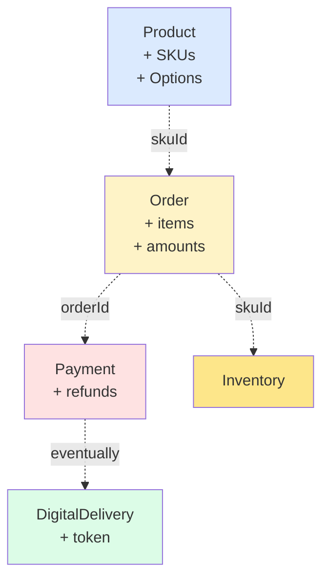

# Aggregate 경계 — 트랜잭션 / 참조 규칙

| 문서 버전 | 작성일 | 작성자 | 주요 변경 사항 |
| --- | --- | --- | --- |
| v1.0.0 | 2026-05-14 | engineering-agent/tech-lead | 최초 |

**[[domain-model|↑ hub]]**

---

## 1. DDD 규칙

| 규칙 | 적용 |
| --- | --- |
| **1 트랜잭션 = 1 aggregate 변경** | 가능한 한 (예외 — payment + order 같이 변경) |
| **다른 aggregate 는 id 로만 참조** | Order 가 Product 객체 가짐 X (id 만) |
| **aggregate root 가 단일 진입점** | Order 의 OrderItem 직접 변경 X |
| **eventual consistency 다른 aggregate** | OrderPaid → DigitalDelivery 는 비동기 |

---

## 2. 본 vault 경계



---

## 3. 예외 케이스 — 같은 TX 에 여러 aggregate

### 3.1 결제 confirm

```
@Transactional {
    payment.approve()     ← Payment aggregate
    order.confirmPayment() ← Order aggregate
}
```

→ 같은 TX 에 2 aggregate 변경. 이유: 사용자가 결제 후 "주문 완료" 즉시 보여야 함. eventual consistency 면 UX ↓.

### 3.2 환불

```
@Transactional {
    payment.cancel()       ← Payment
    order.refund()         ← Order
    settlement.adjust()    ← Settlement
}
```

→ 회계 정합성 즉시.

### 3.3 같은 TX 가 정당화되는 조건

- UX 즉시성 (한 화면 처리).
- 회계 / 보안 정합성.
- 다른 도메인이 같은 DB (모놀리식 한정).

---

## 4. eventual consistency (다른 aggregate)

| 흐름 | 처리 |
| --- | --- |
| OrderPaid → DigitalDelivery 생성 | AFTER_COMMIT listener / Kafka |
| OrderPaid → 알림 발송 | 동 |
| OrderCanceled → 재고 복원 | 동 |
| PaymentCanceled → DigitalDelivery revoke | 동 |
| PaymentCanceled → settlement adjust | 같은 TX (회계 즉시) |

---

## 5. 함정

### 함정 1 — Aggregate root 우회
`order.items().get(0).changeQuantity(5)` — root 거치지 않음.
→ `order.updateItemQty(itemId, 5)` — root 통과.

### 함정 2 — 다른 aggregate 객체 참조 (id 아님)
Order 의 필드 `List<Product> products` — N+1 + 동기화 문제.
→ `List<ProductId>` + 필요시 lookup.

### 함정 3 — 한 TX 너무 큰 변경
Order + 5 Products + Inventory + Payment 한 TX → 락 contention.
→ aggregate 분리.

### 함정 4 — eventual 처리 안 됨
listener 실패 시 디지털 발급 X → 사용자 "결제했는데 책 없음".
→ outbox + retry.

---

## 6. 관련

- [[domain-model|↑ hub]]
- [[../transactions]]
- [[../architecture]]
- [[../design-decisions/kafka-event-driven]]
