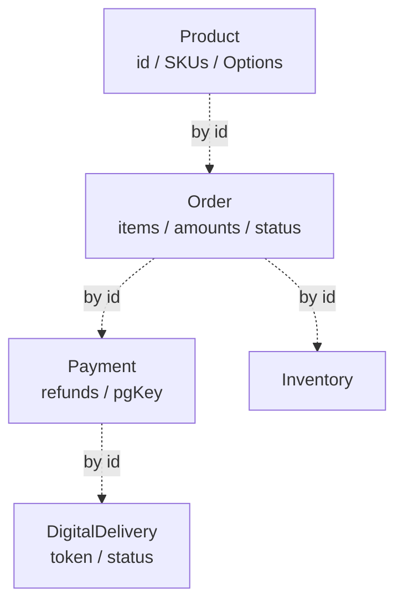

# product domain-model — Aggregate hub

| 문서 버전 | 작성일 | 작성자 | 주요 변경 사항 |
| --- | --- | --- | --- |
| v1.0.0 | 2026-05-14 | engineering-agent/tech-lead | 최초 |

**[[../product|↑ hub]]**

> 5 aggregate + value objects + 도메인 이벤트.

---

## 1. Aggregate 목록

| Aggregate | 책임 | 노트 |
| --- | --- | --- |
| **Product** | 상품 정의 + 옵션 + SKU | [[product-aggregate]] |
| **Order** | 주문 + items + 금액 계산 | [[order-aggregate]] |
| **Payment** | 결제 + 환불 (집합) | [[payment-aggregate]] |
| **DigitalDelivery** ★ | 사용자별 마스킹 사본 + 토큰 | [[digital-delivery-aggregate]] |
| Inventory | SKU 단위 재고 | — (도메인 작음, table 노트로 충분) |

---

## 2. Value Objects

- `ProductId`, `SkuId`, `OrderId`, `PaymentId`, `UserId` — ULID-backed.
- `Money(BigDecimal, Currency)` — 통화 안전.
- `Address` — 배송지 (encrypted at rest).
- `TaxRate`, `WatermarkInfo`.

자세히: [[value-objects]].

---

## 3. Aggregate 경계

→ 화살표 = 참조 (FK), 같은 트랜잭션 X.

자세히: [[aggregate-boundaries]].

---

## 4. Repository Ports

| Port | 자세히 |
| --- | --- |
| ProductRepository | [[repository-ports]] |
| OrderRepository | |
| PaymentRepository | |
| InventoryRepository | |
| DigitalDeliveryRepository | |

---

## 5. Domain Events

- ProductCreated / ProductDiscontinued
- OrderCreated / OrderPaid / OrderCanceled / OrderFulfilled
- PaymentApproved / PaymentFailed / PaymentCanceled
- DigitalDeliveryReady / DigitalDeliveryRevoked
- InventoryDepleted / InventoryRestocked

자세히: [[domain-events]].

---

## 6. 관련

- [[../product|↑ hub]]
- [[../architecture]]
- [[../database/database]]
- [[product-aggregate]]
- [[order-aggregate]]
- [[payment-aggregate]]
- [[digital-delivery-aggregate]]
- [[value-objects]]
- [[domain-events]]
- [[repository-ports]]
- [[aggregate-boundaries]]
