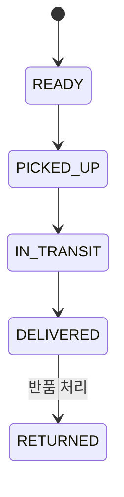
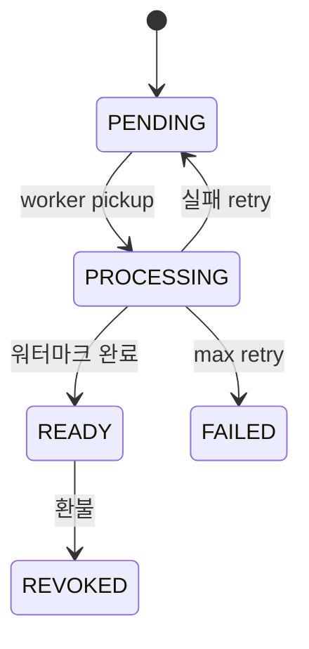

# DeliveryStatus enum (실물 / 디지털)

| 문서 버전 | 작성일 | 작성자 | 주요 변경 사항 |
| --- | --- | --- | --- |
| v1.0.0 | 2026-05-14 | engineering-agent/tech-lead | 최초 |

**[[enums|↑ hub]]**

---

## 1. 실물 배송 — ShipmentStatus

```java
public enum ShipmentStatus {
    READY,         // 송장 발급
    PICKED_UP,     // 택배사 수거
    IN_TRANSIT,    // 배송 중
    DELIVERED,     // 배송 완료
    RETURNED;      // 반품
}
```



## 2. 디지털 배송 — DigitalDeliveryStatus

```java
public enum DigitalDeliveryStatus {
    PENDING,       // 결제 직후, 워터마크 worker 대기
    PROCESSING,    // 워터마크 적용 중
    READY,         // 다운로드 가능
    REVOKED,       // 환불로 access revoke
    FAILED;        // 워터마크 max retry 초과
}
```



## 3. 관련

- [[enums|↑ hub]]
- [[../design-decisions/physical-delivery-policy]]
- [[../design-decisions/digital-delivery-policy]]
- [[../domain-model/digital-delivery-aggregate]]
