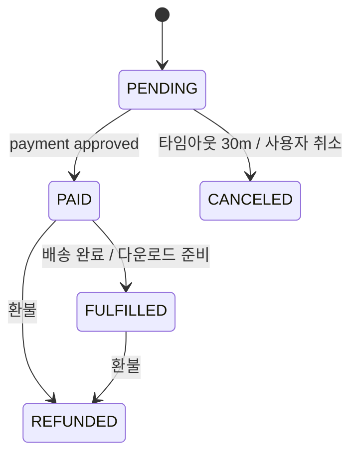

# OrderStatus enum

| 문서 버전 | 작성일 | 작성자 | 주요 변경 사항 |
| --- | --- | --- | --- |
| v1.0.0 | 2026-05-14 | engineering-agent/tech-lead | 최초 |

**[[enums|↑ hub]]**

---

## 1. 값

```java
public enum OrderStatus {
    PENDING,     // 주문 생성, 결제 대기
    PAID,        // 결제 완료
    FULFILLED,   // 배송 완료 / 다운로드 가능
    CANCELED,    // 결제 전 취소 (타임아웃 30m 포함)
    REFUNDED;    // 결제 후 환불
}
```

## 2. 상태 머신



## 3. 트리거

| Status | 트리거 | 이벤트 |
| --- | --- | --- |
| PENDING | 주문 생성 | OrderCreated |
| PAID | 결제 승인 | OrderPaid |
| FULFILLED | 배송 / 다운로드 | OrderFulfilled |
| CANCELED | timeout / cancel | OrderCanceled |
| REFUNDED | 환불 전체 | OrderRefunded |

## 4. 관련

- [[enums|↑ hub]]
- [[../domain-model/order-aggregate]]
- [[../database/orders-table]]
