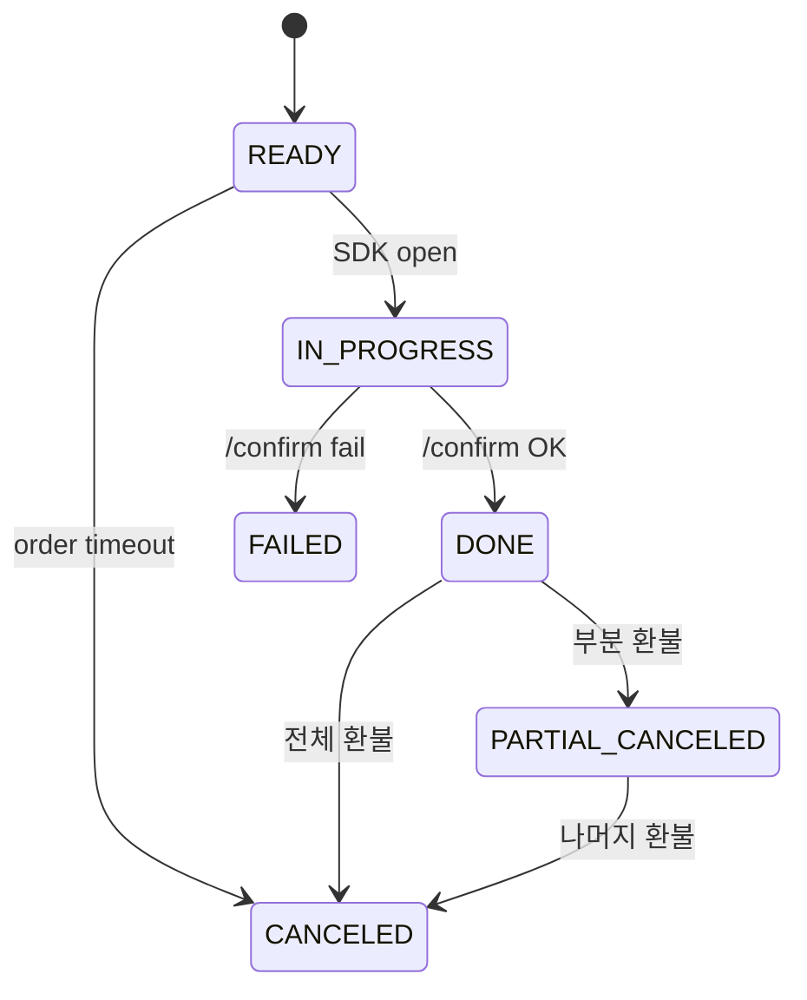

# PaymentStatus enum

| 문서 버전 | 작성일 | 작성자 | 주요 변경 사항 |
| --- | --- | --- | --- |
| v1.0.0 | 2026-05-14 | engineering-agent/tech-lead | 최초 |

**[[enums|↑ hub]]**

---

## 1. 값

```java
public enum PaymentStatus {
    READY,              // 결제 init (PG SDK open 전)
    IN_PROGRESS,        // PG 결제창 open
    DONE,               // 승인 완료
    FAILED,             // 실패
    CANCELED,           // 전체 환불
    PARTIAL_CANCELED;   // 부분 환불
}
```

## 2. 상태 머신



## 3. 멱등 규칙

- approve: DONE → DONE = no-op (idempotent).
- fail: FAILED → FAILED = no-op.
- cancel: CANCELED → cancel = throw.

## 4. 관련

- [[enums|↑ hub]]
- [[../domain-model/payment-aggregate]]
- [[../database/payments-table]]
- [[../design-decisions/payment-flow]]
