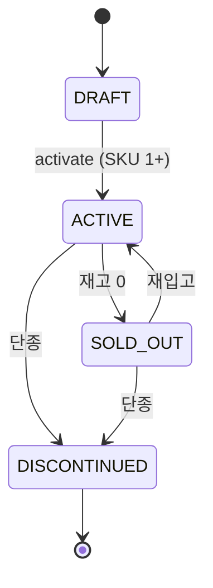

# ProductStatus enum

| 문서 버전 | 작성일 | 작성자 | 주요 변경 사항 |
| --- | --- | --- | --- |
| v1.0.0 | 2026-05-14 | engineering-agent/tech-lead | 최초 |

**[[enums|↑ hub]]**

---

## 1. 값

```java
public enum ProductStatus {
    DRAFT,           // admin 작성 중
    ACTIVE,          // 정상 판매
    SOLD_OUT,        // 재고 0 (재입고 가능)
    DISCONTINUED;    // 영구 단종
}
```

## 2. 상태 머신



## 3. 노출 / 결제 매트릭스

| Status | 카탈로그 | 검색 | 결제 | URL 직접 |
| --- | --- | --- | --- | --- |
| DRAFT | X | X | X | X (admin) |
| ACTIVE | O | O | O | O |
| SOLD_OUT | O (품절) | O | X | O |
| DISCONTINUED | X | X | X | O (옛 사용자 — 환불) |

자세히: [[../design-decisions/product-status-policy]].

## 4. 관련

- [[enums|↑ hub]]
- [[../design-decisions/product-status-policy]]
- [[../domain-model/product-aggregate]]
