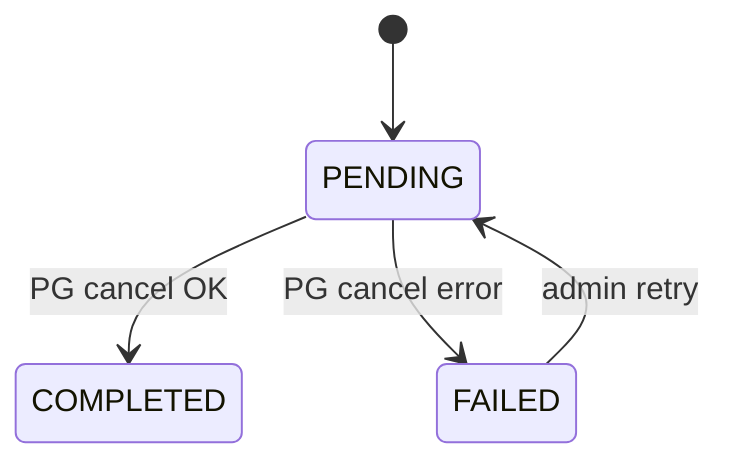

# RefundStatus enum

| 문서 버전 | 작성일 | 작성자 | 주요 변경 사항 |
| --- | --- | --- | --- |
| v1.0.0 | 2026-05-14 | engineering-agent/tech-lead | 최초 |

**[[enums|↑ hub]]**

---

## 1. 값

```java
public enum RefundStatus {
    PENDING,     // 환불 요청 (PG cancel API 호출 전)
    COMPLETED,   // PG cancel 성공
    FAILED;      // PG cancel 실패 → admin 검토
}
```

## 2. 상태 머신



## 3. 관련

- [[enums|↑ hub]]
- [[../database/refunds-table]]
- [[../design-decisions/refund-policy]]
