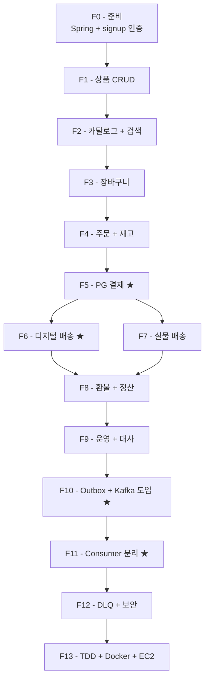

# 구현 순서 — F0~F13 PR 단위 to-do

| 문서 버전 | 작성일 | 작성자 | 주요 변경 사항 |
| --- | --- | --- | --- |
| v1.0.0 | 2026-05-14 | engineering-agent/tech-lead | 최초 |

**[[product|↑ hub]]**

> F0~F9 = 단일 노드 MVP. F10~F13 = Kafka 고도화 (이미지 Project 9 매핑).

---

## 0. 원칙

- 각 PR = 1 기능 + 1 migration + tests + docs.
- F0 → F9 (순차).
- F10~F13 = F9 운영 후 시작 (점진적 마이그).
- 회귀 테스트 PASS.
- feature flag — 위험 기능 (검색 FTS / 첨부 / 알림).

---

## 1. 전체 흐름



---

## 2. F0 — 준비 (1주)

| 항목 | 내용 |
| --- | --- |
| Tech | Spring Boot 3.3, Java 21, PostgreSQL 16, Redis 7 |
| 인증 | signup 의 JWT 통합 |
| 패키지 | `com.example.product` (Hexagonal) |
| Migration | Flyway 초기 |
| Tests | Testcontainers (PostgreSQL + Redis) |
| CI | GitHub Actions |

## 3. F1 — 상품 CRUD (2주)

| 항목 | 내용 |
| --- | --- |
| 테이블 | products / options / values / skus / images |
| API | admin CRUD + 상태 전이 |
| 도메인 | Product aggregate |
| Security | XSS sanitization |
| Tests | unit + integration |

## 4. F2 — 카탈로그 + 검색 (1.5주)

| 항목 | 내용 |
| --- | --- |
| API | 카탈로그 (cursor pagination + 카테고리 / 태그 / 가격 filter) |
| 검색 | Phase 1: ILIKE → Phase 2: FTS |
| 캐시 | Redis (상품 상세 30분 TTL) |
| Feature flag | `product.search.fts-enabled` |

## 5. F3 — 장바구니 (1주)

| 항목 | 내용 |
| --- | --- |
| 테이블 | cart_items |
| API | add/update/remove |
| 정책 | 50 항목 / 사용자 |

## 6. F4 — 주문 + 재고 (1.5주)

| 항목 | 내용 |
| --- | --- |
| 테이블 | orders / order_items / inventory / coupons / redemptions |
| API | /orders POST + GET |
| Redis | Lua atomic 재고 차감 |
| Timeout | 30분 worker 복원 |
| 쿠폰 + 적립금 적용 |

## 7. F5 — PG 결제 ★ (2주)

| 항목 | 내용 |
| --- | --- |
| PG | 토스 sandbox + 가맹 신청 |
| 테이블 | payments / payment_transactions / webhook_events |
| API | /payments/confirm + /webhooks/toss |
| 보안 | Idempotency / HMAC / amount 검증 / PCI-DSS |
| Tests | WireMock + sandbox |

## 8. F6 — 디지털 배송 ★ (2주)

| 항목 | 내용 |
| --- | --- |
| 테이블 | digital_assets / digital_deliveries |
| 외부 | Google Drive API + PDFBox |
| Worker | 워터마크 (max 5 retry + SKIP LOCKED) |
| API | /downloads/{token} |
| 보안 | watermark + token + audit |

## 9. F7 — 실물 배송 (1.5주)

| 항목 | 내용 |
| --- | --- |
| 테이블 | shipments |
| 외부 | CJ 택배 API |
| Worker | 송장 발급 + webhook 수신 |

## 10. F8 — 환불 + 정산 (1.5주)

| 항목 | 내용 |
| --- | --- |
| 테이블 | refunds / settlements / settlement_adjustments |
| API | /payments/{id}/cancel |
| Listener | 디지털 revoke + 정산 adjust |

## 11. F9 — 운영 + 대사 (1주)

| 항목 | 내용 |
| --- | --- |
| 메트릭 | Prometheus + Grafana |
| 대사 | daily cron + Slack |
| Runbook | 5 시나리오 |

---

## 12. F10 — Outbox + Kafka 도입 ★ (1.5주)

| 항목 | 내용 |
| --- | --- |
| 테이블 | event_outbox |
| Listener | AFTER_COMMIT → outbox INSERT (in-process 와 dual-write) |
| Worker | OutboxPublishWorker (SKIP LOCKED) |
| Kafka | 1 broker (dev) / MSK (prod) |
| Topic | `product.payment.events.v1` 만 (시작) |

자세히: [[design-decisions/kafka-event-driven]] · [[implementation/kafka-integration]].

## 13. F11 — Consumer 분리 ★ (2주)

| 항목 | 내용 |
| --- | --- |
| Consumer 1 | digital-delivery (워터마크) — Kafka 통해 |
| Consumer 2 | notification (push / email) |
| Consumer 3 | settlement |
| Consumer 4 | audit |
| 마이그 | in-process listener 제거 (1개씩) |

## 14. F12 — DLQ + KStreams + 보안 (1.5주)

| 항목 | 내용 |
| --- | --- |
| DLQ | @RetryableTopic + @DltHandler |
| Replay | admin endpoint |
| 통계 | KStreams (매출 / 환불율 실시간) |
| 보안 | SASL/PLAIN + TLS + ACL |
| 모니터링 | Kafka UI + Prometheus JMX |

## 15. F13 — TDD + Docker + EC2 (1주)

| 항목 | 내용 |
| --- | --- |
| TDD | 모든 AC 별 test 1 case (EmbeddedKafka + Testcontainers) |
| Docker | docker-compose (앱 + DB + Redis + Kafka + kafka-ui) |
| AWS | EC2 + MSK + RDS + ElastiCache + S3 |
| Deploy | GitHub Actions → ECR → EC2 (codedeploy) |

→ image Project 9 의 핵심 기술 모두 매핑.

---

## 16. 일정 (예상)

```
F0:  1주
F1:  2주
F2:  1.5주
F3:  1주
F4:  1.5주
F5:  2주
F6:  2주
F7:  1.5주
F8:  1.5주
F9:  1주
────────────
F0~F9 소계: 15주 (~3.5개월)

F10: 1.5주
F11: 2주
F12: 1.5주
F13: 1주
────────────
F10~F13 소계: 6주 (~1.5개월)

총: 21주 (~5개월)
```

→ 팀 2명 가정. F10~F13 는 F9 운영 후 진입.

---

## 17. 회피 체크리스트

각 PR 머지 전:
- [ ] Migration down 가능
- [ ] feature flag (위험 기능)
- [ ] signup 회귀 PASS
- [ ] 이전 단계 회귀 PASS
- [ ] EXPLAIN ANALYZE 첨부
- [ ] runbook 의 알람 / 메트릭 등록
- [ ] pitfalls 점검

---

## 18. 관련

- [[product|↑ hub]]
- [[overview]]
- [[prerequisites]]
- [[requirements]]
- [[design-decisions/kafka-event-driven]]
- [[implementation/kafka-integration]]
