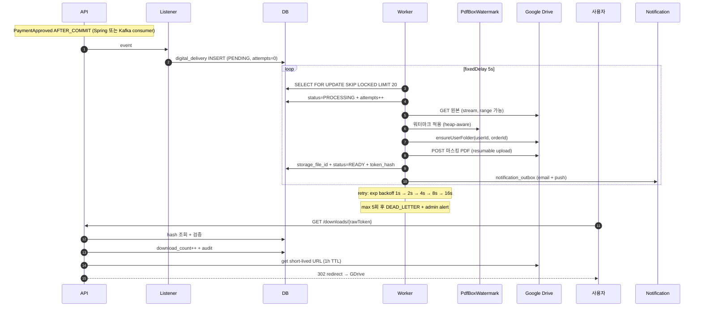

# 디지털 배송 구현 ★ — Worker + GDrive + 워터마크

| 문서 버전 | 작성일 | 작성자 | 주요 변경 사항 |
| --- | --- | --- | --- |
| v1.0.0 | 2026-05-14 | engineering-agent/tech-lead | 최초 |
| v1.1.0 | 2026-05-14 | 각 구현 결정의 4구조 (왜 / 안 하면 / 대안 / 트레이드오프) + memory / CPU 최적화 + GDrive quota 관리 + retry / DLQ + download endpoint 보안 + 운영 metric |

**[[implementation|↑ hub]]**

> answer-be 영감 + Hexagonal/Outbox/Worker 정형화 — 결제 → 마스킹 PDF 생성 → 사용자별 GDrive 저장 → 토큰 다운로드.
> 정책 는 [[../design-decisions/digital-delivery-policy]], 보안 깊이 는 [[../security/digital-watermarking]] 참고.

---

## 0. 한 페이지 요약

```
[PaymentApproved AFTER_COMMIT]
   │
   ├─ Listener: digital_delivery row INSERT (status=PENDING)
   │
   └─ Worker (Scheduled fixedDelay 5s):
          1. SELECT FOR UPDATE SKIP LOCKED
          2. status=PROCESSING + attempts++
          3. 원본 GDrive download (stream)
          4. WatermarkService.apply (PDFBox)
          5. 사용자 폴더 ensureExists
          6. 마스킹 PDF upload (resumable)
          7. download_token 발급 (hash 만 DB)
          8. status=READY + storage_file_id
          9. NotificationOutbox.send (email + push)
          10. (실패 시) exp backoff retry max 5회 → DEAD_LETTER

[Download endpoint]
   1. GET /downloads/{rawToken}
   2. sha256(raw) → digital_deliveries lookup
   3. 검증 (revoked / expired / count < max)
   4. download_count++ + audit row INSERT
   5. GDrive presigned URL 발급 (1h)
   6. 302 redirect
```

---

## 1. 전체 흐름



---

## 2. Listener (결제 승인 → enqueue)

### 2.1 코드

```java
@Component
@RequiredArgsConstructor
public class DigitalDeliveryListener {

    private final DigitalDeliveryRepository deliveries;
    private final OrderRepository orders;
    private final DigitalAssetRepository assets;
    private final IdGenerator ids;
    private final Clock clock;
    private final DeliveryProperties props;

    @TransactionalEventListener(phase = AFTER_COMMIT)
    public void onPaymentApproved(PaymentApproved ev) {
        var order = orders.findById(ev.orderId()).orElseThrow();

        for (var item : order.items()) {
            // PHYSICAL 은 별도 흐름 ([[physical-delivery-impl]])
            if (item.productType() == ProductType.PHYSICAL) continue;

            // 디지털 자산 조회 (없으면 admin 미설정 → alert)
            var asset = assets.findByProductId(item.productId())
                .orElseThrow(() -> new MissingAssetException(item.productId()));

            // 기존 delivery 가 있는지 (재 결제 시 — UNIQUE 검증)
            var existing = deliveries.findByUserAndItem(ev.buyerId(), item.id());
            if (existing.isPresent()) {
                log.info("delivery already exists for user={} item={}", ev.buyerId(), item.id());
                continue;
            }

            var delivery = DigitalDelivery.initiate(
                DeliveryId.next(),
                ev.orderId(),
                item.id(),
                ev.buyerId(),
                asset.id(),
                props.downloadMax(),    // 기본 5
                clock.now());

            deliveries.save(delivery);
            log.info("delivery enqueued: {}", delivery.id());
        }
    }
}
```

### 2.2 왜 AFTER_COMMIT (트랜잭션 안 X)

**왜 필요**
- 결제 트랜잭션이 commit 안 됐는데 워터마크 enqueue → 결제 rollback 시 고스트 delivery row.
- 다른 도메인 (디지털) 의 처리가 결제의 부수효과 — 결제 성공 후에만 진행.

**안 하면 어떤 문제**
- 결제 도중 fail → PG 가 cancel 했는데 우리는 워터마크 시작 → 비용 낭비 + 사용자 혼란.
- 분산 트랜잭션 / saga 복잡도 ↑.

**대안**
| 방식 | 적용 |
| --- | --- |
| 동기 처리 (트랜잭션 안) | 결제 trans 30s 늘림 / DB 락 |
| `@Async` (Spring) | 단순 but 서버 재시작 시 손실 |
| **AFTER_COMMIT Listener** ★ | DB commit 보장 |
| Outbox + Kafka (F10+) | 분산 + 재처리 |

**트레이드오프**
- AFTER_COMMIT = 같은 JVM 내 in-process — 단일 노드 가정.
- Kafka outbox = 분산 가능 but 운영 ↑.

자세히: [[../design-decisions/kafka-event-driven]].

### 2.3 왜 UNIQUE (user_id, order_item_id)

**왜 필요**
- 같은 사용자가 같은 item 을 (실수 / 재 결제로) 2번 → 워터마크 PDF 2개 = 비용 낭비 + 추적 모호.

**안 하면 어떤 문제**
- attempts retry 시 새 row INSERT 가능 → 중복 처리.
- forensic 시 "어떤 PDF 가 유출본인지" 모호.

**구현**
```sql
CREATE UNIQUE INDEX ux_dd_user_item
    ON digital_deliveries (user_id, order_item_id);
```

---

## 3. Worker

### 3.1 코드

```java
@Component
@RequiredArgsConstructor
@Slf4j
public class DigitalDeliveryWorker {

    private final DigitalDeliveryRepository deliveries;
    private final DigitalAssetRepository assets;
    private final DigitalAssetStorage storage;
    private final WatermarkService watermark;
    private final UserRepository users;
    private final ServerPepperRegistry pepperRegistry;
    private final NotificationOutbox notifications;
    private final DownloadTokenIssuer tokenIssuer;
    private final Clock clock;
    private final IdGenerator ids;
    private final DeliveryProperties props;

    @Scheduled(fixedDelay = 5_000)
    @SchedulerLock(name = "digitalDeliveryWorker",
                   lockAtMostFor = "10m",
                   lockAtLeastFor = "5s")
    public void process() {
        // SKIP LOCKED — 여러 worker instance 가 같은 row 안 잡음
        var pending = deliveries.findPending(props.batchSize());
        for (var d : pending) {
            try {
                processOne(d);
            } catch (Exception e) {
                log.error("worker outer fail: {}", d.id(), e);
                // 개별 row 실패가 batch 전체 중단 X
            }
        }
    }

    @Transactional
    public void processOne(DigitalDelivery delivery) {
        delivery.startProcessing(clock.now());
        deliveries.save(delivery);

        long start = System.currentTimeMillis();
        try {
            var asset = assets.findById(delivery.assetId()).orElseThrow();
            var user = users.findById(delivery.userId()).orElseThrow();

            // 1. 원본 download (stream — 메모리 보호)
            var originalBytes = storage.download(asset.storageProvider(),
                                                 asset.storageFileId());

            // 2. 워터마크
            var pepper = pepperRegistry.current();
            var watermarkInfo = WatermarkInfo.of(
                delivery.userId(),
                delivery.orderId(),
                user.email(),
                clock.now(),
                pepper);
            var stampedBytes = watermark.apply(originalBytes,
                                                watermarkInfo,
                                                asset.watermarkLevel());

            // 3. 사용자 폴더 (없으면 생성)
            var fileId = storage.upload(
                "GDRIVE",
                delivery.userId().value(),
                delivery.orderId().value(),
                buildFileName(asset, watermarkInfo),
                stampedBytes);

            // 4. token 발급
            var token = tokenIssuer.generate(delivery.id(),
                                              delivery.userId(),
                                              clock.now());

            // 5. 도메인 상태 READY
            delivery.markReady(
                "GDRIVE",
                fileId,
                watermarkInfo.hash(),
                token.hash(),
                token.expiresAt(),
                clock.now());
            deliveries.save(delivery);

            // 6. notification outbox
            notifications.send(delivery.userId(), "DIGITAL_READY",
                Map.of(
                    "downloadUrl", buildDownloadUrl(token.raw()),
                    "expiresAt", token.expiresAt(),
                    "remainingAttempts", props.downloadMax(),
                    "title", asset.title()));

            long duration = System.currentTimeMillis() - start;
            metrics.timer("watermark_apply_duration_seconds").record(duration, MILLISECONDS);
            log.info("delivery READY: {} ({}ms)", delivery.id(), duration);

        } catch (TransientException e) {
            // GDrive 일시 장애 — retry
            log.warn("delivery failed (transient): {}", delivery.id(), e);
            scheduleRetry(delivery, e);

        } catch (PermanentException e) {
            // 손상된 원본 / 워터마크 영구 실패 — 즉시 DEAD_LETTER
            log.error("delivery failed (permanent): {}", delivery.id(), e);
            delivery.markFailed(e.getMessage(), clock.now());
            deliveries.save(delivery);
            alertAdmin("permanent failure", delivery, e);

        } catch (Exception e) {
            // 알 수 없음 — retry 로 분류 (안전)
            log.error("delivery failed (unknown): {}", delivery.id(), e);
            scheduleRetry(delivery, e);
        }
    }

    private void scheduleRetry(DigitalDelivery delivery, Exception e) {
        var attempts = delivery.attempts();
        if (attempts >= props.maxAttempts()) {
            delivery.markFailed(e.getMessage(), clock.now());
            alertAdmin("max retry reached", delivery, e);
        } else {
            // exp backoff: 1s → 2s → 4s → 8s → 16s
            var backoff = Duration.ofSeconds(1L << attempts);
            delivery.recordFailure(e.getMessage(), clock.now().plus(backoff));
        }
        deliveries.save(delivery);
    }

    private String buildFileName(DigitalAsset asset, WatermarkInfo info) {
        // 파일명에 user 정보 노출 안 함 (사용자 폴더에 있으므로)
        // hash prefix 만 — 중복 방지 + 추적
        return asset.title().replaceAll("[\\\\/:*?\"<>|]", "_")
            + "-"
            + info.hash().substring(0, 8)
            + ".pdf";
    }

    private String buildDownloadUrl(String rawToken) {
        return props.publicBaseUrl() + "/downloads/" + rawToken;
    }
}
```

### 3.2 왜 SKIP LOCKED + ShedLock 둘 다

**왜 필요**
- ShedLock = worker scheduler 의 동시 실행 방지 (multi-instance 환경).
- SKIP LOCKED = 같은 worker 안의 batch 처리 시 다른 worker 가 같은 row 가져오는 race.

**안 하면 어떤 문제**
| 누락 | 사고 |
| --- | --- |
| ShedLock X | 2 instance 가 동시 5s 마다 scan → 같은 batch query |
| SKIP LOCKED X | row 1 을 worker A 가 lock 중인데 worker B 가 또 처리 시도 → 워터마크 2번 |
| 둘 다 X | 같은 사용자에게 PDF 2개 + 알림 2번 |

**대안**
- Redis 분산 락 (수동) — 코드 복잡.
- DB advisory lock — 가능 but PostgreSQL 종속.
- **ShedLock + FOR UPDATE SKIP LOCKED** ★ — 표준 + 검증된 패턴.

**트레이드오프**
- 두 단계 락 = 약간 복잡 but 안정.
- 본 vault: F10+ 의 Kafka consumer 환경에서는 partition 별 single consumer 로 더 단순.

### 3.3 왜 stream download (전체 byte[] 아님)

**왜 필요**
- 100MB PDF 를 byte[] 로 메모리 로딩 → JVM heap 압박.
- 동시 5 worker 가 100MB 씩 = 500MB+ heap.

**안 하면 어떤 문제**
- OutOfMemoryError → worker 죽음 → backlog 쌓임.
- GC pause spike → 모든 worker 영향.

**구현 옵션**

```java
// Option A: byte[] (소형 자산 / 책 ≤ 50MB)
var bytes = drive.files().get(fileId).executeMediaAsInputStream().readAllBytes();

// Option B: stream → temp file (대형 자산)
var temp = Files.createTempFile("asset-", ".pdf");
try (var in = drive.files().get(fileId).executeMediaAsInputStream();
     var out = Files.newOutputStream(temp)) {
    in.transferTo(out);
}
// PDFBox 가 temp file 직접 load (메모리 적게)
try (var doc = PDDocument.load(temp.toFile(), MemoryUsageSetting.setupTempFileOnly())) {
    // ...
}
```

**대안**
- byte[]: 단순 but 메모리.
- temp file: 디스크 I/O but 메모리 보호.
- **MixedFileTempStream** ★ (PDFBox `MemoryUsageSetting`) — 메모리 + 디스크 hybrid.

**트레이드오프**
- 본 vault: **자산 크기 50MB 기준** — 이하 byte[], 이상 temp file (PDFBox MemoryUsageSetting).

### 3.4 왜 retry 분류 (Transient vs Permanent)

**왜 필요**
- 모든 실패 retry — GDrive 손상 file 도 무한 시도 → 비용 ↑.
- 분류 = 빠른 실패 + 자동 admin alert.

**Transient (재시도 가치 있음)**
- HTTP 5xx (GDrive 서버 일시 장애)
- Rate limit (429)
- Connection timeout
- I/O exception

**Permanent (재시도 무의미)**
- 손상된 PDF (PDFBox `IOException: corrupt`)
- PDF 가 암호화 (`InvalidPasswordException`)
- 원본 file 삭제됨 (GDrive 404)
- WatermarkException (구조적 문제)

```java
public class TransientException extends RuntimeException {
    public TransientException(Throwable cause) { super(cause); }
}

public class PermanentException extends RuntimeException {
    public PermanentException(String msg) { super(msg); }
}

// GoogleDriveStorage 어댑터에서 변환
catch (GoogleJsonResponseException e) {
    if (e.getStatusCode() == 404) throw new PermanentException("asset not found");
    if (e.getStatusCode() >= 500) throw new TransientException(e);
    if (e.getStatusCode() == 429) throw new TransientException(e);
    throw new TransientException(e);   // 안전 default
}
```

### 3.5 왜 max 5 회 (3 / 10 아님)

- 1 회 첫 시도.
- 2~3 회 일시 장애 복구 윈도우 (대부분 1분 안).
- 4~5 회 더 큰 장애 (~30분).
- 6+ 회 → 거의 영구 문제 — 자동화로 해결 X, admin 필요.

**합계 시간** (exp backoff 1/2/4/8/16s + 처리 시간):
```
attempt 1: 즉시
attempt 2: 1s backoff + 처리
attempt 3: 2s backoff + 처리
attempt 4: 4s backoff + 처리
attempt 5: 8s backoff + 처리
→ 약 15s + 5번 처리 = 평균 1분 안 끝남
```

→ 1분 안에도 안 되면 admin 개입 = 합리적 SLA.

### 3.6 처리 batch 크기

```yaml
delivery:
  batch-size: 20        # 1 cycle 당 row
  fixed-delay: 5000     # 5초
  max-attempts: 5
  download-max: 5
```

**왜 20개 (1000 / 1 아님)**
- 1 개씩 → throughput 낮음.
- 1000 개씩 → memory + GDrive rate limit.
- 20 개 + 5초 = 240 개/분 = **충분히 빠름**.

**Tune 기준**
- p95 처리 시간 > 30s → batch 줄임 (10).
- GDrive 429 빈번 → batch 줄이고 fixed-delay 늘림.
- backlog 1000+ 누적 → worker instance 늘림 (F10+ Kafka consumer scale).

---

## 4. WatermarkService

자세한 PDFBox 코드 + visible / invisible / hash chain 은 [[../security/digital-watermarking#6]] 참고.

여기서는 **interface + 호출 패턴** 만.

```java
public interface WatermarkService {
    /**
     * 원본 PDF + 사용자 정보 + 보안 수준 → 마스킹된 PDF.
     * 호출자는 결과 byte[] 를 storage 에 저장.
     */
    byte[] apply(byte[] originalPdf, WatermarkInfo info, WatermarkLevel level);
}
```

```java
public enum WatermarkLevel {
    NONE,        // 무료 샘플
    LIGHT,       // 일반 PDF — footer 만
    STANDARD,    // 책 — footer + metadata (본 vault 기본)
    STRICT,      // 강의 자료 — + diagonal
    MAX;         // 기밀 — + steganography (F12+)
}
```

자세히: [[../security/digital-watermarking#10]] (자산별 decision table).

---

## 5. GoogleDriveStorage 어댑터

### 5.1 코드

```java
@Component
@RequiredArgsConstructor
public class GoogleDriveStorage implements DigitalAssetStorage {

    private final Drive drive;       // service account credentials
    private final GoogleDriveProperties props;
    private final RetryTemplate retryTemplate;
    private final Cache<String, String> folderCache;  // userId+orderId → folderId

    public String provider() { return "GDRIVE"; }

    /**
     * 사용자 폴더 ensureExists.
     * Cache: 같은 사용자의 여러 자산 처리 시 folder lookup 1회.
     */
    public String ensureUserFolder(String userId, String orderId) {
        var key = userId + "/" + orderId;
        return folderCache.get(key, k -> {
            // 1. 사용자 root folder
            var userFolderId = findOrCreate("_customers/" + userId, props.customersRoot());
            // 2. order subfolder
            return findOrCreate(orderId, userFolderId);
        });
    }

    public String upload(String provider, String userId, String orderId,
                          String fileName, byte[] content) {
        require(provider.equals("GDRIVE"));

        var folderId = ensureUserFolder(userId, orderId);

        var meta = new com.google.api.services.drive.model.File();
        meta.setName(fileName);
        meta.setParents(List.of(folderId));
        meta.setMimeType("application/pdf");

        // resumable upload — 대용량 PDF + 일시 장애 복구
        var media = new ByteArrayContent("application/pdf", content);
        var request = drive.files().create(meta, media);
        request.getMediaHttpUploader()
            .setDirectUploadEnabled(false)         // resumable
            .setChunkSize(10 * 1024 * 1024);       // 10MB chunk

        return retryTemplate.execute(ctx -> {
            try {
                var created = request.setFields("id, webContentLink").execute();
                return created.getId();
            } catch (GoogleJsonResponseException e) {
                throw classifyException(e);
            }
        });
    }

    public byte[] download(String provider, String fileId) {
        require(provider.equals("GDRIVE"));
        return retryTemplate.execute(ctx -> {
            try (var in = drive.files().get(fileId).executeMediaAsInputStream()) {
                return in.readAllBytes();
            } catch (GoogleJsonResponseException e) {
                throw classifyException(e);
            }
        });
    }

    public String getDownloadUrl(String fileId, Duration ttl) {
        // GDrive 의 short-lived webContentLink (~ 1h)
        try {
            return drive.files().get(fileId)
                .setFields("webContentLink")
                .execute()
                .getWebContentLink();
        } catch (Exception e) {
            throw classifyException(e);
        }
    }

    public void revokeUserAccess(String fileId, String userEmail) {
        // 사용자 reader permission 제거
        try {
            var perms = drive.permissions().list(fileId)
                .setFields("permissions(id,emailAddress)")
                .execute().getPermissions();
            for (var p : perms) {
                if (userEmail.equals(p.getEmailAddress())) {
                    drive.permissions().delete(fileId, p.getId()).execute();
                }
            }
        } catch (Exception e) {
            throw classifyException(e);
        }
    }

    public void deleteFile(String fileId) {
        // 30일 후 cron — 환불 evidence window 지난 후
        try {
            drive.files().delete(fileId).execute();
        } catch (Exception e) {
            throw classifyException(e);
        }
    }

    private RuntimeException classifyException(Throwable e) {
        if (e instanceof GoogleJsonResponseException g) {
            var code = g.getStatusCode();
            if (code == 404) return new PermanentException("not found: " + g.getMessage());
            if (code == 403) return new PermanentException("forbidden: " + g.getMessage());
            if (code == 429) return new TransientException(e);
            if (code >= 500) return new TransientException(e);
        }
        return new TransientException(e);
    }
}
```

### 5.2 GDrive quota 관리

| Limit | 본 vault 대응 |
| --- | --- |
| API request: 1000 / 100s / user | service account 별 throttle (worker concurrency) |
| Upload: 750GB / day | 알람 + admin alert |
| Files per folder: 500k | 사용자 폴더 분리로 회피 |
| File size: 5TB | 책 PDF (100MB) 무관 |

### 5.3 왜 folderCache (LRU)

**왜 필요**
- 같은 사용자의 여러 자산 처리 시 폴더 lookup 매번 → GDrive API 호출.
- API 호출 = quota 소진 + 느림.

**구현**
```java
@Bean
public Cache<String, String> folderCache() {
    return Caffeine.newBuilder()
        .maximumSize(10_000)
        .expireAfterWrite(Duration.ofHours(1))
        .build();
}
```

**왜 1 시간**
- 폴더는 거의 변경 X (사용자가 직접 삭제하지 않음).
- 1 시간 = balance (메모리 vs API 호출).

### 5.4 Resumable upload

**왜 필요**
- 대용량 PDF (100MB) 단일 POST → 일시 disconnect 시 처음부터.
- chunk 단위 resumable → 중단 후 이어서.

**왜 10MB chunk**
- 너무 작음 (1MB) → request 횟수 ↑.
- 너무 큼 (50MB) → 실패 시 재전송 ↑.
- 10MB = GDrive 권장 minimum.

---

## 6. Download endpoint

### 6.1 코드

```java
@RestController
@RequiredArgsConstructor
public class DownloadController {

    private final DigitalDeliveryRepository deliveries;
    private final DigitalAssetStorage storage;
    private final DownloadAuditRepository audit;
    private final DownloadAbuseDetector abuseDetector;
    private final IdGenerator ids;
    private final Clock clock;

    @GetMapping("/downloads/{rawToken}")
    public ResponseEntity<Void> download(
            @PathVariable String rawToken,
            HttpServletRequest req,
            @AuthenticationPrincipal AuthUser auth) {

        // 1. token → hash
        var hash = sha256Hex(rawToken);

        // 2. delivery 조회
        var delivery = deliveries.findByTokenHash(hash)
            .orElseThrow(() -> new InvalidTokenException("token not found"));

        // 3. 인증 사용자 일치 검증 (token 도용 방어 추가)
        if (auth != null && !delivery.userId().equals(auth.userId())) {
            log.warn("token-user mismatch: token belongs to {} but accessed by {}",
                delivery.userId(), auth.userId());
            slack.alert("token-user mismatch", Map.of(
                "deliveryId", delivery.id(),
                "tokenUserId", delivery.userId(),
                "accessedBy", auth.userId(),
                "ip", req.getRemoteAddr()));
            throw new ForbiddenException();
        }

        // 4. 도메인 검증 (status / revoke / expiry / count)
        try {
            delivery.download(clock.now());      // throws if invalid
        } catch (DownloadNotAllowedException e) {
            recordAudit(delivery, req, 403, 0, 0);
            throw e;
        }
        deliveries.save(delivery);

        // 5. abuse 검출 (다국가 IP 등)
        abuseDetector.check(delivery, req);

        // 6. presigned URL
        long start = System.currentTimeMillis();
        var presigned = storage.getDownloadUrl(delivery.storageFileId(),
                                                Duration.ofHours(1));
        long duration = System.currentTimeMillis() - start;

        // 7. audit
        recordAudit(delivery, req, 302, 0, duration);

        // 8. redirect
        return ResponseEntity.status(HttpStatus.FOUND)
            .location(URI.create(presigned))
            .header("X-Robots-Tag", "noindex, nofollow")   // 검색엔진 차단
            .build();
    }

    private void recordAudit(DigitalDelivery d, HttpServletRequest req,
                              int statusCode, long bytes, long durationMs) {
        audit.save(new DownloadAudit(
            ids.next(),
            d.id(),
            d.userId(),
            extractIp(req),
            req.getHeader("User-Agent"),
            geoIp.lookup(extractIp(req)),     // { country, city, asn }
            req.getHeader("Referer"),
            req.getHeader("Accept-Language"),
            bytes,
            (int) durationMs,
            statusCode,
            clock.now()));
    }

    private String extractIp(HttpServletRequest req) {
        var forwarded = req.getHeader("X-Forwarded-For");
        if (forwarded != null && !forwarded.isBlank()) {
            return forwarded.split(",")[0].trim();
        }
        return req.getRemoteAddr();
    }
}
```

### 6.2 왜 인증 사용자 검증 추가 (token 만 X)

**왜 필요**
- token 도용 (phishing / browser history 유출) 시 attacker 가 사용 가능.
- 사용자 인증 ∩ token 소유자 일치 시만 허용 → 도용 방어 강화.

**안 하면 어떤 문제**
- token URL 만 가지면 누구나 다운로드 가능.
- "친구한테 URL 보내줄게" 의 사용자 행동 ↑.

**트레이드오프**
- 비회원 다운로드 X → 본 vault 의 정책 (회원 only).
- 영구 URL 의 단순성 X.

### 6.3 왜 X-Robots-Tag (noindex)

**왜 필요**
- presigned URL 이 Google bot 의 indexing 위험 → 검색 노출.
- 검색엔진 차단 헤더.

### 6.4 왜 X-Forwarded-For 처리

**왜 필요**
- Load balancer (ALB / nginx) 뒤에 server 가 있을 때 `req.getRemoteAddr()` = LB IP.
- X-Forwarded-For 헤더 = 실 사용자 IP.

**안 하면 어떤 문제**
- audit 의 IP 가 모두 LB IP — abuse 검출 무력.

**보안 주의**
- X-Forwarded-For 는 사용자가 위조 가능 → trusted proxy 만 신뢰.
- Spring: `server.forward-headers-strategy: native`.

---

## 7. 환불 시 revoke (AFTER_COMMIT)

```java
@Component
@RequiredArgsConstructor
public class DigitalRevokeListener {

    private final DigitalDeliveryRepository deliveries;
    private final UserRepository users;
    private final DigitalAssetStorage storage;
    private final Clock clock;

    @TransactionalEventListener(phase = AFTER_COMMIT)
    public void onPaymentCanceled(PaymentCanceled ev) {
        var related = deliveries.findByOrderId(ev.orderId());

        for (var d : related) {
            if (d.status() == DeliveryStatus.REVOKED) continue;

            // 1. domain 상태
            d.revoke("REFUND", clock.now());
            deliveries.save(d);

            // 2. 외부 호출 (GDrive permission)
            try {
                var user = users.findById(d.userId()).orElseThrow();
                storage.revokeUserAccess(d.storageFileId(), user.email());
            } catch (Exception e) {
                // 실패해도 DB 의 revoke 는 유효 — alert + 수동 처리
                log.error("gdrive revoke failed: {}", d.id(), e);
                slack.alert("gdrive revoke failed", Map.of(
                    "deliveryId", d.id(),
                    "fileId", d.storageFileId(),
                    "error", e.getMessage()));
            }
        }
    }
}
```

### 7.1 왜 file 즉시 삭제 X (permission 만)

**왜 필요**
- 분쟁 시 evidence — "이 사용자가 이 PDF 받았다" 의 증거 (워터마크 박힌 사본).
- 30일 후 cron 으로 삭제 (분쟁 윈도우 지난 후).

**안 하면 어떤 문제**
- 즉시 삭제 → 사용자가 "나는 안 받았다" 주장 시 증거 X.
- 워터마크 hash 만 있고 실제 PDF 없으면 법적 약화.

**대안**
- 즉시 삭제: 저장 비용 ↓ but 증거 ↓.
- 30일: balanced.
- 5년: audit 강 but 비용 ↑.

**구현**
```sql
-- 30일 cron
SELECT id, storage_file_id FROM digital_deliveries
WHERE status = 'REVOKED'
  AND revoked_at < now() - INTERVAL '30 days'
  AND storage_file_id IS NOT NULL;
```

```java
@Scheduled(cron = "0 0 4 * * *")    // 매일 새벽 4시
public void cleanupRevokedFiles() {
    var ready = deliveries.findRevokedReadyForFileDelete(Duration.ofDays(30));
    for (var d : ready) {
        try {
            storage.deleteFile(d.storageFileId());
            d.clearStorageFileId(clock.now());
            deliveries.save(d);
        } catch (Exception e) {
            log.error("cleanup failed: {}", d.id(), e);
        }
    }
}
```

---

## 8. 운영 metric

| Metric | 의미 | Alert |
| --- | --- | --- |
| `digital_delivery_pending_count` (gauge) | PENDING row 수 | > 100 → 워커 정체 |
| `watermark_apply_duration_seconds` (histogram) | 워터마크 처리 시간 | p95 > 30s |
| `digital_delivery_attempts_total{status}` (counter) | 시도 / 결과 | failed > 5/min |
| `digital_delivery_dead_letter_total` (counter) | 영구 실패 | > 0 (즉시 알람) |
| `gdrive_api_calls_total{operation,status}` (counter) | GDrive 호출 | 429 spike |
| `gdrive_api_duration_seconds` (histogram) | GDrive 지연 | p95 > 5s |
| `download_attempts_total{status}` (counter) | 다운로드 시도 | 401 spike (token 도용 의심) |
| `download_audit_multi_country_total` (counter) | 다국가 시도 | > 0 (per token) |

자세히: [[../operations/observability]].

---

## 9. 함정 (구현 측면 확장)

### 함정 1 — 동기 처리 (트랜잭션 안 GDrive 호출)
DB 락 30s + PG timeout cascade.
**Why**: 외부 호출은 latency 변동 큼.
**How to apply**: AFTER_COMMIT + worker.

### 함정 2 — Worker 트랜잭션 안 GDrive
SELECT FOR UPDATE → 외부 호출 30s → row lock 30s → 다른 worker block.
**Why**: 외부 I/O 는 DB lock 밖.
**How to apply**: status=PROCESSING UPDATE 만 트랜잭션 안 → 외부 호출은 트랜잭션 밖 → READY UPDATE 도 별도 트랜잭션.

### 함정 3 — byte[] 전체 메모리
100MB × 5 worker = 500MB heap.
**Why**: PDFBox 의 in-memory load 가 기본.
**How to apply**: MemoryUsageSetting.setupMixed() + temp file.

### 함정 4 — retry 분류 없음
손상된 PDF 도 5회 retry → GDrive quota 낭비.
**Why**: 영구 실패는 retry 무의미.
**How to apply**: Transient vs Permanent exception 구분.

### 함정 5 — folderCache 없음
같은 사용자 5 자산 처리 시 폴더 lookup 5번.
**Why**: GDrive API 호출 = quota + 시간.
**How to apply**: LRU cache 1시간.

### 함정 6 — directUpload (resumable X)
100MB upload 도중 disconnect → 처음부터.
**Why**: 단일 POST 의 변동성.
**How to apply**: resumable + 10MB chunk.

### 함정 7 — token 검증 시 인증 사용자 무시
attacker 가 token URL 만 알면 됨.
**Why**: token = 소유 증명 + 본인 인증 = 2 layer.
**How to apply**: @AuthenticationPrincipal 일치 검증.

### 함정 8 — X-Forwarded-For 무시
audit 의 IP 가 모두 LB IP — abuse 검출 X.
**Why**: cloud LB 환경의 표준.
**How to apply**: trusted proxy 설정 + Spring forward-headers-strategy.

### 함정 9 — abuseDetector 동기
검출 query 1s → 다운로드 응답 1s 늦어짐.
**Why**: abuse 검출은 UX 와 별개.
**How to apply**: @Async 또는 audit 후 별도 cron.

### 함정 10 — revoke 실패 시 retry 무한
GDrive 일시 장애 시 revoke listener fail → 영구 재시도.
**Why**: AFTER_COMMIT listener 의 실패 처리.
**How to apply**: try/catch + Slack alert + 수동 처리 (또는 outbox 패턴).

### 함정 11 — file 즉시 삭제
환불 분쟁 시 evidence X.
**Why**: 30일 윈도우 안의 분쟁 가능성.
**How to apply**: permission revoke 즉시 + file 30일 후 cron.

### 함정 12 — pepper rotation 후 옛 worker
옛 PDF 의 hash 검증 실패.
**Why**: pepper version 매핑 누락.
**How to apply**: pepperVersion 컬럼 + Registry 의 옛 pepper 보관.

### 함정 13 — concurrent watermark 메모리
PDFBox + 동시 worker × 100MB = OOM.
**Why**: PDFBox 의 메모리 사용량.
**How to apply**: worker concurrency 제한 (CPU 코어 수 / 2) + heap 4GB+.

### 함정 14 — 재발급 시 새 워터마크 매번
같은 사용자 + order + asset 인데 매번 새 PDF.
**Why**: 워터마크 비용 절감 가능.
**How to apply**: storage_file_id 재사용 + pepperVersion 검증.

### 함정 15 — file name 에 PII
파일명 = "user@example.com_book.pdf" — 폴더 list 시 노출.
**Why**: 사용자 폴더 안에서도 file name 은 ID 노출 X 안 함이 안전.
**How to apply**: title + hash prefix 만.

### 함정 16 — download_count 도 DB 의 atomic
사용자 새로고침 폭주 → count race.
**Why**: 다운로드도 결제처럼 멱등 필요.
**How to apply**: domain `download()` 에서 atomic 검증 + UPDATE WHERE count < max.

### 함정 17 — 다운로드 audit insert race
동시 다운로드 시 audit row 누락.
**Why**: insert 자체는 race 없지만 transaction 분리 시.
**How to apply**: audit 는 별도 transaction (REQUIRES_NEW) + 실패해도 redirect 는 진행.

### 함정 18 — DEAD_LETTER 알람 없음
admin 이 모름.
**Why**: 영구 실패는 자동 복구 X — 사람 개입 필수.
**How to apply**: markFailed 시 즉시 Slack alert.

### 함정 19 — backlog 누적 시 알람 X
PENDING 1000+ 쌓여도 모름.
**Why**: 사용자 관점 "결제했는데 다운 안 됨".
**How to apply**: gauge metric + alert threshold.

### 함정 20 — 사용자가 같은 책 결제 2번
재 결제 시 새 delivery — 추적 모호 + 비용 ↑.
**Why**: UNIQUE 제약 + listener 의 existing 검증.
**How to apply**: UNIQUE (user_id, order_item_id) + listener early return.

---

## 10. 다른 컨텍스트 / 변형

### 10.1 작은 자산 (≤ 5MB)

- byte[] in-memory OK.
- batch size 100 가능.
- single worker instance 충분.

### 10.2 매우 큰 자산 (≥ 500MB, 강의 영상)

- 스트림 처리 필수.
- 워터마크 적용은 별도 ffmpeg / 영상 워터마크 lib.
- 본 vault 의 PDFBox 적용 X — 영상은 [[../security/digital-watermarking#91]] 참고.

### 10.3 다중 PG / 다중 자산 storage

- DigitalAssetStorage 어댑터 분기 (GDRIVE / S3 / Azure Blob).
- 같은 listener / worker, 어댑터만 다름.

### 10.4 Kafka consumer (F10+)

- Listener → outbox INSERT.
- Worker → Kafka consumer (`product.payment.events.v1`).
- partition key = orderId (순서 보장).
- 자세히: [[../implementation/kafka-integration]].

---

## 11. 관련

- [[implementation|↑ hub]]
- [[../design-decisions/digital-delivery-policy]] — 정책
- [[../security/digital-watermarking]] — 워터마크 깊이 (v1.1.0)
- [[../database/digital-deliveries-table]]
- [[../database/digital-assets-table]]
- [[../domain-model/digital-delivery-aggregate]] — lifecycle
- [[../pitfalls/digital-delivery-pitfalls]]
- [[payment-confirm-impl]] — listener 호출 trigger
- [[refund-impl]] — revoke 호출
- [[kafka-integration]] — F10+ 분산

---

## 12. 변경 이력

| Version | Date | 변경 |
| --- | --- | --- |
| v1.0.0 | 2026-05-14 | 최초 — listener + worker + GDrive + 함정 5개 |
| v1.1.0 | 2026-05-14 | 4구조 깊이 적용 (AFTER_COMMIT / SKIP+ShedLock / Transient vs Permanent / max 5 회 근거 / batch 20 / X-Forwarded-For / 인증 사용자 검증 / 30일 file 보관 / pepper rotation 대응) + memory 처리 (byte[] vs temp file) + GDrive quota / resumable upload / folderCache + Download endpoint 보안 (token-user 일치 / abuse 검출 / noindex) + 환불 revoke + 운영 metric 8개 + 함정 20개 + 다른 컨텍스트 4개 |
