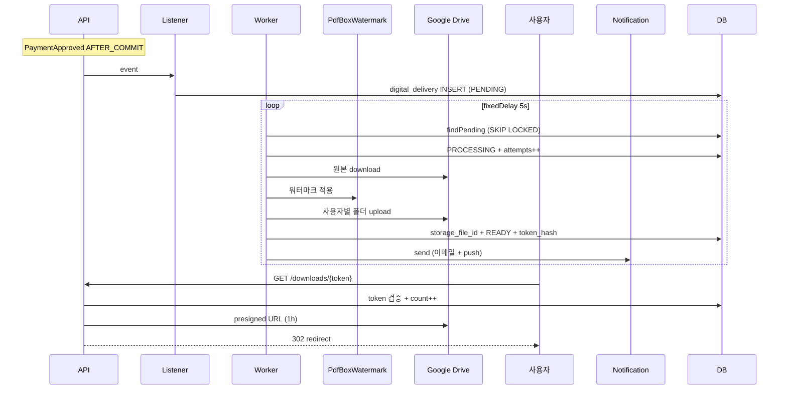

# 디지털 배송 구현 ★ — Worker + GDrive + 워터마크

| 문서 버전 | 작성일 | 작성자 | 주요 변경 사항 |
| --- | --- | --- | --- |
| v1.0.0 | 2026-05-14 | engineering-agent/tech-lead | 최초 |

**[[implementation|↑ hub]]**

> answer-be 영감 + 정형화 — listener + worker + GDrive + 다운로드 토큰.

---

## 1. 전체 흐름



---

## 2. Listener (결제 승인 → enqueue)

```java
@Component
@RequiredArgsConstructor
public class DigitalDeliveryListener {

    private final DigitalDeliveryRepository deliveries;
    private final OrderRepository orders;
    private final DigitalAssetRepository assets;
    private final IdGenerator ids;
    private final Clock clock;

    @TransactionalEventListener(phase = AFTER_COMMIT)
    public void onPaymentApproved(PaymentApproved ev) {
        var order = orders.findById(ev.orderId()).orElseThrow();
        for (var item : order.items()) {
            if (item.productType() == ProductType.PHYSICAL) continue;

            var asset = assets.findByProductId(item.productId()).orElseThrow();
            var delivery = DigitalDelivery.initiate(
                DeliveryId.next(),
                ev.orderId(),
                item.id(),
                ev.buyerId(),
                asset.id(),
                /* downloadMax */ 5,
                clock.now());
            deliveries.save(delivery);
        }
    }
}
```

---

## 3. Worker

```java
@Component
@RequiredArgsConstructor
public class DigitalDeliveryWorker {

    private final DigitalDeliveryRepository deliveries;
    private final DigitalAssetRepository assets;
    private final DigitalAssetStorage storage;
    private final WatermarkService watermark;
    private final UserRepository users;
    private final NotificationOutbox notifications;
    private final Clock clock;
    private final IdGenerator ids;

    @Scheduled(fixedDelay = 5_000)
    @SchedulerLock(name = "digitalDeliveryWorker", lockAtMostFor = "5m")
    public void process() {
        var pending = deliveries.findPending(20);   // SELECT FOR UPDATE SKIP LOCKED
        for (var d : pending) processOne(d);
    }

    @Transactional
    public void processOne(DigitalDelivery delivery) {
        delivery.startProcessing(clock.now());
        deliveries.save(delivery);

        try {
            var asset = assets.findById(delivery.assetId()).orElseThrow();
            var user = users.findById(delivery.userId()).orElseThrow();

            // 1. 원본 download
            var originalBytes = storage.download(asset.storageProvider(), asset.storageFileId());

            // 2. 워터마크 적용
            var watermarkInfo = WatermarkInfo.of(
                delivery.userId(),
                delivery.orderId(),
                user.email(),
                clock.now());
            var stampedBytes = watermark.apply(originalBytes, watermarkInfo);

            // 3. 사용자별 폴더 upload
            var fileId = storage.upload(
                "GDRIVE",
                delivery.userId().value(),
                delivery.orderId().value(),
                asset.title() + "-" + watermarkInfo.hash().substring(0, 8) + ".pdf",
                stampedBytes);

            // 4. token 발급
            var token = DownloadToken.generate(delivery.id(), delivery.userId(), clock.now());

            delivery.markReady(
                "GDRIVE", fileId, watermarkInfo.hash(),
                token.hash(), token.expiresAt(), clock.now());
            deliveries.save(delivery);

            // 5. 알림
            notifications.send(delivery.userId(), "DIGITAL_READY",
                Map.of("downloadUrl", "https://example.com/downloads/" + token.raw(),
                       "expiresAt", token.expiresAt()));

        } catch (Exception e) {
            log.error("watermark failed", e);
            delivery.recordFailure(e.getMessage(),
                clock.now().plus(Duration.ofMinutes(2L << delivery.attempts())));
            deliveries.save(delivery);
        }
    }
}
```

---

## 4. WatermarkService (PDFBox)

```java
@Component
public class PdfBoxWatermarkService implements WatermarkService {

    public byte[] apply(byte[] pdfBytes, WatermarkInfo info) {
        try (var doc = PDDocument.load(pdfBytes)) {
            var font = PDType1Font.HELVETICA;
            for (var page : doc.getPages()) {
                try (var cs = new PDPageContentStream(doc, page,
                        AppendMode.APPEND, true)) {
                    cs.setNonStrokingColor(200, 200, 200);
                    cs.setFont(font, 8);
                    cs.beginText();
                    cs.newLineAtOffset(50, 30);
                    cs.showText(String.format(
                        "Purchased by %s on %s | Order: %s | UID: %s",
                        info.emailMasked(),
                        info.purchasedAt().toString().substring(0, 10),
                        info.orderId().value(),
                        info.userId().value().substring(0, 8)));
                    cs.endText();
                }
            }
            // metadata
            var meta = doc.getDocumentInformation();
            meta.setCustomMetadataValue("watermark_hash", info.hash());
            meta.setCustomMetadataValue("user_id", info.userId().value());
            meta.setCustomMetadataValue("order_id", info.orderId().value());

            var out = new ByteArrayOutputStream();
            doc.save(out);
            return out.toByteArray();
        } catch (IOException e) {
            throw new WatermarkException(e);
        }
    }
}
```

---

## 5. GDrive Storage 어댑터

```java
@Component
@RequiredArgsConstructor
public class GoogleDriveStorage implements DigitalAssetStorage {

    private final Drive drive;

    public String upload(String provider, String userId, String orderId,
                          String fileName, byte[] content) {
        var folderId = ensureUserFolder(userId, orderId);

        var meta = new com.google.api.services.drive.model.File();
        meta.setName(fileName);
        meta.setParents(List.of(folderId));

        var media = new ByteArrayContent("application/pdf", content);
        var created = drive.files().create(meta, media)
            .setFields("id, webContentLink")
            .execute();

        return created.getId();
    }

    public String getDownloadUrl(String fileId, Duration ttl) {
        // GDrive 의 short-lived link
        return drive.files().get(fileId)
            .setFields("webContentLink")
            .execute()
            .getWebContentLink();
    }

    public void revoke(String fileId, String userEmail) {
        var perms = drive.permissions().list(fileId).execute().getPermissions();
        perms.stream()
            .filter(p -> userEmail.equals(p.getEmailAddress()))
            .forEach(p -> {
                try { drive.permissions().delete(fileId, p.getId()).execute(); }
                catch (Exception e) { throw new RuntimeException(e); }
            });
    }

    private String ensureUserFolder(String userId, String orderId) { /* ... */ }
}
```

---

## 6. Download endpoint

```java
@GetMapping("/downloads/{rawToken}")
public ResponseEntity<Void> download(@PathVariable String rawToken,
                                     HttpServletRequest req) {
    var hash = sha256(rawToken);
    var delivery = deliveries.findByTokenHash(hash)
        .orElseThrow(() -> new NotFoundException());

    delivery.download(clock.now());           // 검증 + count++
    deliveries.save(delivery);

    downloadAudit.record(delivery.id(), req.getRemoteAddr(),
        req.getHeader("User-Agent"), clock.now());

    var presigned = storage.getDownloadUrl(delivery.storageFileId(), Duration.ofHours(1));
    return ResponseEntity.status(HttpStatus.FOUND)
        .location(URI.create(presigned)).build();
}
```

---

## 7. 함정

### 함정 1 — Worker 트랜잭션 안 GDrive 호출
100MB 처리 30초 — DB 락.
→ DB SELECT FOR UPDATE 만 / 외부 호출은 trans 밖.

### 함정 2 — 같은 row 동시 처리
→ ShedLock + SKIP LOCKED.

### 함정 3 — token raw 저장
→ hash 만.

### 함정 4 — 워터마크 PDF 매번 재생성
→ 한 번 만 + storage_file_id 재사용.

### 함정 5 — revoke 시 즉시 file 삭제
evidence X.
→ permission 만 / 30일 후 file 삭제 cron.

---

## 8. 관련

- [[implementation|↑ hub]]
- [[../design-decisions/digital-delivery-policy]]
- [[../security/digital-watermarking]]
- [[../database/digital-deliveries-table]]
- [[../database/digital-assets-table]]
- [[../domain-model/digital-delivery-aggregate]]
- [[../pitfalls/digital-delivery-pitfalls]]
