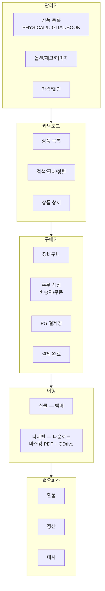
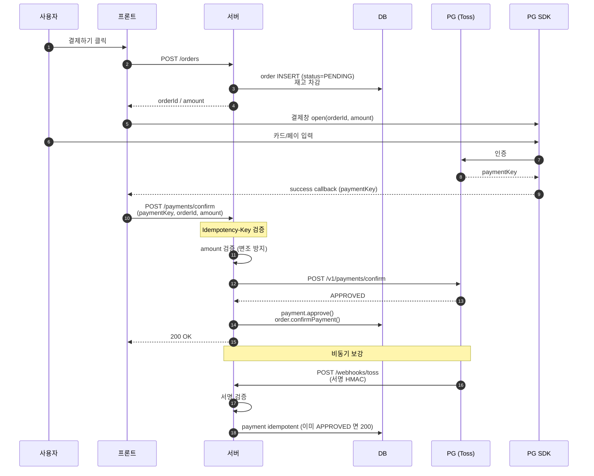
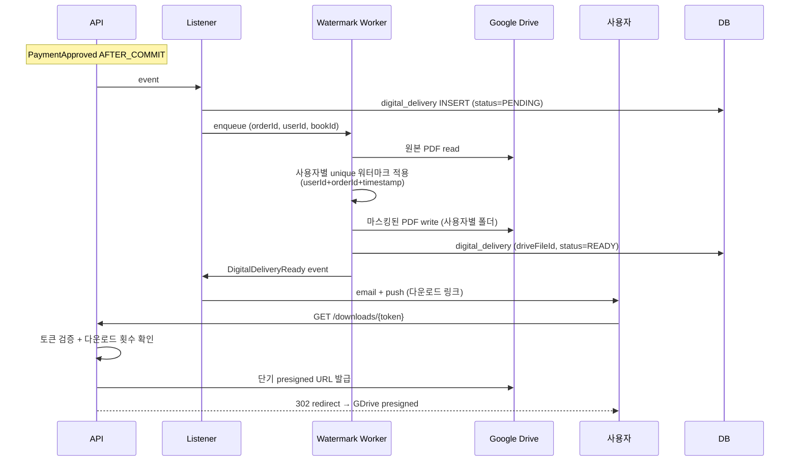
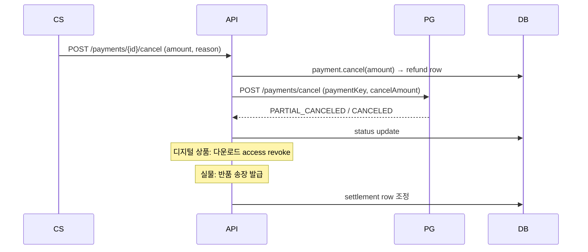
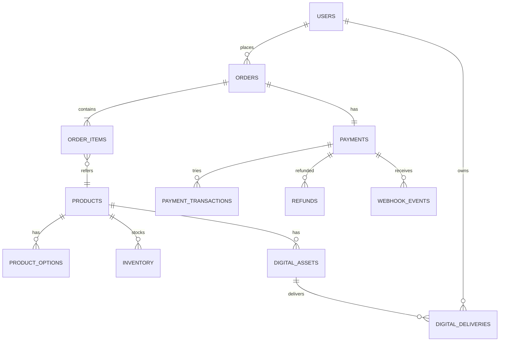
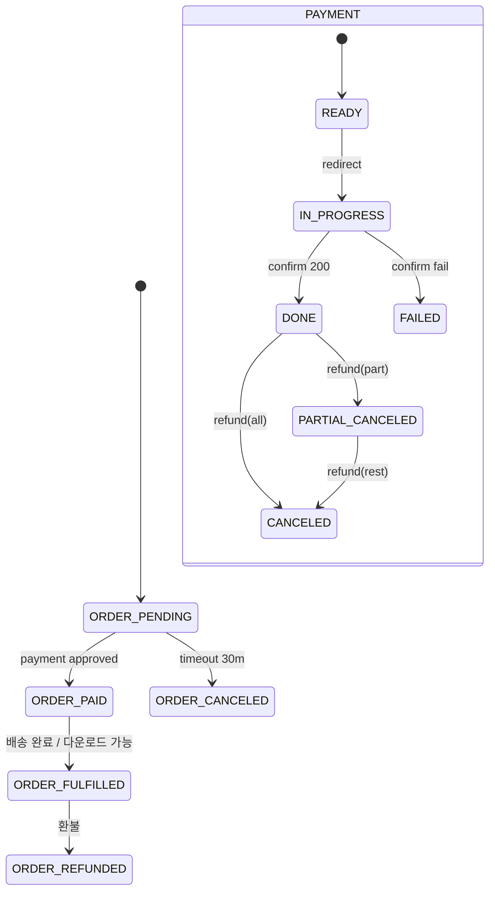

# product overview — end-to-end 흐름

| 문서 버전 | 작성일 | 작성자 | 주요 변경 사항 |
| --- | --- | --- | --- |
| v1.0.0 | 2026-05-14 | engineering-agent/tech-lead | 최초 |

**[[product|↑ hub]]**

> 상품 등록 → 노출 → 주문 → PG 결제 → 배송 (실물/디지털) → 환불 까지 한 페이지.

---

## 1. 큰 그림

---

## 2. 결제 흐름 (시퀀스)

자세히: [[design-decisions/payment-flow]] · [[security/webhook-signature]].

---

## 3. 디지털 배송 (책 PDF) 흐름 ★

자세히: [[design-decisions/digital-delivery-policy]] · [[implementation/digital-delivery-impl]] · [[security/digital-watermarking]].

---

## 4. 환불 흐름

자세히: [[design-decisions/refund-policy]] · [[implementation/refund-impl]].

---

## 5. 데이터 큰 ERD

자세히: [[database/database]].

---

## 6. 상태 머신 (한 화면)

자세히: [[enums/order-status]] · [[enums/payment-status]].

---

## 7. 관련

- [[product|↑ hub]]
- [[prerequisites]] — 시작 전 준비
- [[requirements]] — Acceptance Criteria
- [[architecture]] — Hexagonal 패키지
- [[transactions]] — race 분석
- [[implementation-order]] — F0~F9
