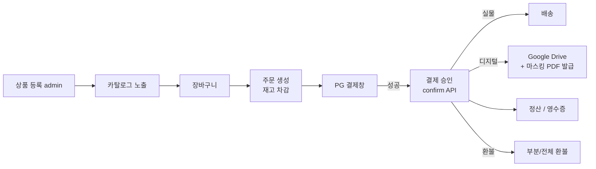

# 상품 레시피 — 상품 등록 + PG 결제 + 디지털 배송 hub

| 문서 버전 | 작성일 | 작성자 | 주요 변경 사항 |
| --- | --- | --- | --- |
| v1.0.0 | 2026-05-14 | engineering-agent/tech-lead | 최초 — folder split (signup/board 동일) + PG 비교 + 책 디지털 배송 |

**[[../api-design|↑ api-design hub]]**

> 상품 등록 → 장바구니 → 주문 → **PG 결제** → (실물 배송 / 디지털 다운로드) → 환불/정산 전체.
> **PG**: 토스 / 카카오페이 / 네이버페이 / KCP / 이니시스 / Stripe / PayPal 장단점.
> **디지털 (책)**: PDF 마스킹 + Google Drive 워크플로 (answer-be `product` 패키지 영감, 개선).

---

## 0. 왜 이 레시피인가

| 질문 | 답 |
| --- | --- |
| 왜 signup 처럼 폴더 split? | 영역 7~9 단계 — 한 파일 1000줄 넘으면 검색 X. |
| 왜 PG 비교가 hub 핵심? | 한국 SaaS 의 가장 큰 결정 — PG 잘못 고르면 정산/환불/PCI 재작업 발생. |
| 왜 책 (디지털) 별도 단계? | 실물 vs 디지털 = 배송/환불/저작권 정책이 근본적으로 다름. 마스킹/워터마크 = 도용 방지. |
| 왜 answer-be 참고? | 마스킹 + Google Drive 흐름 실 사례. 정형화 + DDD/Hexagonal 로 개선. |

---

## 1. 전체 흐름



자세히: [[overview]].

---

## 2. 폴더 구조

```
product/
├── product.md                  ← 이 파일 (hub)
├── overview.md                 ← end-to-end 흐름
├── prerequisites.md            ← 기술/도메인/인프라 전제
├── requirements.md             ← Acceptance Criteria
├── architecture.md             ← Hexagonal (signup 동일)
├── transactions.md             ← 결제/재고 race 분석
├── implementation-order.md     ← F0~F9 PR 단위 to-do
│
├── design-decisions/           ← 정책 (왜 / 안 하면 / 대안 / 트레이드오프)
│   ├── design-decisions.md     ← hub
│   ├── pg-selection.md         ★ Toss/KCP/카카오/네이버/Stripe/PayPal 비교
│   ├── payment-flow.md         ← checkout / authorization / capture / settle
│   ├── webhook-strategy.md     ← PG webhook idempotency + 서명
│   ├── refund-policy.md        ← 전체/부분 환불 + 정산 영향
│   ├── digital-delivery-policy.md  ★ 책 PDF + 마스킹 + GDrive
│   ├── physical-delivery-policy.md
│   ├── inventory-strategy.md   ← 재고 차감 시점 (주문/결제/배송)
│   ├── tax-strategy.md         ← 부가세 + 영수증
│   ├── pricing-strategy.md     ← 할인 / 쿠폰 / 프로모션
│   ├── product-status-policy.md ← DRAFT/ACTIVE/SOLD_OUT/DISCONTINUED
│   ├── option-strategy.md      ← size/color SKU
│   ├── currency-strategy.md    ← KRW only vs 다국적
│   ├── settlement-policy.md    ← 정산 주기
│   └── kafka-event-driven.md   ★ F10+ Kafka 고도화 (분산 / 대용량)
│
├── database/
│   ├── database.md             ← ERD hub
│   ├── products-table.md
│   ├── product-options-table.md
│   ├── product-images-table.md
│   ├── inventory-table.md
│   ├── orders-table.md
│   ├── order-items-table.md
│   ├── payments-table.md
│   ├── payment-transactions-table.md  ← 시도별 audit
│   ├── refunds-table.md
│   ├── digital-assets-table.md       ★ 원본 + 마스킹 자산
│   ├── digital-deliveries-table.md   ★ 사용자별 unique 마스킹 부여
│   ├── webhook-events-table.md       ← PG webhook idempotency
│   └── coupons-table.md
│
├── domain-model/
│   ├── domain-model.md
│   ├── product-aggregate.md
│   ├── order-aggregate.md
│   ├── payment-aggregate.md
│   ├── digital-delivery-aggregate.md ★ 책 다운로드 aggregate
│   ├── value-objects.md        ← Money / ProductId / OrderId
│   ├── domain-events.md
│   ├── repository-ports.md
│   └── aggregate-boundaries.md
│
├── enums/
│   ├── enums.md
│   ├── product-status.md
│   ├── product-type.md         ← PHYSICAL/DIGITAL/BOOK
│   ├── order-status.md
│   ├── payment-status.md
│   ├── payment-method.md
│   ├── refund-status.md
│   ├── currency.md
│   └── delivery-status.md
│
├── security/
│   ├── security.md
│   ├── pci-dss.md              ★ 카드번호/CVC 절대 저장 X
│   ├── webhook-signature.md    ★ PG HMAC 서명 검증
│   ├── idempotency-key.md      ★ 결제 중복 방지
│   ├── digital-watermarking.md ★ PDF 마스킹 / 워터마크
│   ├── pii-encryption.md       ← 배송지 암호화
│   └── audit-logging.md
│
├── implementation/
│   ├── implementation.md
│   ├── product-crud-impl.md
│   ├── checkout-impl.md
│   ├── payment-init-impl.md    ← PG redirect
│   ├── payment-confirm-impl.md ★ 승인 + 멱등
│   ├── payment-webhook-impl.md ★ PG webhook 수신
│   ├── refund-impl.md
│   ├── digital-delivery-impl.md ★ GDrive 업로드 + 마스킹 발급
│   ├── physical-delivery-impl.md
│   ├── inventory-impl.md
│   ├── coupon-impl.md
│   └── settlement-impl.md
│
├── testing/
│   ├── testing.md
│   ├── test-scenarios.md       ← AC 매핑
│   ├── unit-tests.md
│   ├── integration-tests.md
│   └── pg-mock-tests.md        ★ PG sandbox / mock
│
├── operations/
│   ├── operations.md
│   ├── observability.md
│   ├── runbook.md
│   └── reconciliation.md       ★ PG 대사 (서버 vs PG 금액 일치)
│
└── pitfalls/
    ├── pitfalls.md
    ├── concurrency-pitfalls.md ← 재고/이중결제
    ├── payment-pitfalls.md     ★ webhook 누락/순서/금액 변조
    ├── digital-delivery-pitfalls.md ★ 다운로드 도용
    └── refund-pitfalls.md
```

---

## 3. Phase 단계 (구현 순서)

### 3.1 Phase F0~F9 — 단일 노드 / Spring 기반 MVP

| Phase | 내용 | 기간 |
| --- | --- | --- |
| F0 | 준비 (Spring 3.3 + signup 인증 통합) | 1주 |
| F1 | 상품 CRUD (admin) | 2주 |
| F2 | 카탈로그 노출 + 검색 | 1.5주 |
| F3 | 장바구니 | 1주 |
| F4 | 주문 생성 + 재고 차감 | 1.5주 |
| F5 | PG 결제 (init + confirm + webhook) | 2주 |
| F6 | 디지털 배송 (책 마스킹 + GDrive) | 2주 |
| F7 | 실물 배송 (택배 API) | 1.5주 |
| F8 | 환불 + 정산 | 1.5주 |
| F9 | 운영 + 대사 | 1주 |

총 ~15주 (3.5개월, 팀 2명 기준).

### 3.2 Phase F10~F12 — 대용량 / 분산 고도화 ★

| Phase | 내용 | 기간 |
| --- | --- | --- |
| **F10** | **Outbox + Kafka producer 도입** (in-process 와 dual-write 검증) | 1.5주 |
| **F11** | **Kafka consumer 분리** (digital / notification / settlement / audit) | 2주 |
| **F12** | **DLQ / replay / KStreams 통계 / 보안 (SASL/TLS)** | 1.5주 |
| F13 | TDD 강화 + Docker / AWS EC2 배포 + 모니터링 | 1주 |

총 6주 추가 (Phase F0~F9 운영 후 → 대용량 진입 시 시작).

자세히: [[design-decisions/kafka-event-driven]] · [[implementation-order]].

---

## 4. cheat sheet

| 의사결정      | 정답 (한국 일반)                             | 어디 보면 됨                                      |
| --------- | -------------------------------------- | -------------------------------------------- |
| PG 첫 선택   | **토스페이먼츠** (개발자 경험 1위)                 | [[design-decisions/pg-selection]]            |
| 결제 흐름     | redirect 후 **/confirm** 서버 호출          | [[design-decisions/payment-flow]]            |
| webhook   | HMAC-SHA-256 서명 + Idempotency-Key      | [[security/webhook-signature]]               |
| 재고 차감     | **주문 시점** + 결제 실패 시 복원                 | [[design-decisions/inventory-strategy]]      |
| 디지털 자산 보호 | 사용자별 **고유 마스킹** PDF + GDrive presigned | [[design-decisions/digital-delivery-policy]] |
| 환불        | DONE → CANCELED/PARTIAL_CANCELED (멱등)  | [[design-decisions/refund-policy]]           |
| 정산        | PG webhook → 정산 row → 일/월 batch        | [[design-decisions/settlement-policy]]       |
| 대용량 분산    | F10+ Outbox + Kafka 점진 마이그            | [[design-decisions/kafka-event-driven]]      |

---

## 5. 다른 컨텍스트

| 비즈니스 | 무엇이 달라지나 |
| --- | --- |
| 무신사 / 패션 | option-strategy 의 SKU 폭증 + 재고 동시성 |
| 쿠팡 / 마켓컬리 | 물류 통합 (3PL) + 배송 SLA |
| 교보문고 / 리디 | digital-delivery 중심 — 본 레시피 영역 |
| Netflix / 멜론 | 구독 모델 — payment-flow 가 recurring billing |
| 해외 (Stripe) | currency-strategy 다국적 + 세금 (VAT/Sales Tax) |

---

## 6. 관련

- [[../signup/signup|↗ signup recipe]] — 인증 / outbox 패턴 / audit
- [[../board/board|↗ board recipe]] — 댓글/좋아요 (리뷰에 응용)
- [[../review|↗ review]] — 상품 리뷰
- [[../cart|↗ cart (top-level, 본 폴더로 흡수 예정)]]
- [[../order-stock|↗ order-stock (top-level, 본 폴더로 흡수 예정)]]
- [[../payment-pg|↗ payment-pg (top-level, 본 폴더로 흡수 예정)]]
- [[../product-crud|↗ product-crud (top-level, 본 폴더로 흡수 예정)]]
- [[../product-search|↗ product-search (top-level, 본 폴더로 흡수 예정)]]

---

## 7. 변경 이력

| Version | Date | 변경 |
| --- | --- | --- |
| v1.0.0 | 2026-05-14 | 최초 — folder hub + Phase 0~9 + PG 비교 + 책 디지털 + cheat sheet |
| v1.1.0 | 2026-05-14 | Phase F10~F13 (Kafka 고도화) 추가 + design-decisions/kafka-event-driven 도입 |
