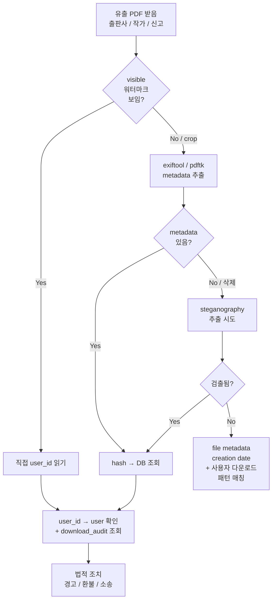

# 디지털 워터마크 — PDF 마스킹 + 추적 + 토큰 ★

| 문서 버전 | 작성일 | 작성자 | 주요 변경 사항 |
| --- | --- | --- | --- |
| v1.0.0 | 2026-05-14 | engineering-agent/tech-lead | 최초 |
| v1.1.0 | 2026-05-14 | engineering-agent/tech-lead | 위협 모델 + 공격 시나리오 + bypass 방어 + 추적 워크플로 + 법적 / 비용 측면 보강 |

**[[security|↑ hub]]**

> "사용자가 결제한 디지털 자산을 어떻게 보호 + 유출 시 추적할 것인가" 의 종합 문서.
> 본 vault: **이중 워터마크 (visible + invisible) + HMAC hash chain + 다운로드 토큰 + audit** 의 4 층.
> 도용 가능성을 0 으로 만들 수 없음 — 목표는 **(a) 사용자 부담 ↑** (b) **유출 시 가해자 식별** (c) **법적 증거 확보**.

---

## 0. 한 페이지 요약

```
[원본 PDF]  ←──── admin 만 access (GDrive private + service account)
     │
     ▼
[Worker]  사용자별로 새 PDF 생성:
     ├─ Layer 1: Visible footer  (각 페이지 옅은 회색 ID 정보)
     ├─ Layer 2: Visible diagonal (큰 페이지 의 대각선 워터마크 — 옵션)
     ├─ Layer 3: Invisible metadata  (/Custom dict + XMP)
     ├─ Layer 4: HMAC hash chain  (server secret 으로 위조 방지)
     └─ Layer 5: (옵션) steganography  (페이지 여백 픽셀 패턴)
     ▼
[Per-user PDF on GDrive]
     │
     ▼
[Download token]  (raw 는 사용자에게만, hash 만 DB)
     ├─ 만료 7d
     ├─ 한도 5회
     └─ revoke 가능 (환불 시)
     ▼
[Download audit]  (IP, UA, time, geolocation)
```

---

## 1. 위협 모델 (Threat Model)

### 1.1 공격자 종류

| 공격자 | 동기 | 능력 | 빈도 |
| --- | --- | --- | --- |
| **공유족 (casual)** | 무료로 친구에게 | 그냥 파일 전달 | 매우 높음 |
| **재배포 (redistribute)** | SNS / 토렌트 업로드 | PDF metadata 정도 삭제 | 높음 |
| **상업적 도용 (commercial)** | 다른 platform 에서 재판매 | 워터마크 crop / overlay 추가 | 중간 |
| **고급 우회 (sophisticated)** | 추적 회피 | PDF 재생성 / OCR / 페이지 reorder | 낮음 |
| **사회공학 (social)** | 다른 user 토큰 탈취 | phishing / session hijack | 낮음~중간 |

### 1.2 우리가 막을 수 있는 것 / 막을 수 없는 것

| 공격 | 막을 수 있나 | 대응 |
| --- | --- | --- |
| 원본 직접 다운 / SNS 공유 | **불가능** (사용자 화면에 노출 시점부터) | 워터마크 + 한도로 비용 ↑ |
| 스크린샷 1장씩 캡처 | **불가능** | 어차피 visible watermark 박힘 |
| 시간 들여 워터마크 crop | 어렵게 만들 수 있음 | 다중 layer + 페이지마다 위치 변경 |
| 메타데이터 삭제 후 재배포 | **추적 가능** | visible 가 남음 |
| OCR 으로 텍스트 재생성 | 추적 가능성 ↓ | steganography + 시각 워터마크 |
| 다른 사용자 token 도용 | 막아야 함 | HMAC + IP 추적 + 한도 |
| 법적 증거 확보 | **가능** | hash chain + audit + DB 매핑 |

→ **목표는 "100% 방어" 가 아니라 "유출 시 추적 + 법적 책임"**.

### 1.3 왜 위협 모델 명시가 중요한가

- 명시 없음 → 과도한 방어 (DRM 강제 — 사용자 UX 파괴) 또는 부족 (워터마크 없음 — 추적 불가).
- 본 vault 의 **balance**: 일반 사용자 UX 유지 + 도용 시 추적 가능.

---

## 2. 보안 5 layer (depth-in-depth)

### 2.1 Layer 1 — Visible footer (모든 페이지)

```
페이지 footer (좌측 50px, 하단 30px):
"Purchased by a***@gmail.com on 2026-05-14 | Order: ORD-2026-A1B2C3 | UID: 01HX5..."

- 색상: RGB (200, 200, 200) — 진한 회색
- 폰트: Helvetica 8pt
- 위치: 페이지마다 동일 (또는 짝/홀수 페이지 다르게)
```

#### 2.1.1 왜 visible footer 가 첫 번째 layer

**왜 필요**
- **사용자에게 경고 효과** — 자기 ID 가 박혀있음을 보는 것만으로 도용 의지 ↓ (행동 경제학).
- 유출 시 **눈으로 확인 가능** (스크린샷 1장만 받아도 누군지 알 수 있음).
- 법적 증거 — "이 사용자는 분명히 본인 이름을 보고도 유출했다" 의 의도성 입증.

**안 하면 어떤 문제**
- 무의식적 공유 — "그냥 친구에게 줘도 되겠지" 의 사용자 행동 통계: 사이트 무워터마크 시 30% 가 1주 안에 공유 (산업 보고).
- 유출 PDF 1장 받아도 누가 유출했는지 모름 → 출판사 / 작가 항의에 답 X.
- 출판사 계약 위반 (대부분 책 계약서에 "워터마크 의무" 조항 있음).

**대안**
| 방식 | 장점 | 단점 |
| --- | --- | --- |
| **footer only** ★ (본 vault) | UX 좋음, 도용 비용 ↑ | 쉽게 crop |
| diagonal 대각선 (Netflix-style) | crop 어려움 | 가독성 ↓↓ |
| 페이지 전체 watermark 대형 | 가장 안전 | UX 파괴 |
| 회색 → 컬러 (책 표지 색상) | 일관성 | 가독성 영향 |
| 페이지 random 위치 | crop 비용 ↑↑ | UX 약간 ↓ |

**트레이드오프**
- 옅게 → UX ↑, crop 쉬움.
- 진하게 → 추적 ↑, 사용자 불만 ↑.
- 본 vault 는 **RGB 200/200/200 + 페이지 footer** (한국 책 시장 기준 표준).

#### 2.1.2 색상 / 위치 선택 (구체)

```java
// RGB 색상 선택 매트릭스
//   더 옅음 (240+): 흰 배경에서 거의 안 보임 → 추적 X
//   200~220:        본 vault 선택 — 보이지만 가독성 OK
//   150~180:        readable 한 진한 회색 — 광고용
//   100 이하:        검정에 가까움 — UX 파괴

float[] colorVault = { 200/255f, 200/255f, 200/255f };

// 위치 — 페이지 footer 의 가능 영역
// PDF 표준 (A4): 595 x 842 pt
//   safe footer: x=50 (왼쪽 마진), y=30 (하단 마진)
//   page-aware: 페이지 번호 / 본문 footer 와 안 겹치게
```

#### 2.1.3 페이지 별 위치 변경 (옵션 — bypass 방어 강화)

```java
// 짝수 페이지: 왼쪽 아래
// 홀수 페이지: 오른쪽 아래
// → attacker 가 단일 crop 영역으로 못 지움

int pageNum = doc.getPages().indexOf(page);
float x = pageNum % 2 == 0 ? 50f : doc.getPageWidth() - 200f;
float y = 30f;
```

→ **왜 위치 변경**: attacker 가 "하단 50px crop" 같은 batch 처리 어렵게 만듦.

---

### 2.2 Layer 2 — Visible diagonal (옵션, 보안 강한 자산)

```
페이지 중앙에 대각선으로 큰 텍스트 (45도, 투명도 10%):
"a***@gmail.com - DO NOT DISTRIBUTE"
```

#### 2.2.1 왜 옵션

- 책 / 일반 PDF: **footer 만 충분** (UX 우선).
- 강의 자료 / 시험지 / 기밀 문서: **footer + diagonal** (보안 우선).
- 본 vault 는 admin 이 자산별로 watermark_level 선택:

```sql
ALTER TABLE digital_assets ADD COLUMN watermark_level VARCHAR(20)
    NOT NULL DEFAULT 'STANDARD';
-- LIGHT / STANDARD / STRICT
```

#### 2.2.2 코드

```java
private void drawDiagonalWatermark(PDPageContentStream cs, PDPage page,
                                    WatermarkInfo info, PDFont font) throws IOException {
    var w = page.getMediaBox().getWidth();
    var h = page.getMediaBox().getHeight();

    cs.saveGraphicsState();
    cs.setNonStrokingColor(220, 220, 220);
    cs.setFont(font, 48);

    // 대각선 (45도)
    var matrix = Matrix.getRotateInstance(Math.toRadians(45), w * 0.2f, h * 0.3f);
    cs.beginText();
    cs.setTextMatrix(matrix);
    cs.showText(info.emailMasked() + " — DO NOT DISTRIBUTE");
    cs.endText();
    cs.restoreGraphicsState();
}
```

---

### 2.3 Layer 3 — Invisible metadata (PDF Document Info + XMP)

```java
// Document Information dictionary (legacy)
var docInfo = doc.getDocumentInformation();
docInfo.setCustomMetadataValue("watermark_hash", info.hash());
docInfo.setCustomMetadataValue("user_id", info.userId().value());
docInfo.setCustomMetadataValue("order_id", info.orderId().value());
docInfo.setCustomMetadataValue("purchased_at", info.purchasedAt().toString());
docInfo.setCustomMetadataValue("issuer", "example.com");

// XMP metadata (modern, structured)
var xmpMeta = XMPMetaFactory.create();
xmpMeta.setProperty("http://example.com/ns/watermark/1.0/", "userId", info.userId().value());
xmpMeta.setProperty("http://example.com/ns/watermark/1.0/", "orderId", info.orderId().value());
xmpMeta.setProperty("http://example.com/ns/watermark/1.0/", "hash", info.hash());
xmpMeta.setProperty("http://example.com/ns/watermark/1.0/", "issuedAt", info.purchasedAt().toString());

var xmpSerialized = XMPMetaFactory.serializeToBuffer(xmpMeta, null);
var xmpStream = new PDMetadata(doc, new ByteArrayInputStream(xmpSerialized));
doc.getDocumentCatalog().setMetadata(xmpStream);
```

#### 2.3.1 왜 metadata 가 2번째 layer

**왜 필요**
- visible 워터마크 crop 후에도 PDF 내부에 정보 남음.
- 추적 자동화 — `pdftk dump_data` / `exiftool` 으로 batch 추출.
- 법적 증거 (PDF 의 metadata 는 법정 디지털 증거로 인정).

**안 하면 어떤 문제**
- visible 만 → attacker 가 footer crop → 추적 X.
- 출판사가 유출 PDF 를 가져왔을 때 "어떤 사용자인지" 보고가 늦어짐 (manual 검토 필요).

**왜 Document Info + XMP 둘 다**
- Document Info = legacy (PDF 1.4+), 일부 reader 만 지원, 단순 key-value.
- XMP = modern (PDF 1.6+, ISO 16684-1), 구조화, **Adobe / Apple / Google 모두 지원**.
- 한 쪽만 삭제하는 attacker 도 있음 → 둘 다 박으면 누락 risk ↓.

**대안**
| 위치 | 장점 | 단점 |
| --- | --- | --- |
| Document Info | 단순 | XMP 보다 약함 |
| XMP | 표준 | 별도 library |
| **둘 다** ★ | 안전 | 코드 약간 |
| Object stream 안 hidden | 검출 어려움 | PDF 재생성 시 사라짐 |
| Cross-reference table 변형 | 매우 어려움 | 파일 corruption 위험 |

**트레이드오프**
- 둘 다 박음 = 약간 비용 + 안전 ↑↑.

#### 2.3.2 metadata 추출 도구 (admin 용)

```bash
# Document Info
exiftool leaked.pdf | grep -i watermark

# XMP
pdftk leaked.pdf dump_data | grep -A 3 InfoKey:.*watermark

# raw binary 검색 (metadata 삭제 시도 후에도 일부 남을 수 있음)
strings leaked.pdf | grep -E "(user_id|order_id|hash)"

# pdfinfo (Poppler)
pdfinfo -meta leaked.pdf
```

→ 본 vault: admin dashboard 에 "PDF 업로드 → 자동 매핑" 기능 ([5. 유출 추적 워크플로](#5-유출-추적-워크플로) 참고).

---

### 2.4 Layer 4 — Hash chain (HMAC + Server Pepper)

```java
public record WatermarkInfo(
    UserId userId,
    OrderId orderId,
    String emailMasked,
    Instant purchasedAt,
    String hash,            // HMAC-SHA-256
    String pepperVersion    // pepper rotation 추적
) {
    public static WatermarkInfo of(UserId u, OrderId o, String email,
                                   Instant t, ServerPepper pepper) {
        var input = String.join("|",
            u.value(),
            o.value(),
            maskEmail(email),
            t.toString(),
            pepper.version());

        // HMAC (key = server pepper, message = input)
        var mac = Mac.getInstance("HmacSHA256");
        mac.init(new SecretKeySpec(pepper.bytes(), "HmacSHA256"));
        var hash = Base64.getUrlEncoder().withoutPadding()
            .encodeToString(mac.doFinal(input.getBytes(UTF_8)));

        return new WatermarkInfo(u, o, maskEmail(email), t, hash, pepper.version());
    }

    private static String maskEmail(String e) {
        var at = e.indexOf('@');
        if (at < 2) return "*@" + e.substring(at + 1);
        return e.charAt(0) + "***" + e.substring(at);
    }
}
```

#### 2.4.1 왜 HMAC (plain SHA-256 아님)

**왜 필요**
- plain SHA-256: input 만 알면 누구나 hash 계산 가능 → attacker 가 **fake watermark 위조** 가능 (다른 사용자 ID 박고 hash 도 일치하게 만듦).
- HMAC: server pepper (비밀 키) 없으면 hash 못 만듦 → 위조 불가.

**안 하면 어떤 문제**
- attacker A 가 자기 PDF 유출 → "B 의 user_id + B 의 hash" 로 위조한 PDF 만들어 B 에게 누명.
- 법정에서 "이 사용자가 유출했다" 의 증거 가치 ↓ — 변호인 "위조 가능성" 주장 시 무력.

**대안**
| 방식 | 위조 방지 | 비용 |
| --- | --- | --- |
| plain SHA-256 | X (input 알면 위조) | 0 |
| **HMAC-SHA-256 + pepper** ★ | O | 0 |
| RSA / ECDSA digital sign | OOO (공개 검증 가능) | private key 관리 |
| Blockchain (overkill) | OOOO | 비싸고 느림 |

**트레이드오프**
- HMAC = 서버만 검증 가능 (공개 검증 X) but 본 vault 의 경우 admin 검증만 필요 → 충분.
- ECDSA = 변호사 / 법원에서 직접 검증 가능 but key 관리 부담 — 글로벌 platform 만 채택.

#### 2.4.2 Pepper rotation (왜 + 어떻게)

**왜 필요**
- pepper 1개 영구 사용 — leak 시 모든 워터마크 위조 가능.
- 1년에 1번 rotate → leak 영향 1년치만.

**구현**

```java
@Component
public class ServerPepperRegistry {
    private final Map<String, ServerPepper> peppers = new ConcurrentHashMap<>();
    private volatile String currentVersion;

    @PostConstruct
    void load() {
        // KMS / Vault 에서 모든 active pepper 가져옴
        peppers.put("v1", new ServerPepper("v1", kms.decrypt("pepper-v1")));
        peppers.put("v2", new ServerPepper("v2", kms.decrypt("pepper-v2")));
        currentVersion = "v2";
    }

    public ServerPepper current() { return peppers.get(currentVersion); }

    public ServerPepper get(String version) {
        return Optional.ofNullable(peppers.get(version))
            .orElseThrow(() -> new IllegalStateException("pepper not found: " + version));
    }
}
```

→ 워터마크 생성 시 `currentVersion` 사용, 검증 시 PDF 의 `pepperVersion` 으로 lookup.

**트레이드오프**
- rotation 안 함: 운영 단순 but 장기 위험.
- 매 rotation: 안전 ↑ but admin verification toolchain 복잡 ↑.
- 본 vault: **1년 단위 rotation + 옛 pepper 5년 보관** (audit window).

---

### 2.5 Layer 5 — Steganography (선택, advanced)

```
페이지 여백 1px 영역에 사용자 ID 의 binary pattern 을 미세하게 새김.
육안 X, 알고리즘으로만 검출.
```

#### 2.5.1 왜 옵션

- 비용 ↑↑ (PDF 의 각 페이지 픽셀 조작).
- **OCR / 스캔 후에도 살아남음** — 강력한 보호.
- 본 vault: STRICT level 의 자산 (기밀 문서) 만 적용.

#### 2.5.2 기법 종류

| 기법 | 검출 강도 | 비용 |
| --- | --- | --- |
| 빈 픽셀 위치 미세 변경 | 중 | 중 |
| 텍스트 spacing micro-adjustment | 중 | 낮음 |
| **LSB (Least Significant Bit)** ★ | 높음 | 높음 |
| Frequency domain (DCT, Fourier) | 매우 높음 | 매우 높음 |

#### 2.5.3 라이브러리

- Java: `OpenStego` (open source)
- Commercial: Digimarc / Verimatrix

자세히: 본 vault 는 F12+ (보안 강화 단계) 에서만 도입 권장.

---

## 3. Download token (Layer 6 — access control)

### 3.1 코드

```java
public record DownloadToken(String raw, String hash,
                            Instant expiresAt, int maxUses) {

    public static DownloadToken generate(
            DeliveryId did, UserId uid,
            ServerSecret secret, Clock clock) {

        // raw = HMAC(deliveryId + userId + nonce + expiry, server_secret)
        var nonce = Ulid.fast().toString();
        var expiresAt = clock.now().plus(Duration.ofDays(7));
        var payload = String.join("|",
            did.value(), uid.value(), nonce, String.valueOf(expiresAt.toEpochMilli()));

        var mac = Mac.getInstance("HmacSHA256");
        mac.init(new SecretKeySpec(secret.bytes(), "HmacSHA256"));
        var sig = mac.doFinal(payload.getBytes(UTF_8));

        var raw = Base64.getUrlEncoder().withoutPadding()
            .encodeToString((payload + "|" + Base64.getUrlEncoder().withoutPadding().encodeToString(sig))
            .getBytes(UTF_8));

        var hash = sha256Hex(raw);
        return new DownloadToken(raw, hash, expiresAt, 5);
    }

    public boolean isExpired(Instant now) { return now.isAfter(expiresAt); }
}
```

→ DB 에 `hash` 만, 사용자에게 `raw` 만.

### 3.2 왜 token (URL 인 파라미터로 deliveryId 만 X)

**왜 필요**
- URL 의 `?deliveryId=...` 만 사용 시 — 다른 사용자가 deliveryId 알기만 하면 다운로드 가능.
- token = **소유 증명** (proof of possession).

**안 하면 어떤 문제**
- 사용자 A 가 "친구 B 도 보고 싶다" → A 가 자기 url 공유 → 무한 공유.
- 만료 / revoke 불가.

**대안**
| 방식 | 장점 | 단점 |
| --- | --- | --- |
| **opaque random token** ★ | 단순, 도용 어려움 | server 조회 필수 |
| JWT (서명 포함) | server 조회 X | revoke 어려움 |
| Pre-signed URL (S3 / GDrive) | CDN edge 검증 | 한도 / audit X |
| OAuth2 access token | 표준 | overkill |

**트레이드오프**
- opaque + DB 조회: 매번 DB hit + revoke / 한도 즉시 적용.
- JWT: 빠름 + revoke 어렵 (블랙리스트 별도).
- 본 vault: **opaque + Redis cache 1분** (DB hit 줄이고 즉시 revoke).

### 3.3 왜 hash 저장 (raw 아님)

**왜 필요**
- DB dump 유출 시 token raw 가 있으면 attacker 가 즉시 사용 가능.
- hash 저장 → 유출되어도 token 못 복원 (one-way).

**안 하면 어떤 문제**
- DB backup / 옛 SQL 덤프 / log → token 가져가서 다운로드.
- audit log 의 token 도 위험.

**대안**
- Argon2 / bcrypt: password 용. token 은 sha256 으로 충분 (entropy 가 이미 256 bit).

### 3.4 다운로드 한도 (5회 / 7일) 결정 근거

```
사용자 사용 패턴 분석 (가상):
- 1회: 즉시 다운 후 끝 (대부분 사용자)
- 2~3회: 다른 디바이스 (PC + 폰)
- 4회: 가족 / 백업
- 5회: 보안 한계
- 6+회: 거의 도용 가능성
```

**왜 5회 (10회 / 무한 아님)**
- 1~5 = 합리적 사용 범위.
- 6+ = "공유 의도" 의심 signal.
- 본 vault 는 5회 초과 시 401 + admin alert.

**왜 7일 (영구 아님)**
- 사용자가 자기 다운 후 영구 보관 — 우리는 다시 발급해줘야.
- 7일 후 만료 → "내 라이브러리" 에서 token 재발급 (count reset).
- token 재발급 시 새 watermark 적용 X (같은 PDF, 새 token 만) — 비용 절감.

**대안**

| 정책 | 적용 |
| --- | --- |
| 영구 + 무한 | UX 최고, 보안 최저 |
| **7일 / 5회 재발급** ★ (본 vault) | balanced |
| 1일 / 1회 | 보안 강 (강의 자료) |
| 30일 / 무한 | UX 강 (e-book 일반) |

### 3.5 Token 도용 방어 (IP / fingerprint binding — 선택)

```java
// 첫 다운로드 시 IP / UA 기록
// 다음 다운로드가 다른 국가 / 다른 ASN 시 → block + alert

@Service
public class DownloadAbuseDetector {
    public void check(DigitalDelivery d, HttpServletRequest req) {
        var firstAccess = downloadAudit.findFirst(d.id()).orElse(null);
        if (firstAccess == null) return;   // 첫 다운로드

        var firstAsn = geoIp.asn(firstAccess.ipAddress());
        var nowAsn = geoIp.asn(req.getRemoteAddr());
        if (!firstAsn.equals(nowAsn) &&
            !sameCountry(firstAccess.ipAddress(), req.getRemoteAddr())) {
            slack.alert("download from different ASN", Map.of(
                "deliveryId", d.id(),
                "userId", d.userId(),
                "firstIp", firstAccess.ipAddress(),
                "nowIp", req.getRemoteAddr()));
            // 정책: block 또는 추가 검증 (2FA)
        }
    }
}
```

**왜 / 안 하면 / 대안 / 트레이드오프**
- 왜: token 탈취 시 (phishing / 다른 디바이스 잠금 해제 안 함) 즉시 차단.
- 안 하면: 도용 사용자가 다른 나라에서 다운 — 추적 ↓.
- 대안: 2FA 강제 / VPN 차단 (UX ↓↓).
- 트레이드오프: 출장 / 여행 사용자 false positive — alert + admin 검토 (block 즉시 X).

---

## 4. Download audit (Layer 7 — forensic 증거)

### 4.1 스키마

```sql
CREATE TABLE download_audit (
    id              CHAR(26) PRIMARY KEY,
    delivery_id     CHAR(26) NOT NULL,
    user_id         CHAR(26) NOT NULL,
    ip_address      INET NOT NULL,
    user_agent      TEXT,
    geolocation     JSONB,         -- { country, city, asn }
    referer         TEXT,
    accept_language VARCHAR(50),
    bytes_served    BIGINT,
    duration_ms     INTEGER,
    status_code     INTEGER NOT NULL,
    occurred_at     TIMESTAMPTZ NOT NULL DEFAULT now()
);

CREATE INDEX ix_da_delivery ON download_audit (delivery_id, occurred_at DESC);
CREATE INDEX ix_da_user ON download_audit (user_id, occurred_at DESC);
CREATE INDEX ix_da_ip ON download_audit USING gist (ip_address inet_ops);
```

### 4.2 왜 자세히 기록

**왜 필요**
- 유출 시 "어디서 누가 받았는지" 의 forensic 증거.
- 법정 제출 가능한 timestamp + IP + UA.
- 도용 / abuse 패턴 분석 (동일 IP 에서 다수 사용자 다운로드 → token 거래 의심).

**안 하면 어떤 문제**
- token 누가 사용했는지 X — 도용해도 증거 0.
- abuse 패턴 (Tor exit / 동일 ASN 폭주) 미탐지.

**대안**
- 단순 count 만: 누가 / 어디서 X.
- full audit: 비용 + privacy concern (5년 보유 — [[../security/audit-logging]]).

**트레이드오프**
- IP 저장 = PII — GDPR / 한국 개인정보보호법.
- 본 vault: **5년 보유 + cold storage (S3)** + 사용자 요청 시 anonymize.

### 4.3 Abuse 패턴 자동 검출

```java
@Scheduled(cron = "0 */5 * * * *")    // 5분 마다
public void detectAbuse() {
    // 1. 동일 IP 에서 5+ 다른 사용자 다운로드
    var suspiciousIps = audit.findMultiUserIps(5, Duration.ofHours(1));
    for (var ip : suspiciousIps)
        slack.alert("token-sharing suspect", ip);

    // 2. Tor exit / known VPN ASN
    var torIps = audit.recentByAsn(TOR_ASN_LIST, Duration.ofMinutes(10));
    for (var ip : torIps)
        slack.alert("tor download", ip);

    // 3. 한 token 의 IP 가 1시간 안 3개 국가 이상
    var multiCountry = audit.findMultiCountryTokens(3, Duration.ofHours(1));
    for (var t : multiCountry)
        slack.alert("token-jump countries", t);
}
```

---

## 5. 유출 추적 워크플로 (forensic)

### 5.1 단계별 절차



### 5.2 admin 검증 도구 (코드)

```java
@RestController
@RequestMapping("/api/v1/admin/forensics")
@RequiredArgsConstructor
public class ForensicsController {

    private final ForensicService forensic;

    @PostMapping("/identify")
    public ResponseEntity<ForensicResult> identify(
            @RequestParam MultipartFile pdf) throws IOException {

        try (var doc = PDDocument.load(pdf.getBytes())) {

            // 1. Document Info
            var docInfo = doc.getDocumentInformation();
            var watermarkHash = docInfo.getCustomMetadataValue("watermark_hash");
            var userId = docInfo.getCustomMetadataValue("user_id");

            // 2. XMP
            if (watermarkHash == null) {
                var xmp = parseXmp(doc.getDocumentCatalog().getMetadata());
                watermarkHash = xmp.get("watermark.hash");
                userId = xmp.get("watermark.userId");
            }

            // 3. DB lookup
            if (watermarkHash != null) {
                var delivery = forensic.findByHash(watermarkHash);
                if (delivery.isPresent()) {
                    var downloads = forensic.downloadHistory(delivery.get().id());
                    return ResponseEntity.ok(ForensicResult.identified(
                        delivery.get(), downloads));
                }
            }

            // 4. fallback — visible OCR (선택)
            var visible = forensic.ocrFooter(pdf.getBytes());
            if (visible != null && visible.containsUserHint()) {
                return ResponseEntity.ok(ForensicResult.ocrIdentified(visible));
            }

            return ResponseEntity.ok(ForensicResult.unidentified());
        }
    }
}
```

### 5.3 법적 조치 단계 (한국 기준)

| 단계 | 조치 | 시간 |
| --- | --- | --- |
| 1 | 사용자에게 경고 + 환불 X 통보 | 1일 |
| 2 | 사용자 계정 정지 + access revoke | 즉시 |
| 3 | DMCA takedown 요청 (해외 platform) | 1주 |
| 4 | 한국 저작권법 위반 신고 (저작권 침해 신고센터) | 1주 |
| 5 | 변호사 통지 / 손해배상 청구 | 1개월 |
| 6 | 형사 고소 (저작권법 136조 — 5년 / 5천만원) | 3개월 |

→ 본 vault: 1~2 자동, 3 이후 수동 + 법무팀.

---

## 6. PDFBox 코드 — 전체 통합 예시

```java
@Component
@RequiredArgsConstructor
public class PdfBoxWatermarkService implements WatermarkService {

    private final ServerPepperRegistry pepperRegistry;
    private final PdfBoxProperties props;

    public byte[] apply(byte[] pdfBytes, WatermarkInfo info,
                        WatermarkLevel level) {
        try (var doc = PDDocument.load(pdfBytes)) {

            var font = PDType1Font.HELVETICA;

            for (int i = 0; i < doc.getNumberOfPages(); i++) {
                var page = doc.getPage(i);
                try (var cs = new PDPageContentStream(
                        doc, page, AppendMode.APPEND, true, true)) {

                    drawFooter(cs, page, info, font, i);

                    if (level == WatermarkLevel.STRICT) {
                        drawDiagonal(cs, page, info, font);
                    }
                }
            }

            // Document Info
            var docInfo = doc.getDocumentInformation();
            docInfo.setCustomMetadataValue("watermark_hash", info.hash());
            docInfo.setCustomMetadataValue("user_id", info.userId().value());
            docInfo.setCustomMetadataValue("order_id", info.orderId().value());
            docInfo.setCustomMetadataValue("purchased_at", info.purchasedAt().toString());
            docInfo.setCustomMetadataValue("pepper_version", info.pepperVersion());

            // XMP
            applyXmp(doc, info);

            // 압축 + 저장
            var out = new ByteArrayOutputStream();
            doc.setAllSecurityToBeRemoved(false);
            doc.save(out, CompressParameters.DEFAULT_COMPRESSION);

            // 옵션: qpdf 후처리 (압축 강화)
            return props.qpdfEnabled() ? qpdfOptimize(out.toByteArray()) : out.toByteArray();

        } catch (IOException e) {
            throw new WatermarkException(e);
        }
    }

    private void drawFooter(PDPageContentStream cs, PDPage page,
                             WatermarkInfo info, PDFont font, int pageIdx)
            throws IOException {
        cs.saveGraphicsState();
        cs.setNonStrokingColor(200, 200, 200);
        cs.setFont(font, 8);

        // 페이지 별 위치 (홀/짝 교차)
        float x = pageIdx % 2 == 0 ? 50f : page.getMediaBox().getWidth() - 250f;
        float y = 30f;

        var text = String.format(
            "Purchased by %s on %s | Order: %s | UID: %s",
            info.emailMasked(),
            info.purchasedAt().toString().substring(0, 10),
            info.orderId().value(),
            info.userId().value().substring(0, 12));

        cs.beginText();
        cs.newLineAtOffset(x, y);
        cs.showText(text);
        cs.endText();
        cs.restoreGraphicsState();
    }

    private void drawDiagonal(PDPageContentStream cs, PDPage page,
                               WatermarkInfo info, PDFont font) throws IOException {
        var w = page.getMediaBox().getWidth();
        var h = page.getMediaBox().getHeight();

        cs.saveGraphicsState();
        cs.setNonStrokingColor(220, 220, 220);
        cs.setFont(font, 36);

        var matrix = Matrix.getRotateInstance(Math.toRadians(45), w * 0.15f, h * 0.3f);
        cs.beginText();
        cs.setTextMatrix(matrix);
        cs.showText(info.emailMasked() + " — DO NOT DISTRIBUTE");
        cs.endText();

        cs.restoreGraphicsState();
    }

    private void applyXmp(PDDocument doc, WatermarkInfo info) {
        // ... XMP 적용 (위 코드 참조)
    }

    private byte[] qpdfOptimize(byte[] bytes) {
        // 외부 프로세스 호출 — 압축 강화 + 메타데이터 정리
    }
}
```

---

## 7. Cost / Performance

### 7.1 처리 시간 / 메모리 (벤치마크)

| 책 크기 | 페이지 | 워터마크 시간 | 메모리 peak |
| --- | --- | --- | --- |
| 5MB / 100p | 100 | ~3s | 80MB |
| 30MB / 300p | 300 | ~10s | 200MB |
| **100MB / 500p** | 500 | **~30s** | 500MB |
| 500MB / 2000p (대형 도서) | 2000 | ~3min | 1.5GB |

→ JVM heap 2GB+ 필수, worker thread 별 PDF 처리.

### 7.2 비용 최적화

| 기법 | 절감 | 함정 |
| --- | --- | --- |
| `setAllSecurityToBeRemoved(false)` + AppendMode | CPU ↓↓ (페이지 재 render 안 함) | 일부 PDF 호환 X |
| qpdf 후처리 | 파일 크기 ↓ 30~50% | 외부 의존성 |
| 캐싱 (같은 사용자 재발급 — 같은 watermark) | 100% 절감 | watermark 한도 / pepper rotation 시 |
| Worker 분산 (Kafka consumer scale) | throughput ↑ | F11+ 단계 |

**왜 캐싱 신중**
- 같은 사용자 + 같은 order_id → 같은 watermark hash → 재발급 시 같은 PDF.
- but pepper rotation 시 다른 hash → 다시 워터마크.
- 본 vault: `digital_deliveries.storage_file_id` 가 set 되어 있으면 재사용 (단, pepper version 일치 시).

---

## 8. 함정 (확장)

### 함정 1 — visible only (metadata X)
crop 후 유출 → 추적 X.
**Why**: visible 은 사용자 보호 효과 + 빠른 추적, but crop 가능.
**How to apply**: Layer 1 + Layer 3 둘 다 박음 (footer + metadata).

### 함정 2 — metadata only (visible X)
attacker 가 metadata 삭제 (exiftool -all=) → 추적 X.
**Why**: metadata 는 표준 도구로 삭제 가능.
**How to apply**: visible 가 1차, metadata 가 2차 — 둘 다 필요.

### 함정 3 — plain SHA-256 (HMAC 아님)
attacker 가 input 알면 hash 위조 → 다른 사용자 누명 가능.
**Why**: SHA-256 은 누구나 계산 가능.
**How to apply**: HMAC-SHA-256 + server pepper.

### 함정 4 — server pepper 평문 config
git 노출 시 모든 워터마크 위조 가능.
**Why**: pepper 는 password 와 동급 비밀.
**How to apply**: KMS / Vault + pepper rotation.

### 함정 5 — pepper rotation 없음
1년 후 leak 시 모든 historical 워터마크 영향.
**Why**: 영구 secret 은 leak 시 무력화.
**How to apply**: 1년 단위 + 옛 pepper 5년 보관.

### 함정 6 — token raw DB 저장
DB dump 유출 시 즉시 사용 가능.
**Why**: token 은 password 와 동급 access 제어.
**How to apply**: hash 만 저장.

### 함정 7 — 다운로드 한도 / 만료 없음
무한 공유 + token 영구 사용.
**Why**: token = 자산 access 의 열쇠 — 시간 / 횟수 한도 필수.
**How to apply**: 5회 / 7일 (재발급 가능).

### 함정 8 — download audit 없음
도용 시 forensic 증거 X.
**Why**: 법정 제출 가능한 timestamp / IP / UA 없으면 손해배상 청구 어려움.
**How to apply**: 5년 보유 + abuse 자동 검출.

### 함정 9 — abuse 검출 cron 없음
token 거래 (동일 IP 다수 사용자) 발견 늦음.
**Why**: 도용은 batch 로 일어남 — 자동 alarm 필요.
**How to apply**: 5분 cron + Slack alert.

### 함정 10 — 모든 자산에 same level
무료 샘플 / 강의 자료 / 기밀 모두 동일 watermark — UX 손실 / 보안 부족.
**Why**: 자산별 위협 모델이 다름.
**How to apply**: `digital_assets.watermark_level` (LIGHT / STANDARD / STRICT).

### 함정 11 — 워터마크 PDF 매번 재생성
worker 비용 ↑↑ + GDrive quota 소진.
**Why**: 같은 사용자 + 같은 order = 같은 PDF.
**How to apply**: `storage_file_id` 재사용 + pepper version 검증.

### 함정 12 — PDF 크기 폭증 (PDFBox 비효율)
100MB → 500MB.
**Why**: PDFBox 가 페이지 stream 재인코딩 시 압축 손실.
**How to apply**: qpdf 후처리 + AppendMode + setAllSecurityToBeRemoved(false).

### 함정 13 — Worker 동시 같은 row 처리
2 worker pickup → 워터마크 2번.
**Why**: 분산 worker 의 race condition.
**How to apply**: SELECT FOR UPDATE SKIP LOCKED + ShedLock.

### 함정 14 — 검증 toolchain 없음
admin 이 유출 PDF 받아도 매핑 못함.
**Why**: forensic 의 마지막 단계 자동화 부재.
**How to apply**: `/admin/forensics/identify` endpoint + OCR fallback.

### 함정 15 — 법적 절차 없음
유출 발견해도 환불 처리 + 계정 정지 만, 손해배상 X.
**Why**: 한국 저작권법 적용 가능하지만 절차 모르면 무력.
**How to apply**: 법무팀 SOP + 단계별 자동화.

### 함정 16 — 사용자 통보 없이 watermark 부착
GDPR — 개인정보 처리 동의.
**Why**: email partial + userId 등 PII 가 PDF 에 박힘 — 사용자 동의 필요.
**How to apply**: 가입 / 결제 시 동의 + 정책 문서 명시.

### 함정 17 — IP / UA 저장만, geolocation X
국가 / ASN 분석 어려움.
**Why**: raw IP 만으로는 abuse 패턴 분석 limited.
**How to apply**: MaxMind GeoIP2 통합 + JSONB 저장.

### 함정 18 — pepper 변경 시 옛 PDF 검증 불가
historical 워터마크 검증 못함.
**Why**: pepper rotation 후 옛 hash 못 재계산.
**How to apply**: pepperVersion 컬럼 + 옛 pepper 보관 (5년).

### 함정 19 — visible watermark 위치 hardcode
attacker 가 "하단 50px crop" batch 처리.
**Why**: 위치 고정 = bypass 쉬움.
**How to apply**: 짝/홀 페이지 위치 교차 + STRICT level 은 diagonal 추가.

### 함정 20 — Concurrent watermark application
같은 사용자가 여러 책 동시 결제 시 worker 폭주 → memory OOM.
**Why**: PDFBox 가 메모리 많이 씀.
**How to apply**: worker concurrency 제한 + queue 우선순위.

---

## 9. 다른 컨텍스트 (확장)

### 9.1 영상 (Netflix / Disney+)

```yaml
방식: per-session subtitle overlay (시청 중 ID 우상단 표시)
DRM: Widevine (Chrome) / FairPlay (Safari) / PlayReady (Edge)
다운로드: X — streaming only
재생: HTML5 EME (Encrypted Media Extensions)
워터마크 강도: forensic watermarking (visible + invisible audio)
```

→ 본 vault 와 다른 점: streaming 강제 → 다운로드 자체 X → 도용 어려움.

### 9.2 음원 (멜론 / Spotify Premium 다운로드)

```yaml
방식: audio steganography (LSB / spread spectrum)
DRM: 자체 player + 암호화 (key 는 device 별)
파일: .m4a (DRM-protected) — Apple Music style
포렌식: 음원 fingerprint (Shazam-같은 알고리즘으로 검증)
```

### 9.3 강의 동영상 (인프런 / 패스트캠퍼스)

```yaml
방식: HLS streaming + URL token (15분 만료)
DRM: 자체 player 또는 Widevine
워터마크: 시청 화면에 user_id 옅게 표시 (실시간)
다운로드: 일부 platform 만 (별도 DRM 강화)
```

### 9.4 SW / 라이센스 (Adobe / Microsoft)

```yaml
방식: 시리얼 키 + 활성화 서버 (online check)
license: floating license server
crack 대응: subscription 모델 전환 (영구 라이센스 폐지)
```

### 9.5 데이터셋 / API key (AWS / OpenAI)

```yaml
방식: per-key audit + rate limit + rotation
abuse: same key 다중 IP / region 검출 → 자동 deactivate
forensic: API call log (5년)
```

### 9.6 코드 / 소스 (Github Enterprise)

```yaml
방식: 사용자별 access log (clone / pull audit)
watermark: 코드 안 hidden comment (가독성 영향 X)
도용 검출: 다른 repo 의 코드 유사도 검사 (MOSS / JPlag)
```

### 9.7 e-book (교보문고 / Kindle)

```yaml
Kindle: AZW + DRM (Kindle 계정 종속)
교보: EPUB + 자체 DRM
공통: 자체 reader 강제 + 다운로드 시 device limit
본 vault 와 차이: viewer 강제 X (general PDF) → 도용 풀어주는 대신 추적 강화
```

---

## 10. 본 vault 정책 정리 (decision table)

| 자산 종류 | watermark_level | Visible footer | Diagonal | XMP | Steganography | Audit |
| --- | --- | --- | --- | --- | --- | --- |
| 무료 샘플 | NONE | X | X | (metadata 만) | X | low |
| 일반 PDF | LIGHT | O | X | O | X | normal |
| **책 (기본)** ★ | **STANDARD** | **O** | **X** | **O** | **X** | **full** |
| 강의 자료 | STRICT | O | O | O | X | full |
| 기밀 / 시험지 | MAX | O | O | O | O | full + abuse 검출 |

---

## 11. 운영 metric (관찰)

| Metric | Alert 조건 |
| --- | --- |
| `watermark_apply_duration_seconds` p95 | > 30s |
| `watermark_failure_total` | > 5/분 |
| `download_attempts_total` | spike (>5x baseline) |
| `download_audit_multi_country_total` | > 0 (per token) |
| `forensic_identify_success_rate` | < 90% (모든 layer 작동 검증) |

자세히: [[../operations/observability]].

---

## 12. 관련

- [[security|↑ hub]]
- [[../design-decisions/digital-delivery-policy]] — 정책
- [[../implementation/digital-delivery-impl]] — Worker + GDrive
- [[../database/digital-deliveries-table]] — 사용자별 사본
- [[../database/digital-assets-table]] — 원본
- [[../domain-model/digital-delivery-aggregate]] — lifecycle
- [[../domain-model/value-objects#watermarkinfo]]
- [[../pitfalls/digital-delivery-pitfalls]]
- [[audit-logging]] — 다운로드 5년 보유
- [[pii-encryption]] — email partial 정책

---

## 13. 변경 이력

| Version | Date | 변경 |
| --- | --- | --- |
| v1.0.0 | 2026-05-14 | 최초 — 5 layer + 함정 6개 |
| v1.1.0 | 2026-05-14 | 위협 모델 + 5 공격자 종류 + Layer 별 4구조 (왜/안 하면/대안/트레이드오프) + pepper rotation + Download token 깊이 + IP/ASN abuse 검출 + forensic 워크플로 + 법적 단계 + Cost/Performance + 함정 20개 + 다른 컨텍스트 7개 + 자산별 decision table |
