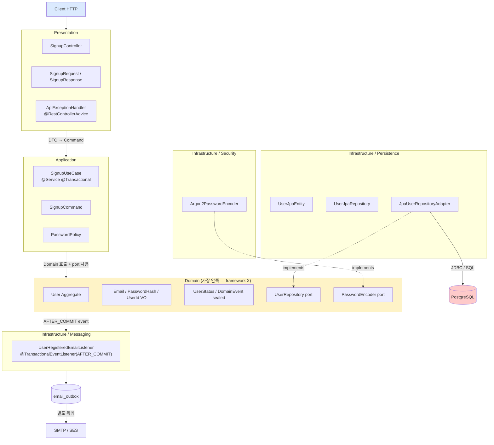

# signup §3 — 아키텍처 / 의존성 흐름

**[[signup|↑ signup hub]]**  ·  ← [[domain-model]]  ·  → [[database]]

---

## 1. 계층 별 책임

| 계층 | 패키지 | 책임 | 의존 |
| --- | --- | --- | --- |
| **Presentation** | `presentation/api/v1/auth/` | HTTP 요청·응답 변환 / Bean Validation / Swagger | Application |
| **Application** | `application/user/` | UseCase / `@Transactional` 경계 / 흐름 제어 | Domain (port), Domain |
| **Domain** | `domain/user/` | 도메인 규칙 / 상태 전이 / 도메인 이벤트 / **port (interface)** | — (framework 모름) |
| **Infrastructure / Persistence** | `infrastructure/persistence/jpa/user/` | JPA Entity / Spring Data Repository / **Adapter** (port 구현) | Domain |
| **Infrastructure / Messaging** | `infrastructure/messaging/` | 도메인 이벤트 listener → outbox / SMTP / Kafka | Domain |
| **Config / Common** | `config/`, `common/` | Spring Security / CORS / 공통 Bean (Clock, IdGenerator) | — |

**핵심 의존 규칙**:
- **Domain 은 어디도 의존하지 않음** (POJO + standard Java + jakarta.validation 만)
- Application 은 Domain 의 interface (port) 만 의존
- Infrastructure 가 Domain port 를 구현 (adapter)
- 의존성 방향: **바깥 → 안쪽** (Hexagonal / Onion)

---

## 2. 의존성 흐름 — 전체



> 💡 **점선 (`-.->`)** = "implements" (의존 방향이 안쪽). 의존성은 **바깥 → 안쪽** 으로만.

---

## 3. 각 계층의 입출력 명확화

### 3.1 Presentation Controller

**입력**: HTTP Request (`SignupRequest` JSON)
**출력**: HTTP Response (`ApiResponse<SignupResponse>` JSON)
**책임**:
- Bean Validation (`@Valid`)
- DTO ↔ Command 변환
- `Authentication` 추출 (signup 은 비인증이지만 일반 endpoint 는 필요)
- 비즈니스 로직 **절대** X

### 3.2 Application UseCase

**입력**: `SignupCommand` (domain language)
**출력**: 도메인 객체 (`User`) 또는 ID
**책임**:
- `@Transactional` 경계
- 흐름 제어 (정책 검증 → 도메인 호출 → 저장 → 이벤트 발행)
- port (Repository / Encoder) 만 사용

### 3.3 Domain

**입력 / 출력**: 도메인 객체 (`User`, `Email`, ...)
**책임**:
- 규칙 / 상태 전이 / 도메인 이벤트
- framework 의존 0 — 표준 Java + jakarta.validation 만 (`@NotBlank` 같은 annotation 도 안 씀)

### 3.4 Infrastructure / Persistence Adapter

**입력**: 도메인 객체 (`User`)
**출력**: JPA Entity 또는 domain 객체 (lookup 시)
**책임**:
- 도메인 ↔ JPA Entity 매핑
- `Spring Data UserJpaRepository` 호출
- DB 예외 → 도메인 예외 변환 (`DataIntegrityViolationException` → `EmailAlreadyExistsException`)

### 3.5 Infrastructure / Messaging Listener

**입력**: Domain Event (`UserRegistered`)
**출력**: outbox row
**책임**:
- 트랜잭션 커밋 후 후속 작업 trigger
- 외부 IO (SMTP) 직접 X — outbox 적재만

---

## 4. 왜 이렇게 분리하는가

### 4.1 도메인 ↔ ORM 분리의 이득

- ORM 변경 (JPA → MyBatis) 시 — Adapter 만 새로 작성. UseCase / Domain 변동 X.
- 도메인 unit test 가 빠름 (DB 없이 in-memory)
- ORM 의 lazy / dirty checking 같은 마법이 도메인에 새지 않음
- 도메인 객체가 `@Entity` 어노테이션 / proxy / managed state 에 종속되지 않음

### 4.2 Domain Event 분리의 이득

- UseCase 가 외부 부수효과 (이메일 / Kafka / 알림) 를 몰라도 됨
- listener 가 늘어나도 UseCase 코드 X
- 트랜잭션 커밋 후 처리로 데이터 일관성 보장 (커밋 안 됐는데 이메일 발송 같은 사고 X)

### 4.3 Presentation ↔ Application 분리의 이득

- HTTP 변경 (REST → gRPC / GraphQL) 시 — Controller 만 새로. UseCase 변동 X.
- UseCase 가 ServletRequest 같은 framework 객체 모름 → 테스트 쉬움.

---

## 5. 패키지 트리 (구현 §6 의 미리보기)

```
com.example.shop
├── domain/
│   ├── common/
│   │   ├── DomainEvent.java           (sealed interface)
│   │   └── IdGenerator.java           (port)
│   └── user/
│       ├── User.java                   (Aggregate Root)
│       ├── Email.java                  (Value Object)
│       ├── PasswordHash.java           (Value Object)
│       ├── UserId.java                 (Value Object)
│       ├── UserStatus.java             (enum)
│       ├── UserRepository.java         (port)
│       ├── PasswordEncoder.java        (port)
│       ├── events/
│       │   ├── UserRegistered.java
│       │   ├── UserEmailVerified.java
│       │   └── UserPasswordChanged.java
│       └── exceptions/
│           └── EmailAlreadyExistsException.java
│
├── application/
│   └── user/
│       ├── SignupUseCase.java          (@Service @Transactional)
│       ├── SignupCommand.java          (record)
│       └── PasswordPolicy.java
│
├── infrastructure/
│   ├── persistence/jpa/user/
│   │   ├── UserJpaEntity.java          (@Entity)
│   │   ├── UserJpaRepository.java      (Spring Data JpaRepository)
│   │   └── JpaUserRepositoryAdapter.java (implements UserRepository)
│   ├── security/
│   │   └── Argon2PasswordEncoder.java   (implements PasswordEncoder)
│   ├── id/
│   │   └── UlidIdGenerator.java         (implements IdGenerator)
│   └── messaging/
│       └── UserRegisteredEmailListener.java
│
├── presentation/
│   └── api/v1/auth/
│       ├── SignupController.java
│       ├── SignupRequest.java          (record + toString 마스킹)
│       └── SignupResponse.java         (record)
│
├── common/
│   ├── model/dto/response/CommonResponse.java
│   ├── model/enums/ResponseCode.java
│   ├── exception/BusinessException.java
│   └── handler/ApiExceptionHandler.java
│
└── config/
    └── SecurityConfig.java
```

→ [[../../common/response-envelope]] · [[../../common/security-config]] 의 표준 패턴 그대로.

---

## 6. 관련

- [[signup|↑ signup hub]]
- [[domain-model]] — 이전 (§2)
- [[database]] — 다음 (§4)
- [[../../common/response-envelope]] — Presentation 의 envelope
- [[../../common/security-config]] — SecurityConfig 의 endpoint 정책
