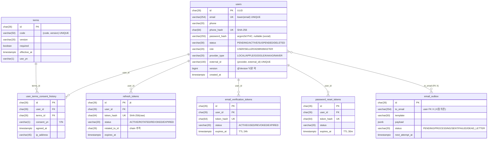
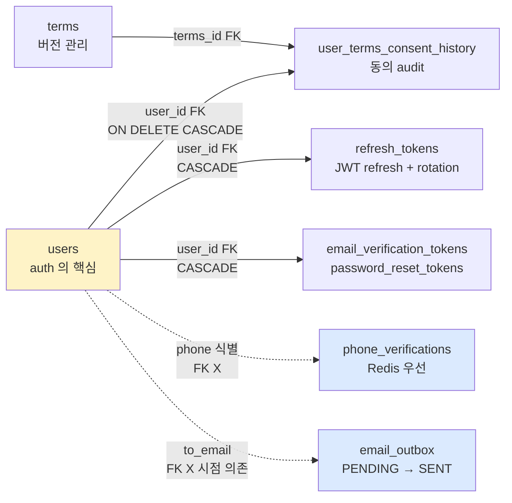

# auth §5 — DB 스키마 (Hub)

**[[../signup|↑ signup hub]]**  ·  ← [[../design-decisions|design-decisions]]  ·  → [[../domain-model/domain-model|domain-model]]

> auth 도메인의 모든 table / 인덱스 / 제약 / 정합성 정책.
> 각 table 이 자기 노트 + 공통 정책 (ID / 마이그레이션 / 암호화).

---

## 1. 이 폴더의 노트

### 1.1 Table 별

| 노트 | Table | 목적 |
| --- | --- | --- |
| [[users-table]] | `users` | 사용자 본체 + soft delete + lower(email) UNIQUE |
| [[terms-tables]] | `terms`, `user_terms_consent_history` | 약관 + 동의 history |
| [[refresh-tokens-table]] | `refresh_tokens` | JWT refresh (rotation chain) |
| [[verification-tokens-table]] | `email_verification_tokens`, `phone_verifications`, `password_reset_tokens` | 3종 공통 패턴 |
| [[email-outbox-table]] | `email_outbox` | outbox 패턴 + worker |

### 1.2 정책 / 횡단

| 노트 | 무엇 |
| --- | --- |
| [[id-strategy]] | ULID 결정 + `CHAR(26)` 통일 |
| [[migrations]] | Flyway 운영 + 마이그레이션 정책 + 롤백 |
| [[encryption-at-rest]] | RDS encryption / column-level 암호화 / hash 인덱스 |

---

## 2. 전체 ERD



### 2.1 관계 요약



> 💡 **FK 있음 (실선)** = ON DELETE CASCADE — user 삭제 시 같이.
> 💡 **FK 없음 (점선)** = phone 은 가입 전 존재 / outbox 는 시점 의존 (email 변경 후에도 옛 발송 OK).

---

## 3. 공통 컨벤션

### 3.1 ID — ULID `CHAR(26)`

모든 PK 가 ULID. 자세히: [[id-strategy]].

### 3.2 시간 — `TIMESTAMPTZ` (UTC)

```sql
created_at TIMESTAMPTZ NOT NULL DEFAULT now()
```

→ PG 가 UTC 저장 + 응답 시 클라 timezone 변환.

### 3.3 enum — `VARCHAR + CHECK`

```sql
status VARCHAR(30) NOT NULL CHECK (status IN ('PENDING_VERIFICATION', 'ACTIVE', ...))
```

→ JPA `@Enumerated(EnumType.STRING)` 와 일치.

### 3.4 soft delete vs hard delete

| Table | 정책 |
| --- | --- |
| `users` | **soft delete** (`status='DELETED'` + email anonymize) |
| `user_terms_consent_history` | hard delete (CASCADE) — GDPR 시 |
| `refresh_tokens` / `*_verification_tokens` | hard delete (7일 후 cleanup) |
| `email_outbox` | hard delete (30일 후 cleanup) |

### 3.5 indexing 원칙

- **PK** — 자동 인덱스
- **UNIQUE (lookup)** — `lower(email)`, `token_hash`
- **Foreign key** — 자동 안 만들어짐 (PG). 명시:
  ```sql
  CREATE INDEX ix_user_terms_consent_user ON user_terms_consent_history (user_id);
  ```
- **Partial index** — DELETED 제외:
  ```sql
  CREATE INDEX ix_users_active ON users (created_at DESC) WHERE status <> 'DELETED';
  ```
- **인덱스 = INSERT 비용** — 무한 추가 X. `pg_stat_user_indexes` 모니터.

자세히: [[../../database/postgresql/security|↗ PG 보안]] · [[../../database/jpa#11.5.1 signup 의 JPA]].

---

## 4. 트랜잭션 / 정합성

### 4.1 한 트랜잭션 안의 INSERT 들

가입 흐름:
```sql
BEGIN;
  INSERT INTO users (...);                          -- 1
  INSERT INTO user_terms_consent_history (...);     -- N (약관 수)
COMMIT;
-- AFTER_COMMIT 후 별도 트랜잭션
  INSERT INTO email_outbox (...);
```

[[../transactions]] 의 트랜잭션 경계 결정.

### 4.2 Race condition 의 진실의 원천

| 시나리오 | 1차 방어 | 진실의 원천 |
| --- | --- | --- |
| email 중복 가입 | `existsByEmail` (application) | `ux_users_email` UNIQUE |
| 같은 refresh 동시 사용 | hash lookup | `ux_refresh_tokens_hash` UNIQUE |
| 토큰 중복 발급 | application 검증 | `ux_*_tokens_hash` UNIQUE |

→ **DB constraint 가 마지막 안전망**.

---

## 5. 검색 패턴 — 어떤 쿼리가 자주

| 쿼리 | 빈도 | 인덱스 |
| --- | --- | --- |
| `users WHERE lower(email) = ?` (로그인) | 매우 잦음 | `ux_users_email` |
| `users WHERE id = ?` | 매 인증 요청 | PK |
| `refresh_tokens WHERE token_hash = ?` | 토큰 갱신 | `ux_refresh_tokens_hash` |
| `email_outbox WHERE status = 'PENDING'` | 워커 polling | `ix_email_outbox_pending` (partial) |
| `users WHERE phone_hash = ?` (휴대폰 login) | 자주 | `ux_users_phone_hash` (옵션) |

자세히: [[users-table#3 조회 패턴]].

---

## 6. 마이그레이션 — Flyway 한 곳에서

```
src/main/resources/db/migration/
├── V1__create_users.sql                    [[users-table]]
├── V2__create_terms_and_consent.sql        [[terms-tables]]
├── V3__create_refresh_tokens.sql           [[refresh-tokens-table]]
├── V4__create_email_verification_tokens.sql [[verification-tokens-table]]
├── V5__create_phone_verifications.sql      [[verification-tokens-table]]
├── V6__create_password_reset_tokens.sql    [[verification-tokens-table]]
├── V7__create_email_outbox.sql             [[email-outbox-table]]
└── V8__add_users_phone_columns.sql         (예 — 후속 migration)
```

자세히: [[migrations]].

---

## 7. 관련

- [[../signup|↑ signup hub]]
- [[../domain-model/domain-model|↗ 도메인 모델]] — DB ↔ 도메인 매핑
- [[../../database/database|↗ database hub]] — JPA / MyBatis / 공존
- [[../../database/postgresql/security|↗ PG 보안]]
- [[../../database/jpa#11.5.1]] — Adapter 적용
