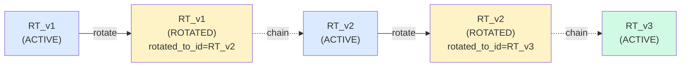

# refresh_tokens 테이블 — rotation chain

**[[database|↑ database hub]]**

> JWT refresh token 영속. rotation chain 추적 + reuse detection 핵심.
> 이 테이블이 잘못 설계되면 **계정 탈취 대응 불가, 사용자 강제 로그아웃 불가, DB 무한 증가** 가 한꺼번에 터진다.

---

## 1. Schema

```sql
-- V3__create_refresh_tokens.sql
CREATE TABLE refresh_tokens (
    id                 CHAR(26) PRIMARY KEY,                  -- jti (ULID)
    user_id            CHAR(26) NOT NULL REFERENCES users(id) ON DELETE CASCADE,
    token_hash         CHAR(64) NOT NULL,                     -- SHA-256(raw) hex
    device_fingerprint VARCHAR(255),                          -- User-Agent (truncated)
    ip_address         VARCHAR(45),                            -- 발급 시 IP
    status             VARCHAR(20) NOT NULL,
    rotated_to_id      CHAR(26),                                -- chain — 다음 RT 의 ID
    issued_at          TIMESTAMPTZ NOT NULL,
    expires_at         TIMESTAMPTZ NOT NULL,
    revoked_at         TIMESTAMPTZ,
    revoked_reason     VARCHAR(100),

    CONSTRAINT chk_refresh_tokens_status
        CHECK (status IN ('ACTIVE', 'ROTATED', 'REVOKED', 'EXPIRED'))
);

CREATE UNIQUE INDEX ux_refresh_tokens_hash ON refresh_tokens (token_hash);
CREATE INDEX ix_refresh_tokens_user_status ON refresh_tokens (user_id, status);
CREATE INDEX ix_refresh_tokens_expires ON refresh_tokens (expires_at);
CREATE INDEX ix_refresh_tokens_rotated_to ON refresh_tokens (rotated_to_id) WHERE rotated_to_id IS NOT NULL;
```

---

## 2. 각 컬럼의 "왜" — 4구조 (왜 필요 / 안 하면 문제 / 대안 / 트레이드오프)

### 2.1 `id CHAR(26)` — jti (JWT ID)

**왜 필요한가**
- 토큰의 unique 식별자. revocation list / audit / rotation chain 의 기준점.
- ULID — 시간순 정렬 가능. "이 user 의 가장 최근 RT" 조회를 ID DESC 만으로 가능.

**안 하면 무슨 문제**
- token_hash 만 PK 로 쓰면 → 토큰이 의미상 변경되면 row 자체 식별 어려움. rotation chain 의 `rotated_to_id` 도 hash 참조 = 64 char × N row.
- 순차 ID (BIGSERIAL) → 가입 순서 / 토큰 발급 빈도 노출 (URL 에 jti 가 들어가는 일은 없지만 audit 로그에서 정보 누출).

**대안과 왜 안 됨**
- UUID v4 — random 이라 시간순 정렬 X. "user 의 최근 RT" 조회에 별도 인덱스 (issued_at) 필요. ULID 가 더 효율.
- jti 를 raw token 자체로 사용 → reuse detection 시 누가 사용 중인지 식별 어려움. **jti 와 token 분리 = 표준 패턴**.

**트레이드오프**
- ULID 의 timestamp 가 노출 → 토큰 발급 시각 추정 가능. 단 issued_at 컬럼이 이미 있어 무의미.

---

### 2.2 `user_id CHAR(26) NOT NULL REFERENCES users(id) ON DELETE CASCADE`

**왜 필요한가**
- 어떤 user 의 RT 인지 — `/me/sessions` (디바이스 목록), `revokeAllForUser` (패스워드 변경 시) 의 기준.
- FK — DB 정합성 (없는 user_id 로 RT 못 만듦).
- CASCADE — user 삭제 시 RT 자동 삭제 → 좀비 RT 방지.

**안 하면 무슨 문제 (FK 없을 시)**
- 없는 user_id 로 RT INSERT 가능 (application bug 시). 그 RT 로 로그인 시도 → JWT 검증 통과 + DB 의 RT 도 있음 → 토큰 갱신 성공. user 가 존재 안 하는데 인증된 상태 = 시스템 invariant 깨짐.

**안 하면 무슨 문제 (CASCADE 없을 시)**
- user 가 hard delete 되면 (`DELETE FROM users WHERE id=?`) RT 가 좀비 row. user_id 참조하는 코드가 NPE 또는 silent ignore.
- 단 본 vault 는 soft delete → CASCADE 가 거의 발동 안 됨. 운영 상 admin 의 hard delete (테스트 / 잘못된 가입 정리) 시 안전망.

**대안과 왜 안 됨**
| 후보 | 왜 안 됨 |
| --- | --- |
| `ON DELETE SET NULL` + user_id nullable | user_id NULL 인 RT 가 의미 X (어떤 user 의 RT 인지 모름) |
| FK 없이 application 검증 | race condition + DB 직접 INSERT 우회 가능 |
| `ON DELETE RESTRICT` | user 삭제 시 RT 정리 먼저 강제 — 명시적이지만 cleanup 코드 추가 |

**트레이드오프**
- CASCADE 발동 시 — RT audit (도난 추적용) 도 같이 삭제. 운영 정책 따라 RESTRICT + 명시 cleanup 이 더 안전한 경우 있음.
- 본 vault: soft delete 기본 → CASCADE 는 안전망. 운영 hard delete 정책 명시 시 RESTRICT 고려.

---

### 2.3 `token_hash CHAR(64) NOT NULL` — SHA-256(raw) hex

**왜 필요한가**
- raw token 의 SHA-256 해시 (32 byte = 64 char hex).
- 토큰 검증: 사용자가 보낸 raw → server 가 SHA-256 → DB 의 token_hash 와 비교.
- DB 자체에 raw 가 없으므로 유출 시에도 토큰 도용 불가.

**안 하면 무슨 문제 (raw 저장 시)**
- DB 백업 유출 / SQL injection / 내부자 조회 → **모든 RT 가 즉시 사용 가능**.
- access token 은 짧으니 (10분) 곧 만료지만 RT 는 14일 — 즉시 모든 user 가 탈취당함.
- 실제 사례: 다수의 SaaS 보안 사고 (Adobe 2013, Yahoo 2014 등 — credential 평문 / 약한 hash 노출).

**왜 SHA-256 (bcrypt/argon2 아님)**
- password 와 다름. RT 는 **고-엔트로피 random** (32+ byte 랜덤 = brute force 시간 우주 나이 초과).
- SHA-256 의 빠른 검증 (μs) → 매 요청마다 검증해도 부담 없음.
- bcrypt/argon2 는 의도적으로 느림 (수십 ms) → 매 API 호출마다 인증 비용 ↑.

**대안과 왜 안 됨**
| 후보 | 왜 안 됨 |
| --- | --- |
| 평문 저장 | 유출 = 즉시 사고 |
| HMAC-SHA256 + secret | secret rotation 시 전체 hash 재계산. SHA-256 으로 충분 (raw 가 random 이라 rainbow table X) |
| argon2 | 매 요청마다 수십 ms — auth 병목 |
| 암호화 (pgcrypto) | decrypt 비용 + key 관리. hash 가 더 단순 + 안전 |

**트레이드오프**
- 64 char fixed → DB 용량 (1000만 RT × 64 byte = 640 MB) 추가. RDS 비용 무시 가능.
- raw 가 한 번 잃어버리면 (네트워크 누출 / 클라이언트 저장 실수) → 그 raw 는 즉시 revoke 필요. application 의 revoke 기능 필수.

---

### 2.4 `device_fingerprint VARCHAR(255)`

**왜 필요한가**
- 사용자에게 `/me/sessions` 화면에서 "iPhone Safari", "Chrome Windows" 등 표시.
- 의심 활동 감지 — 평소 iPhone 만 쓰던 사용자가 갑자기 Linux curl → 알람.
- 강제 logout UI 의 식별자.

**안 하면 무슨 문제**
- 디바이스 식별 X → "다른 기기 로그아웃" UI 불가능 → 패스워드 분실 / 도난 시 사용자가 자기 디바이스 골라 revoke 못함.
- audit 시 "어떤 디바이스에서 발급된 RT 인지" 추적 X.

**왜 User-Agent (별도 device ID 아님)**
- 추가 client 변경 X (User-Agent 는 자동 전송).
- 정확도는 ~70% (같은 디바이스 다른 브라우저 = 다른 fingerprint).
- 더 정확한 식별 (UDID, IMEI) 은 모바일 앱에서만 가능 + 프라이버시 부담.

**대안과 왜 안 됨**
- 명시적 device ID (앱이 발급) → 정확도 ↑ 하지만 웹 / mobile 모두 지원 시 별도 클라이언트 변경. 본 vault: User-Agent 기본 + 미래 강화.
- Fingerprint.js 같은 brower fingerprinting → 프라이버시 / GDPR / 한국 개인정보보호법 부담.

**트레이드오프**
- User-Agent 가 변경 (브라우저 업데이트) 되면 같은 디바이스도 다른 row 생성. 사용자 혼란 가능 — "어? 내 iPhone 이 두 개?"
- 255 char truncate → 일부 모바일 User-Agent (커스텀 WebView) 가 잘림. 운영 영향 미미.

---

### 2.5 `ip_address VARCHAR(45)` — IPv6 max

**왜 필요한가**
- 발급 시 IP — 의심 활동 감지 / audit.
- 45 char = IPv6 표현 max (`xxxx:xxxx:...:xxxx`) + zone identifier (`%eth0`).

**안 하면 무슨 문제**
- 도난 시 "어디서 발급됐는지" 추적 X. 보안 대응 늦어짐.
- audit log 부실 — 분쟁 / 감사 시 입증 자료 부족.

**대안과 왜 안 됨**
- `INET` (PostgreSQL native type) → 더 정확하지만 다른 RDBMS 호환 X. application 도 직접 String 다룸.
- 별도 access_log 테이블 → join 비용. 매 토큰 검증마다 join.

**트레이드오프**
- IP 도 PII (GDPR) — 보유 기간 정책 필요. cleanup 시 IP 만 mask (`mask_ipv4`).
- proxy / CDN 뒤 → X-Forwarded-For 의 첫 IP 만 신뢰. 잘못 파싱 시 모든 사용자가 같은 IP (CDN edge).

---

### 2.6 `status VARCHAR(20) NOT NULL` + CHECK

**왜 4-state (ACTIVE / ROTATED / REVOKED / EXPIRED)**

| state | 의미 | 발생 시점 |
| --- | --- | --- |
| ACTIVE | 사용 가능 | 발급 직후 |
| ROTATED | rotation 으로 폐기 — 다음 RT 가 사용 중 | rotation 시 |
| REVOKED | 명시적 폐기 (logout / 패스워드 변경 / 도난) | 사용자 / admin 작업 |
| EXPIRED | TTL 만료 (수동 표시 또는 cleanup 직전) | TTL 초과 시 |

**왜 BOOLEAN `is_active` 안 됨**
- "이미 rotate 된 토큰을 다시 사용" 케이스 (도난 의심) 와 "logout 으로 명시 revoke" 케이스 를 구분 못 함.
- REVOKED 의 사유 (logout vs 도난 vs 패스워드 변경) → `revoked_reason` 컬럼과 함께 의미.
- 단순 active/inactive 보다 4-state 가 운영 / 감사 시 진단 가능.

**왜 ROTATED 와 EXPIRED 분리**
- ROTATED = 정상 흐름 (rotation 으로 폐기). reuse 시 도난 의심.
- EXPIRED = 자연사. reuse 시도 자체가 unusual 이지만 도난과는 다름.
- audit / 메트릭 분리에 유리.

**대안과 왜 안 됨**
- timestamp 만 (revoked_at NULL = active) → 4-state 의미 분리 X.
- PostgreSQL ENUM type → 값 추가는 가능하지만 변경/제거 어려움. VARCHAR + CHECK 가 운영에 유리.

**트레이드오프**
- 상태 전이 코드 (ACTIVE → ROTATED → ?) 의 invariant 강제는 application 책임. DB CHECK 만으론 부족.

자세히: [[../enums/refresh-token-status]].

---

### 2.7 `rotated_to_id CHAR(26)` — rotation chain

**왜 필요한가**
- rotation chain 추적: 이전 RT 가 어떤 RT 로 갱신됐는지.
- **reuse detection** 의 핵심: ROTATED 상태의 RT 가 다시 들어오면 → 같은 chain 전체 revoke + 사용자에게 도난 경고.
- audit: 한 user 의 RT 발급 흐름 시각화.

**안 하면 무슨 문제 (chain 없을 시)**
- Reuse 감지는 가능하지만 (status=ROTATED 인데 또 들어옴) → **그 RT 가 어떤 다음 RT 와 연결되는지 모름** → 영향 범위 좁히기 어려움.
- 도난 의심 시 → 한 user 의 모든 ACTIVE RT 를 다 revoke (안전하지만 영향 큼).
- chain 있으면 → 도난된 RT 의 후속 chain 만 정확히 revoke 가능.

**왜 reuse detection 이 중요한가 (구체 시나리오)**
```
1. 정상: user 가 RT_v1 → 갱신 → RT_v2 (RT_v1 = ROTATED, rotated_to_id=RT_v2)
2. 도난: 공격자가 가로챈 RT_v1 으로 또 갱신 시도
3. 서버: "이 RT 는 ROTATED 상태인데 또 들어옴 = 누군가 도난" 감지
4. 대응: RT_v1 의 chain (RT_v1, RT_v2, ...) 전체 revoke → 진짜 user 도 강제 로그아웃 + 알람
```

**대안과 왜 안 됨**
- 별도 `rotation_history` 테이블 → join 비용 + 같은 정보 분리. 한 컬럼이 자연.
- chain 추적 안 함 → reuse detection 만 → 영향 분석 / audit 부실.

**트레이드오프**
- chain 이 매우 길어지면 (1년 = 약 26 rotation) → recursive CTE 비용. cleanup 정책으로 옛 chain 정리.
- NULL 다수 (ACTIVE 는 NULL) → partial index 로 효율.

---

### 2.8 `issued_at` / `expires_at` `TIMESTAMPTZ`

**왜 필요한가**
- TTL 강제 — `expires_at < now()` 인 RT 는 거부.
- 사용자 화면 — "이 세션은 X일 후 만료" 표시.
- audit — 토큰 lifecycle 시각화.

**왜 TTL 14일**
- 너무 짧으면 (1일) → 매일 재로그인 → UX 망함.
- 너무 길면 (90일) → 도난 시 피해 기간 ↑.
- 14일 = 산업 표준 균형점 (Google, Twitter 등도 비슷한 수준).

**안 하면 무슨 문제**
- expires_at 없이 영원한 RT → 도난 시 영원히 악용 가능.
- 명시적 TTL 만 (JWT exp claim) → DB 의 RT 가 만료 정보 없음 = cleanup 불가.

**대안과 왜 안 됨**
- JWT 에 TTL 만 박고 DB 에 안 적음 → cleanup 시 만료 row 찾는 비용 (전체 row decode).
- 길이 슬라이딩 (사용 시마다 TTL 갱신) → 활성 user 는 사실상 무한. 단 도난 시도 무한.

**트레이드오프**
- 절대 TTL (issued + 14d) vs 슬라이딩 — 본 vault: rotation 으로 새 RT 발급 시 새 14d TTL → 사실상 슬라이딩과 같은 효과 + 도난 시 명확한 cutoff.

---

### 2.9 `revoked_at` / `revoked_reason VARCHAR(100)`

**왜 필요한가**
- 명시적 revoke 시점 audit.
- reason — 'LOGOUT' / 'PASSWORD_CHANGED' / 'REUSE_DETECTED' / 'ADMIN_FORCE' — 운영 / 감사 / 사용자 알림 정책 분기.

**안 하면 무슨 문제**
- 단순 status=REVOKED 만 → "왜 revoke 됐는지" 모름. CS 응대 / 보안 인시던트 분석 부실.
- "reuse detection 으로 revoke 된 것" vs "정상 logout" 구분 X → 사용자에게 알림 발송 정책 분기 불가.

**대안과 왜 안 됨**
- enum 으로 별도 코드화 (`revoked_reason_code SMALLINT`) → 가독성 ↓. VARCHAR 가 SQL 직접 조회 시 명확.

**트레이드오프**
- VARCHAR 자유 입력 → 일관성 깨질 수 있음. application 상수 (`RevocationReason.LOGOUT.code()`) 로 통제.

---

## 3. Rotation Chain 추적



```sql
-- chain 따라가기
WITH RECURSIVE chain AS (
    SELECT id, rotated_to_id, status, issued_at, 0 AS depth
    FROM refresh_tokens
    WHERE id = ?                              -- 시작 RT

    UNION ALL

    SELECT rt.id, rt.rotated_to_id, rt.status, rt.issued_at, c.depth + 1
    FROM refresh_tokens rt
    JOIN chain c ON rt.id = c.rotated_to_id
)
SELECT * FROM chain;
```

**언제 사용**
- 도난 의심 (reuse detection) 시 영향 범위 파악.
- 사용자 CS 요청 "내 세션 시간순 보여줘".
- 보안 감사 — 한 user 의 토큰 발급 패턴 분석.

---

## 4. 인덱스 — 왜

### `ux_refresh_tokens_hash` UNIQUE
- **매 토큰 검증마다 사용** (`WHERE token_hash = ?`) — 가장 빈도 높음.
- UNIQUE — 같은 hash 두 row 불가 (SHA-256 충돌 = 우주 나이 초과 확률, 실용적 X 검증).
- 안 하면: 매 검증마다 풀스캔 → API 응답 시간 ↑.

### `ix_refresh_tokens_user_status` (user_id, status)
- "user 의 ACTIVE RT 목록" (`/me/sessions`, revokeAllForUser).
- composite — `WHERE user_id = ? AND status = 'ACTIVE'` 의 조합 lookup 최적.
- 안 하면: user_id 만 인덱스 → status filter 가 추가 scan.

### `ix_refresh_tokens_expires` (expires_at)
- cleanup job — `WHERE expires_at < ?`.
- 안 하면: 매일 cleanup 이 풀스캔 → IO ↑ + 정상 트래픽 영향.

### `ix_refresh_tokens_rotated_to` (rotated_to_id) — partial
- chain 추적 / reverse lookup ("이 RT 의 이전 RT 는?").
- partial (`WHERE rotated_to_id IS NOT NULL`) — NULL 다수 (ACTIVE) 제외.
- 안 하면: chain 분석이 풀스캔.

---

## 5. 조회 패턴

| 패턴 | SQL | 빈도 | 응답 시간 목표 |
| --- | --- | --- | --- |
| 토큰 검증 (rotate / logout) | `WHERE token_hash = ?` | 매 갱신 (분당 1000+) | p99 < 5ms |
| user 의 active RT (디바이스 list) | `WHERE user_id = ? AND status = 'ACTIVE'` | `/me/sessions` 호출 | p99 < 20ms |
| 전체 revoke (패스워드 변경 / 보안 사고) | `UPDATE ... SET status='REVOKED' WHERE user_id = ? AND status='ACTIVE'` | 드뭄 | p99 < 100ms |
| Cleanup | `DELETE WHERE expires_at < ?` | 매일 batch | (batch — 운영 영향 X) |

---

## 6. Cleanup 정책

```sql
-- 매일 새벽 — 만료 7일 지난 row 삭제
DELETE FROM refresh_tokens
WHERE expires_at < now() - INTERVAL '7 days';

-- Audit 보존 — ROTATED chain 은 30일까지
DELETE FROM refresh_tokens
WHERE expires_at < now() - INTERVAL '30 days'
  AND status IN ('ROTATED', 'REVOKED', 'EXPIRED');
```

**왜 7일 grace period**
- 만료 직후 즉시 삭제 → 사용자 CS 요청 ("내가 어제 로그아웃 안 했는데 왜 로그아웃됐어?") 분석 자료 없음.
- 7일 = 분석 가능한 최소 보존 + 디스크 부담 최소화.

**왜 ROTATED/REVOKED 는 30일**
- reuse detection / 도난 분석 시 더 길게 보존 필요.
- 30일 = 보통 보안 인시던트 대응 기간 충분.

**왜 ShedLock**
- 다중 인스턴스 환경 — 같은 cleanup job 이 동시 실행 시 deadlock / IO 폭증.
- ShedLock 으로 단일 실행 보장.

```java
@Scheduled(cron = "0 0 4 * * *")
@SchedulerLock(name = "refreshTokenCleanup", lockAtMostFor = "PT1H")
public void cleanup() {
    int deleted = tokens.deleteOldExpired(Instant.now().minus(Duration.ofDays(7)));
    log.info("refresh token cleanup: {} deleted", deleted);
}
```

**안 하면 무슨 문제 (cleanup 자체 X)**
- 월 100만 RT 발급 = 1년 1200만 row. 인덱스 크기 폭증 → 모든 RT 조회 느려짐.
- 디스크 용량 / 백업 / restore 시간 ↑.

---

## 7. JPA Entity

```java
@Entity
@Table(name = "refresh_tokens")
public class RefreshTokenJpaEntity {
    @Id @Column(length = 26) private String id;
    @Column(name = "user_id", nullable = false, length = 26) private String userId;
    @Column(name = "token_hash", nullable = false, length = 64) private String tokenHash;
    @Column(name = "device_fingerprint", length = 255) private String deviceFingerprint;
    @Column(name = "ip_address", length = 45) private String ipAddress;

    @Enumerated(EnumType.STRING)
    @Column(nullable = false, length = 20) private RefreshTokenStatus status;

    @Column(name = "rotated_to_id", length = 26) private String rotatedToId;
    @Column(name = "issued_at", nullable = false) private Instant issuedAt;
    @Column(name = "expires_at", nullable = false) private Instant expiresAt;
    @Column(name = "revoked_at") private Instant revokedAt;
    @Column(name = "revoked_reason", length = 100) private String revokedReason;
}
```

> 💡 user 와 `@ManyToOne` 안 만든 이유 — JPA association 은 N+1 위험 + Aggregate 경계 위반. user_id 만 String 으로 저장, 필요 시 Repository 별도 호출. [[../domain-model/aggregate-boundaries#4]].

---

## 8. 비교 — RDB vs Redis

| | RDB (이 노트) | Redis |
| --- | --- | --- |
| latency | ms | μs |
| 영속 | ✅ ACID | AOF / RDB 의존 (data loss 가능) |
| Audit / chain | ✅ 풍부 (SQL 자유) | ⚠️ key-value 의 제약 |
| Rotation chain 추적 | ✅ (recursive CTE) | ⚠️ (별도 list / SET 으로 시뮬레이션) |
| 비용 | 무료 (이미 있는 DB) | Redis 인프라 추가 |
| 동시 다중 디바이스 | ✅ row N 개 | ✅ SET / HASH |
| 운영 / 백업 | DB 와 함께 | 별도 백업 / failover 정책 |

**언제 Redis 가 맞는가**
- 분당 100만+ 토큰 검증 (DB 부담) — 대형 SaaS.
- 짧은 TTL (5분 이하) — DB cleanup 부담 ↑.
- 다중 region — Redis cluster 가 글로벌 동기화 ↑.

**본 vault: RDB 기본**
- 중소 규모 — DB 한 번이면 충분.
- audit / chain / reuse detection 모두 SQL 로 자연스럽게.
- Redis 의 운영 비용 (failover / persistence 정책) 회피.

자세히: [[../design-decisions#9 refresh 저장소]].

---

## 9. 함정 모음 — "이걸 안 하면 X 가 터짐"

### 함정 1 — `token` 평문 저장
DB 백업 유출 / 내부자 조회 → **모든 user 가 즉시 탈취**. RT 는 14일 유효 = 14일간 피해.
→ SHA-256 hash 만 저장. raw 는 발급 직후 1회 응답 후 server 에 안 남김.

### 함정 2 — `rotated_to_id` 없이 ROTATED 만
reuse detection 시 "이 도난 RT 가 어떤 chain 의 일부인지" 추적 X → 영향 범위 못 좁히고 user 의 모든 RT revoke (UX 망함).
→ rotated_to_id 컬럼으로 chain 추적.

### 함정 3 — `status` CHECK 제약 없음
admin 스크립트 / 직접 SQL 로 `'INACTIVE'` 같은 invalid 값 INSERT → application 의 enum 매핑 실패 → 500 또는 silent ignore.
→ DB CHECK 필수.

### 함정 4 — `expires_at` 인덱스 없음
매일 cleanup job 이 풀스캔 → IO 폭증 + 정상 트래픽 영향. 1000만 row 시 cleanup 만 수 분.
→ `ix_refresh_tokens_expires` 필수.

### 함정 5 — `ON DELETE CASCADE` 없이 좀비 RT
user hard delete 후 RT 남음 → application 코드가 `findByUserId` 시 NPE 또는 silent ignore.
→ CASCADE 또는 RESTRICT (cleanup 명시).

### 함정 6 — Cleanup 자체 없음
1년 후 1000만+ row → 인덱스 비대 → 모든 RT 조회 느려짐 → API 전체 응답 지연.
→ @Scheduled + ShedLock 으로 daily cleanup.

### 함정 7 — `device_fingerprint` 너무 짧게 잡음
일부 모바일 WebView User-Agent 가 300+ char → truncate / reject.
→ VARCHAR(255) + application 단 truncate 명시.

### 함정 8 — Reuse detection 로직 없음
도난 시 공격자가 ROTATED 토큰 재사용 시도 → 서버가 "ROTATED 상태이므로 거부" 만 하고 끝 → user 도 모르고 공격자도 다른 토큰 사용 중일 수 있음.
→ ROTATED reuse 감지 시 → chain 전체 revoke + user 알람.

### 함정 9 — IP / device 미기록
도난 시 "어디서 발급됐는지" 모름. 사용자가 "내 RT 가 어떤 디바이스에서?" 묻는데 답 X.
→ ip_address + device_fingerprint 필수.

### 함정 10 — `revoked_reason` 없이 "왜 revoke 됐는지" 모름
CS 응대 / 보안 인시던트 분석 시 부실. "이 토큰이 logout 인지 도난 의심인지" 구분 X.
→ revoked_reason 컬럼 + application 상수.

### 함정 11 — TTL 너무 길게 (90일+)
도난 시 피해 기간 ↑. 14일 + rotation 으로 사실상 슬라이딩.

### 함정 12 — JWT exp claim 만 의존 (DB 에 expires_at 없음)
cleanup 시 만료 row 찾으려면 전체 JWT decode → 수만 row × decode 비용. DB 컬럼이 필수.

---

## 10. 관련

- [[database|↑ database hub]]
- [[../enums/refresh-token-status]] — 4-state 의 자세한 전이 / 규칙
- [[../login-impl#6 RefreshTokenService]] — application 코드
- [[../token-refresh-impl]] — rotation + reuse detection 흐름
- [[../security]] — 도난 대응 정책
