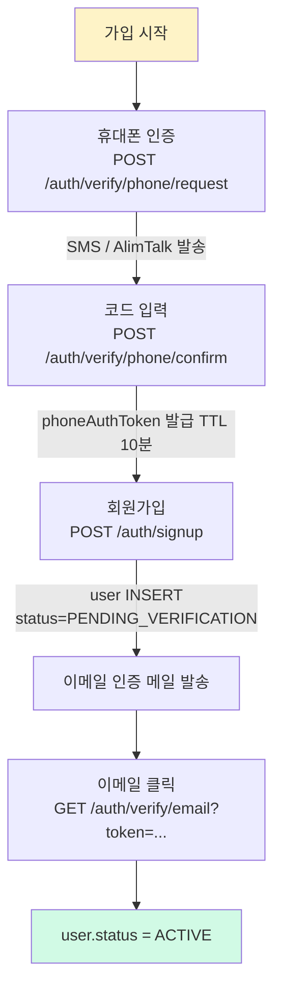

# 가입 인증 채널 — 이메일 / 휴대폰 / 둘 다

**[[design-decisions|↑ design-decisions hub]]**

> "가입 시 어떤 채널로 본인을 확인하나" — 이메일만, 휴대폰만, 둘 다. 잘못 선택하면 **UX friction 폭증 또는 어뷰즈 폭증**.

---

## 1. 본 vault 결정

**한국 B2C SaaS = 이메일 ID + 휴대폰 인증 표준**

- 이메일: 로그인 ID + 알림 발송 채널
- 휴대폰: 본인 인증 (가입 1회) + 알림 발송 보조
- 일부 도메인 (금융 / 의료): 추가로 PASS/NICE 본인인증

---

## 2. 옵션 비교 — 4구조

### 2.1 이메일만

**왜 이게 적합한 케이스**
- B2B SaaS (Notion, Slack, GitHub) — 업무용, 데스크탑 중심.
- 글로벌 — SMS / 휴대폰 인증의 국가별 인프라 차이.

**왜 안 되는 케이스 (한국 B2C)**
- 한국 모바일 시장 = 휴대폰 인증이 사실상 표준 UX.
- 이메일만 사용하면 "본인이 맞나" 의문 — 가입 인증 통과해도 진짜 사람인지 불분명.
- 어뷰즈: 이메일은 100만 개 무료 생성 가능 (10minutemail 등 임시 메일) → spam 가입 폭주.

**안 하면 무슨 문제**
- 같은 사람의 다중 계정 / 봇 가입 차단 어려움.
- 한국 사용자의 "휴대폰 인증 안 받으면 의심스러움" UX 기대 위반.

**트레이드오프**
- 휴대폰 인증 비용 (SMS 건당 9~30원) — 가입자 100만 명 = 1000~3000만원.
- 사용자 friction — 인증 단계 추가.

---

### 2.2 휴대폰만 (이메일 없이)

**왜 이게 적합한 케이스**
- 본 휴대폰 본인 인증으로 강한 식별 (당근마켓, 토스 일부 흐름).
- 이메일 사용 빈도 낮은 사용자 (장년층 / 모바일 중심).

**왜 안 되는 케이스 (B2C 일반)**
- 마케팅 / 알림 발송 채널 부재 — SMS 만 발송 (비용 ↑).
- 비밀번호 재설정 / 보안 알림 채널이 SMS 만 → SMS 못 받는 상황 (해외 / 단말 분실) 시 복구 불가.
- 이메일 ID 없이 사용자 검색 (CS 응대) 어려움.

**안 하면 무슨 문제**
- 사용자가 휴대폰 분실 / 번호 변경 시 계정 복구 흐름 X → 영구 계정 잠금.
- 마케팅 메일 발송 불가 → SMS / 알림톡 비용 부담.

**트레이드오프**
- 휴대폰 변경 시 마이그레이션 흐름 필요 (옛 휴대폰 인증 + 새 휴대폰 인증).

---

### 2.3 둘 다 (이메일 ID + 휴대폰 인증) — 본 vault

**왜 이게 표준**
- 한국 SaaS 의 사실상 표준 (네이버 / 카카오 / 쿠팡 / 무신사 등).
- 이메일 ID = 로그인 + 알림.
- 휴대폰 인증 = 본인 확인 (가입 시 1회).
- 봇 / 다중 계정 가입 차단.

**구체적 흐름**
```
1. 사용자가 이메일 + 비밀번호 + 휴대폰 입력
2. 휴대폰으로 6-digit SMS 코드 발송
3. 사용자 입력 → 검증
4. user row INSERT (status=PENDING_VERIFICATION, phoneVerifiedAt=now)
5. 이메일 인증 메일 발송 (별도)
6. 클릭 → status=ACTIVE
```

**왜 휴대폰 먼저 (이메일 먼저 아님)**
- 휴대폰 인증은 동기 (1분 안에 완료) — 가입 흐름 끊김 X.
- 이메일 인증은 비동기 (메일 받고 클릭) — 시간 걸림.
- 휴대폰 통과 후 가입 완료 → 이메일은 사후 확인 흐름.

**트레이드오프**
- 두 채널 모두 비용 (이메일 + SMS).
- 사용자 입력 부담 (휴대폰 번호 추가).
- 휴대폰 없는 user (외국인 / 학생 등) 제외 가능.

---

### 2.4 둘 다 (사용자 선택 ID)

**왜 이게 적합한 케이스**
- 유연성 우선 — 사용자가 이메일 또는 휴대폰 중 선택해서 로그인.
- 일부 SaaS (인스타그램, 트위터) 가 이 방식.

**왜 안 되는 케이스**
- application 코드 복잡도 ↑ — 양쪽 모두 UNIQUE / 검색 / 변경 흐름.
- "이메일로 가입한 사용자가 휴대폰만 알 때" 복구 어려움.

**트레이드오프**
- 유연성 vs 복잡도.
- 본 vault 의 default: 이메일 = ID, 휴대폰 = 인증 보조. 단일성 우선.

---

## 3. 휴대폰 인증의 세부 종류

### 3.1 SMS 인증번호 (6-digit)

**왜 사용**
- 가장 저렴 (NCP SENS 9원, AlimTalk 7원).
- 모든 휴대폰 지원 (피쳐폰 / 스마트폰).
- 사용자 친숙 (수만 SaaS 가 이 방식).

**한계**
- brute force 위협 (100만 경우) — 5회 lock + 3분 TTL 으로 완화.
- SMS 가로채기 (SIM swap, malware) — 본인인증보다 약함.

**언제 적합**
- 일반 가입 — 본 vault 의 default.

---

### 3.2 AlimTalk (카카오 알림톡)

**왜 사용**
- SMS 보다 저렴 (10원 vs 30원).
- 카카오 사용자 (한국 95%) 도달.
- 신뢰감 ↑ (카카오 브랜드).

**한계**
- 사전 등록된 템플릿만 발송 가능 (카카오 검수 1주).
- 카카오톡 미사용자에겐 fallback SMS 필요.

**언제 적합**
- 본 vault 의 default — SMS 와 조합 (AlimTalk 시도 → 실패 시 SMS).

---

### 3.3 본인인증 (PASS / NICE / KCB)

**왜 사용**
- 통신사 보유 정보 기반 = 실명 / 생년월일 / 휴대폰 명의자 검증.
- 강한 식별 (SMS 보다 신뢰도 ↑).

**한계**
- 비싸다 (~150-250원 / 건).
- 사용자 흐름 길다 (별도 페이지 redirect / app intent).
- 외국인 한정 (한국 통신사 가입자만).

**언제 적합**
- 금융 (계좌 개설 / 송금) — 법적 요구.
- 의료 (처방 / 보험) — 본인 확인 필수.
- 청소년 보호 (게임 / 성인 사이트).
- 일반 SaaS 는 over-engineering — SMS 충분.

---

### 3.4 ARS (자동음성)

**왜 사용**
- 시각장애인 / 노약자 — SMS 입력 어려운 사용자.
- accessibility compliance.

**한계**
- 비싸다 (~200원+).
- 사용자 거의 사용 X (대부분 SMS 선호).

**언제 적합**
- accessibility 의무 (공공 서비스 / 금융).

---

## 4. 다른 컨텍스트의 결정

### 4.1 B2B SaaS

```yaml
auth-channels:
  primary: email-only
  reason: 업무용 / SSO 통합 / SMS 비용 절감
```

→ 이메일만 + SSO (SAML / OIDC) 우선.

### 4.2 글로벌 (한국 X)

```yaml
auth-channels:
  primary: email-only
  optional: phone (Twilio)
  reason: 국가별 SMS 인프라 차이
```

→ AlimTalk / PASS 무관. Twilio / Plivo.

### 4.3 금융

```yaml
auth-channels:
  primary: phone-with-pass
  email: optional
  reason: 본인 확인 법적 요구
```

→ PASS / NICE 필수 + enumeration 차단.

### 4.4 어린이 / 학생 대상

```yaml
auth-channels:
  primary: email + 법정대리인 동의
  reason: 한국 정보통신망법 §31 (만 14세 미만)
```

→ 휴대폰 없는 미성년 + 법정대리인 휴대폰 인증.

---

## 5. 구현 흐름 — 본 vault 의 default



자세히: [[../phone-verification-impl]] · [[../email-verification-impl]] · [[../signup-impl]].

---

## 6. 함정 모음

### 함정 1 — 이메일만 사용 (한국 B2C)
임시 메일 / 봇 가입 폭주.
→ 휴대폰 인증 추가.

### 함정 2 — 휴대폰만 사용 (이메일 없음)
복구 흐름 X. 마케팅 채널 없음.
→ 이메일도 받음.

### 함정 3 — 휴대폰 인증 안 하고 가입 완료
어뷰즈 폭증.
→ phoneAuthToken 으로 인증 통과 강제.

### 함정 4 — phoneAuthToken 의 TTL 너무 김 (1시간+)
도난 시 영구 가입 가능.
→ 10분 + 단일 사용.

### 함정 5 — phoneAuthToken 재사용 가능
같은 토큰으로 여러 가입.
→ 사용 시 status=USED 전이.

### 함정 6 — PASS / NICE 를 일반 SaaS 에 강제
비용 ↑ + 사용자 friction.
→ 금융 / 의료만.

### 함정 7 — 한국 외 사용자 (외국인) 차단
글로벌 확장 어려움.
→ "외국인은 휴대폰 X 가입 옵션" 별도 흐름.

### 함정 8 — 휴대폰 번호 변경 흐름 없음
번호 변경 시 계정 영구 잠금.
→ /me/phone-change 흐름 (옛 인증 + 새 인증).

---

## 7. 관련

- [[design-decisions|↑ hub]]
- [[sms-provider]] — SMS / AlimTalk / PASS 비교
- [[email-provider]] — 이메일 발송 도구
- [[../phone-verification-impl]] · [[../email-verification-impl]]
- [[../database/users-table#2.3 phone]] — phone 컬럼 정책
