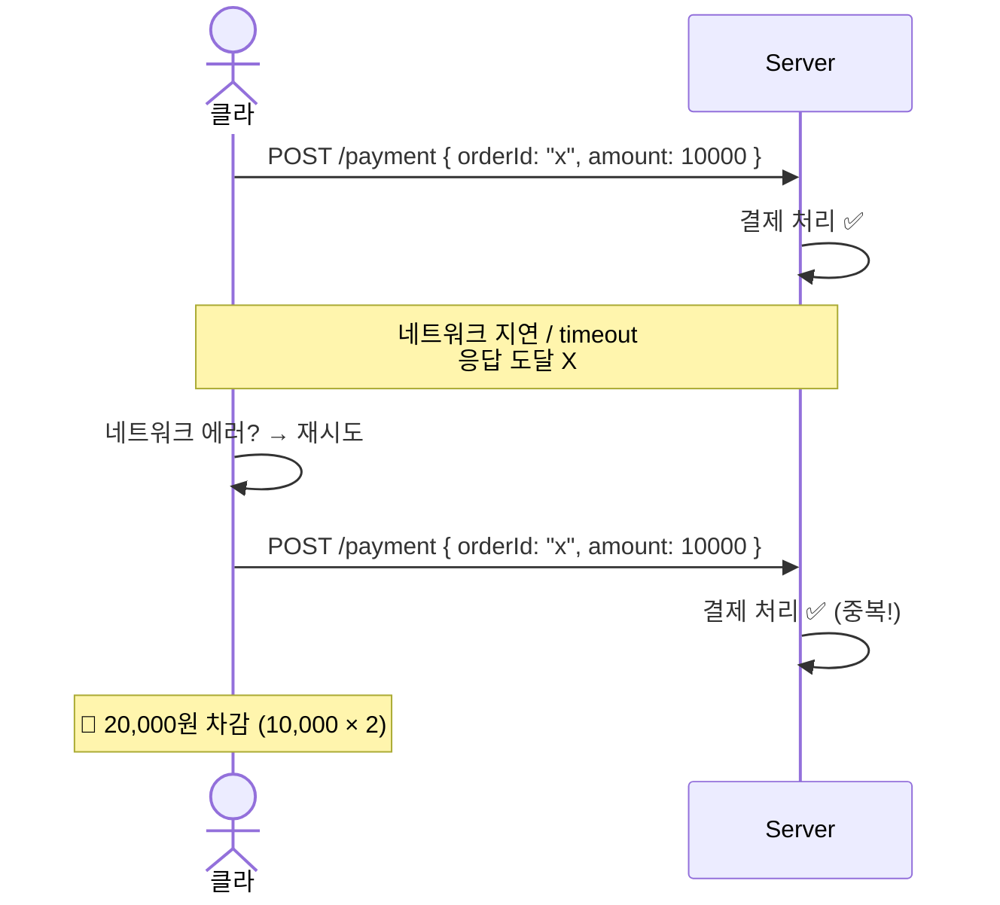
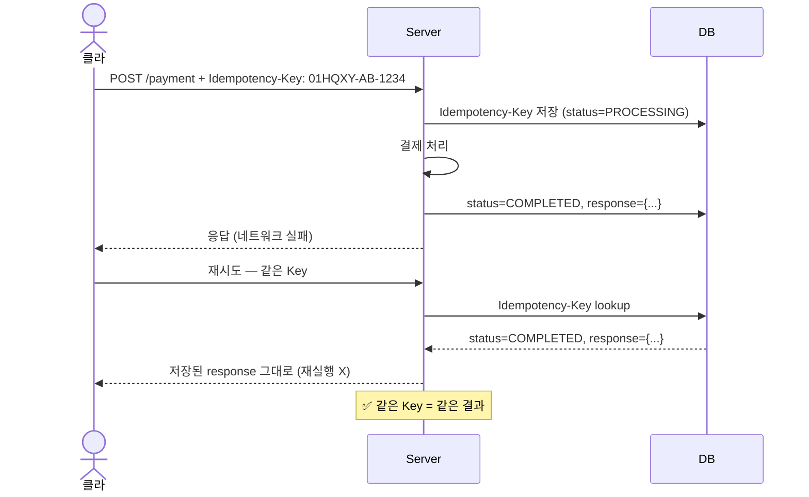
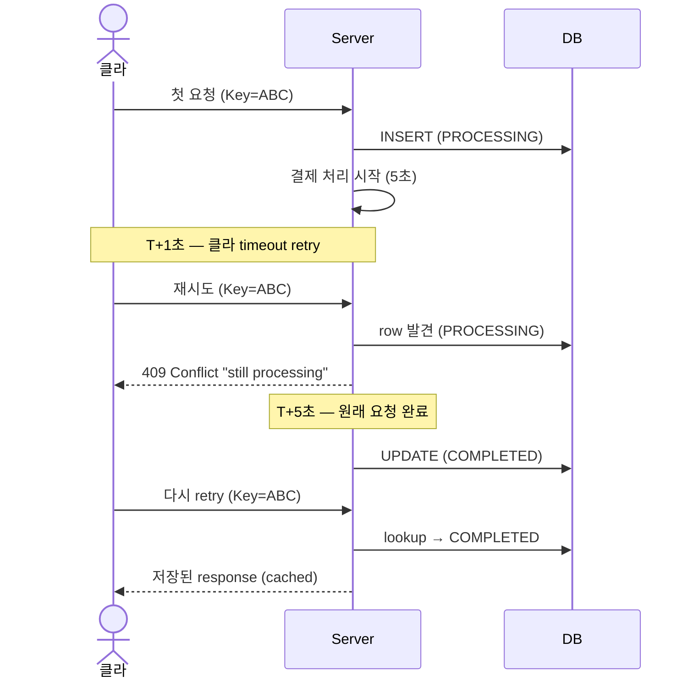

# Idempotency-Key 정책

**[[design-decisions|↑ design-decisions hub]]**

> "네트워크 retry / 중복 클릭 시 같은 작업이 N번 실행 안 되도록" — 결제 / 가입 / 송금 등에 필수.

---

## 1. 본 vault 결정

| Endpoint 종류 | 정책 |
| --- | --- |
| 일반 조회 (`GET`) | 자동 idempotent — 불필요 |
| 일반 mutating (`POST /signup`, `PATCH /me`) | Optional (헤더 보내면 처리) |
| **결제 / 주문 / 인출** | **Required** (헤더 없으면 reject) |
| **외부 호출 (PG, SMS)** | 자체 idempotent 또는 outbox + dedupe |

---

## 2. 왜 필요한가

### 2.1 시나리오 (문제)



### 2.2 Idempotency-Key 의 해결



→ 같은 Key 의 요청은 같은 결과. 중복 처리 X.

---

## 3. 정책 결정 — 4구조

### 3.1 Required (결제 / 주문 / 인출)

**왜 적합**
- 비용 큰 작업 — 중복 실행 시 financial impact.
- 외부 시스템 (PG / 은행) 연동 — 중복 호출 비용.

**왜 사용자에게 부담 안 됨**
- SDK / 라이브러리가 자동 생성 (예: Stripe SDK).
- B2B / 결제 API 표준.

**구현**
```java
@PostMapping("/payment")
public PaymentResponse pay(
    @RequestHeader(name = "Idempotency-Key", required = true) String key,
    @RequestBody PaymentRequest req
) {
    // Idempotency-Key 없으면 400
}
```

---

### 3.2 Optional (본 vault default)

**왜 적합**
- UX 부담 ↓ (클라가 안 보내도 동작).
- 클라가 의지 있으면 헤더 보냄 → 안전.

**왜 안 됨 (결제)**
- 클라가 빼먹으면 → 보호 X.

**구현**
```java
@PostMapping("/signup")
public SignupResponse signup(
    @RequestHeader(name = "Idempotency-Key", required = false) String key,
    @Valid @RequestBody SignupRequest req
) {
    if (key != null) {
        var cached = idempotencyService.get(key);
        if (cached != null) return cached;
    }
    var response = userService.signup(req);
    if (key != null) idempotencyService.save(key, response);
    return response;
}
```

---

### 3.3 None (조회)

**왜 적합**
- GET 은 자연스럽게 idempotent (같은 요청 = 같은 결과).
- 헤더 필요 X.

---

## 4. 구현 — DB 기반

### 4.1 Schema

```sql
CREATE TABLE idempotency_keys (
    key             VARCHAR(100) PRIMARY KEY,
    user_id         CHAR(26),                       -- 보안 (다른 user 의 key 사용 차단)
    endpoint        VARCHAR(200) NOT NULL,
    request_hash    CHAR(64) NOT NULL,              -- SHA-256(body)
    status          VARCHAR(20) NOT NULL,           -- PROCESSING / COMPLETED / FAILED
    response_body   TEXT,                            -- COMPLETED 시 저장된 응답
    response_status SMALLINT,                        -- HTTP status
    created_at      TIMESTAMPTZ NOT NULL DEFAULT now(),
    completed_at    TIMESTAMPTZ,

    CONSTRAINT chk_idempotency_status
        CHECK (status IN ('PROCESSING', 'COMPLETED', 'FAILED'))
);

CREATE INDEX ix_idempotency_created ON idempotency_keys (created_at);
```

### 4.2 처리 흐름

```java
@Service
@Transactional
public class IdempotencyService {
    public Optional<Response> get(String key, String endpoint, String requestHash, UserId userId) {
        var row = repo.findByKey(key);
        if (row.isEmpty()) return Optional.empty();

        var r = row.get();
        // 1. 다른 user 의 key 사용 차단
        if (!r.userId().equals(userId)) throw new ForbiddenException();

        // 2. 다른 endpoint 의 key 사용 차단
        if (!r.endpoint().equals(endpoint)) throw new ConflictException("key reused for different endpoint");

        // 3. body 변경 감지 — 같은 key 인데 body 다르면 conflict
        if (!r.requestHash().equals(requestHash))
            throw new ConflictException("key used with different request body");

        // 4. status 별
        return switch (r.status()) {
            case COMPLETED -> Optional.of(Response.fromCache(r.responseBody(), r.responseStatus()));
            case PROCESSING -> throw new ConflictException("request still processing");
            case FAILED -> Optional.empty();    // retry 가능
        };
    }

    public void save(String key, String endpoint, String requestHash, UserId userId,
                     Response response) {
        repo.save(new IdempotencyKey(key, userId, endpoint, requestHash,
            IdempotencyStatus.COMPLETED, response.body(), response.status(),
            Instant.now(), Instant.now()));
    }
}
```

### 4.3 Cleanup

```sql
-- 24시간 지난 row 삭제
DELETE FROM idempotency_keys WHERE created_at < now() - INTERVAL '24 hours';
```

**왜 24시간**
- retry 는 보통 분 단위 — 24시간이면 충분.
- 너무 길면 → 인덱스 비대.
- 너무 짧으면 → 오랜 retry 못 받음.

---

## 5. Key 형식

```
Idempotency-Key: 01HQ-AB-1234-...
```

- 30+ char random.
- ULID / UUID 권장 (충돌 확률 무시).
- 사용자가 생성 (클라 책임).

**왜 클라가 생성 (서버 생성 X)**
- 서버 생성 시 → 응답 후 클라가 받아야 retry 가능. 응답 안 받으면 retry 불가.
- 클라가 미리 생성 후 요청 → 응답 못 받아도 같은 key 로 retry.

---

## 6. body 변경 감지

```
첫 요청: { orderId: "x", amount: 10000 } + Key=ABC
재시도:  { orderId: "x", amount: 99999 } + Key=ABC   ← body 다름
```

→ 의도적 / 실수로 다른 body. 같은 key 로 다른 결과 = 무결성 깨짐.

**대응**
- request_hash 저장 + 검증.
- 다른 body 면 409 Conflict.

---

## 7. PROCESSING — 동시 retry



**왜 PROCESSING 시 409**
- 동시 처리 = 중복 처리 risk.
- 클라가 잠시 기다린 후 retry.

---

## 8. 함정 모음

### 함정 1 — Idempotency-Key 없이 결제 / 인출
중복 결제 사고.
→ Required + 검증.

### 함정 2 — Key 만 검증 (body 변경 감지 X)
다른 body 에도 같은 응답 → 무결성 깨짐.
→ request_hash 검증.

### 함정 3 — 다른 user 의 Key 사용
A 의 Key 를 B 가 사용 → A 의 응답을 B 가 받음 (정보 유출).
→ user_id 검증.

### 함정 4 — PROCESSING 분기 없음
동시 retry 가 둘 다 처리 → 중복.
→ PROCESSING 시 409.

### 함정 5 — TTL 없음
DB 무한 증가.
→ 24시간 cleanup.

### 함정 6 — Server 가 Key 생성
응답 못 받으면 retry 불가.
→ 클라가 미리 생성.

### 함정 7 — Key 길이 짧음 (5-10 char)
random 공간 작음 → 충돌 가능.
→ 30+ char ULID/UUID.

### 함정 8 — Optional 인데 클라가 안 보냄 (결제)
중복 결제 위험.
→ 결제는 Required.

### 함정 9 — Failure 응답 캐싱
실패 응답 cache → 다음 retry 도 실패 (성공해야 하는데).
→ FAILED status 는 재시도 허용.

### 함정 10 — Key 만 hash 없이 검증
같은 key 의 다른 endpoint 사용 → 잘못된 cache.
→ endpoint 도 검증.

### 함정 11 — Idempotency 가 트랜잭션 안에
트랜잭션 rollback 시 idempotency row 도 사라짐 → 다음 retry 가 다시 처리.
→ 별도 트랜잭션 (외부 commit 패턴) 또는 PROCESSING 으로 표시.

### 함정 12 — 응답이 큰 binary / file
DB row 폭증.
→ response 만 캐싱 (큰 file 은 별도 storage).

---

## 9. 다른 컨텍스트

### 9.1 결제 / 금융

```yaml
idempotency: required
ttl: 7d
on-conflict: 409 + 명확 에러
```

### 9.2 일반 SaaS

```yaml
idempotency: optional
ttl: 24h
endpoints-with-required: [payment, order, withdrawal]
```

### 9.3 외부 API (Stripe / Toss)

```yaml
idempotency: required (provider 의 Idempotency-Key)
key-source: client-generated
sdk: 자동 처리
```

---

## 10. 관련

- [[design-decisions|↑ hub]]
- [[../signup-impl]] — Optional Idempotency-Key
- [[../../payment-pg]] — 결제 Required
- [[../../order-stock]] — 주문 Required
- 외부 — Stripe Idempotency Docs, RFC 9457 (Idempotency-Key 표준)
