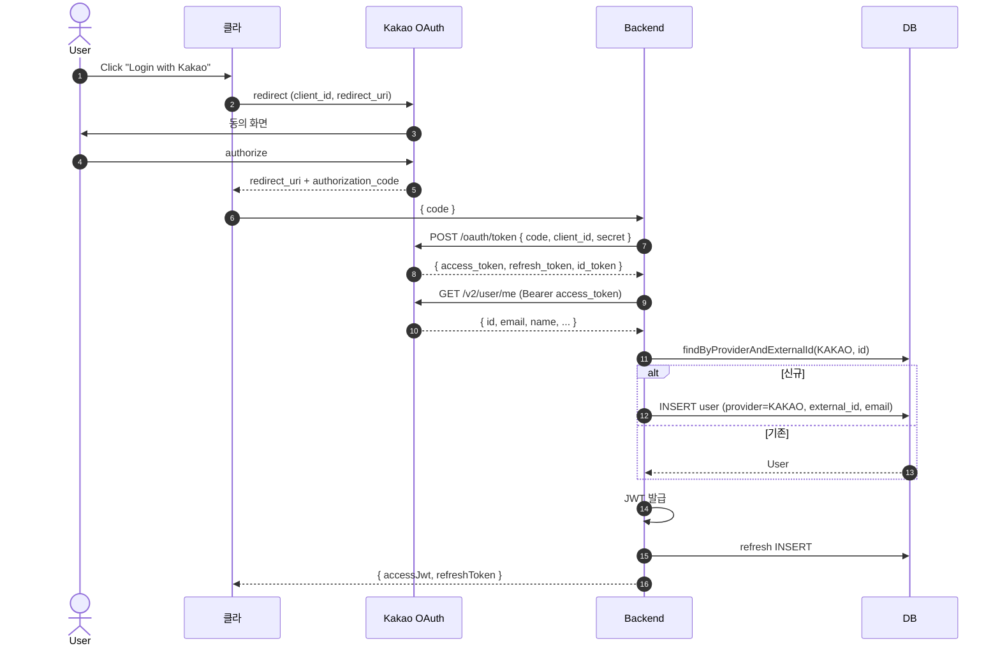

# 소셜 로그인 — Kakao / Naver / Google / Apple

**[[design-decisions|↑ design-decisions hub]]**

> "어떤 소셜 로그인을 지원하나" + "어떻게 검증하나" — 한국 SaaS 의 사실상 필수.

---

## 1. 본 vault 결정

- **한국 B2C SaaS**: Kakao + Naver + Google + Apple (4개).
- **iOS 앱이면 Apple 필수** (App Store 정책).
- **B2B / 글로벌**: Google + Microsoft + Apple.

---

## 2. 각 Provider 의 "왜" — 4구조

### 2.1 Kakao

**왜 1순위 (한국)**
- 한국 사용자 95% 가 카카오톡 계정 — 가장 익숙한 IdP.
- 구현 쉬움 — `/v2/user/me` + access_token 한 번 호출.
- 한국어 docs / 한국 시간대 / 한국 통신.

**언제 안 됨**
- B2B / 글로벌 — Kakao 인지도 ↓.

**대안 (B2B)**
- Google Workspace 가 더 자연.

**트레이드오프**
- 한국 → 압도적 우선.

---

### 2.2 Naver

**왜 같이 사용**
- 한국 30대+ / 직장인 점유율 ↑.
- 네이버 메일 / 카페 / 블로그 통합 사용자.
- Kakao 와 함께 = 한국 사용자 99% 커버.

**언제 안 됨**
- 글로벌 — 인지도 0.

---

### 2.3 Google

**왜 같이 사용**
- Gmail 사용자 (한국 60%+) 도 흔함.
- 글로벌 확장 시 자연.
- OIDC 표준 — JWT id_token 검증 명확.

**언제 1순위**
- 글로벌 / B2B SaaS.

---

### 2.4 Apple (Sign in with Apple)

**왜 필수 (iOS 앱)**
- App Store 정책 — Google / Kakao 로그인이 있으면 Apple 로그인 강제 (2020 정책).
- 미준수 시 앱 reject.

**왜 어려움**
- 첫 로그인만 email 제공 (이후엔 sub 만).
- JWT JWKS 검증 (RS256).
- private email relay (`@privaterelay.appleid.com`) 처리.
- token revocation webhook 필요 (Apple 의 정책).

**언제 안 됨**
- 웹 only — Apple 강제 X.

---

## 3. 비교 표

| Provider | 한국 점유 | 구현 난이도 | 토큰 검증 | 필수 (App Store) |
| --- | --- | --- | --- | --- |
| **Kakao** | 매우 높음 (3,500만+) | 쉬움 | `/v2/user/me` + access_token | ❌ |
| **Naver** | 높음 (3,000만+) | 쉬움 | `/v1/nid/me` + access_token | ❌ |
| **Google** | 중간 (1,500만+) | 쉬움 | `tokeninfo` + id_token (OIDC) | ❌ |
| **Apple** | iOS user 만 | **어려움** | id_token JWT + JWKS | ✅ (iOS) |

---

## 4. OAuth2 / OIDC 흐름



---

## 5. Apple 특수 처리

### 5.1 첫 로그인만 email

```json
// 첫 로그인 응답
{
  "sub": "001234.abcd5678",
  "email": "user@example.com",
  "email_verified": true
}

// 두 번째부터
{
  "sub": "001234.abcd5678"
  // email 없음!
}
```

**왜**
- Apple 의 프라이버시 정책 — email 노출 최소화.

**대응**
- 첫 로그인 시 email 받으면 DB 에 저장.
- 두 번째부터 sub 로 식별 (email 무관).

### 5.2 Private Email Relay

```
사용자가 "Hide My Email" 선택 시:
email = "abc123@privaterelay.appleid.com"
```

**왜**
- Apple 이 random email 생성 → Apple 이 forwarding.
- 사용자가 언제든 차단 가능.

**대응**
- 그대로 저장 OK. Apple 이 알아서 forwarding.
- 마케팅 메일 발송 시 bounce 가능 — webhook 처리.

### 5.3 JWT 검증 (RS256 + JWKS)

```java
// 1. Apple JWKS endpoint 에서 public key fetch (cache)
GET https://appleid.apple.com/auth/keys
→ { keys: [...] }

// 2. id_token 의 kid 매칭 → public key
String kid = header.get("kid");
PublicKey publicKey = jwks.findByKid(kid);

// 3. 검증
Jws<Claims> claims = Jwts.parser()
    .verifyWith(publicKey)
    .requireIssuer("https://appleid.apple.com")
    .requireAudience(appleClientId)
    .build()
    .parseSignedClaims(idToken);
```

**왜 JWKS**
- Apple 이 public key 회전.
- JWKS endpoint 에 항상 최신 key.

**왜 cache**
- 매 로그인마다 JWKS fetch → Apple endpoint 부담.
- cache 24h.

### 5.4 Token Revocation Webhook

```
Apple → webhook → 서버
  POST /webhook/apple
  { events: [{ type: "consent-revoked", sub: "..." }] }
   ↓
[서버]
  users.findByAppleSub(sub).markRevoked()
  refresh_tokens.revokeAllForUser(...)
```

**왜 필요**
- Apple 정책 — 사용자가 Apple ID 에서 앱 권한 취소 시 webhook 발송.
- 미준수 시 App Store reject.

자세히: [[../oauth2-social-login#6 Apple]].

---

## 6. DB 매핑

```sql
-- users 테이블의 소셜 컬럼 (이미 [[../database/users-table]] 에서 정의)
provider_type VARCHAR(20)        -- LOCAL / KAKAO / NAVER / GOOGLE / APPLE
external_id   VARCHAR(100)       -- Kakao id, Apple sub, ...
apple_sub     VARCHAR(100)       -- Apple 만 별도 (revocation webhook 용)

-- UNIQUE: 한 provider 의 같은 사용자 = 하나의 user
CREATE UNIQUE INDEX ux_users_provider_external
    ON users (provider_type, external_id)
    WHERE external_id IS NOT NULL;
```

---

## 7. 이메일 통합 정책

**시나리오**: 사용자가 `alice@gmail.com` 으로 LOCAL 가입 → 나중에 Google 로그인 시도 → 같은 이메일.

| 정책 | 처리 | trade-off |
| --- | --- | --- |
| **자동 link** (본 vault 기본) | 이메일 검증된 LOCAL 이면 Google account 와 link | UX 좋음 / 보안 약함 |
| **분리 user** | Google = 새 user 생성 | 안전 / UX 헷갈림 |
| **reject** | "이미 가입된 이메일" 메시지 | 명확 / UX 거침 |

**본 vault**
- LOCAL 가입 + email_verified_at 있음 → Google 로그인 시 link.
- LOCAL 가입 + 미인증 → reject ("이메일 인증 후 다시").

자세히: [[../oauth2-social-login#5 통합]].

---

## 8. 라이브러리

```kotlin
// Spring OAuth2 client
implementation("org.springframework.boot:spring-boot-starter-oauth2-client")

// JWT 검증 (Apple JWKS)
implementation("com.nimbusds:nimbus-jose-jwt:9.40")

// Kakao / Naver — 자체 WebClient 사용 (OAuth2 client 도 OK)
implementation("org.springframework.boot:spring-boot-starter-webflux")
```

**왜 Spring OAuth2 client**
- 표준 OAuth2 / OIDC 흐름 자동 처리.
- 단 Kakao / Naver 는 비표준 (custom provider) — 수동 설정.

**왜 nimbus-jose-jwt (jjwt 외 추가)**
- Apple JWKS endpoint fetch / RSA key parsing 등 jjwt 보다 강력.
- jjwt 도 가능하지만 nimbus 가 더 명시적.

---

## 9. 함정 모음

### 함정 1 — Apple Sign in 누락 (iOS)
App Store reject.
→ Kakao / Google 있으면 Apple 필수.

### 함정 2 — Apple 첫 로그인의 email 안 저장
두 번째부터 email 없음 → user 식별 어려움.
→ 첫 응답 email DB 저장.

### 함정 3 — Apple JWT 서명 검증 skip
JWT 위조 가능.
→ JWKS fetch + signature 검증.

### 함정 4 — JWKS endpoint 매 호출
Apple 부담 + rate limit.
→ cache 24h.

### 함정 5 — Apple revocation webhook 안 받음
App Store 정책 위반.
→ POST /webhook/apple endpoint.

### 함정 6 — external_id UNIQUE 누락
한 Apple 계정 → 여러 user row.
→ partial UNIQUE.

### 함정 7 — 이메일 기반 자동 link 미인증 user
이메일 검증 안 된 LOCAL user 에 Google link → 계정 탈취 가능.
→ email_verified_at 있을 때만 link.

### 함정 8 — provider 의 access_token 평문 저장
긴 TTL 이면 도난 시 oauth API 무한 호출.
→ access_token 안 저장 (검증 후 즉시 폐기).

### 함정 9 — Kakao / Naver 의 user info 매 호출
provider rate limit.
→ 가입 시 한 번만 + DB 캐시.

### 함정 10 — redirect_uri 검증 skip
악의적 redirect → 토큰 도난.
→ provider 의 등록된 redirect_uri 정확히 일치.

### 함정 11 — state parameter 없음 (CSRF)
authorization code 도난 시 다른 사용자 가입.
→ state = random + session 매핑.

### 함정 12 — provider 응답의 email_verified 신뢰
provider 가 verified=false 라도 자동 link → 도용 가능.
→ verified=true 만 link.

---

## 10. 다른 컨텍스트

### 10.1 B2B SaaS

```yaml
social-login:
  providers: [google-workspace, microsoft, apple, sso-saml]
  reason: 기업 계정 통합
```

### 10.2 글로벌

```yaml
social-login:
  providers: [google, facebook, apple, github (developer)]
  reason: 시장 점유
```

### 10.3 게임 (청소년)

```yaml
social-login:
  providers: [kakao, naver, apple]
  additional: pass-identity-verification (실명)
```

---

## 11. 관련

- [[design-decisions|↑ hub]]
- [[token-model]] — JWT 발급
- [[../oauth2-social-login]] — 자세한 구현
- [[../database/users-table#2.8]] — provider_type / external_id
- 외부 — Kakao OAuth Docs, Apple Sign In Docs, OIDC spec
