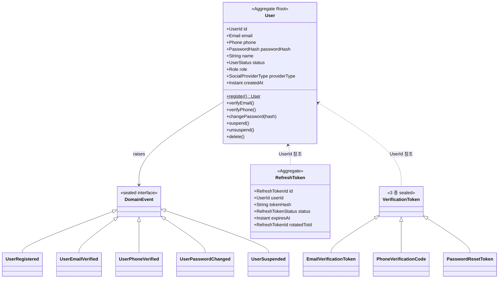
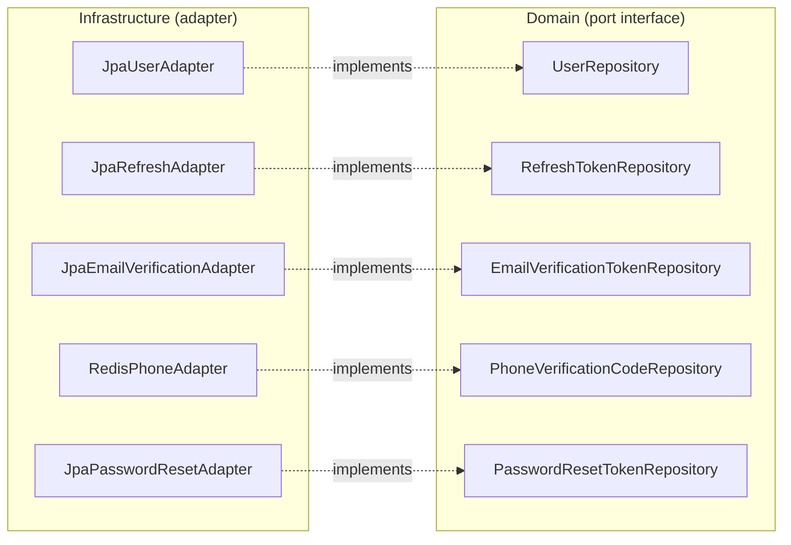
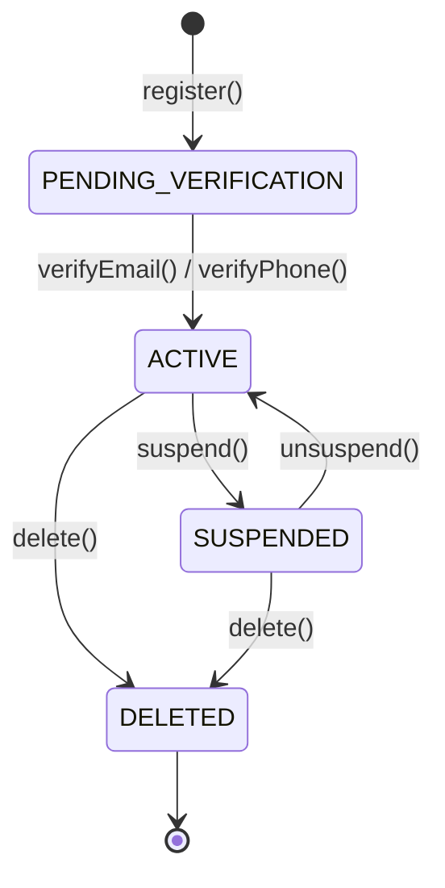
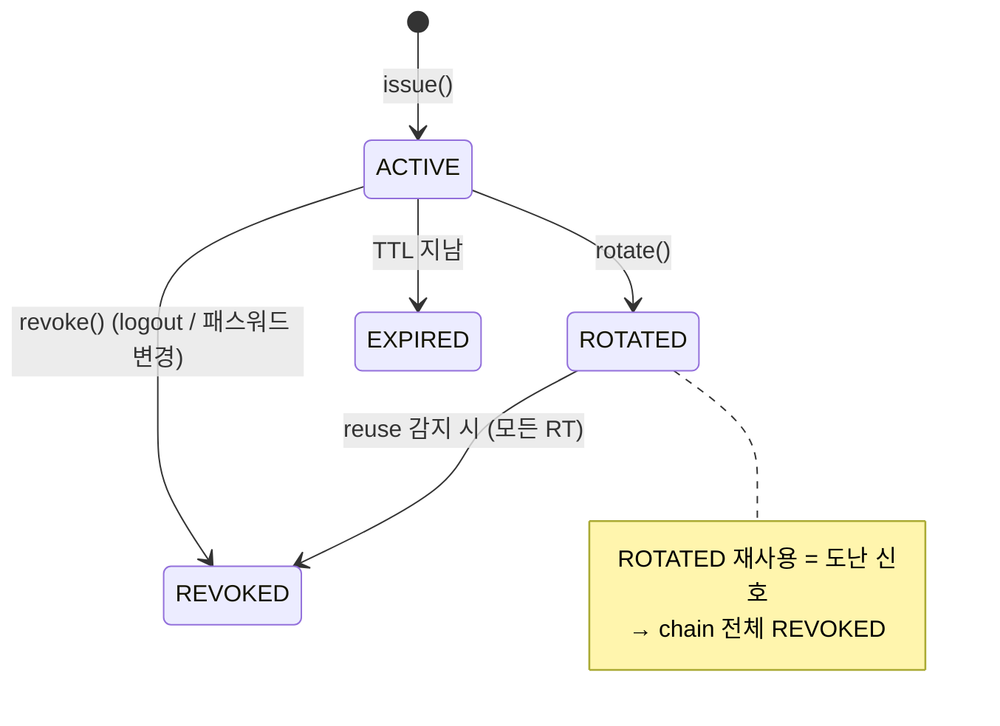
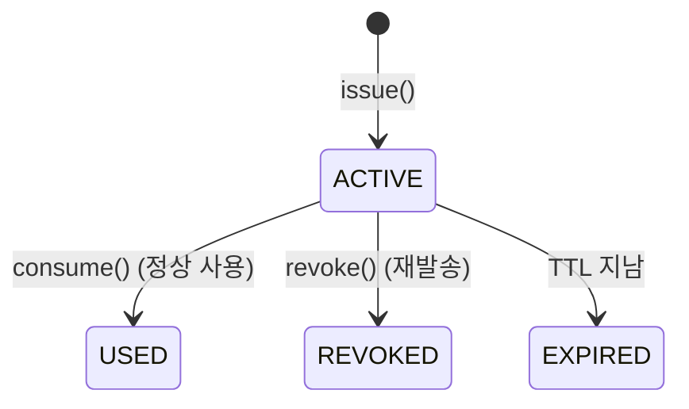

# auth §6 — 도메인 모델 (Hub)

**[[../signup|↑ signup hub]]**  ·  ← [[../database/database|database]]  ·  → [[../architecture|architecture]]

> auth 도메인의 객체·규칙 모음.
> Aggregate / Value Object / Domain Event / Repository port — 각자 자기 노트로 분리.

---

## 1. 이 폴더의 노트

| 노트 | 무엇 |
| --- | --- |
| [[user-aggregate]] | User Aggregate Root — 메서드 / transition / 책임 |
| [[value-objects]] | Value Object 패턴 — 왜 record / compact constructor / 4종 VO 소개 |
| [[email-vo]] | `Email` — RFC 5322 / 정규화 위치 |
| [[password-hash-vo]] | `PasswordHash` — argon2 PHC 형식 검증 |
| [[user-id-vo]] | `UserId` — ULID 선택 이유 |
| [[phone-number-vo]] | `PhoneNumber` — 한국 휴대폰 / 정규화 / E.164 |
| [[domain-events]] | 5 events + listener + AFTER_COMMIT |
| [[repository-ports]] | UserRepository / RefreshTokenRepository / VerificationTokenRepository ports |
| [[domain-rules]] | 9 불변식 + 각 규칙의 책임 위치 |
| [[aggregate-boundaries]] | Aggregate 경계 결정 — 왜 User 가 약관 동의를 안 가지나 |

→ enums (UserStatus / RefreshTokenStatus / ...) 는 [[../enums/enums|enums/]] 별도 폴더.

---

## 2. 도메인 그림 (high-level)



### 2.1 Repository Ports (domain interface)



---

## 3. 상태 머신 (high-level)

### 3.1 User



### 3.2 RefreshToken



### 3.3 VerificationToken (3종 공통)



각 상태 / 전이 상세: [[../enums/user-status]] · [[../enums/refresh-token-status]] · [[../enums/verification-token-status]].

각 상태 / 전이 상세: [[../enums/user-status]] · [[../enums/refresh-token-status]] · [[../enums/verification-token-status]].

---

## 4. 의존 관계

```mermaid
flowchart TD
    AR["Aggregate Root<br/>User / RefreshToken / VerificationToken"]
    VO["Value Objects<br/>Email / PasswordHash / UserId / PhoneNumber"]
    DE["Domain Events<br/>UserRegistered / UserEmailVerified / ..."]
    L["Listener<br/>이메일 outbox / Kafka / 푸시 알림"]
    Port["Repository (port)"]
    Adapter["Adapter (JPA / MyBatis)<br/>— 도메인이 모르는 곳"]

    AR -->|사용| VO
    AR -->|raises| DE
    DE -->|구독 application/infra| L
    Port <-.implements.- Adapter

    style AR fill:#fef3c7
    style VO fill:#fef3c7
    style DE fill:#fef3c7
    style Port fill:#fef3c7
    style Adapter fill:#dbeafe
```

**도메인 layer 는**:
- `jakarta.validation`, `java.time`, `java.util` 만 import
- Spring / JPA / MyBatis 의존 0
- HTTP / DB / 외부 API 모름
- 단위 테스트가 ms 단위

---

## 5. 코드 컨벤션 (이 폴더 전체)

- **record** 우선 (Value Object / Event)
- **final class + 메서드** (Aggregate)
- **compact constructor** 에서 검증
- **public 생성자 X** → static factory (`User.register(...)`)
- **setter X** → 의미 있는 메서드 (`verifyEmail()` 같은)
- **`pullDomainEvents()`** — 이벤트는 한 번만 가져감 (idempotent X — caller 책임)
- **`reconstitute()`** — Adapter 의 JPA → 도메인 매핑 전용 static

자세한 예 — [[user-aggregate]].

---

## 6. 관련

- [[../signup|↑ signup hub]]
- [[../enums/enums|↗ enums/]] — 모든 enum
- [[../architecture]] — 계층 / Port-Adapter 흐름
- [[../database/database|↗ database/]] — DB schema (참조)
