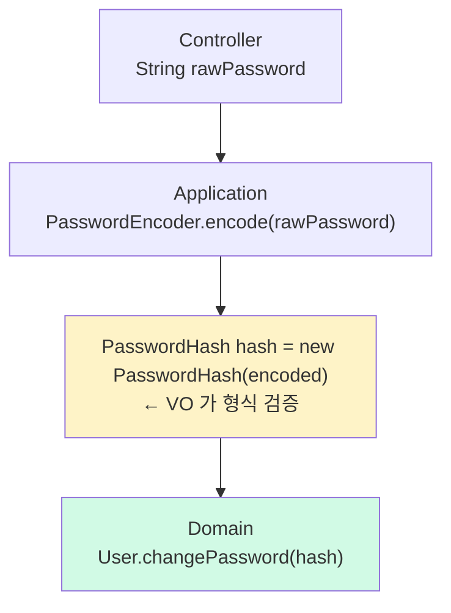

# PasswordHash VO — argon2 PHC 형식 검증

**[[domain-model|↑ domain-model hub]]**  ·  ← [[value-objects]]

> 평문 password 를 도메인에 들어오지 못하게 차단하는 **타입 안전성** 의 핵심.

---

## 1. 코드

```java
// src/main/java/com/example/shop/domain/user/PasswordHash.java
public record PasswordHash(@JsonValue String value) {

    public PasswordHash {
        if (value == null)
            throw new IllegalArgumentException("password hash required");
        if (!value.startsWith("$argon2"))
            throw new IllegalArgumentException("not an argon2 PHC hash: " + value.substring(0, Math.min(value.length(), 10)));
    }
}
```

---

## 2. 왜 이 VO 가 중요한가

### 2.1 평문 vs 해시의 책임 분리

```java
// ❌ 위험 — 평문이 도메인에 들어옴
public final class User {
    private String password;                                  // 평문?
    public void changePassword(String newPassword) {          // 평문 인자?
        ...
    }
}

// ✅ 안전 — 평문은 도메인 안에 절대 못 들어옴
public final class User {
    private PasswordHash passwordHash;                        // 항상 hash
    public void changePassword(PasswordHash newHash) {        // hash 인자만
        ...
    }
}
```

> 💡 **컴파일 타임에 강제** — User 의 어떤 메서드도 `String password` 받지 않음.
> 평문 password 는 **Controller / Application 의 method 파라미터 (raw String) 로만 잠깐 존재했다 사라짐**.

### 2.2 PasswordEncoder 가 게이트



평문 → hash 변환은 **Application layer 의 PasswordEncoder** 에서만. 도메인은 hash 만.

---

## 3. 왜 `$argon2` prefix 만 검증

### 3.1 argon2 PHC 형식 (Password Hashing Competition)

```
$argon2id$v=19$m=65536,t=3,p=4$qLKHe2v9...$abc123...
[ 변종  ][버전][   파라미터   ][  salt ][  hash ]
```

| 부분 | 의미 |
| --- | --- |
| `$argon2id` | 변종 — argon2i / argon2d / argon2id (hybrid) |
| `$v=19` | 버전 |
| `$m=65536,t=3,p=4` | 파라미터 — memory KB, iterations, parallelism |
| `$qLKHe2v9...` | salt (base64) |
| `$abc123...` | hash (base64) |

```java
if (!value.startsWith("$argon2"))
    throw ...;
```

→ 시작 부분 만 검증. 변종 (`$argon2i`, `$argon2d`, `$argon2id`) 와 버전 차이 흡수.

### 3.2 더 엄격한 검증 — 옵션

```java
private static final Pattern PHC = Pattern.compile(
    "^\\$argon2(i|d|id)\\$v=\\d+\\$m=\\d+,t=\\d+,p=\\d+\\$[A-Za-z0-9+/=]+\\$[A-Za-z0-9+/=]+$"
);

public PasswordHash {
    if (!PHC.matcher(value).matches())
        throw new IllegalArgumentException("invalid argon2 PHC format");
}
```

장점: 더 안전
단점: argon2 라이브러리가 약간 다른 형식 (encoding) 만들면 falsely 거절

본 vault: **`startsWith("$argon2")`** — 단순 + 99% 케이스 커버.

### 3.3 bcrypt 도 받을지

옵션:

```java
public PasswordHash {
    if (!value.startsWith("$argon2") && !value.startsWith("$2a$") && !value.startsWith("$2b$"))
        throw new IllegalArgumentException("unsupported password hash format");
}
```

→ 운영 중 알고리즘 마이그레이션 (bcrypt → argon2) 시 도움. 본 vault 는 argon2 만 (단순).

---

## 4. 응답에 절대 노출 X

```java
public record SignupResponse(
    String userId,
    String email,
    String status,
    Instant createdAt
) {
    // ❌ password / passwordHash 필드 절대 없음
}
```

```java
// SignupRequest 의 toString 도 마스킹
public record SignupRequest(String email, String password, ...) {
    @Override public String toString() {
        return "SignupRequest[email=%s, password=***, ...]"
            .formatted(email);
    }
}
```

> 💡 **`@JsonValue` + `@JsonProperty` 신중**
> PasswordHash 의 `@JsonValue` 가 있으면 — 의도치 않게 응답에 hash 노출. 단, **응답 DTO 에 PasswordHash 를 안 넣으면** 무관.
> 본 vault: 응답 DTO 에 password 관련 필드 일체 없음. `@JsonValue` 는 도메인 객체 직렬화 시 (예: 캐시) 만 사용.

---

## 5. PasswordEncoder Port (참고)

```java
// domain/user/PasswordEncoder.java
public interface PasswordEncoder {
    String encode(String plain);            // 평문 → hash
    boolean matches(String plain, String hash);
    default boolean needsRehash(String hash) { return false; }
}
```

```java
// infrastructure/security/Argon2PasswordEncoder.java (구현)
@Component
public class Argon2PasswordEncoder implements PasswordEncoder {
    private final Argon2Function hasher = Argon2Function.getInstance(65536, 3, 4, 32, Argon2.ID);

    @Override
    public String encode(String plain) {
        validate(plain);
        return Password.hash(plain).addRandomSalt(16).with(hasher).getResult();
    }
    @Override
    public boolean matches(String plain, String hash) {
        return Password.check(plain, hash)
                       .with(Argon2Function.getInstanceFromHash(hash));
    }
}
```

→ Application service 의 사용 흐름:

```java
public void signup(SignupCommand cmd) {
    var rawPassword = cmd.rawPassword();
    var encoded = passwordEncoder.encode(rawPassword);
    var hash = new PasswordHash(encoded);                     // VO 가 형식 검증
    var user = User.register(..., hash, ...);
    // rawPassword 는 여기 메서드 끝나면 GC
}
```

자세히: [[../design-decisions#3 패스워드 해시 알고리즘]] · [[../security#4 알고리즘 선정]].

---

## 6. 키 마이그레이션 — argon2 파라미터 강화

OWASP 권장이 m=64MB → m=128MB 로 강화되면:

```java
public boolean needsRehash(String hash) {
    var current = Argon2Function.getInstanceFromHash(hash);
    return current.getMemory() != 65536          // 새 기준이면 mismatch
        || current.getIterations() != 3
        || current.getParallelism() != 4;
}

// 로그인 성공 시 자동 rehash
public void login(...) {
    var user = users.findByEmail(...);
    if (encoder.matches(rawPassword, user.passwordHash().value())) {
        if (encoder.needsRehash(user.passwordHash().value())) {
            user.changePassword(new PasswordHash(encoder.encode(rawPassword)));
            users.save(user);
        }
        // 로그인 성공
    }
}
```

→ 사용자가 로그인할 때마다 옛 hash 가 새 파라미터로 업그레이드. 점진적 마이그레이션.

---

## 7. 함정 모음

### 함정 1 — PasswordHash 가 평문 받음
```java
public PasswordHash {
    if (value == null || value.isBlank()) ...   // 평문이 통과 가능 (😱)
}
```
**반드시 hash 형식 검증** (`$argon2` prefix).

### 함정 2 — toString 의 hash 노출
record 의 기본 `toString()` 이 hash 값 출력. 로그에 hash 노출 = 부분 정보. **`@Override toString` 마스킹** 또는 record 의 default 그대로 + 로그 신중.

> 💡 hash 는 평문보다 안전하지만 — brute force 시도 가능. PII 로 취급.

### 함정 3 — 응답 DTO 에 PasswordHash 포함
실수로 응답에 노출. **DTO 명시적 작성** (필요 필드만).

### 함정 4 — 평문 vs hash 혼동
`String passwordOrHash` 같은 모호한 변수명. **명확히 분리**.

### 함정 5 — Bean Validation `@Pattern` 으로 검증 시도
Bean Validation 은 DTO 단. 도메인 VO 가 hash 형식 검증.

### 함정 6 — `bcrypt` 와 `argon2` 같이
운영 중 마이그레이션 정책 명확 — `needsRehash` 활용 또는 한 알고리즘만.

### 함정 7 — 해시 후 평문 변수 그대로
```java
var rawPassword = cmd.rawPassword();
var hash = encoder.encode(rawPassword);
// rawPassword 가 GC 전까지 메모리 잔존
log.info("user signed up: {}", rawPassword);    // ❌ 절대 X
```
→ 평문은 method 안에서만 사용 + 명시적 노출 X.

### 함정 8 — argon2 라이브러리 버전 차이
password4j 1.7 vs 1.8 의 PHC 형식 미세 차이. **버전 fix + IT 회귀**.

---

## 8. 관련

- [[domain-model|↑ domain-model hub]]
- [[value-objects]]
- [[../design-decisions#3 패스워드 해시 알고리즘]]
- [[../security#4 알고리즘 선정]]
- [[user-aggregate#5 changePassword]]
- [[../../pitfalls/null-safety]] — 평문 password 의 toString 함정
