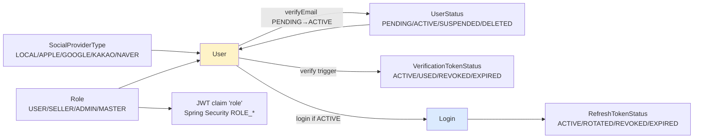

# auth — 도메인 Enums (각 enum 의 자기 노트)

**[[../signup|↑ signup hub]]**  ·  관련: [[../domain-model]]

> 각 enum 은 단순한 값 모음이 아니라 **도메인의 의사결정**.
> "왜 5개 상태가 아니라 4개인지", "왜 이 이름인지", "어떤 대안이 있었는지" 를 각자 자기 노트에 정리.

---

## 1. 이 폴더의 enum 목록

| Enum | 노트 | 책임 |
| --- | --- | --- |
| **UserStatus** | [[user-status]] | user 의 lifecycle 상태 (PENDING_VERIFICATION → ACTIVE → SUSPENDED → DELETED) |
| **VerificationTokenStatus** | [[verification-token-status]] | 이메일·휴대폰·패스워드 리셋 토큰 공통 (ACTIVE / USED / REVOKED / EXPIRED) |
| **RefreshTokenStatus** | [[refresh-token-status]] | refresh token (ACTIVE / ROTATED / REVOKED / EXPIRED) — ROTATED 가 특별 |
| **SocialProviderType** | [[social-provider-type]] | 로그인 / 가입 채널 (LOCAL / APPLE / GOOGLE / KAKAO / NAVER) |
| **Role** | [[role]] | 권한 등급 (USER / SELLER / ADMIN / MASTER) |

→ [[../../common/response-envelope]] 의 `ResponseCode` 는 cross-cutting 이라 별도.

---

## 2. enum 설계 원칙 (이 vault 전반)

### 2.1 enum 의 책임

| ✅ enum 이 가질 책임 | ❌ enum 이 가지면 안 되는 책임 |
| --- | --- |
| 상태 / 카테고리 / 종류 표현 | 상태 전이 로직 (Aggregate 가 가짐) |
| 권한 / 가능 여부 query (`canX()`) | DB / 외부 호출 |
| 직렬화 / 표시 라벨 (`label()`) | 비즈니스 규칙 (도메인 layer 가) |

```java
// ✅ OK — query 메서드
public enum UserStatus {
    PENDING_VERIFICATION, ACTIVE, SUSPENDED, DELETED;

    public boolean canLogin() { return this == ACTIVE; }
    public boolean isFinal() { return this == DELETED; }
}

// ❌ NG — 상태 전이 로직 (Aggregate 에 있어야)
public enum UserStatus {
    PENDING_VERIFICATION {
        public UserStatus verify() { return ACTIVE; }    // ❌
    }, ...
}
```

→ Aggregate (`User.verifyEmail()`) 이 transition 책임.

### 2.2 enum 명명 규칙

- **단수형** (`UserStatus`, not `UserStatuses`)
- **값은 UPPER_SNAKE_CASE** (Java 컨벤션)
- **상태 (`*Status`) / 종류 (`*Type`) / 카테고리 (`*Kind`)** suffix 일관
- **Default 가 있으면 첫 번째** (예: `LOCAL` 이 SocialProviderType 의 default)

### 2.3 DB 저장 — `EnumType.STRING` 강제

```java
@Enumerated(EnumType.STRING)        // ✅
private UserStatus status;

// ❌ EnumType.ORDINAL — enum 순서 바뀌면 모든 row 의 의미 바뀜
```

자세히: [[../../database/jpa#함정 4]].

### 2.4 새 값 추가 정책

- **이름 변경 금지** — 한 번 정의된 값 이름은 deprecated 만, 절대 rename X (DB 의 모든 row 깨짐)
- 새 값은 enum 끝에 추가 권장 (옛 코드와의 호환은 어차피 String 매핑으로 OK 이지만 보기 좋음)
- 의미 변경 X — 같은 이름이면 같은 의미 유지

### 2.5 enum 의 표시 라벨 / i18n

```java
public enum UserStatus {
    PENDING_VERIFICATION("인증 대기"),
    ACTIVE("활성"),
    SUSPENDED("정지"),
    DELETED("탈퇴");

    private final String label;
    UserStatus(String label) { this.label = label; }
    public String label() { return label; }
}
```

i18n 필요하면 — `MessageSource` 활용 (enum 값 자체엔 한국어 X, 표시 시점 번역).

---

## 3. enum 사이의 관계 / 의존



---

## 4. enum 의 패키지 위치

```
com.example.shop/
├── domain/
│   ├── user/
│   │   ├── UserStatus.java           ← user lifecycle
│   │   ├── SocialProviderType.java   ← user lifecycle
│   │   └── Role.java                 ← user-bound (옵션: domain/auth/)
│   ├── auth/
│   │   ├── RefreshTokenStatus.java   ← RefreshToken Aggregate
│   │   └── VerificationTokenStatus.java
│   └── ...
```

각 enum 은 **Aggregate 가 사용하는 도메인 패키지** 에 위치. infrastructure / presentation 이 import 함.

---

## 5. 직렬화 / API 응답

| 정책 | 예 |
| --- | --- |
| 응답에 enum 값 그대로 (String) | `"status": "PENDING_VERIFICATION"` |
| 응답에 label 변환 | `"statusLabel": "인증 대기"` (옵션 — 외국어는 i18n) |
| 응답에 둘 다 | `"status": "...", "statusLabel": "..."` |

본 vault 기본: **enum 값 (String) + 클라이언트가 표시 라벨 관리**. label 은 Admin / 사내 도구만.

Jackson:
```java
@JsonFormat(shape = JsonFormat.Shape.STRING)        // 기본
private UserStatus status;
```

---

## 6. 관련

- [[../signup|↑ signup hub]]
- [[../domain-model]] — Aggregate / Value Object
- [[user-status]] · [[refresh-token-status]] · [[verification-token-status]] · [[social-provider-type]] · [[role]]
- [[../../database/jpa#함정 4]] — EnumType.STRING 강제
