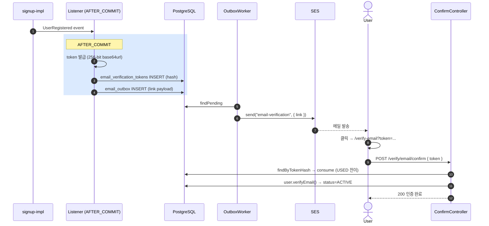

# 이메일 인증 구현 (AWS SES + outbox)

**[[implementation|↑ implementation hub]]**

> 가입 후 PENDING_VERIFICATION → 클릭 → ACTIVE. outbox 패턴 + AFTER_COMMIT 으로 트랜잭션 안전성.

---

## 1. 흐름 개요



---

## 2. API spec

```http
POST /api/v1/auth/verify/email/request         # 재발송 (로그인 후)
POST /api/v1/auth/verify/email/confirm         # 토큰 검증 (비인증)
```

### 2.1 Request

```http
POST /api/v1/auth/verify/email/request
Authorization: Bearer <access>

200 OK
{ "code": "OK_001", "message": "인증 메일을 발송했습니다." }
```

### 2.2 Confirm

```http
POST /api/v1/auth/verify/email/confirm
{ "token": "9f4b3a2c-...-base64url" }

200 OK
{ "code": "OK_001", "message": "이메일 인증 완료" }
```

---

## 3. 비기능

- 토큰 **단일 사용** (USED 전이).
- 토큰 만료 **24시간**.
- 재발송 — 1시간 3회 / user.
- 발송 = **outbox + AFTER_COMMIT** (트랜잭션 안 SMTP X).
- 이미 ACTIVE user 의 request — silent OK (혼동 방지).
- 인증 URL: `https://shop.example.com/verify-email?token=...` (프론트가 confirm API 호출).

---

## 4. 도메인 — EmailVerificationToken

```java
public final class EmailVerificationToken {

    public enum Status { ACTIVE, USED, REVOKED, EXPIRED }

    private final EmailVerificationTokenId id;
    private final UserId userId;
    private final String tokenHash;            // SHA-256(raw)
    private final Instant issuedAt;
    private final Instant expiresAt;
    private Status status;

    public static EmailVerificationToken issue(EmailVerificationTokenId id, UserId userId,
                                                String hash, Instant now, Duration ttl) {
        return new EmailVerificationToken(id, userId, hash, now, now.plus(ttl), Status.ACTIVE);
    }

    public void consume(Instant now) {
        if (status != Status.ACTIVE)
            throw new BusinessException(ResponseCode.INVALID_TOKEN,
                "token not active: " + status);
        if (!now.isBefore(expiresAt))
            throw new BusinessException(ResponseCode.EXPIRED_AUTH_CODE, "token expired");
        status = Status.USED;
    }

    public void revoke() { this.status = Status.REVOKED; }
}
```

### 4.1 왜 4-state (ACTIVE / USED / REVOKED / EXPIRED)

- ACTIVE = 사용 가능.
- USED = 1회 사용 후.
- REVOKED = 재발송 시 옛 토큰 무효.
- EXPIRED = TTL 만료 (또는 cleanup 표시).

**왜 USED 와 REVOKED 분리**
- audit — "사용됐는지" vs "재발송으로 무효" 구분.
- 분쟁 시 입증.

자세히: [[../enums/verification-token-status]] · [[../database/verification-tokens-table#3]].

### 4.2 왜 raw 가 256-bit base64url

- URL token — 사용자 클릭만 (입력 X).
- 256-bit = brute force 불가능 (URL 자체 보안).
- base64url = URL 안전 (`+`, `/`, `=` 없음).

**왜 6-digit code 아님 (phone 과 다름)**
- email = 클릭 URL → 짧을 필요 X.
- 6-digit = 100만 경우 → brute force 가능 (rate limit 필요).
- 256-bit = 단일 안전.

자세히: [[email-verification-model]].

---

## 5. UseCase — Request (재발송)

```java
@Service
@Slf4j
@RequiredArgsConstructor
public class RequestEmailVerificationUseCase {

    private final UserRepository users;
    private final EmailVerificationTokenRepository tokens;
    private final ApplicationEventPublisher events;
    private final IdGenerator ids;
    private final Clock clock;
    private final SecureRandom random = new SecureRandom();

    @Value("${app.email-verification.ttl:PT24H}") Duration ttl;
    @Value("${app.email-verification.rate-per-hour:3}") int ratePerHour;

    @Transactional
    public void handle(UserId userId) {
        var user = users.findById(userId)
            .orElseThrow(() -> new BusinessException(ResponseCode.USER_NOT_FOUND));

        // ACTIVE 이면 silent OK
        if (user.isActive()) {
            log.info("user {} already active, ignore re-request", userId.value());
            return;
        }

        var now = Instant.now(clock);

        // Rate limit — 1시간 3회
        var recent = tokens.countActiveForUserSince(userId, now.minus(Duration.ofHours(1)));
        if (recent >= ratePerHour)
            throw new BusinessException(ResponseCode.RATE_LIMIT_EXCEEDED,
                "인증 메일 발송 한도 초과. 1시간 후 다시 시도해 주세요.");

        // 옛 ACTIVE 토큰 모두 revoke
        tokens.revokeAllActiveForUser(userId);

        // 새 토큰 발급
        var rawBytes = new byte[32];
        random.nextBytes(rawBytes);
        var raw = Base64.getUrlEncoder().withoutPadding().encodeToString(rawBytes);
        var hash = sha256Hex(raw);

        var token = EmailVerificationToken.issue(
            new EmailVerificationTokenId(ids.next()),
            userId, hash, now, ttl
        );
        tokens.save(token);

        // outbox 의 link 에 raw 포함 — AFTER_COMMIT listener 가 처리
        events.publishEvent(new EmailVerificationRequested(
            userId, user.email(), raw, token.id(), now
        ));
    }
}
```

### 5.1 왜 ACTIVE user 의 재요청 silent OK

- 사용자가 실수로 재요청 → 에러 응답 시 혼동.
- "이미 인증됐어요" 응답으로 user enumeration 가능 — 단순 OK 가 안전.

### 5.2 왜 옛 토큰 revoke

- 재발송 = 옛 link 무효 의도.
- 옛 link 가 메일 caching / 사용자 archive 에 잔존 시 영구 노출 위험.
- 가장 최신 link 만 유효.

### 5.3 왜 raw 가 event 안에

- listener 가 outbox 에 link 포함 → SES 발송 시 사용.
- raw 는 발급 시점에만 존재 — server 어디에도 저장 X (hash 만).

**왜 application memory 만 OK**
- 같은 트랜잭션 안에서 listener → outbox INSERT → 메모리 해제.
- DB / 로그 노출 X.

### 5.4 왜 SecureRandom (Random 아님)

- Random = predictable (seed 추측 가능).
- SecureRandom = /dev/urandom — cryptographically secure.

---

## 6. UseCase — Confirm

```java
@Service
@RequiredArgsConstructor
public class ConfirmEmailVerificationUseCase {

    private final UserRepository users;
    private final EmailVerificationTokenRepository tokens;
    private final ApplicationEventPublisher events;
    private final Clock clock;

    @Transactional
    public void handle(String rawToken) {
        var hash = sha256Hex(rawToken);
        var token = tokens.findByTokenHash(hash)
            .orElseThrow(() -> new BusinessException(ResponseCode.INVALID_TOKEN));

        var now = Instant.now(clock);
        token.consume(now);                        // 만료 / 단일 사용 검증 + USED 전이
        tokens.save(token);

        var user = users.findById(token.userId())
            .orElseThrow(() -> new BusinessException(ResponseCode.USER_NOT_FOUND));
        user.verifyEmail();                        // PENDING_VERIFICATION → ACTIVE
        users.save(user);

        user.pullDomainEvents().forEach(events::publishEvent);
    }
}
```

### 6.1 왜 consume + save 후 user.verifyEmail()

- 토큰 상태 변경 먼저 — 동시 재사용 차단.
- 후 user 상태 변경.
- 한 트랜잭션 안 → 일부 실패 시 rollback.

### 6.2 왜 같은 `@Transactional`

- 토큰 USED + user ACTIVE = atomic.
- 한쪽 실패 시 둘 다 rollback (정합성).

자세히: [[../transactions]].

---

## 7. AWS SES Email Client

```kotlin
implementation("software.amazon.awssdk:sesv2:2.25.50")
```

```yaml
app:
  email:
    from: noreply@shop.example.com
    aws-region: ap-northeast-2

aws:
  ses:
    access-key-id: ${AWS_ACCESS_KEY_ID:}
    secret-access-key: ${AWS_SECRET_ACCESS_KEY:}
```

```java
@Component
@RequiredArgsConstructor
@Slf4j
public class AwsSesEmailClient implements EmailClient {

    private final SesV2Client ses;
    private final TemplateEngine templates;
    @Value("${app.email.from}") String fromAddress;

    @CircuitBreaker(name = "email-ses", fallbackMethod = "fallback")
    @Retry(name = "email-ses")
    @Override
    public EmailResult send(String to, String templateName, Map<String, Object> payload) {
        var html = templates.process(templateName, new Context(Locale.KOREAN, payload));
        var text = templates.process(templateName + "-text", new Context(Locale.KOREAN, payload));
        var subject = subjectOf(templateName);

        var request = SendEmailRequest.builder()
            .fromEmailAddress(fromAddress)
            .destination(d -> d.toAddresses(to))
            .content(c -> c.simple(b -> b
                .subject(t -> t.data(subject))
                .body(body -> body
                    .html(t -> t.data(html))
                    .text(t -> t.data(text)))))
            .build();

        try {
            var response = ses.sendEmail(request);
            return new EmailResult(true, response.messageId(), null);
        } catch (SesV2Exception e) {
            log.warn("SES send failed: to={}, error={}", to, e.awsErrorDetails().errorMessage());
            return new EmailResult(false, null, e.awsErrorDetails().errorCode());
        }
    }

    private EmailResult fallback(String to, String tpl, Map<String, Object> p, Throwable t) {
        return new EmailResult(false, null, "SES temporarily unavailable");
    }
}
```

### 7.1 왜 HTML + Text 둘 다

- 일부 클라이언트 (text-only) 또는 spam filter 가 text 만 분석.
- Text fallback 없으면 spam score ↑.

### 7.2 왜 CircuitBreaker + Retry

- SES 일시 장애 시 자동 retry.
- 5번 실패 시 circuit open → fallback (outbox 의 worker 가 재시도).
- application 의 발송 호출이 외부 장애에 cascade X.

### 7.3 왜 SES v2 SDK

- v1 = legacy, v2 = 최신 (비동기 / non-blocking).
- 한국 region 의 anti-spam 기능 통합.

자세히: [[../design-decisions/email-provider]].

---

## 8. Outbox Listener (AFTER_COMMIT)

```java
@Component
@RequiredArgsConstructor
public class EmailVerificationOutboxListener {

    private final EmailOutboxRepository outbox;
    private final IdGenerator ids;
    private final Clock clock;
    @Value("${app.web.verify-email-base}") String verifyUrlBase;

    @TransactionalEventListener(phase = TransactionPhase.AFTER_COMMIT)
    public void on(EmailVerificationRequested event) {
        var link = verifyUrlBase + "?token=" + event.rawToken();
        outbox.enqueue(new EmailOutboxRow(
            ids.next(),
            event.email().value(),
            "email-verification",
            Map.of(
                "link", link,
                "expiresInHours", 24L,
                "userId", event.userId().value()
            ),
            Instant.now(clock)
        ));
    }
}
```

### 8.1 왜 AFTER_COMMIT

- 비즈니스 commit 후 outbox INSERT.
- 비즈니스 rollback 시 outbox 도 적재 X.
- 트랜잭션 안 SMTP 호출 회피.

자세히: [[../transactions]] · [[../database/email-outbox-table#3.2]].

---

## 9. Outbox Worker (별도 프로세스)

```java
@Component
@RequiredArgsConstructor
public class EmailOutboxWorker {

    private final EmailOutboxRepository outbox;
    private final EmailClient client;

    @Scheduled(fixedDelay = 1000)
    @SchedulerLock(name = "emailOutboxWorker", lockAtMostFor = "PT5M")
    public void process() {
        outbox.findPending(50).forEach(this::sendOne);
    }

    @Transactional
    public void sendOne(EmailOutboxRow row) {
        row.markProcessing(Instant.now());
        outbox.save(row);

        try {
            var result = client.send(row.toEmail(), row.template(), row.payload());
            if (result.ok()) {
                row.markSent(result.externalMessageId(), Instant.now());
            } else {
                row.recordFailure(result.errorCode(), computeNextAttempt(row.attempts() + 1));
            }
        } catch (Exception e) {
            row.recordFailure(e.getMessage(), computeNextAttempt(row.attempts() + 1));
        }
        outbox.save(row);
    }
}
```

자세히: [[../database/email-outbox-table#4 Worker]].

---

## 10. Controller

```java
@Tag(name = "이메일 인증")
@RestController
@RequestMapping("/api/v1/auth/verify/email")
@RequiredArgsConstructor
public class EmailVerificationController {

    private final RequestEmailVerificationUseCase request;
    private final ConfirmEmailVerificationUseCase confirm;

    @Operation(summary = "인증 메일 요청 / 재발송")
    @PostMapping("/request")
    public ResponseEntity<CommonResponse<Void>> requestVerify(@AuthenticationPrincipal AuthUser auth) {
        request.handle(auth.id());
        return ResponseEntity.ok(CommonResponse.success(ResponseCode.OK,
            "인증 메일을 발송했습니다."));
    }

    @Operation(summary = "이메일 인증 confirm")
    @PostMapping("/confirm")
    public ResponseEntity<CommonResponse<Void>> confirmVerify(
        @Valid @RequestBody EmailConfirmDto req
    ) {
        confirm.handle(req.token());
        return ResponseEntity.ok(CommonResponse.success(ResponseCode.OK,
            "이메일 인증이 완료되었습니다."));
    }
}

public record EmailConfirmDto(@NotBlank String token) {
    @Override public String toString() {
        return "EmailConfirmDto[token=***]";
    }
}
```

---

## 11. SES sandbox 해제 + DNS 설정

운영 전 필수:
- **SES sandbox 해제** — AWS 콘솔 production access (1-2일).
- **SPF**: `v=spf1 include:amazonses.com -all`
- **DKIM**: SES 발급 CNAME 3개.
- **DMARC**: `v=DMARC1; p=quarantine; rua=mailto:dmarc@...`
- **From 도메인 검증** — SES.

자세히: [[../design-decisions/email-provider#4 발송 시 필수 설정]].

**안 하면 무슨 문제**
- Gmail / Naver / Daum 이 spam 폴더 직행.
- 사용자가 인증 메일 못 받음 → 가입 실패.

---

## 12. 함정 모음

### 함정 1 — SMTP 직접 호출 (Gmail relay 등)
배달율 ↓ + IP 평판 0 → spam 직행.
→ SES / SendGrid / Postmark.

### 함정 2 — SPF / DKIM / DMARC 없음
spam 폴더 직행.
→ 3개 모두.

### 함정 3 — 트랜잭션 안 SMTP
DB 락 + 외부 cascade.
→ outbox + AFTER_COMMIT.

### 함정 4 — Raw token 저장
DB 유출 = 모든 link 사용 가능.
→ SHA-256 hash.

### 함정 5 — TTL 미설정
영구 유효 → 옛 메일 archive 노출.
→ 24h.

### 함정 6 — 단일 사용 (USED) 검증 X
같은 link 무한 사용.
→ status=USED 전이.

### 함정 7 — 재발송 무제한
이메일 폭탄 + SES 비용 폭증.
→ 1h 3회.

### 함정 8 — 재발송 시 옛 토큰 revoke 안 함
옛 link 영구 활성.
→ revokeAllActiveForUser.

### 함정 9 — HTML 만 발송
text-only client / spam filter 의심.
→ HTML + Text 둘 다.

### 함정 10 — URL token 의 쿼리 파라미터 로그
nginx access log + 외부 분석 도구 token 노출.
→ path masking / token query 안 logging.

### 함정 11 — Bounce / complaint webhook 무시
무효 email 무한 발송 → SES suspension.
→ SNS webhook 처리.

### 함정 12 — Worker single instance 보장 X
다중 워커 같은 row 처리 → SES 중복 발송.
→ ShedLock.

### 함정 13 — ACTIVE user 재요청 에러 응답
"이미 인증됐어요" = enumeration.
→ silent OK.

### 함정 14 — `app.web.verify-email-base` 환경별 분리 X
dev 의 URL 이 prod 메일에.
→ profile 별 yml.

---

## 13. 운영 체크리스트

- [ ] SES sandbox 해제 + production access
- [ ] SPF + DKIM + DMARC DNS
- [ ] bounce / complaint webhook (SNS → SQS → handler)
- [ ] outbox 워커 liveness probe
- [ ] 발송 성공률 메트릭 + 5% 초과 실패 알람
- [ ] 토큰 SHA-256 hash 저장
- [ ] 24h TTL + cleanup daily
- [ ] 1h 3회 rate limit

---

## 14. 관련

- [[implementation|↑ implementation hub]]
- [[signup-impl]] — UserRegistered event 가 트리거
- [[email-verification-model]] — URL token vs 6-digit 비교
- [[../design-decisions/email-provider]] — SES 선택
- [[../database/verification-tokens-table]] · [[../database/email-outbox-table]]
- [[../transactions]] — AFTER_COMMIT
