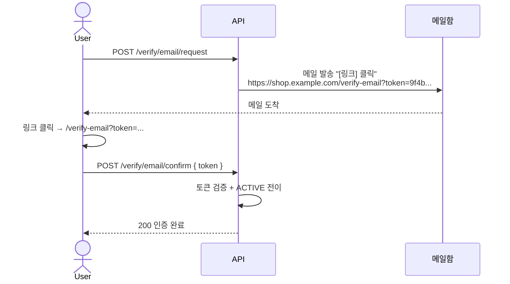

# 이메일 인증 모델 비교 — URL token / 6-digit code / 둘 다

**[[implementation|↑ implementation hub]]**  ·  관련: [[email-verification-impl]] · [[../design-decisions/email-provider]]

> "이메일 인증을 어떻게 구현할지" 의 모델 결정 — 자리수 / 형식 / 모델 별 trade-off + 본 vault 권장.

---

## 1. 3가지 모델

### 1.1 모델 A — URL Token (긴 random)

가장 표준적. 이메일 안에 **검증 링크** + 긴 random token.



**Token 형식 옵션**:

| 형식 | 길이 | 예 | 비고 |
| --- | --- | --- | --- |
| UUID v4 | 36 char (hex+hyphen) | `e0a4f1c2-...` | 추측 불가지만 길이 부담 |
| Base64URL (32 bytes) | **43 char** ✅ | `9f4b3a2c...VzL3w` | **본 vault 권장** |
| Hex (32 bytes) | 64 char | `9f4b...` | 길이 부담 |
| Short random (16 bytes) | 22 char | `abc...` | brute force 위험 (128bit 미만) |

**본 vault**: **Base64URL 32 bytes (256 bit entropy)** — 충분히 안전 + URL safe + 길이 적당.

```java
var rawBytes = new byte[32];                              // 256 bit entropy
new SecureRandom().nextBytes(rawBytes);
var raw = Base64.getUrlEncoder().withoutPadding().encodeToString(rawBytes);
// 결과: "qLKHe2v9OySTAjN5Y..." (43 chars)
```

---

### 1.2 모델 B — 6-digit Code

휴대폰 인증 식. 사용자가 **숫자 6자리** 직접 입력.

```
[클라] POST /auth/verify/email/request
[메일] "인증번호: 482917 (3분 안에 입력)"
[클라] 메일 보고 코드를 폼에 입력
[프론트] POST /auth/verify/email/confirm { email, code: "482917" }
```

**자리수 비교**:

| 자리수 | 조합 수 | brute force (5회 lock 가정) | UX |
| --- | --- | --- | --- |
| 4자리 | 10,000 | ⚠️ 2,000회면 100% | 입력 빠름 |
| 5자리 | 100,000 | 안전 | 입력 빠름 |
| **6자리 ✅** | **1,000,000** | **안전 + 표준** | **균형** |
| 7자리 | 10,000,000 | 매우 안전 | 입력 부담 |
| 8자리 | 100,000,000 | 과 안전 | 입력 어려움 |

**본 vault**: **6자리** — Google / Naver / 카카오 / 은행 모두 표준.

```java
var random = new SecureRandom();
var code = String.format("%06d", random.nextInt(1_000_000));      // "000000" ~ "999999"
```

---

### 1.3 모델 C — 둘 다 (Link with Code 표시)

```
[메일]
  "아래 링크 클릭으로 인증:
   https://shop.example.com/verify-email?token=...

   또는 인증번호 직접 입력: 482917"
```

→ Mobile 앱 (web link 처리 미세 issue) + PC 사용자 둘 다 대응.

---

## 2. 비교 — 어떤 걸 써야 하나

| 항목 | A. URL Token | B. 6-digit Code | C. 둘 다 |
| --- | --- | --- | --- |
| **사용자 부담** | 클릭만 | 코드 입력 | 둘 중 선택 |
| **모바일 UX** | ✅ (앱 deeplink) | △ (앱 ↔ 메일 ↔ 앱) | ✅ |
| **PC UX** | ✅ | ✅ | ✅ |
| **링크 클릭 사고 (이메일 클라가 미리보기)** | ⚠️ — 자동 클릭 위험 | ✅ | △ |
| **이메일 클라가 안 열림 / spam 폴더** | ❌ | ✅ (코드 메모리 가능) | ✅ |
| **TTL** | 24시간 (긴 link) | 3~5분 (짧은 코드) | 둘 다 |
| **brute force 위험** | 거의 X (256bit) | ⚠️ — 코드 lock 필수 | 같이 |
| **구현 복잡도** | 낮음 | 중간 (lock + retry) | 높음 (둘 다) |
| **사용처** | 표준 (Google / GitHub) | 본인 확인 강한 (은행 / Apple) | 모바일·PC 혼합 |

---

## 3. 본 vault 권장

### 3.1 일반 SaaS — **모델 A (URL Token)**

가입 후 이메일 인증 = **링크 클릭** 이 가장 자연스러움.

- 사용자 부담 최소 (클릭 1번)
- TTL 길게 (24시간) → 사용자가 메일 늦게 봐도 OK
- 보안 충분 (256bit token + 1회 사용)

### 3.2 본인 확인 강한 SaaS / 금융 — **모델 B (6-digit)**

- 패스워드 변경 / 출금 / 결제 같은 critical 작업 직전 step-up
- 짧은 TTL (3분) — 즉각 사용 의도
- brute force lock (5회)

### 3.3 모바일 앱 — **모델 C 또는 deeplink + 코드**

iOS / Android 앱:
- 메일 link 클릭 → safari → 앱으로 deeplink → 검증 (복잡)
- 또는 코드만 → 사용자가 앱으로 복사·붙여넣기

→ **앱 deeplink 가 잘 안 되는 환경이면 코드** 가 더 단순.

### 3.4 본 vault 의 [[email-verification-impl]] 는 — **모델 A**

가입 후 비동기 인증 메일 (link). 사용자가 메일 받고 link 클릭 → ACTIVE 전이.

---

## 4. Token 보안 — 공통

### 4.1 항상 hash 저장

```java
var rawToken = generateRawToken();                            // 클라에만
var tokenHash = sha256Hex(rawToken);                          // DB 에
// raw 는 메일에만, DB / log 에는 절대 raw 저장 X
```

### 4.2 단일 사용 (USED 전이)

```java
public void consume(Instant now) {
    if (status != ACTIVE) throw new BusinessException(ResponseCode.INVALID_TOKEN);
    if (!now.isBefore(expiresAt))
        throw new BusinessException(ResponseCode.EXPIRED_AUTH_CODE);
    status = USED;
}
```

### 4.3 만료 TTL

- URL token: **24시간** (느슨)
- 6-digit code: **3~5분** (즉각)
- TTL 이 너무 길면 = leaked token 사용 가능 시간 ↑
- TTL 이 너무 짧으면 = 사용자가 못 봄 (메일 클라 지연)

### 4.4 재발송 rate limit

```
같은 user 의 verification 요청 — 1시간 3건
```

이메일 폭탄 / 비용 폭증 방어. [[email-verification-impl#4]] 참고.

---

## 5. 인증 모델 별 구현 차이

### 5.1 URL Token — 도메인

```java
public final class EmailVerificationToken {
    private final String tokenHash;                            // SHA-256(raw 32 bytes)
    private final Instant expiresAt;                            // now + 24h
    private VerificationTokenStatus status;
}
```

### 5.2 6-digit Code — 도메인

```java
public final class EmailVerificationCode {
    private final String codeHash;                              // SHA-256(6 digit)
    private final Instant expiresAt;                            // now + 5m
    private int attempts;                                       // brute force lock
    private VerificationTokenStatus status;

    public void tryConfirm(String code, Instant now) {
        if (attempts >= MAX_ATTEMPTS) {
            status = VerificationTokenStatus.REVOKED;
            throw new BusinessException(ResponseCode.FORBIDDEN, "시도 초과");
        }
        attempts++;
        if (!sha256Hex(code).equals(codeHash))
            throw new BusinessException(ResponseCode.UNAUTHORIZED, "코드 불일치");
        if (!now.isBefore(expiresAt))
            throw new BusinessException(ResponseCode.EXPIRED_AUTH_CODE);
        status = VerificationTokenStatus.USED;
    }
}
```

→ 코드 방식은 **attempts 카운터** + **lock 로직** 필수.

---

## 6. 이메일 본문 구성

### URL Token 식

```
제목: [Shop] 이메일 인증을 완료해 주세요

본문 (HTML):
  <h1>이메일 인증</h1>
  <p>Alice 님, 가입을 환영합니다.</p>
  <p>아래 버튼을 클릭해 이메일 인증을 완료해 주세요.</p>
  <a href="https://shop.example.com/verify-email?token=qLKHe2v9..." style="...">
    이메일 인증 완료
  </a>
  <p>또는 아래 링크 직접 복사:</p>
  <code>https://shop.example.com/verify-email?token=...</code>
  <p>이 링크는 24시간 후 만료됩니다.</p>
```

### 6-digit Code 식

```
제목: [Shop] 인증번호 [482917]

본문:
  <h1>이메일 인증번호</h1>
  <p>인증번호: <strong style="font-size: 32px;">482917</strong></p>
  <p>이 번호는 3분 후 만료됩니다.</p>
  <p>본인이 요청하지 않았다면 무시해 주세요.</p>
```

→ **제목에 코드를 미리 보기** 하면 사용자가 메일 안 열어도 알림 보고 확인 가능 (모바일 UX ↑).

---

## 7. 모바일 / 앱 / 웹 — 각각 어떻게 처리

### 7.1 웹

- URL token: 메일 링크 클릭 → 우리 사이트 페이지 → confirm API → 성공 페이지
- 6-digit: 가입 폼 (또는 별도 페이지) 에 code 입력 → confirm API

### 7.2 iOS / Android 앱

| 시나리오 | 처리 |
| --- | --- |
| 앱이 background — 메일 link 클릭 | Universal Link / App Link 로 앱 열기 → confirm |
| 앱이 안 깔린 사용자 | 웹 페이지로 fallback (앱 다운로드 안내) |
| 메일 클라이언트가 link preview 자동 | ⚠️ — preview 가 link 자동 fetch 시 token 소비 위험. **GET 으로 status 변경 X** (반드시 POST 또는 token 확인만) |

### 7.3 메일 클라이언트의 link preview 함정

Microsoft / Gmail 의 link safety scanner 가 자동으로 link 를 **GET 요청** 으로 미리 fetch. 만약 우리 endpoint 가 GET 으로 token 검증 + status 변경하면 — **사용자가 클릭 전에 token 만료**.

**해결**:
1. **POST endpoint** 만 검증 — `/auth/verify/email/confirm` 은 POST
2. GET 의 link 는 **프론트 페이지** 만 — 프론트가 사용자 클릭 후 POST 호출
3. 또는 link 에 **추가 신호** (사용자 클릭 = 폼 submit) 필요

본 vault: **2번 — 프론트 페이지 + POST**.

---

## 8. 다른 도구의 실제 사례

| 서비스 | 모델 | 자리수 / 길이 | TTL |
| --- | --- | --- | --- |
| GitHub | URL Token | base64 ~40 char | 7일 |
| Google | URL Token + 6-digit OTP (둘 다) | 토큰 ~50 char / 6 digit | 토큰 1시간 / OTP 5분 |
| Apple | 6-digit Code | 6 digit | 10분 |
| Slack | 6-digit Code (마법 코드) | 6 digit | 5분 |
| Notion | URL Token | base64 | 24시간 |
| 카카오 | 6-digit Code (휴대폰) | 6 digit | 3분 |

→ 자리수 6이 표준. URL token 는 base64 30~40 char.

---

## 9. 함정 모음

### 함정 1 — 6-digit 의 attempts lock 없음
100만 조합 — 자동화 무한 시도 = 분 단위로 뚫림. **5회 lock 강제**.

### 함정 2 — URL token 이 GET 으로 검증
이메일 link preview 가 미리 fetch → 사용자 클릭 전에 USED. **POST 만**.

### 함정 3 — Token 을 평문 DB 저장
DB 유출 = 모든 인증 link 사용 가능. **SHA-256 hash**.

### 함정 4 — TTL 너무 김
24시간 (URL) / 5분 (code) 가 합리. 7일 (URL) 도 OK. 영구는 절대 X.

### 함정 5 — 같은 user 동시 multiple ACTIVE 토큰
재발송 시 옛 토큰 안 무효 → 옛 토큰 우연히 노출 시 attacker 사용 가능. **재발송 시 revoke**.

### 함정 6 — 자리수 4 또는 5
4자리 만개 = 5회 lock 으로도 100명 중 5명은 우연히 맞춤 (10000 / 5 = 2000). 6자리 권장.

### 함정 7 — Token 형식이 짧고 단순
"ABC123" 같은 짧은 token = brute force. **128 bit 이상 entropy**.

### 함정 8 — 코드 메일 제목 노출
"인증번호: 482917" 제목 = 메일 클라 미리보기로 다른 사람이 볼 수도. 본 vault: **제목에 코드 OK** (사용자 본인 디바이스 가정), 단 회사 / 공용 PC 환경은 주의.

### 함정 9 — Code 가 character 포함 (예: ABC123)
입력 어려움 (대소문자 / 0과 O 혼동). **숫자만**.

---

## 10. 권장 구현 (본 vault 의 디폴트)

```yaml
email-verification:
  model: url-token                        # 또는 6-digit-code
  token:
    bytes: 32                              # 256 bit entropy
    encoding: base64url-no-padding
    length: 43                              # char
  ttl: PT24H                                # 24시간

  # 6-digit-code 모드 사용 시
  code:
    digits: 6
    ttl: PT5M                                # 5분
    max-attempts: 5
    lock-duration: PT15M
```

```java
// EmailVerificationToken — model: url-token
public static EmailVerificationToken issue(...) {
    var raw = generateUrlSafeToken(32);
    var hash = sha256Hex(raw);
    return new EmailVerificationToken(id, userId, hash, now, now.plus(Duration.ofHours(24)),
                                       VerificationTokenStatus.ACTIVE);
}

// EmailVerificationCode — model: 6-digit-code
public static EmailVerificationCode issue(...) {
    var code = String.format("%06d", new SecureRandom().nextInt(1_000_000));
    var hash = sha256Hex(code);
    return new EmailVerificationCode(id, userId, hash, now, now.plus(Duration.ofMinutes(5)),
                                      VerificationTokenStatus.ACTIVE, 0);
}
```

---

## 11. 관련

- [[signup|↑ signup hub]]
- [[email-verification-impl]] — 구현 (URL token 기반)
- [[phone-verification-impl]] — SMS 6-digit code 모델 (유사 패턴)
- [[design-decisions]] — 전체 의사결정
- [[enums/verification-token-status]] — token lifecycle
