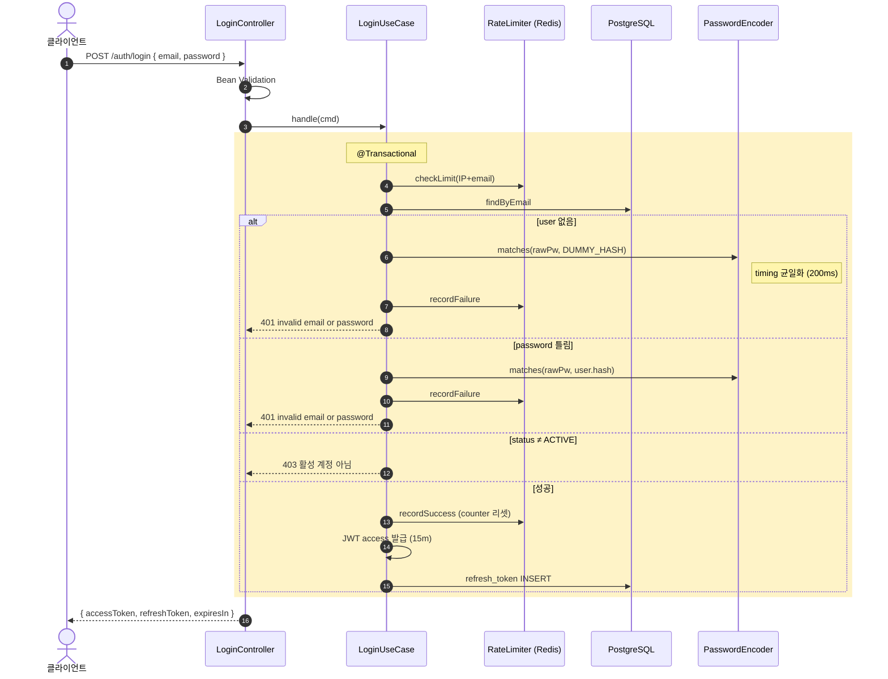

# 로그인 구현 (JWT access + refresh)

**[[implementation|↑ implementation hub]]**

> 가입된 user 가 이메일·비밀번호로 로그인 → JWT access + opaque refresh 발급.
> 정책 결정: [[../design-decisions/token-model]].

---

## 1. 흐름 개요



---

## 2. API spec

```http
POST /api/v1/auth/login
Content-Type: application/json
{ "email": "alice@x.com", "password": "Tr0ub4dor!" }
```

```http
200 OK
{
  "code": "OK_001",
  "message": "로그인 성공",
  "data": {
    "accessToken": "eyJhbGciOi...",
    "refreshToken": "9f4b3a2c-...-base64url",
    "tokenType": "Bearer",
    "expiresIn": 900
  }
}
```

**실패 응답**

| Status | Code | 메시지 |
| --- | --- | --- |
| 401 | INVALID_CREDENTIALS | "invalid email or password" (enumeration 차단 통일) |
| 403 | ACCOUNT_NOT_ACTIVE | "활성 계정이 아닙니다 (PENDING_VERIFICATION)" |
| 401 | ACCOUNT_LOCKED | "5회 로그인 실패 — 15분 후 다시 시도" |

---

## 3. 비기능 요구

- access TTL **15분** / refresh TTL **14일**
- refresh **rotation** (사용 시 새 RT 발급, 옛 RT → ROTATED)
- 동시 다중 세션 허용
- 실패 응답 시간 ≈ 성공 (timing 균일화)
- 5회 실패 → 15분 lock (per IP+email)
- enumeration 차단 — "invalid email or password" 통일

자세히: [[../design-decisions/token-model]] · [[../security/attack-defense]].

---

## 4. 도메인 — RefreshToken Aggregate

```java
public final class RefreshToken {

    public enum Status { ACTIVE, ROTATED, REVOKED, EXPIRED }

    private final RefreshTokenId id;
    private final UserId userId;
    private final String tokenHash;                   // SHA-256(raw)
    private final String deviceFingerprint;
    private final Instant issuedAt;
    private final Instant expiresAt;
    private Status status;
    private RefreshTokenId rotatedToId;

    public static RefreshToken issue(RefreshTokenId id, UserId userId, String tokenHash,
                                     String device, Instant now, Duration ttl) {
        return new RefreshToken(id, userId, tokenHash, device, now,
                                now.plus(ttl), Status.ACTIVE, null);
    }

    public void rotate(RefreshTokenId newId, Instant now) {
        if (status != Status.ACTIVE)
            throw new IllegalStateException("not active: " + status);
        if (!now.isBefore(expiresAt))
            throw new IllegalStateException("expired");
        this.status = Status.ROTATED;
        this.rotatedToId = newId;
    }

    public void revoke() { this.status = Status.REVOKED; }

    public boolean isUsable(Instant now) {
        return status == Status.ACTIVE && now.isBefore(expiresAt);
    }
    // accessors
}
```

### 4.1 왜 별도 Aggregate (User 안에 컬렉션 X)

- 한 user 의 RT 가 N 개 (디바이스 별).
- User load 시마다 N RT 도 fetch → N+1 + 메모리 부담.
- RT 변경 (rotation) 이 User 의 dirty check 일으킴 → @Version 충돌.

자세히: [[../domain-model/aggregate-boundaries#4]].

### 4.2 왜 hash 저장 (raw 아님)

- DB 유출 = raw 면 모든 RT 즉시 사용.
- SHA-256 충분 (RT 는 high-entropy random, brute force 우주 나이 초과).
- 14일 보호 시간.

자세히: [[../database/refresh-tokens-table#2.3]].

### 4.3 왜 ROTATED 상태 (REVOKED 외 별도)

- ROTATED = 정상 흐름 (rotation 성공).
- REVOKED = 명시적 폐기 (logout / 도난 / 패스워드 변경).
- 분리해야 reuse detection 가능 — "ROTATED 토큰이 또 들어옴 = 도난".

자세히: [[../enums/refresh-token-status]].

---

## 5. Domain — Port

```java
public interface RefreshTokenRepository {
    RefreshToken save(RefreshToken token);
    Optional<RefreshToken> findById(RefreshTokenId id);
    Optional<RefreshToken> findByTokenHash(String hash);
    int revokeAllForUser(UserId userId, String reason);
}
```

---

## 6. JwtTokenProvider

```java
@Component
@RequiredArgsConstructor
public class JwtTokenProvider {

    @Value("${auth.jwt.secret}") String base64Secret;
    @Value("${auth.jwt.issuer}") String issuer;
    @Value("${auth.jwt.access-ttl}") Duration accessTtl;

    private SecretKey key;
    private JwtParser parser;

    @PostConstruct
    void init() {
        var keyBytes = Base64.getDecoder().decode(base64Secret);
        key = Keys.hmacShaKeyFor(keyBytes);
        parser = Jwts.parser()
            .verifyWith(key)
            .requireIssuer(issuer)
            .clockSkewSeconds(30)
            .build();
    }

    public String generateAccessToken(String email, String userId, Role role, String sessionId) {
        var now = Instant.now();
        return Jwts.builder()
            .issuer(issuer)
            .subject(email)
            .id(UlidCreator.getMonotonicUlid().toString())     // jti
            .claim("uid", userId)
            .claim("role", role.name())
            .claim("sid", sessionId)
            .claim("type", "ACCESS")
            .issuedAt(Date.from(now))
            .expiration(Date.from(now.plus(accessTtl)))
            .signWith(key)
            .compact();
    }

    public Claims parse(String token) {
        return parser.parseSignedClaims(token).getPayload();
    }
}
```

### 6.1 왜 HS256 (RS256 아님)

- 모놀리식 가정 — 발급자 = 검증자.
- 단순 / 빠름.
- MSA 면 RS256 (public key 분배).

자세히: [[../design-decisions/token-model#3.1]].

### 6.2 왜 256-bit secret + base64

- HS256 의 표준 — 256-bit minimum (jjwt 강제).
- base64 = env 안전 (control char 없음).

### 6.3 왜 `requireIssuer` + `clockSkewSeconds`

- issuer 검증 — 다른 시스템의 JWT 우회 차단.
- clock skew 30s — 서버 간 시계 차이 (NTP 동기화 후에도 ms 차이).

### 6.4 왜 access 만 발급 (refresh 는 별도)

- access = stateless JWT.
- refresh = opaque + DB 매핑 (즉시 무효화 가능).

자세히: [[../../common/security-config#7 JwtTokenProvider]].

---

## 7. UseCase — LoginUseCase

```java
@Service
@RequiredArgsConstructor
@Slf4j
public class LoginUseCase {

    private final UserRepository users;
    private final PasswordEncoder passwordEncoder;
    private final JwtTokenProvider jwt;
    private final RefreshTokenService rtService;
    private final LoginAttemptLimiter loginLimiter;
    private final AuthAuditLogger auditLogger;
    private final Clock clock;

    // pre-computed argon2id dummy hash — timing 균일화용
    private static final String DUMMY_HASH =
        "$argon2id$v=19$m=65536,t=3,p=4$AAAAAAAAAAAAAAAAAAAAAA$" +
        "AAAAAAAAAAAAAAAAAAAAAAAAAAAAAAAAAAAAAAAAAAA";

    @Transactional
    public LoginResult login(String email, String rawPassword, String device, String ip) {
        var normalized = email.trim().toLowerCase(Locale.ROOT);

        // 1. Rate limit
        loginLimiter.checkLimit(ip, normalized);

        // 2. user lookup
        var maybeUser = users.findByEmail(new Email(normalized));

        // 3. timing 균일화 — user 없어도 dummy hash 검증
        if (maybeUser.isEmpty()) {
            passwordEncoder.matches(rawPassword, DUMMY_HASH);
            loginLimiter.recordFailure(ip, normalized);
            auditLogger.log(AuthAuditEvent.loginFailed(normalized, "USER_NOT_FOUND"));
            throw new BusinessException(ResponseCode.UNAUTHORIZED, "invalid email or password");
        }

        var user = maybeUser.get();

        // 4. password 검증
        if (!passwordEncoder.matches(rawPassword, user.currentPasswordHash().value())) {
            loginLimiter.recordFailure(ip, normalized);
            auditLogger.log(AuthAuditEvent.loginFailed(user.id(), "PASSWORD_MISMATCH"));
            throw new BusinessException(ResponseCode.UNAUTHORIZED, "invalid email or password");
        }

        // 5. status 검증
        if (!user.isActive()) {
            auditLogger.log(AuthAuditEvent.loginFailed(user.id(), "USER_NOT_ACTIVE"));
            throw new BusinessException(ResponseCode.FORBIDDEN,
                "활성 계정이 아닙니다 (" + user.status().name() + ")");
        }

        // 6. 성공
        loginLimiter.recordSuccess(ip, normalized);

        // 7. 토큰 발급
        var sessionId = UUID.randomUUID().toString();
        var access = jwt.generateAccessToken(user.email().value(), user.id().value(),
                                             user.role(), sessionId);
        var rt = rtService.issue(user.id(), device, ip);

        // 8. password rehash 점검 (옵션 — params 강화 시)
        if (passwordEncoder.needsRehash(user.currentPasswordHash().value())) {
            user.changePassword(new PasswordHash(passwordEncoder.encode(rawPassword)));
            users.save(user);
        }

        auditLogger.log(AuthAuditEvent.loginSuccess(user.id()));
        return new LoginResult(access, rt.raw(), rt.expiresAt(), accessTtlSeconds());
    }
}

public record LoginResult(String accessToken, String refreshToken, Instant refreshExpiresAt, long expiresInSeconds) {}
```

### 7.1 왜 timing 균일화 (DUMMY_HASH)

**문제**
```java
// timing leak
if (user == null) return false;                        // 5ms (빠름)
return encoder.matches(rawPassword, user.hash());       // 200ms (느림)
```

→ 응답 시간 차이 = user 존재 enumeration.

**해결**
- DUMMY_HASH = 유효한 argon2id 형식 + 검증 항상 실패하는 값.
- 같은 ~200ms 소비 = timing 동일.

자세히: [[../security/attack-defense#5 Timing]].

### 7.2 왜 `LoginAttemptLimiter` (rate limit + lock)

- brute force 방어.
- IP + email 둘 다 키 — NAT 환경에서 정상 사용자 영향 ↓.

### 7.3 왜 `needsRehash` 점검

- argon2id 파라미터 강화 시 (예: m=64MB → m=128MB) 옛 hash 그대로면 효과 X.
- 로그인 성공 시 = 사용자가 평문 입력 → 새 파라미터로 재계산.
- 점진적 마이그레이션.

자세히: [[../design-decisions/password-hash#4.3]].

### 7.4 왜 audit log

- 실패 / 성공 / 사유 — brute force / 도난 분석.
- 분쟁 시 입증.

자세히: [[../security/audit-logging]].

---

## 8. RefreshTokenService — 발급 + Rotation + Revoke

```java
@Service
@RequiredArgsConstructor
public class RefreshTokenService {

    private final RefreshTokenRepository tokens;
    private final IdGenerator ids;
    private final Clock clock;
    private final SecureRandom random = new SecureRandom();

    @Value("${auth.jwt.refresh-ttl:P14D}") Duration refreshTtl;

    public IssuedRefreshToken issue(UserId userId, String device, String ip) {
        // 256-bit random — base64url encoding
        var rawBytes = new byte[32];
        random.nextBytes(rawBytes);
        var raw = Base64.getUrlEncoder().withoutPadding().encodeToString(rawBytes);
        var hash = sha256Hex(raw);

        var token = RefreshToken.issue(
            new RefreshTokenId(ids.next()), userId, hash, device,
            Instant.now(clock), refreshTtl
        );
        tokens.save(token);
        return new IssuedRefreshToken(raw, token.id(), token.expiresAt(), userId);
    }

    @Transactional
    public IssuedRefreshToken rotate(String rawIncoming, String device, String ip) {
        var hash = sha256Hex(rawIncoming);
        var current = tokens.findByTokenHash(hash)
            .orElseThrow(() -> new BusinessException(ResponseCode.INVALID_TOKEN));

        var now = Instant.now(clock);

        switch (current.status()) {
            case ROTATED -> {
                // 🚨 도난 의심 — 모든 RT 즉시 revoke
                tokens.revokeAllForUser(current.userId(), "REUSE_DETECTED");
                auditLogger.log(AuthAuditEvent.suspiciousReuse(current.userId(), current.id()));
                throw new BusinessException(ResponseCode.UNAUTHORIZED,
                    "token reuse detected; please sign in again");
            }
            case REVOKED, EXPIRED -> throw new BusinessException(ResponseCode.INVALID_TOKEN);
            case ACTIVE -> {}
        }
        if (!current.isUsable(now))
            throw new BusinessException(ResponseCode.INVALID_TOKEN);

        var newOne = issue(current.userId(), device, ip);
        current.rotate(newOne.id(), now);
        tokens.save(current);
        return newOne;
    }

    @Transactional
    public void revoke(String rawIncoming, String reason) {
        var hash = sha256Hex(rawIncoming);
        tokens.findByTokenHash(hash).ifPresent(rt -> {
            rt.revoke();
            tokens.save(rt);
            auditLogger.log(AuthAuditEvent.tokenRevoked(rt.userId(), reason));
        });
    }

    private static String sha256Hex(String input) {
        try {
            var digest = MessageDigest.getInstance("SHA-256");
            byte[] hash = digest.digest(input.getBytes(StandardCharsets.UTF_8));
            return HexFormat.of().formatHex(hash);
        } catch (NoSuchAlgorithmException e) { throw new RuntimeException(e); }
    }
}
```

### 8.1 왜 32-byte random (SecureRandom)

- 256-bit entropy → brute force 우주 나이 초과.
- `SecureRandom` (= /dev/urandom on Linux) — cryptographically secure.

### 8.2 왜 base64url (base64 아님)

- URL / cookie 안전 — `+`, `/`, `=` 없음.
- 메일 / 모바일 client 호환.

### 8.3 왜 ROTATED 재사용 시 모든 RT revoke

- ROTATED = "이미 새 RT 발급된 토큰".
- 그게 다시 들어옴 = 누군가 옛 raw 를 가지고 있음 (도난 가능성).
- 진짜 사용자 / 공격자 둘 다 사용 가능 → 안전을 위해 모두 차단.

자세히: [[../database/refresh-tokens-table#9 함정 2]].

자세히: [[token-refresh-impl]] — rotation 의 깊은 흐름.

---

## 9. Rate Limit — Redis 기반

```java
@Component
@RequiredArgsConstructor
public class LoginAttemptLimiter {

    private final RedisTemplate<String, String> redis;
    private static final int MAX_FAILURES = 5;
    private static final Duration LOCK = Duration.ofMinutes(15);

    public void checkLimit(String ip, String email) {
        var key = "login:fail:" + ip + ":" + email;
        var count = redis.opsForValue().get(key);
        if (count != null && Integer.parseInt(count) >= MAX_FAILURES) {
            throw new BusinessException(ResponseCode.FORBIDDEN,
                "로그인 시도 횟수 초과. " + LOCK.toMinutes() + "분 후 다시 시도해 주세요.");
        }
    }

    public void recordFailure(String ip, String email) {
        var key = "login:fail:" + ip + ":" + email;
        var count = redis.opsForValue().increment(key);
        if (count != null && count == 1)
            redis.expire(key, LOCK);                  // 첫 실패 시만 TTL 설정
    }

    public void recordSuccess(String ip, String email) {
        redis.delete("login:fail:" + ip + ":" + email);
    }
}
```

### 9.1 왜 IP + email 키

- IP 만 → NAT (회사 / 학교) 환경에서 정상 사용자 lock.
- email 만 → 분산 IP 로 같은 user 시도.
- 둘 다 = 정상 사용자 영향 ↓ + brute force 차단.

### 9.2 왜 첫 실패 시만 TTL

- TTL 매번 재설정 시 → 공격자 무한 lock 가능 (5초마다 시도).
- 첫 실패 + 15분 = 정확히 15분 lock.

자세히: [[../security/attack-defense#2 Brute Force]].

---

## 10. Controller

```java
@Tag(name = "사용자 로그인")
@RestController
@RequestMapping("/api/v1/auth")
@RequiredArgsConstructor
public class LoginController {

    private final LoginUseCase loginUseCase;
    private final RefreshTokenService rtService;

    @Operation(summary = "로그인")
    @ApiResponses({
        @ApiResponse(responseCode = "200", description = "(OK_001) 로그인 성공"),
        @ApiResponse(responseCode = "401", description = "(UNAUTH_001) invalid email or password"),
        @ApiResponse(responseCode = "403", description = "(FORBID_001) 활성 계정이 아님")
    })
    @PostMapping("/login")
    public ResponseEntity<CommonResponse<TokenResponse>> login(
        @Valid @RequestBody LoginRequest req,
        HttpServletRequest http
    ) {
        var device = http.getHeader("User-Agent");
        var ip = ClientIpUtil.resolveClientIp(http);
        var result = loginUseCase.login(req.email(), req.password(), device, ip);
        return ResponseEntity.ok(CommonResponse.success(ResponseCode.OK,
            new TokenResponse(result.accessToken(), result.refreshToken(),
                              "Bearer", result.expiresInSeconds()),
            "로그인 성공"));
    }

    @Operation(summary = "로그아웃")
    @PostMapping("/logout")
    public ResponseEntity<CommonResponse<Void>> logout(@Valid @RequestBody RefreshRequest req) {
        rtService.revoke(req.refreshToken(), "LOGOUT");
        return ResponseEntity.ok(CommonResponse.success(ResponseCode.OK, "로그아웃"));
    }
}

public record LoginRequest(
    @Email @NotBlank String email,
    @NotBlank @Size(min = 8, max = 128) String password
) {
    @Override public String toString() {
        return "LoginRequest[email=%s, password=***]".formatted(email);
    }
}

public record TokenResponse(
    String accessToken, String refreshToken, String tokenType, long expiresIn
) {}
```

---

## 11. JPA Adapter

자세히: [[../database/refresh-tokens-table]].

```java
public interface RefreshTokenJpaRepository extends JpaRepository<RefreshTokenJpaEntity, String> {
    Optional<RefreshTokenJpaEntity> findByTokenHash(String tokenHash);

    @Modifying(clearAutomatically = true)
    @Query("update RefreshTokenJpaEntity rt " +
           "set rt.status = 'REVOKED', rt.revokedAt = :now, rt.revokedReason = :reason " +
           "where rt.userId = :userId and rt.status = 'ACTIVE'")
    int revokeAllForUser(@Param("userId") String userId,
                         @Param("reason") String reason,
                         @Param("now") Instant now);
}
```

---

## 12. SecurityConfig

[[authentication-authorization]] 의 표준 + login / logout 추가:

```java
.requestMatchers(HttpMethod.POST,
    "/api/v1/auth/login",
    "/api/v1/auth/refresh",
    "/api/v1/auth/logout"
).permitAll()
```

JwtAuthenticationFilter 가 다른 endpoint 의 access token 검증.

---

## 13. 함정 모음

### 함정 1 — Refresh token raw 저장
DB 유출 = 모든 RT 사용. **SHA-256 hash**.

### 함정 2 — Refresh rotation 없음
탈취 시 14일 영구 사용. **rotation + reuse detection**.

### 함정 3 — Enumeration 메시지
"존재하지 않는 이메일" vs "비밀번호 틀림" 분리 = 가입자 list 노출. **"invalid email or password" 통일**.

### 함정 4 — Timing attack 무방비
user 없으면 hash 검증 X → 응답 빠름. **DUMMY_HASH 검증**.

### 함정 5 — access token 을 localStorage
XSS 한 번에 탈취. **httpOnly cookie** (또는 in-memory).

### 함정 6 — 5회 실패 lock 없음
brute force 가능. **Redis 카운터**.

### 함정 7 — JWT 에 민감정보 (password 등)
JWT 디코드 가능. **claim 에 PII X**.

### 함정 8 — logout 후 access 도 무효 기대
JWT stateless — 만료까지 살음. **짧은 TTL (15분)** 로 감수.

### 함정 9 — `alg: "none"` 수용
jjwt 0.12+ 기본 차단. 옛 lib 명시 거부.

### 함정 10 — Clock skew 무시
서버 간 1초 차이로 token invalid. **NTP + clockSkewSeconds(30)**.

### 함정 11 — JWT secret 약함
1초 brute force. **256-bit + base64 + KMS**.

### 함정 12 — `needsRehash` 안 함
argon2 강화 시 효과 없음. 로그인 시 점진 마이그레이션.

### 함정 13 — Rate limit 키가 IP 만
분산 IP 로 우회. **IP + email 둘 다**.

### 함정 14 — 로그인 성공 시 audit 누락
brute force / 도난 분석 X. **모든 시도 audit**.

### 함정 15 — SUSPENDED user 응답에 "정지됨" 명시
공격자가 user 상태 추측. **403 통일 메시지** 또는 ACTIVE 외 정보 노출 X.

---

## 14. 관련

- [[implementation|↑ implementation hub]]
- [[token-refresh-impl]] — rotation 의 깊은 흐름
- [[../design-decisions/token-model]] — JWT 정책
- [[../design-decisions/refresh-storage]] — RDB vs Redis
- [[../database/refresh-tokens-table]] — schema
- [[../security/attack-defense]] — brute force / timing
- [[../security/audit-logging]] — 보안 이벤트
- [[../../common/security-config]] — JwtTokenProvider / Filter
