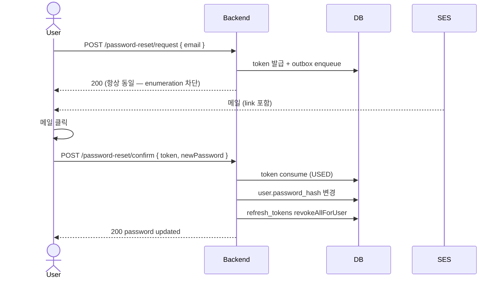

# auth §14 — 패스워드 리셋 구현

**[[implementation|↑ implementation hub]]**

> 패스워드 분실 시 이메일 (또는 SMS) 로 리셋 토큰 발송 → 새 패스워드 설정.
> 핵심: **enumeration 차단** + **단일 사용 토큰** + **모든 RT 무효** + **outbox 발송**.

---

## 1. 흐름 개요



### 1.1 Request

```http
POST /api/v1/auth/password-reset/request
{ "email": "alice@x.com" }

200 OK
{ "code": "OK_001", "message": "if the email is registered, a reset link has been sent" }
```

> **항상 200 + 동일 메시지** — email 등록 여부 enumeration 차단.

### 1.2 Confirm

```http
POST /api/v1/auth/password-reset/confirm
{ "token": "9f4b3a2c-...-base64url", "newPassword": "N3w-Tr0ub4dor!" }

200 OK
{ "code": "OK_001", "message": "password updated" }
```

---

## 2. 비기능

- 토큰 **단일 사용** (`USED` 상태 전이)
- 토큰 만료 **30분**
- 같은 이메일 **1시간 3회** rate limit (이메일 폭탄 방어)
- enumeration 차단 — 응답 항상 200 + 동일 메시지
- 리셋 성공 시 **모든 RefreshToken 무효** — 다른 디바이스 강제 로그아웃
- 새 패스워드 = 기존 거절 (선택)

---

## 3. 도메인

```java
// domain/auth/PasswordResetToken.java
public final class PasswordResetToken {

    public enum Status { ACTIVE, USED, REVOKED, EXPIRED }

    private final PasswordResetTokenId id;
    private final UserId userId;
    private final String tokenHash;                  // SHA-256(raw)
    private final Instant issuedAt;
    private final Instant expiresAt;
    private Status status;

    public static PasswordResetToken issue(PasswordResetTokenId id, UserId userId,
                                           String hash, Instant now, Duration ttl) {
        return new PasswordResetToken(id, userId, hash, now, now.plus(ttl), Status.ACTIVE);
    }

    public void consume(Instant now) {
        if (status != Status.ACTIVE) throw new BusinessException(ResponseCode.INVALID_TOKEN);
        if (!now.isBefore(expiresAt))
            throw new BusinessException(ResponseCode.EXPIRED_AUTH_CODE);
        status = Status.USED;
    }
    public void revoke() { status = Status.REVOKED; }
    // getters
}

public interface PasswordResetTokenRepository {
    PasswordResetToken save(PasswordResetToken t);
    Optional<PasswordResetToken> findByTokenHash(String hash);
    void revokeAllActiveForUser(UserId userId);
    int countActiveForUserSince(UserId userId, Instant since);
}
```

---

## 4. UseCase

### 4.1 Request

```java
@Service
@RequiredArgsConstructor
@Slf4j
public class RequestPasswordResetUseCase {

    private final UserRepository users;
    private final PasswordResetTokenRepository tokens;
    private final ApplicationEventPublisher events;
    private final IdGenerator ids;
    private final Clock clock;
    private final SecureRandom random = new SecureRandom();

    @Value("${app.password-reset.ttl:PT30M}") Duration ttl;
    @Value("${app.password-reset.rate-per-hour:3}") int ratePerHour;

    @Transactional
    public void handle(String email) {
        var normalized = email.trim().toLowerCase(Locale.ROOT);
        var maybeUser = users.findByEmail(new Email(normalized));

        if (maybeUser.isEmpty()) {
            log.info("password reset for non-existent email={}", normalized);
            return;        // silently — enumeration 차단
        }

        var user = maybeUser.get();
        var now = Instant.now(clock);
        var recent = tokens.countActiveForUserSince(user.id(), now.minus(Duration.ofHours(1)));
        if (recent >= ratePerHour) {
            log.warn("rate limit hit for user={}", user.id().value());
            return;        // silently — 외부에 노출 X
        }

        // 기존 ACTIVE 모두 무효 (한 번에 하나만)
        tokens.revokeAllActiveForUser(user.id());

        var rawBytes = new byte[32];
        random.nextBytes(rawBytes);
        var raw = Base64.getUrlEncoder().withoutPadding().encodeToString(rawBytes);
        var hash = sha256Hex(raw);

        var token = PasswordResetToken.issue(
            new PasswordResetTokenId(ids.next()),
            user.id(), hash, now, ttl
        );
        tokens.save(token);

        events.publishEvent(new PasswordResetRequested(
            user.id(), user.email(), raw, token.expiresAt(), now
        ));
    }
}

public record PasswordResetRequested(
    UserId userId, Email email, String rawToken, Instant expiresAt, Instant occurredAt
) implements DomainEvent {}
```

### 4.2 Confirm

```java
@Service
@RequiredArgsConstructor
public class ConfirmPasswordResetUseCase {

    private final UserRepository users;
    private final PasswordResetTokenRepository tokens;
    private final RefreshTokenRepository refreshTokens;        // 모든 RT 무효
    private final PasswordEncoder encoder;
    private final PasswordPolicy policy;
    private final ApplicationEventPublisher events;
    private final Clock clock;

    @Transactional
    public void handle(String rawToken, String newPassword) {
        policy.validate(newPassword);

        var hash = sha256Hex(rawToken);
        var tok = tokens.findByTokenHash(hash)
            .orElseThrow(() -> new BusinessException(ResponseCode.INVALID_TOKEN,
                "유효하지 않은 인증 토큰"));

        var now = Instant.now(clock);
        tok.consume(now);
        tokens.save(tok);

        var user = users.findById(tok.userId())
            .orElseThrow(() -> new BusinessException(ResponseCode.USER_NOT_FOUND));

        // 새 패스워드가 기존과 같으면 거절
        if (encoder.matches(newPassword, user.currentPasswordHash().value()))
            throw new BusinessException(ResponseCode.INVALID_INPUT_FORMAT,
                "새 패스워드는 기존과 달라야 합니다.");

        user.changePassword(new PasswordHash(encoder.encode(newPassword)));
        users.save(user);

        // 보안: 다른 디바이스 강제 로그아웃
        refreshTokens.revokeAllForUser(user.id());

        user.pullDomainEvents().forEach(events::publishEvent);
        events.publishEvent(new PasswordResetCompleted(user.id(), user.email(), now));
    }
}

public record PasswordResetCompleted(UserId userId, Email email, Instant occurredAt)
    implements DomainEvent {}
```

---

## 5. 이메일 outbox listener

```java
@Component
@RequiredArgsConstructor
public class PasswordResetEmailListener {

    private final EmailOutboxRepository outbox;
    private final IdGenerator ids;
    private final Clock clock;
    @Value("${app.web.reset-url-base}") String resetUrlBase;

    @TransactionalEventListener(phase = TransactionPhase.AFTER_COMMIT)
    public void on(PasswordResetRequested e) {
        var link = resetUrlBase + "?token=" + e.rawToken();
        outbox.enqueue(new EmailOutboxRow(
            ids.next(),
            e.email().value(),
            "password-reset",
            Map.of("link", link, "expiresAt", e.expiresAt().toString()),
            Instant.now(clock)
        ));
    }

    /** 패스워드 변경 성공 후 — 알림 메일 (다른 사람이 변경했을 수 있음 — 의심 알림) */
    @TransactionalEventListener(phase = TransactionPhase.AFTER_COMMIT)
    public void on(PasswordResetCompleted e) {
        outbox.enqueue(new EmailOutboxRow(
            ids.next(),
            e.email().value(),
            "password-changed-notify",
            Map.of("changedAt", e.occurredAt().toString()),
            Instant.now(clock)
        ));
    }
}
```

→ 변경 성공 후 **알림 메일** — 본인이 안 한 변경이면 즉시 인지.

---

## 6. DB

```sql
CREATE TABLE password_reset_tokens (
    id          CHAR(26) PRIMARY KEY,
    user_id     CHAR(26) NOT NULL REFERENCES users(id),
    token_hash  CHAR(64) NOT NULL,
    status      VARCHAR(20) NOT NULL,
    issued_at   TIMESTAMPTZ NOT NULL,
    expires_at  TIMESTAMPTZ NOT NULL
);
CREATE UNIQUE INDEX ux_password_reset_tokens_hash ON password_reset_tokens (token_hash);
CREATE INDEX ix_password_reset_tokens_user ON password_reset_tokens (user_id, status);
```

---

## 7. Controller

```java
@Tag(name = "패스워드 리셋")
@RestController
@RequestMapping("/api/v1/auth/password-reset")
@RequiredArgsConstructor
public class PasswordResetController {

    private final RequestPasswordResetUseCase request;
    private final ConfirmPasswordResetUseCase confirm;

    @Operation(summary = "패스워드 리셋 메일 발송")
    @SecurityRequirements()
    @PostMapping("/request")
    public ResponseEntity<CommonResponse<Map<String, String>>> request(
        @Valid @RequestBody PasswordResetRequestDto req
    ) {
        request.handle(req.email());
        // 항상 같은 응답 — enumeration 차단
        return ResponseEntity.ok(CommonResponse.success(ResponseCode.OK,
            Map.of("message", "if the email is registered, a reset link has been sent")));
    }

    @Operation(summary = "패스워드 리셋 confirm")
    @SecurityRequirements()
    @PostMapping("/confirm")
    public ResponseEntity<CommonResponse<Map<String, String>>> confirmReset(
        @Valid @RequestBody PasswordResetConfirmDto req
    ) {
        confirm.handle(req.token(), req.newPassword());
        return ResponseEntity.ok(CommonResponse.success(ResponseCode.OK,
            Map.of("message", "password updated")));
    }
}

public record PasswordResetRequestDto(@Email @NotBlank String email) {}
public record PasswordResetConfirmDto(
    @NotBlank String token,
    @NotBlank @Size(min = 8, max = 128) String newPassword
) {
    @Override public String toString() {
        return "PasswordResetConfirmDto[token=***, newPassword=***]";
    }
}
```

---

## 8. SMS 채널 변형 (옵션)

이메일 대신 SMS 로 리셋 코드 발송도 가능:

```
POST /password-reset/request-sms { phone }    ← 6자리 코드 발송
POST /password-reset/confirm-sms { phone, code, newPassword }
```

[[phone-verification-impl]] 의 패턴 적용. 단 SMS 비용 + 짧은 코드 = brute force 위험 → IP+phone rate limit 강화.

---

## 9. 함정 모음

### 함정 1 — Enumeration
"이메일이 존재하지 않습니다" / "메일을 발송했습니다" 분리 = 가입자 enumeration. **항상 동일 응답**.

### 함정 2 — 토큰 raw DB 저장
DB 유출 = 모든 reset link 사용 가능. **SHA-256 hash**.

### 함정 3 — 단일 사용 미강제
한 번 leaked 된 token 으로 여러 번 변경. `USED` 상태 전이.

### 함정 4 — 만료 미설정
무한 토큰. 30분 권장.

### 함정 5 — 리셋 후 옛 RT 살아있음
공격자가 패스워드 변경 후에도 옛 session 으로 접근. **모든 RT REVOKE**.

### 함정 6 — `/request` 가 동기 SMTP
SMTP 응답 시간으로 enumeration timing 가능. **outbox + AFTER_COMMIT** 비동기.

### 함정 7 — 변경 알림 메일 없음
공격자가 변경했는데 user 모름. **PasswordResetCompleted 이벤트 + 알림 메일**.

### 함정 8 — 새 패스워드 = 기존
변경의 의미 X. 거절.

### 함정 9 — query string 의 token 이 로그에 남음
nginx access log `?token=xxx`. **path masking** 또는 path 만 기록.

### 함정 10 — referrer header 로 token 누출
이메일 링크 클릭 → reset 페이지 → 다른 페이지 이동 시 Referer 로 token 누설.
**no-referrer policy** (`Referrer-Policy: no-referrer`).

---

## 10. 운영 체크리스트

- [ ] 토큰 SHA-256 hash 저장
- [ ] 30분 TTL
- [ ] 1시간 3회 rate limit
- [ ] enumeration 차단 (항상 200 동일)
- [ ] outbox + AFTER_COMMIT
- [ ] 변경 성공 후 알림 메일
- [ ] 변경 시 모든 RT REVOKE
- [ ] Referrer-Policy: no-referrer
- [ ] 만료된 token cleanup 매일

---

## 11. 관련

- [[signup|↑ hub]]
- [[token-refresh-impl]] — 이전 (§13)
- [[transactions]] — 다음 (§15)
- [[email-verification-impl]] — 유사 토큰 패턴
- [[login-impl]] — `RefreshTokenRepository.revokeAllForUser`
