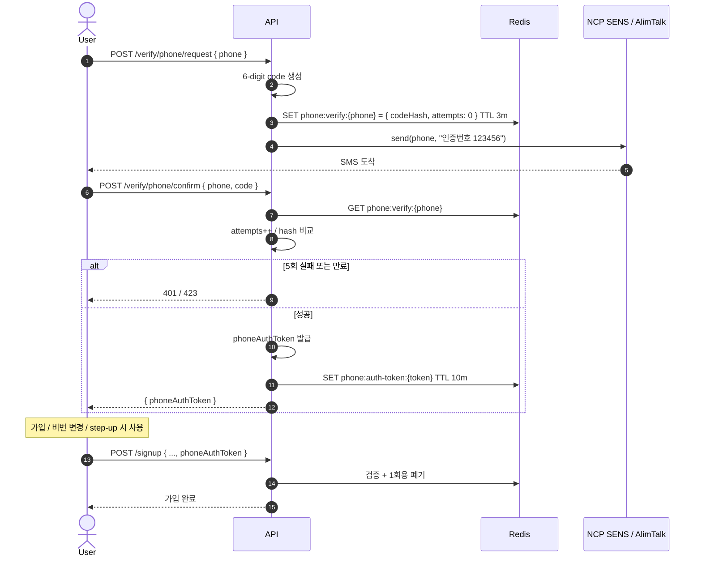

# 휴대폰 인증 구현 (NCP SENS / AlimTalk)

**[[implementation|↑ implementation hub]]**

> 한국 SaaS 표준. 6-digit code + Redis TTL + brute force 방어.

---

## 1. 흐름 개요



---

## 2. API spec

```http
POST /api/v1/auth/verify/phone/request
{ "phone": "010-1234-5678" }

200 OK
{ "code": "OK_001", "data": { "requestId": "01HZ...", "expiresInSeconds": 180 } }
```

```http
POST /api/v1/auth/verify/phone/confirm
{ "phone": "010-1234-5678", "code": "123456" }

200 OK
{ "code": "OK_001", "data": { "phoneAuthToken": "01HZ-TOKEN-...", "expiresInSeconds": 600 } }
```

---

## 3. 비기능

| 항목 | 정책 |
| --- | --- |
| 코드 형식 | 6자리 숫자 |
| 인증번호 TTL | 3분 |
| phoneAuthToken TTL | 10분 |
| Rate limit (phone) | 1시간 5건 + 60s cooldown |
| Rate limit (IP) | 1시간 20건 |
| Brute force lock | 5회 실패 = 코드 무효 (재발송 필요) |
| 동일 phone 재요청 | 이전 코드 invalidate (마지막만 유효) |
| 저장 | Redis (TTL 자동) |

---

## 4. 도메인 — PhoneVerification

```java
public final class PhoneVerification {

    public enum Status { PENDING, VERIFIED, EXPIRED, REVOKED }

    private final PhoneVerificationId id;
    private final PhoneNumber phone;
    private final String codeHash;            // SHA-256(6-digit)
    private final Instant issuedAt;
    private final Instant expiresAt;
    private int attempts;
    private Status status;

    private static final int MAX_ATTEMPTS = 5;

    public static PhoneVerification request(PhoneVerificationId id, PhoneNumber phone,
                                             String code, Instant now, Duration ttl) {
        var hash = sha256Hex(code);
        return new PhoneVerification(id, phone, hash, now, now.plus(ttl), 0, Status.PENDING);
    }

    public void tryConfirm(String code, Instant now) {
        if (status != Status.PENDING)
            throw new BusinessException(ResponseCode.INVALID_TOKEN, "유효하지 않은 인증 요청");
        if (now.isAfter(expiresAt))
            throw new BusinessException(ResponseCode.EXPIRED_AUTH_CODE, "인증번호 만료");
        if (attempts >= MAX_ATTEMPTS) {
            status = Status.REVOKED;
            throw new BusinessException(ResponseCode.FORBIDDEN, "시도 횟수 초과");
        }
        attempts++;
        if (!sha256Hex(code).equals(codeHash))
            throw new BusinessException(ResponseCode.UNAUTHORIZED, "인증번호 불일치");
        status = Status.VERIFIED;
    }
}

public record PhoneNumber(String value) {
    private static final Pattern KR = Pattern.compile("^01[0-9]-?[0-9]{3,4}-?[0-9]{4}$");
    public PhoneNumber {
        if (value == null || !KR.matcher(value).matches())
            throw new IllegalArgumentException("invalid phone: " + value);
    }
    public String normalized() {
        return value.replaceAll("-", "");
    }
}
```

### 4.1 왜 code_hash 저장 (raw 아님)

- Redis 도 DB — 평문 저장 = 내부자 / dump 노출 시 도용 가능.
- 6-digit = 100만 경우 → SHA-256 brute force 가능하지만 attempts lock (5회) 으로 방어.
- attempts × TTL (3분) = 사실상 brute force 불가.

### 4.2 왜 attempts 카운터 (5회 lock)

- 6-digit = 100만 경우 → 단순 무한 시도 시 brute force 가능.
- 5회 = 사용자 오타 허용 + brute force 차단.
- 5회 후 = 코드 무효 (REVOKED) → 재발송 강제.

### 4.3 왜 PhoneNumber VO + 정규화

- `010-1234-5678` / `01012345678` / `+821012345678` 모두 다른 hash → 같은 사용자 중복 가능.
- 정규화 = `01012345678` (하이픈 제거) 표준.
- VO 가 형식 검증 + 정규화 메서드 제공.

자세히: [[../domain-model/phone-number-vo]] · [[../design-decisions/auth-channels#3 SMS 인증]].

---

## 5. Redis schema

```
Key:   phone:verify:{normalized-phone}
Value: JSON { id, codeHash, attempts, status, issuedAt }
TTL:   3분 (자동 만료)

Key:   phone:auth-token:{token}
Value: JSON { phone, verifiedAt }
TTL:   10분
```

### 5.1 왜 Redis (RDB 아님)

- 3분 TTL — RDB 의 cleanup 부담 ↑.
- 분당 폭주 — Redis throughput ↑.
- 단순 KV — `phone:verify:{phone}` 만으로 충분.

### 5.2 RDB 옵션

본인인증 audit 필요 시:

```sql
CREATE TABLE phone_verifications (
    id          CHAR(26) PRIMARY KEY,
    phone       VARCHAR(20) NOT NULL,
    code_hash   CHAR(64) NOT NULL,
    status      VARCHAR(20) NOT NULL,
    attempts    INTEGER NOT NULL DEFAULT 0,
    issued_at   TIMESTAMPTZ NOT NULL,
    expires_at  TIMESTAMPTZ NOT NULL,
    verified_at TIMESTAMPTZ
);
```

자세히: [[../database/verification-tokens-table#4 phone_verifications]].

---

## 6. SMS Client — NCP SENS

```yaml
app:
  sms:
    ncp-sens:
      base-url: https://sens.apigw.ntruss.com
      service-id: ${NCP_SERVICE_ID}
      access-key: ${NCP_ACCESS_KEY}
      secret-key: ${NCP_SECRET_KEY}
      sender: "025550000"
```

```java
@Component
@RequiredArgsConstructor
@Slf4j
public class NcpSensSmsClient implements SmsClient {

    private final WebClient webClient;
    @Value("${app.sms.ncp-sens.service-id}") String serviceId;
    @Value("${app.sms.ncp-sens.access-key}") String accessKey;
    @Value("${app.sms.ncp-sens.secret-key}") String secretKey;
    @Value("${app.sms.ncp-sens.sender}") String sender;

    @CircuitBreaker(name = "sms-ncp", fallbackMethod = "fallback")
    @Retry(name = "sms-ncp")
    @Override
    public SmsResult send(String to, String content) {
        var timestamp = String.valueOf(System.currentTimeMillis());
        var url = "/sms/v2/services/" + serviceId + "/messages";
        var signature = makeSignature("POST", url, timestamp);

        var body = Map.of(
            "type", "SMS",
            "from", sender,
            "content", content,
            "messages", List.of(Map.of("to", to.replaceAll("-", "")))
        );

        try {
            var response = webClient.post()
                .uri(url)
                .header("Content-Type", "application/json")
                .header("x-ncp-apigw-timestamp", timestamp)
                .header("x-ncp-iam-access-key", accessKey)
                .header("x-ncp-apigw-signature-v2", signature)
                .bodyValue(body)
                .retrieve()
                .bodyToMono(Map.class)
                .block();
            return new SmsResult(true, (String) response.get("requestId"), null);
        } catch (WebClientResponseException e) {
            log.error("NCP SENS error: {}", e.getResponseBodyAsString());
            return new SmsResult(false, null, e.getStatusCode().toString());
        }
    }

    private SmsResult fallback(String to, String content, Throwable t) {
        return new SmsResult(false, null, "SMS 발송 일시 불가");
    }

    private String makeSignature(String method, String url, String timestamp) {
        try {
            var message = method + " " + url + "\n" + timestamp + "\n" + accessKey;
            var mac = Mac.getInstance("HmacSHA256");
            mac.init(new SecretKeySpec(secretKey.getBytes(UTF_8), "HmacSHA256"));
            return Base64.getEncoder().encodeToString(mac.doFinal(message.getBytes(UTF_8)));
        } catch (Exception e) { throw new IllegalStateException(e); }
    }
}
```

### 6.1 왜 HMAC-SHA256 signature

- NCP SENS 의 API 인증 방식.
- timestamp + URL 조합 signature → replay attack 방어.

### 6.2 왜 CircuitBreaker + Retry

- NCP SENS 일시 장애 시 cascade 차단.
- Retry → 일시 timeout 자동 복구.
- Circuit open → fallback (가입 자체 막힘 회피).

### 6.3 왜 WebClient (RestTemplate 아님)

- Spring 6 권장 (RestTemplate maintenance only).
- non-blocking + reactive — 대량 발송 시 throughput ↑.

자세히: [[../design-decisions/sms-provider]].

---

## 7. UseCase — Request

```java
@Service
@RequiredArgsConstructor
@Slf4j
public class RequestPhoneVerificationUseCase {

    private final PhoneVerificationRedisRepository repo;
    private final SmsClient sms;
    private final SmsRateLimiter rateLimiter;
    private final IdGenerator ids;
    private final Clock clock;
    private final SecureRandom random = new SecureRandom();

    @Value("${app.phone-verify.ttl:PT3M}") Duration ttl;

    public RequestResult handle(PhoneNumber phone, String clientIp) {
        // Rate limit
        rateLimiter.checkPhone(phone);
        rateLimiter.checkIp(clientIp);

        // 같은 phone 의 옛 PENDING 무효
        repo.deleteByPhone(phone);

        // 6자리 코드 생성
        var code = String.format("%06d", random.nextInt(1_000_000));

        var verification = PhoneVerification.request(
            new PhoneVerificationId(ids.next()), phone, code,
            Instant.now(clock), ttl
        );
        repo.save(verification);

        // SMS 발송
        var result = sms.send(phone.normalized(),
            "[Yule] 인증번호 [" + code + "]를 입력해 주세요. (유효시간 3분)");

        if (!result.ok()) {
            log.warn("SMS 발송 실패: phone={}, error={}", phone, result.errorMessage());
            throw new BusinessException(ResponseCode.EXTERNAL_API_ERROR,
                "SMS 발송 실패 — 잠시 후 다시 시도해 주세요.");
        }

        return new RequestResult(verification.id().value(), (int) ttl.toSeconds());
    }

    public record RequestResult(String requestId, int expiresInSeconds) {}
}
```

### 7.1 왜 옛 PENDING 무효

- 사용자가 재발송 시 옛 코드 영구 활성 = 두 개 동시 유효 = 혼동.
- 마지막 발송만 유효 = UX 명확.

### 7.2 왜 SecureRandom.nextInt(1_000_000)

- 0 ~ 999999 균등 분포.
- `%06d` 로 0-padding (000123 등).
- 100만 경우 + 5회 lock = 사실상 brute force 불가.

### 7.3 왜 SMS 발송 실패 시 throw

- 사용자가 코드 받지 못함 → 다음 단계 진행 X.
- 단순 success 응답 시 사용자가 "코드 안 와요" CS 폭주.

---

## 8. UseCase — Confirm

```java
@Service
@RequiredArgsConstructor
public class ConfirmPhoneVerificationUseCase {

    private final PhoneVerificationRedisRepository verifications;
    private final PhoneAuthTokenRepository authTokens;
    private final IdGenerator ids;
    private final Clock clock;
    @Value("${app.phone-verify.auth-token-ttl:PT10M}") Duration tokenTtl;

    public ConfirmResult handle(PhoneNumber phone, String code) {
        var verification = verifications.findActiveByPhone(phone)
            .orElseThrow(() -> new BusinessException(ResponseCode.NOT_FOUND,
                "인증 요청을 찾을 수 없습니다. 다시 발송해 주세요."));

        verification.tryConfirm(code, Instant.now(clock));
        verifications.save(verification);

        // 통과 시 phoneAuthToken 발급
        var rawToken = ids.next() + UlidCreator.getMonotonicUlid().toString().substring(0, 6);
        authTokens.save(new PhoneAuthToken(rawToken, phone, Instant.now(clock), tokenTtl));

        return new ConfirmResult(rawToken, (int) tokenTtl.toSeconds());
    }

    public record ConfirmResult(String phoneAuthToken, int expiresInSeconds) {}
}
```

### 8.1 왜 phoneAuthToken (인증 결과 token)

- 다음 단계 (signup / step-up) 에서 "이 phone 이 방금 인증됐다" 증명.
- 한 번에 처리 어려운 다단계 흐름 (인증 → 가입 다른 endpoint).

### 8.2 왜 1회용

- 같은 token 으로 여러 가입 / 변경 시도 차단.
- 사용 시 즉시 삭제.

자세히: [[signup-impl#5.4 phoneAuthToken]].

---

## 9. Rate Limiter

```java
@Component
@RequiredArgsConstructor
public class SmsRateLimiter {

    private final RateLimiter limiter;

    public void checkPhone(PhoneNumber phone) {
        var key = "rl:phone-sms:" + phone.normalized();
        var result = limiter.tryConsume(key, RateLimitPolicy.of(5, Duration.ofHours(1)));
        if (!result.allowed())
            throw new BusinessException(ResponseCode.RATE_LIMIT_EXCEEDED,
                "휴대폰 인증 요청 한도 초과 (1시간 5회). 잠시 후 다시 시도해 주세요.");
    }

    public void checkIp(String ip) {
        var key = "rl:phone-sms-ip:" + ip;
        var result = limiter.tryConsume(key, RateLimitPolicy.of(20, Duration.ofHours(1)));
        if (!result.allowed())
            throw new BusinessException(ResponseCode.RATE_LIMIT_EXCEEDED, "요청 한도 초과");
    }
}
```

### 9.1 왜 phone + IP 둘 다

- phone 만 → 분산 IP 로 우회 가능.
- IP 만 → NAT 환경의 정상 사용자 영향.
- 둘 다 = 정상 사용자 영향 ↓ + abuse 차단.

### 9.2 왜 phone 5건 / IP 20건

- phone = 같은 사용자 정상 — 3-5번이면 충분 (오타 등).
- IP = 같은 회사 / 학교 (NAT) 의 정상 사용자 — 20명.

자세히: [[../../rate-limiting]].

---

## 10. Controller

```java
@Tag(name = "휴대폰 인증")
@RestController
@RequestMapping("/api/v1/auth/verify/phone")
@RequiredArgsConstructor
public class PhoneVerificationController {

    private final RequestPhoneVerificationUseCase request;
    private final ConfirmPhoneVerificationUseCase confirm;

    @Operation(summary = "휴대폰 인증번호 발송")
    @PostMapping("/request")
    public ResponseEntity<CommonResponse<RequestPhoneVerificationUseCase.RequestResult>> request(
        @Valid @RequestBody PhoneRequestDto req,
        HttpServletRequest http
    ) {
        var ip = ClientIpUtil.resolveClientIp(http);
        var result = request.handle(new PhoneNumber(req.phone()), ip);
        return ResponseEntity.ok(CommonResponse.success(ResponseCode.OK, result, "발송 완료"));
    }

    @Operation(summary = "인증번호 확인")
    @PostMapping("/confirm")
    public ResponseEntity<CommonResponse<ConfirmPhoneVerificationUseCase.ConfirmResult>> confirm(
        @Valid @RequestBody PhoneConfirmDto req
    ) {
        var result = confirm.handle(new PhoneNumber(req.phone()), req.code());
        return ResponseEntity.ok(CommonResponse.success(ResponseCode.OK, result, "인증 완료"));
    }
}

public record PhoneRequestDto(
    @NotBlank @Pattern(regexp = "^01[0-9]-?[0-9]{3,4}-?[0-9]{4}$") String phone
) {}

public record PhoneConfirmDto(
    @NotBlank @Pattern(regexp = "^01[0-9]-?[0-9]{3,4}-?[0-9]{4}$") String phone,
    @NotBlank @Pattern(regexp = "^\\d{6}$") String code
) {}
```

---

## 11. AlimTalk fallback (옵션)

NCP SENS 의 AlimTalk → 카카오톡 등록 사용자에게 알림톡 발송 (실패 시 SMS fallback):

```java
@Component
public class HybridSmsClient implements SmsClient {

    private final AlimTalkClient alimTalk;
    private final NcpSensSmsClient sms;

    @Override
    public SmsResult send(String to, String content) {
        var alimTalkResult = alimTalk.send(to, "AUTH_CODE",
            Map.of("code", extractCode(content)));
        if (alimTalkResult.ok()) return alimTalkResult;

        // AlimTalk 실패 (카카오 미사용자) → SMS fallback
        return sms.send(to, content);
    }
}
```

### 11.1 왜 AlimTalk 우선

- AlimTalk = 10원 (SMS = 30원) — 비용 ↓.
- 카카오톡 UI 친숙 — UX ↑.

### 11.2 왜 SMS fallback

- 카카오 미사용자 (5%) 에게도 도달.
- 사고 시나리오 (카카오 장애).

자세히: [[../design-decisions/sms-provider#2.2 AlimTalk]].

---

## 12. 본인 인증 (PASS / NICE) — 금융 / 의료

본 vault 의 6-digit = "휴대폰 보유" 확인.
실명 인증 (PASS / NICE) 은 별도 — 통신 3사 정보 기반 강한 식별.

```
POST /api/v1/auth/verify/identity/init
   ↓ PASS / NICE redirect
[사용자 본인 인증 (통신 3사 / 신용카드 / 공동인증서)]
   ↓ callback
서버: 이름·생년월일·휴대폰·CI/DI 추출
   ↓
user 에 저장 (CI UNIQUE — 한 사람 한 계정 보장)
```

**언제 필요**
- 금융 (계좌 / 송금).
- 의료 (처방).
- 청소년 보호 (게임 / 성인).

**일반 SaaS 는 불필요** — 6-digit + 휴대폰 정규화로 충분.

자세히: [[../design-decisions/sms-provider#4 본인인증]].

---

## 13. 함정 모음

### 함정 1 — 인증번호 평문 Redis 저장
같은 사람이 redis-cli 보면 도용 가능.
→ SHA-256 hash.

### 함정 2 — phone 정규화 없음
"010-1234-5678" vs "01012345678" 다른 hash → 중복 가능.
→ 모두 정규화 후 처리.

### 함정 3 — Rate limit 없음
SMS 폭주 = 비용 폭증 + 사용자 피해.
→ phone 5/h + IP 20/h.

### 함정 4 — Brute force lock 없음
6-digit = 100만 → 1분 안에 뚫림.
→ 5회 실패 lock.

### 함정 5 — phoneAuthToken 만료 안 둠
영구 token = 한 번 인증 후 영원히.
→ 10분 TTL.

### 함정 6 — Token 재사용
같은 token 으로 여러 흐름.
→ 1회용.

### 함정 7 — SMS 발송 에러 그대로 노출
NCP error code 노출 = 공격자 reconnaissance.
→ 일반화 메시지.

### 함정 8 — 동시 재요청 (race)
둘 다 6자리 코드 발송 → 사용자 혼동.
→ 마지막만 유효 (이전 invalidate).

### 함정 9 — Circuit Breaker 없음
NCP 다운 시 모든 가입 cascade.
→ Resilience4j.

### 함정 10 — 본인 인증과 혼동
6-digit = "휴대폰 보유" 만. 실명 인증은 PASS / NICE.

### 함정 11 — 60s cooldown 없음 (재발송)
"코드 안 와요" 즉시 재발송 → SMS 폭주.
→ 60s cooldown 추가.

### 함정 12 — phone 형식 검증 누락
일반 전화 (`02-1234-5678`) 통과 → SMS 발송 실패.
→ `^01[0-9]` 패턴.

### 함정 13 — Worker 의 SMS 비동기 대신 동기
SMS API 5초 → 사용자 응답 5초.
→ 옵션: 비동기 + 사용자에 "잠시 후 도착" 메시지.

### 함정 14 — phoneAuthToken 의 phone 매칭 안 함
다른 phone 의 token 사용 가능.
→ 사용 시 token 의 phone 과 request 의 phone 매칭 검증.

---

## 14. 운영 체크리스트

- [ ] NCP SENS service-id / access-key / secret-key — KMS
- [ ] 발신번호 등록 (NCP / 카카오)
- [ ] AlimTalk 템플릿 등록 + 검수 통과
- [ ] Rate limit (phone / IP)
- [ ] SMS 발송 성공율 메트릭
- [ ] 비용 모니터 (월 SMS 건수)
- [ ] phone 정규화 통일
- [ ] Circuit Breaker + Retry
- [ ] AlimTalk → SMS fallback

---

## 15. 관련

- [[implementation|↑ implementation hub]]
- [[signup-impl]] — phoneAuthToken 통합
- [[../design-decisions/sms-provider]] · [[../design-decisions/auth-channels]]
- [[../domain-model/phone-number-vo]]
- [[../database/verification-tokens-table#4]]
- [[../security/attack-defense#2 Brute Force]]
- [[../../rate-limiting]] · [[../../distributed-lock]]
