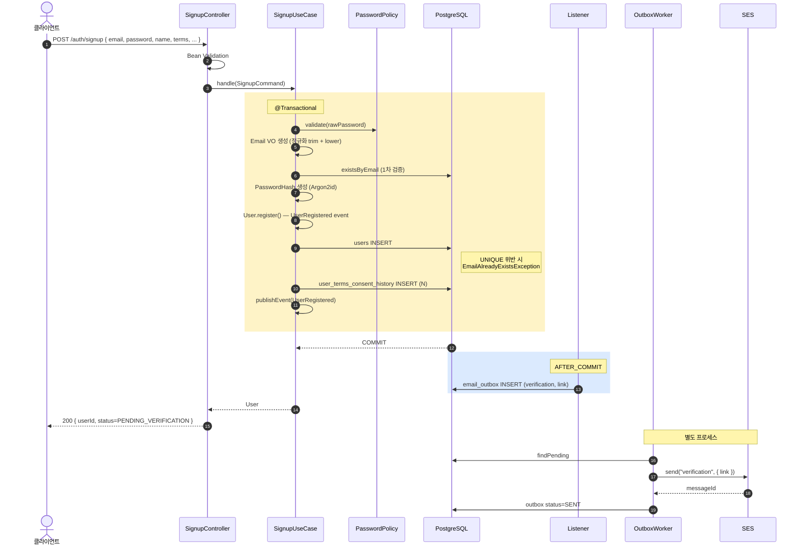

# 회원가입 구현 — Controller / UseCase / Domain / Adapter

**[[implementation|↑ implementation hub]]**

> Phase 1 — auth 의 입구. user 생성 + 약관 동의 + 이메일 인증 trigger.

---

## 1. 흐름 개요



자세히: [[../transactions]] · [[../database/email-outbox-table]].

자세히: [[../transactions]] · [[../database/email-outbox-table]].

---

## 2. 도메인 — Value Objects

```java
// src/main/java/com/example/shop/domain/user/Email.java
public record Email(@JsonValue String value) {
    private static final Pattern EMAIL = Pattern.compile(
        "^[A-Za-z0-9._%+-]+@[A-Za-z0-9.-]+\\.[A-Za-z]{2,}$"
    );
    public Email {
        if (value == null || !EMAIL.matcher(value).matches())
            throw new IllegalArgumentException("invalid email: " + value);
        if (value.length() > 254) throw new IllegalArgumentException("email too long");
    }
}

// src/main/java/com/example/shop/domain/user/PasswordHash.java
public record PasswordHash(@JsonValue String value) {
    public PasswordHash {
        if (value == null || !value.startsWith("$argon2"))
            throw new IllegalArgumentException("not an argon2 hash");
    }
}

// src/main/java/com/example/shop/domain/user/UserId.java
public record UserId(@JsonValue String value) {
    public UserId {
        if (value == null || value.length() != 26)
            throw new IllegalArgumentException("UserId must be ULID (26 chars)");
    }
}
```

### 2.1 왜 record

- 자동 final + immutable.
- compact constructor 에서 검증의 자리가 명확.
- equals/hashCode/toString 자동.
- VO 의 본질 (값 동등성, 불변) 과 자연.

### 2.2 왜 `@JsonValue`

- JSON 직렬화 시 wrapper 없이 String 단일 값으로:
  ```json
  // ❌ wrapper
  { "email": { "value": "alice@x.com" } }
  // ✅ @JsonValue
  { "email": "alice@x.com" }
  ```
- API 응답 깔끔.
- 단 PasswordHash 의 `@JsonValue` 는 **응답 DTO 에 PasswordHash 절대 포함 X** 전제.

### 2.3 왜 도메인 안에서 검증

- VO 가 invalid 한 값을 절대 가질 수 없게 보장.
- Bean Validation 만 의존 시 — 도메인 layer 안에서도 invalid 가능 (REST 외 batch / CLI 경로).
- 다층 방어.

자세히: [[../domain-model/email-vo]] · [[../domain-model/password-hash-vo]] · [[../domain-model/user-id-vo]].

---

## 3. 도메인 — User Aggregate

```java
public final class User {

    private final UserId id;
    private final Email email;
    private PasswordHash passwordHash;
    private final String name;
    private UserStatus status;
    private final Instant createdAt;
    private final List<DomainEvent> events = new ArrayList<>();

    private User(UserId id, Email email, PasswordHash hash, String name,
                 UserStatus status, Instant createdAt) {
        this.id = id; this.email = email; this.passwordHash = hash;
        this.name = name; this.status = status; this.createdAt = createdAt;
    }

    public static User register(UserId id, Email email, PasswordHash hash,
                                String name, Instant now) {
        if (name == null || name.isBlank() || name.length() > 100)
            throw new IllegalArgumentException("invalid name");
        var u = new User(id, email, hash, name, UserStatus.PENDING_VERIFICATION, now);
        u.events.add(new UserRegistered(id, email, now));
        return u;
    }

    public void verifyEmail() {
        if (status != UserStatus.PENDING_VERIFICATION)
            throw new IllegalStateException("not pending: " + status);
        status = UserStatus.ACTIVE;
        events.add(new UserEmailVerified(id, email, Instant.now()));
    }

    public void changePassword(PasswordHash newHash) {
        if (status == UserStatus.DELETED) throw new IllegalStateException("deleted");
        this.passwordHash = newHash;
        events.add(new UserPasswordChanged(id, Instant.now()));
    }

    public List<DomainEvent> pullDomainEvents() {
        var copy = List.copyOf(events); events.clear(); return copy;
    }

    public static User reconstitute(UserId id, Email email, PasswordHash hash,
                                    String name, UserStatus status, Instant createdAt) {
        return new User(id, email, hash, name, status, createdAt);
    }

    // accessors ...
}
```

### 3.1 왜 `final` class + private constructor

**왜 final**
- 상속으로 invariant 깨지는 것 방지.
- "이 도메인은 확장하지 마라" 의 명시.

**왜 private constructor**
- 모든 생성을 `register` (신규) / `reconstitute` (DB 에서 복원) 통해 강제.
- invariant 검증을 한 곳에 집중.

### 3.2 왜 `register` vs `reconstitute`

- `register` = 신규 user (validation + DomainEvent 발행).
- `reconstitute` = DB 에서 load 후 도메인 객체 복원 (event 없음, 검증 최소).
- 두 경우의 의미 분리 — Adapter 가 명시적 사용.

**안 하면 무슨 문제**
- 하나의 constructor 만 → load 시 event 발행 / 검증 중복.
- DB 에서 load 한 user 도 매번 UserRegistered event → 메일 N번 발송.

### 3.3 왜 `verifyEmail()` 같은 의미 있는 메서드 (setter 없음)

- 상태 전이의 invariant 강제 (PENDING_VERIFICATION → ACTIVE 만).
- 코드 어디서든 status 변경 가능하면 도메인 일관성 깨짐.

**안 하면 무슨 문제**
```java
user.setStatus(UserStatus.ACTIVE);    // ❌
// PENDING 가 아닌데 ACTIVE 로 강제
// audit 어려움
```

자세히: [[../domain-model/user-aggregate]].

### 3.4 왜 events List + pullDomainEvents

- 도메인 객체가 "무엇 발생했는지" 만 기록.
- UseCase 가 pull → 외부 publish.
- 도메인이 publisher 의존 X.

**왜 pull 시 clear**
- 같은 객체로 두 번 publish 방지 (idempotency).
- 다음 사용 시 깨끗한 상태.

자세히: [[../domain-model/domain-events]].

---

## 4. 도메인 — Port (인터페이스)

```java
// domain/user/UserRepository.java
public interface UserRepository {
    Optional<User> findByEmail(Email email);
    boolean existsByEmail(Email email);
    User save(User user);
    Optional<User> findById(UserId id);
}

// domain/user/PasswordEncoder.java
public interface PasswordEncoder {
    String encode(String plain);
    boolean matches(String plain, String hash);
    default boolean needsRehash(String hash) { return false; }
}
```

### 4.1 왜 도메인 layer 의 interface

- 도메인 ↔ infrastructure 분리 (Hexagonal / Ports-and-Adapters).
- 도메인은 JPA / MyBatis / Redis 무관.
- 단위 테스트 시 mock 가능.

자세히: [[../architecture]] · [[../domain-model/repository-ports]].

---

## 5. Application — SignupUseCase

```java
@Service
@Slf4j
@RequiredArgsConstructor
public class SignupUseCase {

    private final UserRepository users;
    private final PasswordEncoder passwordEncoder;
    private final PasswordPolicy passwordPolicy;
    private final UserTermsConsentService termsConsent;
    private final IdGenerator idGenerator;
    private final Clock clock;
    private final ApplicationEventPublisher events;

    @Transactional
    public User handle(SignupCommand cmd) {
        // 1. 약관 동의 검증 (Bean Validation 외 도메인 단)
        if (!cmd.termsAgreed())
            throw new BusinessException(ResponseCode.INVALID_INPUT_FORMAT, "약관 동의 필요");

        // 2. 비밀번호 정책 검증
        passwordPolicy.validate(cmd.rawPassword(), cmd.email(), cmd.name());

        // 3. Email 정규화 + VO 생성
        var email = new Email(cmd.email().trim().toLowerCase(Locale.ROOT));

        // 4. 1차 검증 — race condition 은 DB UNIQUE 가 잡음
        if (users.existsByEmail(email))
            throw new EmailAlreadyExistsException(email);

        // 5. PasswordHash 생성 — 평문 → argon2id
        var hash = new PasswordHash(passwordEncoder.encode(cmd.rawPassword()));

        // 6. 도메인 객체 생성 (status=PENDING_VERIFICATION, UserRegistered event)
        var user = User.register(
            new UserId(idGenerator.next()),
            email,
            hash,
            cmd.name().trim(),
            Instant.now(clock)
        );

        // 7. DB 저장 — UNIQUE 위반 시 409
        User saved;
        try {
            saved = users.save(user);
        } catch (DataIntegrityViolationException e) {
            throw new EmailAlreadyExistsException(email);     // 2차 방어
        }

        // 8. 약관 동의 history
        termsConsent.save(saved.id(), cmd.termsAgreed(), cmd.marketingAgreed(),
                          Instant.now(clock));

        // 9. 도메인 이벤트 publish — listener 가 AFTER_COMMIT 후속 처리
        saved.pullDomainEvents().forEach(events::publishEvent);
        return saved;
    }
}
```

### 5.1 왜 `@Transactional` 이 UseCase 에

- UseCase = 비즈니스 트랜잭션 경계.
- 여러 Repository 호출 (users + termsConsent) 이 한 단위.
- 한쪽 실패 시 모두 rollback (정합성).

### 5.2 왜 Email VO 가 Service 단에서 생성 (DTO 에 안 둠)

- Service 가 정규화 (trim, toLowerCase) 책임.
- VO 는 받은 값 그대로 보존 + 검증만.
- DTO 의 String 을 VO 로 변환 = adapter 역할.

**안 하면 무슨 문제**
- VO 가 자동 normalize → input 추적 어려움.
- DTO 에 VO 직접 사용 → 직렬화 복잡.

자세히: [[../domain-model/email-vo#4 정규화]].

### 5.3 왜 1차 (existsByEmail) + 2차 (UNIQUE catch) 검증

**1차 (existsByEmail)**
- 빠른 reject (race 없을 때 99% 케이스).
- 사용자 친화 메시지.

**2차 (DataIntegrityViolationException)**
- race condition 시 — 두 트랜잭션 동시 → 한쪽 INSERT 성공 / 다른 쪽 UNIQUE 위반.
- DB 가 진실의 원천.

**안 하면 무슨 문제**
- 1차만 → race 시 둘 다 INSERT 시도 → 한쪽 IntegrityViolation → 500 (UX 망함).
- 2차만 → 매번 INSERT 시도 → INSERT 실패의 비용.

### 5.4 왜 도메인 이벤트 후 publish

- save 후 발급된 user.id() 가 event 에 포함됨.
- save 전 publish 시 — listener 가 user 검색 시 없음.

자세히: [[../transactions#3 이벤트 흐름]].

---

## 6. Application — UserTermsConsentService

```java
@Service
@RequiredArgsConstructor
public class UserTermsConsentService {

    private final TermsRepository terms;
    private final UserTermsConsentHistoryRepository consents;
    private final IdGenerator ids;

    @Transactional
    public void save(UserId userId, boolean termsAgreed, boolean marketingAgreed, Instant now) {
        var active = terms.findActive();        // 현재 활성 약관 모두
        for (var t : active) {
            boolean consent = t.isRequired()
                ? true                          // 필수 약관 — 가입 자체가 동의 의미
                : "marketing".equals(t.getCode()) ? marketingAgreed : false;
            consents.save(new UserTermsConsentHistoryRow(
                ids.next(), userId.value(), t.getId(),
                consent ? "Y" : "N", now
            ));
        }
    }
}
```

### 6.1 왜 모든 활성 약관 row 생성 (필수 + 선택 둘 다)

- 분쟁 시 "이 사용자가 정확히 어떤 약관에 동의했나" 입증.
- 'N' (거부) row 도 필요 — 단순 absence ≠ "본 적도 없음".

### 6.2 왜 필수 약관도 row INSERT

- "묵시적 동의" 는 법적으로 약함 — 명시 row 가 안전.
- 가입 시점 = 동의 시점 audit.

자세히: [[../database/terms-tables]] · [[../design-decisions/terms-consent-policy]].

---

## 7. Infrastructure — JPA Adapter

```java
@Entity
@Table(name = "users")
public class UserJpaEntity {
    @Id @Column(length = 26) private String id;
    @Column(nullable = false, length = 254) private String email;
    @Column(name = "password_hash", nullable = false, length = 255) private String passwordHash;
    @Column(nullable = false, length = 100) private String name;

    @Enumerated(EnumType.STRING)
    @Column(nullable = false, length = 30) private UserStatus status;

    @Version @Column(nullable = false) private long version;
    @Column(name = "created_at", nullable = false, updatable = false) private Instant createdAt;
    @Column(name = "updated_at", nullable = false) private Instant updatedAt;

    protected UserJpaEntity() {}      // JPA
    public UserJpaEntity(String id, String email, String passwordHash, String name,
                         UserStatus status, Instant createdAt, Instant updatedAt) {
        this.id = id; this.email = email; this.passwordHash = passwordHash;
        this.name = name; this.status = status;
        this.createdAt = createdAt; this.updatedAt = updatedAt;
    }

    void apply(User u, Instant now) {
        this.passwordHash = u.currentPasswordHash().value();
        this.status = u.status();
        this.updatedAt = now;
    }
    // accessors / package-private setters
}

public interface UserJpaRepository extends JpaRepository<UserJpaEntity, String> {
    @Query("select case when count(u) > 0 then true else false end " +
           "from UserJpaEntity u where lower(u.email) = lower(:email)")
    boolean existsByEmailIgnoreCase(@Param("email") String email);

    @Query("from UserJpaEntity u where lower(u.email) = lower(:email)")
    Optional<UserJpaEntity> findByEmailIgnoreCase(@Param("email") String email);
}

@Repository
@RequiredArgsConstructor
public class JpaUserRepositoryAdapter implements UserRepository {

    private final UserJpaRepository spring;
    private final Clock clock;

    @Override public boolean existsByEmail(Email email) {
        return spring.existsByEmailIgnoreCase(email.value());
    }
    @Override public Optional<User> findByEmail(Email email) {
        return spring.findByEmailIgnoreCase(email.value()).map(this::toDomain);
    }
    @Override public Optional<User> findById(UserId id) {
        return spring.findById(id.value()).map(this::toDomain);
    }
    @Override public User save(User user) {
        var now = Instant.now(clock);
        var entity = spring.findById(user.id().value())
            .map(e -> { e.apply(user, now); return e; })
            .orElseGet(() -> new UserJpaEntity(
                user.id().value(), user.email().value(),
                user.currentPasswordHash().value(), user.name(),
                user.status(), user.createdAt(), now));
        return toDomain(spring.save(entity));
    }

    private User toDomain(UserJpaEntity e) {
        return User.reconstitute(
            new UserId(e.getId()), new Email(e.getEmail()),
            new PasswordHash(e.getPasswordHash()), e.getName(),
            e.getStatus(), e.getCreatedAt()
        );
    }
}
```

### 7.1 왜 도메인 ↔ JPA Entity 분리

**문제 (한 클래스 사용 시)**
```java
@Entity
public class User {
    @Id String id;
    @Column String email;
    // 도메인 로직
    public void verifyEmail() { ... }
}
```

- JPA proxy 가 도메인 객체에 누수 (LazyInitializationException).
- ORM 변경 (JPA → MyBatis) 시 도메인 재작성.
- 단위 테스트 시 framework 의존.
- 도메인 invariant 가 JPA 의 default constructor 와 충돌.

**해결 (분리)**
- 도메인 = pure java (User).
- JPA Entity = framework 의존 (UserJpaEntity).
- Adapter 가 매핑.

### 7.2 왜 `lower(email)` query

- DB 의 `ux_users_email` (lower(email) UNIQUE) 와 일치.
- application 의 변환 누락 시에도 case-insensitive lookup.

자세히: [[../database/users-table#3.1 lower email]].

### 7.3 왜 `apply` 메서드 (setter 대신)

- entity 의 부분 update — 변경 가능한 필드만 (passwordHash, status, updatedAt).
- 도메인 객체의 변경된 state 를 entity 에 반영.
- 모든 필드 setter 노출 = 의도치 않은 변경 위험.

자세히: [[../../database/jpa#11.5.1]].

---

## 8. Infrastructure — Argon2PasswordEncoder

```java
@Component
public class Argon2PasswordEncoder implements PasswordEncoder {

    private static final int MEM_KB = 65536;     // 64 MB
    private static final int ITER   = 3;
    private static final int PAR    = 4;
    private static final int OUT_LEN = 32;
    private static final int SALT_LEN = 16;

    private final Argon2Function hasher =
        Argon2Function.getInstance(MEM_KB, ITER, PAR, OUT_LEN, Argon2.ID);

    @Override
    public String encode(String plain) {
        if (plain == null || plain.length() < 8 || plain.length() > 128)
            throw new IllegalArgumentException("password length out of range");
        return Password.hash(plain).addRandomSalt(SALT_LEN).with(hasher).getResult();
    }

    @Override
    public boolean matches(String plain, String hash) {
        return Password.check(plain, hash)
                       .with(Argon2Function.getInstanceFromHash(hash));
    }

    @Override
    public boolean needsRehash(String hash) {
        var current = Argon2Function.getInstanceFromHash(hash);
        return current.getMemory() != MEM_KB
            || current.getIterations() != ITER
            || current.getParallelism() != PAR;
    }
}
```

### 8.1 왜 password4j (Spring Security `Argon2PasswordEncoder` 아님)

- 더 명시적 API.
- PHC 형식 자동.
- `needsRehash` 패턴 우수.

### 8.2 왜 m=64MB / t=3 / p=4

- OWASP 2024 권장 균형.
- 검증 시간 ~200ms (100-300ms 목표).
- GPU 공격 저항 충분.

자세히: [[../design-decisions/password-hash]].

---

## 9. Presentation — Controller

```java
public record SignupRequest(
    @Email @NotBlank @Size(max = 254) String email,
    @NotBlank @Size(min = 8, max = 128) String password,
    @NotBlank @Size(max = 100) String name,
    @AssertTrue(message = "must agree to terms") boolean termsAgreed,
    boolean marketingAgreed
) {
    @Override public String toString() {
        return "SignupRequest[email=%s, password=***, name=%s, termsAgreed=%s]"
            .formatted(email, name, termsAgreed);
    }
}

public record SignupResponse(String userId, String email, String status, Instant createdAt) {
    // 의도적으로 password / password_hash 필드 없음
}

@Tag(name = "사용자 회원가입")
@RestController
@RequestMapping("/api/v1/auth")
@RequiredArgsConstructor
public class SignupController {

    private final SignupUseCase signupUseCase;

    @Operation(summary = "회원가입")
    @ApiResponses({
        @ApiResponse(responseCode = "200", description = "(OK_001) 회원가입 성공"),
        @ApiResponse(responseCode = "409", description = "(BADREQ_004) 이미 가입된 이메일"),
        @ApiResponse(responseCode = "422", description = "(BADREQ_002) 약한 패스워드 / 입력 형식")
    })
    @PostMapping("/signup")
    public ResponseEntity<CommonResponse<SignupResponse>> signup(
        @Valid @RequestBody SignupRequest req
    ) {
        var user = signupUseCase.handle(toCommand(req));
        var body = CommonResponse.success(ResponseCode.OK,
            new SignupResponse(
                user.id().value(),
                user.email().value(),
                user.status().name(),
                user.createdAt()
            ),
            "회원가입 성공"
        );
        return ResponseEntity.ok(body);
    }

    private static SignupCommand toCommand(SignupRequest r) {
        return new SignupCommand(r.email(), r.password(), r.name(),
                                 r.termsAgreed(), r.marketingAgreed());
    }
}
```

### 9.1 왜 `toString` override (password 마스킹)

- record 의 기본 toString = 모든 필드 출력.
- `log.info("request: {}", req)` 가 평문 password 노출.
- 마스킹 = 사고 방어.

자세히: [[../security/sensitive-data-handling#2.1]].

### 9.2 왜 SignupResponse 에 password 필드 명시 제외

- Entity 그대로 반환 시 모든 컬럼 노출 (password_hash 포함).
- DTO 명시 = 필요 필드만.

### 9.3 왜 `@SecurityRequirements()` 빈 어노테이션 (이전 코드)

- Swagger UI 가 "이 endpoint 는 인증 불필요" 표시.
- 가입 endpoint 는 anonymous.

---

## 10. Infrastructure — UserRegisteredEmailListener

```java
@Component
@RequiredArgsConstructor
public class UserRegisteredEmailListener {

    private final EmailOutboxRepository outbox;
    private final IdGenerator ids;
    private final Clock clock;

    @TransactionalEventListener(phase = TransactionPhase.AFTER_COMMIT)
    public void on(UserRegistered event) {
        outbox.enqueue(new EmailOutboxRow(
            ids.next(),
            event.email().value(),
            "verification",
            Map.of("userId", event.userId().value(), "link", buildVerificationLink(event)),
            Instant.now(clock)
        ));
    }
}
```

### 10.1 왜 AFTER_COMMIT (BEFORE_COMMIT 아님)

- 비즈니스 commit 후 outbox INSERT.
- 비즈니스 rollback 시 outbox 도 적재 X (정합성).

**왜 BEFORE_COMMIT 위험**
- rollback 시 → 메일은 발송됐는데 user 가입 X → 사용자 항의.

### 10.2 왜 outbox (직접 SES 호출 X)

- 비즈니스 트랜잭션 안에서 외부 호출 X.
- 재시도 / audit / 워커 분리.

자세히: [[../database/email-outbox-table]] · [[../transactions]].

---

## 11. Config

```java
@Configuration
public class CommonConfig {
    @Bean public Clock clock() { return Clock.systemUTC(); }
    @Bean public IdGenerator idGenerator() {
        return () -> UlidCreator.getMonotonicUlid().toString();
    }
}
```

```yaml
spring:
  datasource:
    url: jdbc:postgresql://localhost:5432/shop
    username: ${DB_USER}
    password: ${DB_PASSWORD}                  # KMS / Secrets Manager
  jpa:
    open-in-view: false                       # 운영 필수
    hibernate:
      ddl-auto: validate                      # Flyway 가 schema 진실
    properties:
      hibernate:
        default_batch_fetch_size: 100
  flyway:
    enabled: true
    locations: classpath:db/migration

logging:
  level:
    com.example.shop: INFO
    org.hibernate.SQL: WARN                   # 운영 — password log 방어
```

### 11.1 왜 `open-in-view: false`

- default true = web request 끝까지 Hibernate session 유지 → 의도치 않은 lazy load.
- false = Service 안에서만 — 명시적 fetch.

### 11.2 왜 `ddl-auto: validate`

- application 이 schema 변경 X.
- Flyway 가 진실의 원천.

자세히: [[../operations/configuration-secrets]] · [[../database/migrations]].

---

## 12. 함정 모음 — "이걸 안 하면 X 가 터짐"

### 함정 1 — Entity 그대로 응답
모든 컬럼 노출 (password_hash 포함).
→ SignupResponse 명시 DTO.

### 함정 2 — `existsByEmail` 만 (DB UNIQUE 없음)
race condition 시 두 user 생성.
→ DB UNIQUE + DataIntegrityViolationException catch.

### 함정 3 — `lower(email)` 안 함
`Alice@X.com` 과 `alice@x.com` 둘 다 통과.
→ JPA query `lower()` + DB UNIQUE index `lower(email)`.

### 함정 4 — toString 마스킹 누락
`log.info("req: {}", req)` = 평문 password 로그.
→ record toString override.

### 함정 5 — Bean Validation `@Email` 만 의존
관대한 검증 (`a@b` 통과).
→ 도메인 VO 가 더 엄격하게 (RFC 5321).

### 함정 6 — 가입 직후 ACTIVE (이메일 인증 없이)
가짜 메일 가입 가능.
→ status=PENDING_VERIFICATION → 이메일 인증 후 ACTIVE.

### 함정 7 — `@Transactional` 안에서 SES 호출
DB connection 점유 + 외부 장애 cascade.
→ AFTER_COMMIT listener + outbox.

### 함정 8 — UserRegistered event 가 save 전 publish
listener 가 user 검색 시 없음.
→ save 후 publish.

### 함정 9 — termsConsentService 가 별도 트랜잭션
`REQUIRES_NEW` 시 — 비즈니스 rollback 해도 약관 동의 잔존.
→ 같은 트랜잭션 (default propagation).

### 함정 10 — 약관 동의 row 가 N (미동의) 없이 absence
"동의 안 했음" vs "본 적도 없음" 구분 X.
→ 모든 활성 약관 row INSERT.

### 함정 11 — Idempotency-Key 없음 + 네트워크 retry
중복 가입 시도 → 409 (UNIQUE) 정상이지만 사용자 혼란.
→ Idempotency-Key optional 지원.

### 함정 12 — `open-in-view: true`
의도치 않은 lazy load → N+1 / LazyInitializationException.
→ false 명시.

---

## 13. 관련

- [[implementation|↑ implementation hub]]
- [[../architecture]] — 패키지 구조
- [[../domain-model]] — User Aggregate / VO
- [[../database/users-table]] · [[../database/terms-tables]]
- [[../design-decisions/password-hash]] — Argon2id
- [[../security/sensitive-data-handling]] · [[../security/password-policy]]
- [[../transactions]] — AFTER_COMMIT
- [[email-verification-impl]] — 이메일 인증 (signup 의 후속)
- [[../../common/response-envelope]] · [[../../common/security-config]]
